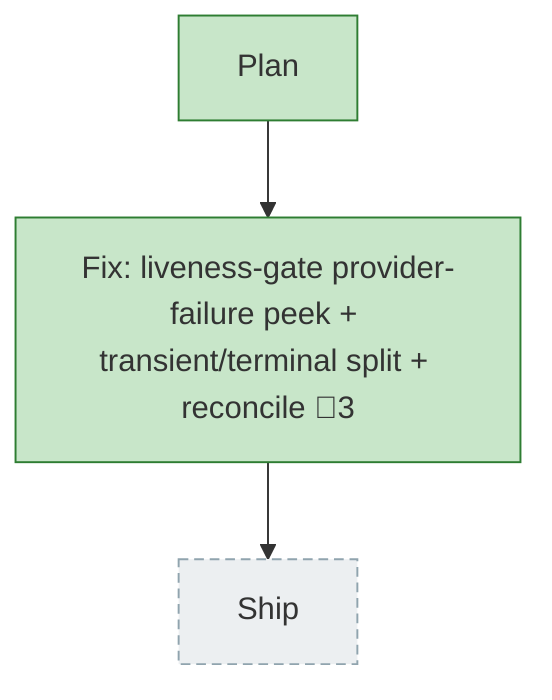

<!-- GENERATED by `harness flow render` — do not hand-edit; regenerate from the flow JSON. -->
# Flow · fix-false-provider-death

**Kind**: flight-plan · **Now**: build · **Next**: ship · **Intent**: Fix false 'exited (quota)' death on a live/working session (defect in plan 023 whole-life notify); queued after plan-022 codex · **Nodes**: 3 · **Events**: 10

**Rail**: ◆─[ ◆ ]─◇  ◆ Plan · [ ◆ Fix: liveness-gate provider-failure peek + transient/terminal split + reconcile ] · ◇ Ship

**Legend**: 🟩 done · 🟧 in-progress · 🟥 blocked · 🟦 known (designed) · ⬜ assumed (speculative) · 🔶 decision · 🗣 user input · 🟪 harness loop · 🤖 companion · 🛠 worker · 🧰 chore (upkeep).

## Node log

### build · Fix: liveness-gate provider-failure peek + transient/terminal split + reconcile
- `2026-06-28T11:07:50.805Z` · — · note — QUEUED: start only after plan-022 codex build lands + reviews — shares daemon.ts/state.ts/binding.ts
- `2026-06-28T12:26:05.582Z` · — · note — UNBLOCKED: plan-022 codex landed on main (411d9aa) + files present; shared-file queue gate (R-3) cleared. Ready to implement.
- `2026-06-28T13:12:13.586Z` · — · validation — flow-pair (codex dogfood, both roles codex gpt-5.5): dlg-0001 build (9 tasks TDD) + dlg-0002 fix (2 findings). Cross-review APPROVE_WITH_NOTES, DIM0=PASS via 7 mutations. LOW note (types.ts stale comment) folded. harness checks --quick green; full suite 1069 passed.
