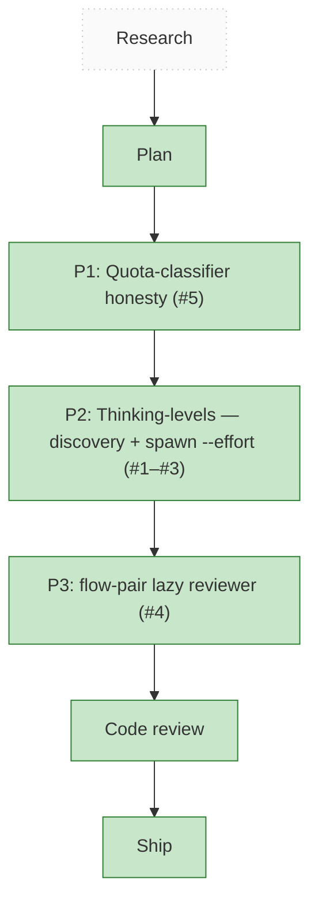

<!-- GENERATED by `harness flow render` — do not hand-edit; regenerate from the flow JSON. -->
# Flow · pij-effort-discovery-quota-fix

**Kind**: flight-plan · **Now**: ship · **Intent**: All 3 phases built + cross-reviewed (DIM0=PASS); ready to ship · **Nodes**: 7 · **Events**: 14

**Rail**: ◇─◆─[ ◆─◆─◆─◆ ]─◆  ◇ Research · ◆ Plan · [ ◆ P1: Quota-classifier honesty (#5) · ◆ P2: Thinking-levels — discovery + spawn --effort (#1–#3) · ◆ P3: flow-pair lazy reviewer (#4) · ◆ Ship ] · ◆ Code review

**Legend** — colour = type/status: 🟩 done · 🟧 in-progress · 🟥 blocked · 🟦 known · ⬜ assumed · 🔶 decision · 🗣 user input · 🟪 harness · 🤖 companion · 🛠 worker. Badges: 💬 comments · 📄 artifacts · 📝 instructions · 🧰 chore (° optional / recommended / ‼ strongly-recommended).
