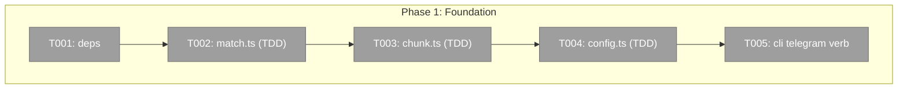
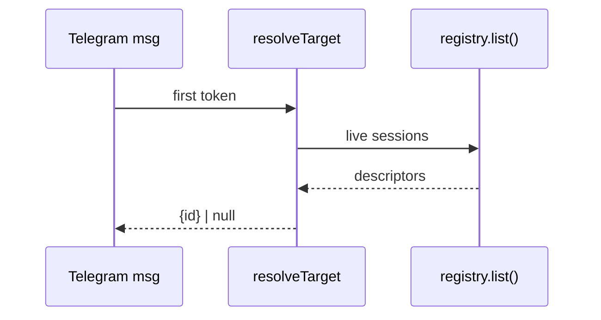

# Phase 1: Foundation — matcher, config, chunker, CLI skeleton

**Plan**: `docs/plans/026-pij-telegram-bridge/pij-telegram-bridge-plan.md`
**Mode**: Full · **Phase**: 1 of 4 · **Testing**: Hybrid (TDD for the pure units here)

## Executive Briefing
- **Purpose**: Land the pure, fully-tested building blocks (address matcher, scoped config+allowlist, message chunker) and the `pij telegram` bin-verb scaffold, so Phases 2–3 only wire I/O onto proven units.
- **What We're Building**: Three pure modules under `.pi/extensions/pij/telegram/` with vitest tests, plus a bin-level `telegram` subcommand in `cli.ts` dispatching `start|init|stop` to stubs. Add `grammy` + `dotenv` deps.
- **Goals**:
  - ✅ `resolveTarget(token, sessions[])` — strip `pij-`, prefix/substring match, deterministic order, first-wins, `null` on no match
  - ✅ `chunk(text, limit)` — numbered multi-part split at the Telegram limit
  - ✅ `loadConfig(path)` — scoped `.env` parse + allowlist validation, never mutates global `process.env`
  - ✅ `pij telegram {start|init|stop}` reaches stubs
- **Non-Goals**: ❌ no grammY bot wiring · ❌ no peer descriptor · ❌ no inbox watch · ❌ no real `start`/`init` behavior (Phases 2–4)

## Pre-Implementation Check

| File | Exists? | Domain | Notes |
|------|---------|--------|-------|
| `.pi/extensions/pij/telegram/match.ts` | NEW | pij-control-plane | pure |
| `.pi/extensions/pij/telegram/match.test.ts` | NEW | pij-control-plane | TDD |
| `.pi/extensions/pij/telegram/chunk.ts` | NEW | pij-control-plane | pure |
| `.pi/extensions/pij/telegram/chunk.test.ts` | NEW | pij-control-plane | TDD |
| `.pi/extensions/pij/telegram/config.ts` | NEW | pij-control-plane | pure; scoped dotenv |
| `.pi/extensions/pij/telegram/config.test.ts` | NEW | pij-control-plane | TDD |
| `.pi/extensions/pij/cli.ts` | MODIFY | pij-control-plane | add `telegram` intercept @ ~cli.ts:867 pattern |
| `package.json` | MODIFY | _platform | add `grammy`, `dotenv` |

## Architecture Map

## Tasks

| Status | ID | Task | Domain | Path(s) | Done When | Notes |
|--------|-----|------|--------|---------|-----------|-------|
| [ ] | T001 | Add `grammy` + `dotenv` to dependencies; `npm install`; confirm both import under tsx | _platform | `package.json` | `import { Bot } from "grammy"` and `import "dotenv"` resolve under tsx; lockfile updated | No build step (tsx-direct) |
| [ ] | T002 | TDD `resolveTarget(token, sessions[]) → {id}\|null`: strip leading `pij-` from token; case-insensitive prefix/substring match against each session's id-token; sort matches by `lastEventAt` newest-first (fallback `startedAt`); return first, or `null` | pij-control-plane | `.pi/extensions/pij/telegram/match.ts`, `match.test.ts` | Tests cover exact, partial, multi-match ordering (by lastEventAt), no-match→null, empty/whitespace token→null | Plan Finding 06; AC-02/AC-04. Tests FIRST |
| [ ] | T003 | TDD `chunk(text, limit=4000) → string[]`: ≤limit → `[text]` (no prefix); >limit → split on a safe boundary, each part prefixed `(i/n) ` | pij-control-plane | `.pi/extensions/pij/telegram/chunk.ts`, `chunk.test.ts` | Tests: under-limit (1 part, no prefix), exact-boundary, multi-part numbering, never exceeds Telegram 4096 incl. prefix | Plan Finding 07; AC-05. Tests FIRST |
| [ ] | T004 | TDD `loadConfig(envPath) → {token, allowedUserIds:number[], chatId?}`: read+parse the `.env` file directly (dotenv `parse`, NOT `config()` — must NOT mutate `process.env`/global); require non-empty token; `TELEGRAM_ALLOWED_USER_IDS` = comma list of integers (reject non-numeric); optional `TELEGRAM_CHAT_ID` | pij-control-plane | `.pi/extensions/pij/telegram/config.ts`, `config.test.ts` | Tests: valid load, missing token→throws, non-numeric id→throws, **global `process.env` unchanged after load** (isolation assertion) | Plan Finding 03; AC-10. Tests FIRST |
| [ ] | T005 | Add bin-level `telegram` verb in `cli.ts` (same `process.argv[2] === "<verb>"` intercept pattern as spawn/adopt at cli.ts:867); route `start`/`init`/`stop` to stub functions in `telegram/index.ts` that print "not yet implemented (Phase N)"; `pij telegram` with no subcommand prints usage | pij-control-plane | `.pi/extensions/pij/cli.ts`, `.pi/extensions/pij/telegram/index.ts` | `pij telegram`, `pij telegram start\|init\|stop` each reach their stub without throwing | Wiring only; behavior in P2–P4 |

## Context Brief
**Key findings from plan**:
- Finding 03 (`.env` isolation): config MUST use dotenv `parse()` on file contents, never `config()` — global env mutation breaks pij's `PIJ_SESSION_ID`/`TMUX_PANE` resolution.
- Finding 06 (matcher): no existing helper; `registry.list()` order is undefined → sort deterministically by `lastEventAt`.
- Finding 07 (chunker): Telegram hard limit 4096; keep part+prefix under it.

**Domain dependencies** (consumed, unchanged):
- `pij-messaging`: `SessionDescriptor` shape (`id`, `lastEventAt`, `startedAt`) — matcher input type only; no contract change this phase.

**Domain constraints**:
- All new files live under `.pi/extensions/pij/telegram/`. `cli.ts` is the only existing file modified.
- FORBIDDEN paths (never touch): `.the-flow-state.json`, `the-flow.json`, `the-flow.md`.

**Reusable**: existing vitest setup; `*.test.ts` auto-discovered.

## Discoveries & Learnings
_Populated during implementation._

| Date | Task | Type | Discovery | Resolution | References |
|------|------|------|-----------|------------|------------|
