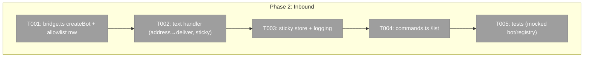
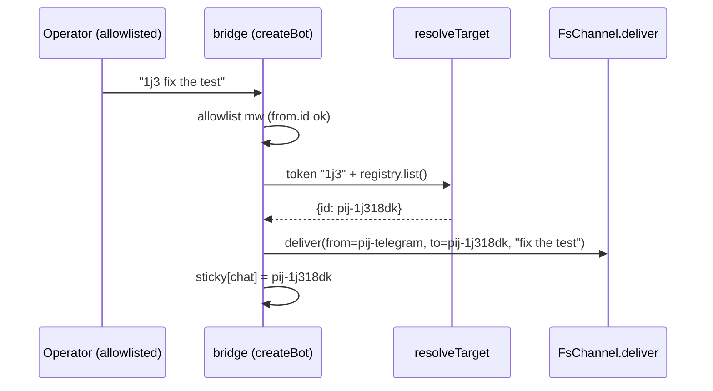

# Phase 2: Inbound relay + allowlist + /list

**Plan**: `docs/plans/026-pij-telegram-bridge/pij-telegram-bridge-plan.md`
**Mode**: Full · **Phase**: 2 of 4 · **Testing**: Hybrid (lightweight + targeted mocks for the grammY glue)

## Executive Briefing
- **Purpose**: An allowlisted operator can address a pij session from Telegram and have their text delivered to it; `/list` shows recent sessions. This is the Telegram→session direction.
- **What We're Building**: `bridge.ts` (a `createBot(config, deps)` that wires a grammY `Bot` with an allowlist-FIRST middleware, a text handler doing address→deliver with sticky fallback, and an in-memory sticky-target store) + `commands.ts` (`/list`). Unit-tested by feeding fake updates to a mocked bot — NO live long-poll here.
- **Goals**: ✅ allowlist gates the first middleware · ✅ `<tok> <text>` → deliver to matched session + set sticky · ✅ unaddressed text → most-recent sticky · ✅ `/list` last 10 + paths
- **Non-Goals**: ❌ real `bot.start()` / long-poll / lockfile (P3) · ❌ peer descriptor + inbox drain (P3) · ❌ `/tail` (P3) · ❌ onboarding (P4)

## Prior Phase Context — Phase 1 (done)
**Deliverables / exports available** (`.pi/extensions/pij/telegram/`):
- `match.ts` → `resolveTarget(token, sessions[]) → {id} | null` (strip `pij-`, partial, `lastEventAt` newest-first, first-wins).
- `chunk.ts` → `chunk(text, limit=4000) → string[]` (round-trip safe; used in P3, not here).
- `config.ts` → `loadConfig(envPath) → {token, allowedUserIds:number[], chatId?}` (scoped; never mutates `process.env`).
- `index.ts` → `runTelegram(argv)` dispatch to `start|init|stop` stubs (start=P2, stop=P3, init=P4).
- `cli.ts` → `pij telegram` verb already wired.
**Patterns to follow**: pure units + vitest; ESM `.js` import specifiers; no global env mutation.
**Gotchas**: `registry.list()` order is undefined — always resolve targets through `resolveTarget` (never assume order).

## Pre-Implementation Check

| File | Exists? | Domain | Notes |
|------|---------|--------|-------|
| `.pi/extensions/pij/telegram/bridge.ts` | NEW | pij-control-plane | grammY bot wiring (testable) |
| `.pi/extensions/pij/telegram/bridge.test.ts` | NEW | pij-control-plane | mocked-update tests |
| `.pi/extensions/pij/telegram/commands.ts` | NEW | pij-control-plane | `/list` |
| `.pi/extensions/pij/telegram/commands.test.ts` | NEW | pij-control-plane | mocked registry |
| `.pi/extensions/pij/telegram/index.ts` | MODIFY | pij-control-plane | `start` may construct the bot (long-poll start deferred to P3) |

## Architecture Map

## Tasks

| Status | ID | Task | Domain | Path(s) | Done When | Notes |
|--------|-----|------|--------|---------|-----------|-------|
| [ ] | T001 | `createBot(config, deps)` in `bridge.ts`: build a grammY `Bot(config.token)`; register an **allowlist middleware FIRST** (`bot.use`) that drops + debug-logs any update whose `from.id` ∉ `config.allowedUserIds` (return without calling `next()`). `deps` injects the delivery + registry fns for testability. | pij-control-plane | `bridge.ts` | A mocked update from a non-allowlisted id never reaches downstream handlers (AC-07) | Plan Finding 02; allowlist is the ONLY access control — must be first |
| [ ] | T002 | Text handler (`bot.on("message:text")`): take the first whitespace token; `resolveTarget(tok, registry.list())` → if match, deliver the **remainder** to that session + set it sticky; if no match, deliver the **whole** text to the current sticky target; if no sticky target, reply with guidance ("address a session, e.g. `1j3 hello` — `/list` to see them"). Deliver via the existing `FsChannel.deliver`-style send path with `from="pij-telegram"`. | pij-control-plane | `bridge.ts` | Mocked tests: AC-02 (addressed→matched session inbox), AC-03 (unaddressed→sticky), AC-04 (multi-match deterministic), no-sticky→guidance | Plan Findings 05/06 |
| [ ] | T003 | In-memory sticky-target store keyed by chat id; updated on every successful address; debug-log each resolution + fallback ("→ pij-xxx" / "sticky pij-xxx" / "no target") | pij-control-plane | `bridge.ts` | Sticky persists across messages within a process run | |
| [ ] | T004 | `/list` in `commands.ts`: `registry.list()` → newest 10 by `lastEventAt`/`startedAt` → reply each `id` + `folder` path | pij-control-plane | `commands.ts`, `commands.test.ts` | `/list` reply lists ≤10 sessions with paths (AC-06 part) | |
| [ ] | T005 | Tests: drive `createBot` with a mocked grammY context/api + a fake registry + a spy delivery; assert AC-02/03/04/07 + `/list`. Run `just test .pi/extensions/pij/telegram` + `just typecheck`. | pij-control-plane | `bridge.test.ts`, `commands.test.ts` | Telegram suite green; typecheck 0 | Targeted mocks (Telegram api + fs) |

## Context Brief
**Key findings**: Finding 02 (allowlist FIRST — RCE-by-proxy if not), Finding 05 (delivery is pure-fs `FsChannel.deliver`, CLI-side, no daemon needed), Finding 06 (resolve through `resolveTarget`, never registry order).

**Domain dependencies** (consumed):
- `pij-messaging`: `FsRegistry.list()` (sessions), `FsChannel.deliver(from,to,body)` (inbox write). Look at `adapters/fs-registry.ts` + `adapters/channel.ts` for the exact signatures; inject them via `deps` so tests don't hit disk.
- P1 `match.ts` / `config.ts`.

**Domain constraints**: stay within `.pi/extensions/pij/telegram/`. FORBIDDEN: `.the-flow-state.json`, `the-flow.json`, `the-flow.md`, `.flow-pair/`. The bot must NOT actually long-poll in tests (construct + feed fake updates only).

**Reusable from P1**: `resolveTarget`, `loadConfig`, vitest patterns.

## Discoveries & Learnings
_Populated during implementation._

| Date | Task | Type | Discovery | Resolution | References |
|------|------|------|-----------|------------|------------|
