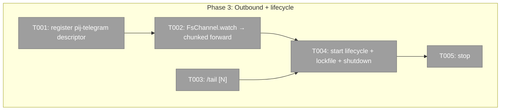
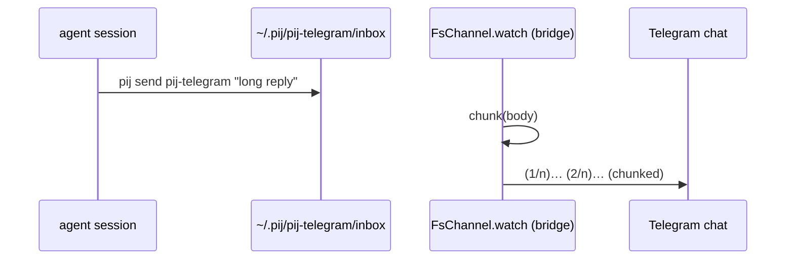

# Phase 3: Outbound peer + self-drain + /tail + single-instance

**Plan**: `docs/plans/026-pij-telegram-bridge/pij-telegram-bridge-plan.md`
**Mode**: Full · **Phase**: 3 of 4 · **Testing**: Hybrid (lightweight integration; process-sim for lockfile)

## Executive Briefing
- **Purpose**: Close the loop. Agents reply via `pij send pij-telegram "…"`; the bridge drains its OWN inbox and forwards (chunked) to the operator's Telegram chat. Add `/tail`, and make `pij telegram start` a safe, single, crash-recoverable **foreground** process.
- **What We're Building**: real `start`/`stop` lifecycle in `index.ts` (lockfile, descriptor register, `createBot` + `FsChannel.watch` + `bot.start()`, graceful shutdown); the inbox→Telegram forwarder (chunked); `/tail [N]` in `commands.ts`.
- **Run model**: `pij telegram start` runs **foreground** (operator backgrounds it / uses a process manager) — it does NOT self-daemonize.
- **Goals**: ✅ peer `pij-telegram` registered (`harness:"pi"`, `lifecycle:"bound"`) → daemon skips it · ✅ inbox drain → chunked forward to chat · ✅ `/tail [N]` (default 10) · ✅ single-instance lockfile + graceful shutdown + 409 handling
- **Non-Goals**: ❌ onboarding/`init` (P4) · ❌ docs (P4) · ❌ NO daemon/core changes (rely on `harness:"pi"` routing)

## Prior Phase Context — Phases 1–2 (done)
- **P1**: `chunk(text,limit=4000)` (round-trip safe — USE for forwarding), `loadConfig`→`{token,allowedUserIds,chatId}`, `resolveTarget`/`recencyKey`, `runTelegram` verb dispatch.
- **P2**: `createBot(config, deps)` (allowlist-first + text relay + sticky store), `commands.ts` `/list`. Sticky target store is per-chat in-memory — `/tail` should read the SAME sticky target.
- **Gotcha**: the bridge sends FROM `pij-telegram`; in P2 that id was just a label. In P3 we register the real descriptor so agents can `pij send pij-telegram` back.

## Pre-Implementation Check

| File | Exists? | Domain | Notes |
|------|---------|--------|-------|
| `.pi/extensions/pij/telegram/index.ts` | MODIFY | pij-control-plane | real `start`/`stop` lifecycle (currently stubs) |
| `.pi/extensions/pij/telegram/bridge.ts` | MODIFY | pij-control-plane | export the inbox→chat forwarder; expose sticky target for `/tail` |
| `.pi/extensions/pij/telegram/commands.ts` | MODIFY | pij-control-plane | add `/tail [N]` |
| `.pi/extensions/pij/telegram/*.test.ts` | MODIFY/NEW | pij-control-plane | forwarder + /tail + lockfile tests |
| daemon / core | **DO NOT TOUCH** | — | `harness:"pi"` → router `observe` already skips it (router.ts:37, daemon.ts:69); no change needed |

## Architecture Map

## Tasks

| Status | ID | Task | Domain | Path(s) | Done When | Notes |
|--------|-----|------|--------|---------|-----------|-------|
| [ ] | T001 | Register the `pij-telegram` descriptor via `FsRegistry.write` on start: fixed `id:"pij-telegram"`, `harness:"pi"`, `lifecycle:"bound"`, `pid:process.pid`, `folder:cwd`, `dataDir`/`eventsPath` under `PIJ_HOME`, `startedAt` | pij-control-plane | `index.ts` | Descriptor file written; a running daemon does NOT pane-inject/drain it (verify: `harness:"pi"` → router `observe`). Test writes+reads back the descriptor and asserts the fields | Plan Finding 01; AC-08. NO daemon edit |
| [ ] | T002 | Inbox→chat forwarder: `FsChannel.watch("pij-telegram", onMsg)`; for each delivered msg, `chunk(msg.body)` and send each part to `config.chatId` via the bot api | pij-control-plane | `bridge.ts`, `index.ts` | Test: deliver a >4096 body to a temp inbox → mocked api receives chunked parts, untruncated (AC-05/AC-08) | Use P1 `chunk`; real temp inbox + mocked api |
| [ ] | T003 | `/tail [N]` in `commands.ts`: read last N output events of the sticky target via `FsEventLog` (default 10; `/tail 20`→20); **no sticky target → same guidance reply as the P2 text handler** | pij-control-plane | `commands.ts`, `commands.test.ts` | Test (seeded `FsEventLog`): `/tail`→10, `/tail 20`→20, no-target→guidance (AC-06) | |
| [ ] | T004 | `start` lifecycle in `index.ts`: `loadConfig` → **lockfile** `~/.pij/pij-telegram.lock` (on start: lock exists? read PID — dead→remove stale & continue; alive→refuse with `pij telegram stop` hint) → register descriptor (T001) → `createBot` → start watch (T002) → `bot.start()` (foreground long-poll). `SIGINT`/`SIGTERM` → `bot.stop()` + clear lock + remove descriptor. Wrap poll errors; a Telegram **409** logs + clean-exits | pij-control-plane | `index.ts` | Process-sim tests: second start (live PID) refused; stale lock (dead PID) auto-cleaned; shutdown clears lock+descriptor (AC-09) | Plan Finding 04; mirrors daemon stale-lock reclaim |
| [ ] | T005 | `pij telegram stop`: signal the running instance (read lock PID) to shut down; clear a stale lock if the PID is dead | pij-control-plane | `index.ts` | `stop` ends a running bridge / clears stale lock (AC-09) | |

## Context Brief
**Key findings**: Finding 01 (self-drain via `harness:"pi"`; bridge runs `FsChannel.watch` like the pi receiver `index.ts:271` — NO daemon change), Finding 04 (single-instance lockfile + graceful shutdown + 409), Finding 07 (chunk for forwarding).

**Domain dependencies** (consumed; import, don't modify):
- `pij-messaging`: `FsRegistry.write` (`adapters/fs-registry.ts`), `FsChannel.watch`/`DeliveredMessage` (`adapters/channel.ts`), `FsEventLog` (`adapters/event-log.ts`), `SessionDescriptor`/`HarnessKind` (`core/types.ts`). Look at the pi in-process receiver wiring in `index.ts:240-271` (root) for the watch pattern to mirror.

**Domain constraints**: ALL edits under `.pi/extensions/pij/telegram/`. Do NOT modify the daemon/core — `harness:"pi"` already makes the router `observe` (skip) the peer. FORBIDDEN: `.the-flow-state.json`, `the-flow.json`, `the-flow.md`, `.flow-pair/`. Tests must not start a real long-poll or a real daemon.

## Discoveries & Learnings
_Populated during implementation._

| Date | Task | Type | Discovery | Resolution | References |
|------|------|------|-----------|------------|------------|
