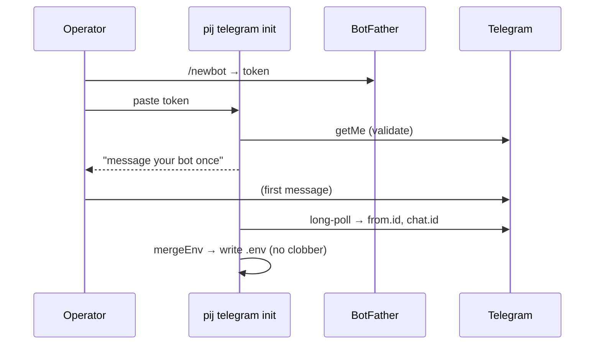

# Phase 4: Onboarding (`pij telegram init`) + docs

**Plan**: `docs/plans/026-pij-telegram-bridge/pij-telegram-bridge-plan.md`
**Mode**: Full · **Phase**: 4 of 4 (final) · **Testing**: Hybrid (test the pure `.env` merge; docs are prose)

## Executive Briefing
- **Purpose**: Zero-to-running in one guided pass, fully documented. `pij telegram init` walks BotFather → validates the token → captures the operator's id from their first message → writes/merges `.env`. Plus README quickstart + a how-to guide.
- **Goals**: ✅ `init` validates token (getMe) + captures `user_id`/`chat_id` + merges `.env` (no clobber) · ✅ `.env.example` · ✅ README quickstart · ✅ `docs/how/pij-telegram.md`
- **Non-Goals**: ❌ no new runtime features (init only wires setup) · ❌ no changes to P1–P3 behavior

## Prior Phase Context — Phases 1–3 (done, all approved)
- **P1**: `loadConfig(envPath)` reads `TELEGRAM_BOT_TOKEN` / `TELEGRAM_ALLOWED_USER_IDS` / `TELEGRAM_CHAT_ID` (scoped, no global env mutation). `init` writes exactly these keys.
- **P2**: allowlist-first relay + `/list`. The allowlist is `TELEGRAM_ALLOWED_USER_IDS` — `init` must capture the operator's numeric id into it.
- **P3**: `pij telegram start` (foreground, single-instance) + `stop`; peer `pij-telegram`; `/tail`. `init` is the third verb (currently a stub).
- **Gotcha**: config validation fails closed on missing token / non-numeric ids — `init` must write valid values.

## Pre-Implementation Check

| File | Exists? | Domain | Notes |
|------|---------|--------|-------|
| `.pi/extensions/pij/telegram/init.ts` | NEW (replaces stub) | pij-control-plane | onboarding flow |
| `.pi/extensions/pij/telegram/init.test.ts` | NEW | pij-control-plane | test the pure `.env` merge |
| `.pi/extensions/pij/telegram/index.ts` | MODIFY | pij-control-plane | route `init` to the real impl (was stub) |
| `.env.example` | NEW | _platform | key template (repo root) |
| `README.md` | MODIFY | _platform | quickstart section |
| `docs/how/pij-telegram.md` | NEW | _platform | operating + security guide |
| `docs/domains/pij-control-plane/domain.md` | MODIFY | pij-control-plane | one-line history note |
| `.gitignore` | (verify) | _platform | already covers `.env` — no change expected |

## Tasks

| Status | ID | Task | Domain | Path(s) | Done When | Notes |
|--------|-----|------|--------|---------|-----------|-------|
| [ ] | T001 | `init.ts`: prompt the BotFather steps (open @BotFather → `/newbot` → paste token); read the token from stdin; validate via grammY `getMe`; print the bot @handle | pij-control-plane | `init.ts`, `index.ts` | Invalid token → clear error; valid → prints @handle | AC-01 |
| [ ] | T002 | Capture operator identity: after validation, prompt "message your bot once", long-poll for the first inbound update, record `from.id` + `chat.id` | pij-control-plane | `init.ts` | First message locks the allowlist to that id | AC-01 |
| [ ] | T003 | **Pure `mergeEnv(existingText, {TELEGRAM_BOT_TOKEN, TELEGRAM_ALLOWED_USER_IDS, TELEGRAM_CHAT_ID})` → new .env text** that sets/updates ONLY these keys and PRESERVES all other lines/keys; write `.env`; create `.env.example` (keys + comments, no secrets) | pij-control-plane / _platform | `init.ts`, `init.test.ts`, `.env.example` | `init.test.ts`: merge preserves a pre-existing unrelated key; updates an existing telegram key in place; appends when absent (AC-01) | The only real unit test of this phase — make it non-vacuous |
| [ ] | T004 | README quickstart: a "Telegram bridge" section — `pij telegram init` walkthrough, the 3 `.env` keys, then `pij telegram start` (foreground; background it yourself) | _platform | `README.md` | Section runs end-to-end as written | |
| [ ] | T005 | `docs/how/pij-telegram.md`: addressing rules (partial first-token, strip `pij-`, multi-match = newest-active first, sticky fallback to most-recent), `/list` + `/tail [N]`, the **reply contract** (agents reply via `pij send pij-telegram`), the **security model** (allowlist is the ONLY access control), single-instance/foreground operation | _platform | `docs/how/pij-telegram.md` | Guide covers all listed topics | |
| [ ] | T006 | One-line history note in the domain doc (bridge peer added) | pij-control-plane | `docs/domains/pij-control-plane/domain.md` | Note recorded; no contract change | Light |

## Context Brief
**Key findings**: Finding 03 (`init` writes the `.env` that `loadConfig` reads — keep the keys exact); Finding 02 (the captured id IS the allowlist — the security model doc must say the allowlist is the only control).

**Domain dependencies**: P1 `loadConfig` key names; grammY `Bot`/`getMe` for validation + the one-shot capture poll.

**Domain constraints**: allowed paths = `.pi/extensions/pij/telegram/`, `.env.example`, `README.md`, `docs/how/pij-telegram.md`, `docs/domains/pij-control-plane/domain.md`. FORBIDDEN: `.the-flow-state.json`, `the-flow.json`, `the-flow.md`, `.flow-pair/`. **Never write a real `.env` with a real token into the repo** (it's gitignored; `init` writes it at runtime — tests must use a temp path). Do NOT modify daemon/core.

## Discoveries & Learnings
_Populated during implementation._

| Date | Task | Type | Discovery | Resolution | References |
|------|------|------|-----------|------------|------------|
