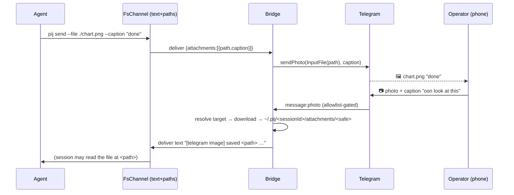

# Phase 5: Media relay — attachments in + out (images / gifs / files)

**Plan**: `docs/plans/026-pij-telegram-bridge/pij-telegram-bridge-plan.md`
**Mode**: Full · **Phase**: 5 of 5 · **Testing**: Hybrid (TDD the pure `media.ts` units + the CLI parse; lightweight/injected-seam for the I/O glue)

## Executive Briefing
- **Purpose**: Carry media **both ways** without putting bytes on the pij wire. An agent attaches a local file to a Telegram reply; the operator sends a photo/gif/document to a session. **Reference-passing**: files live on disk, only paths + metadata flow through the text `body`, and the bridge is the *sole* component touching Telegram's upload/download API.
- **Goals**: ✅ `pij send pij-telegram --file <path> [--caption "<t>"]` → file lands in chat, type-correct (AC-11) · ✅ operator photo/gif/doc → downloaded to a scoped store, session gets a text path (AC-12) · ✅ `body` stays text, filenames sanitized, store under `PIJ_HOME` (AC-13).
- **Non-Goals**: ❌ no bytes through `FsChannel` (paths only) · ❌ no self-hosted Bot API server (enforce the 10/50 MB upload + 20 MB download caps instead) · ❌ no change to P1–P4 behavior · ❌ no multi-file-per-message (one `--file` for v1).

## Prior Phase Context — Phases 1–4 (done, all approved)
- **P1**: `routeMessage`/`resolveTarget` (addressing), `chunk` (outbound splitting). Reuse `routeMessage` to address inbound media via its **caption**.
- **P2**: allowlist is the **first** `bot.use` middleware (Finding 02) — inbound media handlers register **after** it, so non-allowlisted media is dropped before download.
- **P3**: `startForwarder` drains the `pij-telegram` inbox via `FsChannel.watch` and forwards each delivered `body` chunked through an ordered send queue; `createBot` holds the sticky map. Outbound media extends the forwarder; the queue keeps ordering.
- **Gotcha**: the daemon **observes** (never drains) `pij-telegram` (`harness:"pi"`) — unchanged. The daemon now also auto-starts the bridge in-process (this session); media must work identically whether the bridge runs standalone or daemon-hosted.
- **Transport**: `FsChannel.deliver` serializes the `PijMessage` to JSON; adding an optional `attachments` field round-trips with no channel change.

## Pre-Implementation Check

| File | Exists? | Domain | Notes |
|------|---------|--------|-------|
| `.pi/extensions/pij/telegram/media.ts` | NEW | pij-control-plane | pure: classify / size-caps / sanitize / notice |
| `.pi/extensions/pij/telegram/media.test.ts` | NEW | pij-control-plane | the Dim-0 anchors |
| `.pi/extensions/pij/telegram/bridge.ts` | MODIFY | pij-control-plane | outbound media in `startForwarder`; inbound handlers in `createBot` |
| `.pi/extensions/pij/telegram/bridge.test.ts` | MODIFY | pij-control-plane | fake-api outbound + injected-downloader inbound |
| `.pi/extensions/pij/core/types.ts` | MODIFY | pij-control-plane | `PijMessage.attachments?` (optional, additive) |
| `.pi/extensions/pij/core/cli.ts` | MODIFY | _platform | **`pij send` is parsed + the message built HERE** — add `--file/--caption` to the `send` flag set (`core/cli.ts:149`), the parsed-command shape (`:56`/`:230`), and the deliver build (`:455`). `cli.ts` only delegates — do **not** edit it |
| `.pi/extensions/pij/core/cli.test.ts` | MODIFY | _platform | `--file/--caption` parse + message-build unit |
| `package.json` / `package-lock.json` | MODIFY | _platform | add `@grammyjs/files` |
| `docs/how/pij-telegram.md` | MODIFY | _platform | "Attachments" section |
| `README.md` | MODIFY | _platform | one-line mention |
| `docs/domains/pij-control-plane/domain.md` | MODIFY | pij-control-plane | history note |

## Tasks

| Status | ID | Task | Domain | Path(s) | Done When | Notes |
|--------|-----|------|--------|---------|-----------|-------|
| [ ] | T001 | Add `@grammyjs/files`; `npm install`; confirm it imports under tsx | _platform | `package.json`, `package-lock.json` | dep resolves; lockfile updated | mirrors P1 dep add |
| [ ] | T002 | **TDD `media.ts` pure units**: `classifyMedia(path)→"photo"\|"animation"\|"document"`; `withinUploadLimit(bytes,kind)`; `withinDownloadLimit(bytes)`; `safeMediaName(raw)→string`; `buildInboundNotice({path,caption,mime,size})→string` | pij-control-plane | `media.ts`, `media.test.ts` | classification incl. UPPERCASE ext + unknown→document; cap boundaries just-under/just-over (10/50/20 MB); traversal/abs/empty names → safe basename inside store; notice text contains path+caption+mime+size | **Dim-0 anchors — each assertion must flip under a mutation** |
| [ ] | T003 | `PijMessage` gains optional `attachments?: Array<{path:string; caption?:string}>`; **in `core/cli.ts`** `pij send` learns `--file <path>` + `--caption <text>` (add to the `send` flag set `:149`, the parsed-command shape `:56`/`:230`, and the `deliver({from,to,body,…})` build `:455`) | pij-control-plane / _platform | `core/types.ts`, `core/cli.ts`, `core/cli.test.ts` | `pij send id --file p --caption c` yields a message with one attachment; a plain text send has **no** `attachments` key (unchanged) | the one core touch — **`core/cli.ts`, NOT `cli.ts`** (which only delegates); reject `--caption` with no `--file` (clear error) |
| [ ] | T004 | **Outbound** — `startForwarder` handles `attachments`: per file `classifyMedia` → `sendPhoto`/`sendAnimation`/`sendDocument` via grammY `InputFile(path)` + caption, **in the existing ordered send queue**; oversize (`withinUploadLimit` false) → text-notice fallback; forward any text `body` too, but **skip a blank send for an attachment-only (empty body) message** | pij-control-plane | `bridge.ts`, `bridge.test.ts` | fake-`api` test: `.png`→sendPhoto, `.gif`→sendAnimation, `.pdf`→sendDocument (each w/ caption); attachment-only/empty body → media sent, **no** empty text message; oversize→sendMessage notice, **no throw**; ordering preserved (AC-11) | reuse the P3 queue; a temp file on disk for `InputFile` |
| [ ] | T005 | **Inbound** — allowlist-gated `bot.on(["message:photo","message:animation","message:document"])`: resolve target **first** (caption-as-address via `routeMessage`; no caption → sticky; **no target → guidance + no download**); `withinDownloadLimit` pre-check; `@grammyjs/files` download into the **target session's own data dir** `<descriptor.dataDir>/attachments/<safeMediaName>` behind an **injected downloader seam**; deliver `buildInboundNotice(...)` text to that session | pij-control-plane | `bridge.ts`, `bridge.test.ts` | injected-downloader tests: photo+caption `osn look` → saved under **that session's** `attachments/` + session gets a text body with the path; no caption → sticky; **no target → guidance, downloader NOT called**; over-cap → "too big" reply + **no** download; non-allowlisted media **dropped** before download (AC-12/AC-07 parity) | downloader injected so **no network**; store with the session so a future boot tidy reclaims it; reuse allowlist-first ordering |
| [ ] | T006 | Docs: how-doc **Attachments** section (both directions, `--file`/`--caption`, size caps, scoped store), README one-liner, domain-doc history note | _platform / pij-control-plane | `docs/how/pij-telegram.md`, `README.md`, `docs/domains/pij-control-plane/domain.md` | guide covers send + receive + caps; note recorded | light; prose |

## Context Brief
**Key findings**: Finding 02 (allowlist is the *only* control — inbound media handlers register **after** the allowlist middleware, so AC-07 parity holds for media); Finding 03 spirit (the pij `body` is text — media is **path metadata**, never bytes); reference-passing keeps the transport, the daemon, and every other peer text-only.

**Domain dependencies**: P2 `routeMessage`/sticky (address inbound media by caption); P3 `startForwarder` ordered queue (outbound media reuses it); grammY `InputFile` + `sendPhoto`/`sendAnimation`/`sendDocument` (outbound) and `@grammyjs/files` `hydrateFiles`/`file.download` (inbound); `FsChannel` JSON frame (carries `attachments` unchanged).

**Domain constraints**: allowed paths = `.pi/extensions/pij/telegram/`, `.pi/extensions/pij/core/types.ts` (the `attachments` field only), `.pi/extensions/pij/core/cli.ts` (+ `core/cli.test.ts`, the `--file/--caption` parse + message build only — **`cli.ts` is NOT touched**; it merely delegates `send` to the core runner), `package.json`/`package-lock.json`, `docs/how/pij-telegram.md`, `README.md`, `docs/domains/pij-control-plane/domain.md`. **FORBIDDEN**: `.the-flow-state.json`, `the-flow.json`, `the-flow.md`, `.flow-pair/`. Do **not** modify the daemon, the router, or any non-`attachments` part of `core/types.ts`. Inbound media is stored **with the target session**, in `<descriptor.dataDir>/attachments/` (`~/.pij/<id>/attachments/`, under `PIJ_HOME`, outside the repo) — ephemeral, reclaimed by a future boot-time session tidy; tests use a temp `PIJ_HOME`, never write media into the repo. The injected-downloader seam means inbound tests do **no** network I/O.

## Discoveries & Learnings
_Populated during implementation._

| Date | Task | Type | Discovery | Resolution | References |
|------|------|------|-----------|------------|------------|
