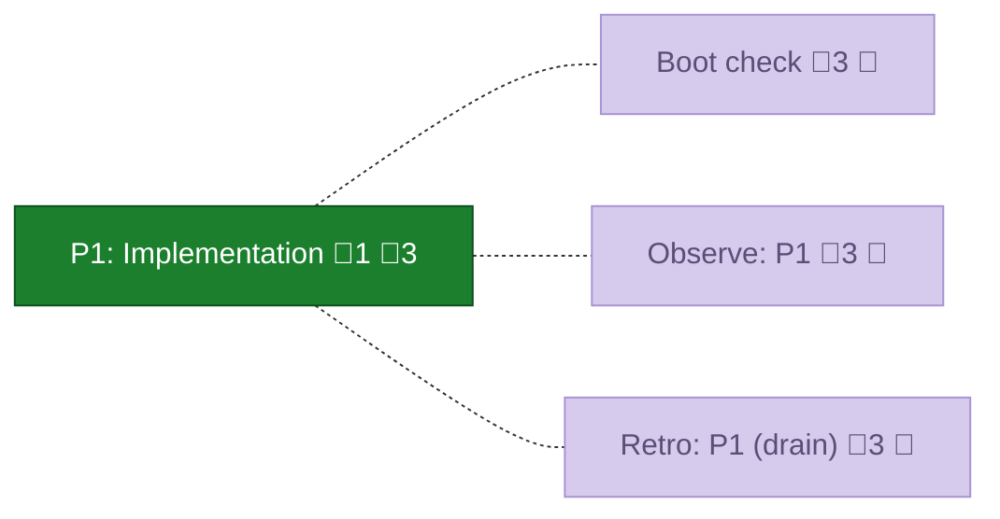
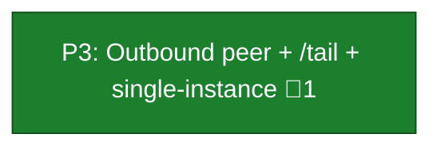

<!-- GENERATED by `harness flow render` — do not hand-edit; regenerate from the flow JSON. -->
# Flow · pij-telegram-bridge

**Kind**: flight-plan · **Now**: ship · **Next**: ship · **Intent**: Telegram bot bridge to the pij daemon: address sessions by partial name, sticky-fallback to most recent, agents reply via pij to pij-telegram, /list + /tail commands, .env onboarding · **Nodes**: 12 · **Events**: 36

**Rail**: ◆─◆─[ ◆─◆─◆─◆─◇ ]  ◆ Research · ◆ Plan · [ ◆ P1: Implementation · ◆ P2: Inbound relay + /list · ◆ P3: Outbound peer + /tail + single-instance · ◆ P4: Onboarding + docs · ◇ Ship ]

### ◆ Research · _done_

↓

### ◆ Plan · _done_

↓

### ◆ P1: Implementation · _done_

↓

### ◆ P2: Inbound relay + /list · _done_

↓

### ◆ P3: Outbound peer + /tail + single-instance · _done_

↓

### ◆ P4: Onboarding + docs · _done_

↓

### ◇ Ship · _assumed_

**Legend** — colour = type/status: 🟩 done · 🟢 in-progress · 🟥 blocked · 🟦 known · ⬜ assumed · 🔶 decision · 🗣 user input · 🟪 harness chore (faded = not yet done) · 🤖 companion · 🛠 worker · 🟧 current (you are here). Badges: 💬 comments · 📄 artifacts · 📝 instructions · 🧰 chore (° optional / recommended / ‼ strongly-recommended; ✓ done · ✕ skipped).

## Node log

### research · Research
- `2026-06-29T11:36:29.080Z` · — · decision — SDK = grammY. Reply model = agent-initiated via 'pij send pij-telegram' (bridge is a self-draining pij peer), not transcript tailing. Addressing = per-message first-token match (strip pij-, partial, first-wins) with sticky fallback to most-recent.

### plan · Plan
- `2026-06-29T11:58:22.585Z` · — · validation — validate-v2: 8/8 code anchors verified; 5 MEDIUM (all underspecification) folded into plan; READY holds. Sidecar: validations/pij-telegram-bridge-plan-validation.md

### phase-1 · P1: Implementation
- `2026-06-29T12:23:23.142Z` · — · validation — APPROVE — 26/26 telegram tests, harness checks --quick all green; AC-02/04/05/10 covered; round-trip test proven non-vacuous

### phase-2 · P2: Inbound relay + /list
- `2026-06-29T12:40:52.040Z` · — · validation — APPROVE — allowlist-first/AC-07 proven (my own mutation flips 2 tests RED); AC-02/03/04/06(partial) covered; 44/44 green

### phase-3 · P3: Outbound peer + /tail + single-instance
- `2026-06-29T13:09:03.373Z` · — · validation — APPROVE — AC-05/08/09 + /tail proven; 409 branch now pinned (my mutation flips 2 tests RED); descriptor harness:pi/bound self-drain contract verified; 81/81 green

### phase-4 · P4: Onboarding + docs
- `2026-06-29T13:31:46.892Z` · — · validation — APPROVE — AC-01 (init+mergeEnv no-clobber), scoped 0600 enforced (my mutation flips perms test RED), docs match impl; 91/91 green
