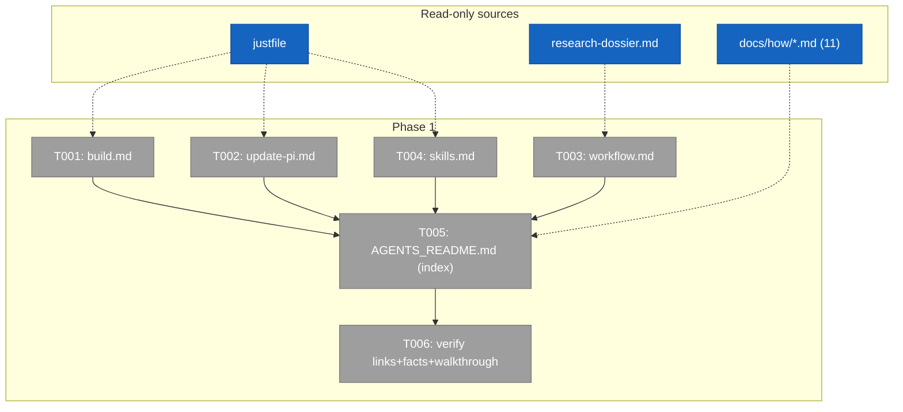
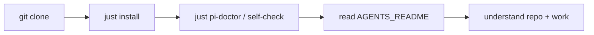

# Phase 1 Tasks — docs/how depth articles + AGENTS_README index

**Plan**: [`../../docs-cold-start-plan.md`](../../docs-cold-start-plan.md)
**Phase**: Phase 1 — docs/how depth articles + AGENTS_README index
**Mode**: Full · **Testing**: Manual (links + facts + cold-start walkthrough)
**Status**: Ready for the coder (implementation NOT done here — planning only)

> **Scope guard:** documentation-only. Create the 5 files below; change no code, no
> `justfile`, no extension, no `.harness/`. Every command/path a doc states MUST match the
> `justfile`/CLI source (cite the line). If a doc and the `justfile` disagree, the doc is wrong.

---

## Executive Briefing

- **Purpose**: Give a fresh agent on a new machine a cold-start front door. Write the 4
  new `docs/how/` depth articles, then the root `AGENTS_README.md` index that signposts to
  them and the 11 existing articles.
- **What We're Building**: 4 Markdown depth articles + 1 root index file.
- **Goals**:
  - ✅ `docs/how/build.md`, `update-pi.md`, `workflow.md`, `skills.md` — accurate, justfile-sourced depth.
  - ✅ `AGENTS_README.md` — cold-start quickstart + index (blurb + link per section), NOT a content dump.
  - ✅ The skills-location fact stated exactly (Key Finding 01 / plan AC-03).
- **Non-Goals**:
  - ❌ Editing the 11 existing `docs/how/` articles (signpost only).
  - ❌ A separate `docs/how/cold-start.md` (quickstart lives in AGENTS_README).
  - ❌ A `skill-runner.md` article (one-line index mention only).
  - ❌ Touching `README.md` (that is Phase 2).

## Pre-Implementation Check

| File | Exists? | Action | Notes |
|------|---------|--------|-------|
| `AGENTS_README.md` (root) | No | **create** | Distinct from existing `AGENTS.md` (rules). Do not edit AGENTS.md. |
| `docs/how/build.md` | No | **create** | — |
| `docs/how/update-pi.md` | No | **create** | — |
| `docs/how/workflow.md` | No | **create** | — |
| `docs/how/skills.md` | No | **create** | — |
| `justfile` | Yes | **read-only source** | Single source of truth for every command. |
| `AGENTS.md`, `RUNBOOK.md` | Yes | **link target** | AGENTS_README links to them; never absorbs them. |
| 11 `docs/how/*.md` | Yes | **link target** | Signpost only. |

## Architecture Map



## Tasks

| Status | ID | Task | Domain | Path(s) | Done When | Notes |
|--------|-----|------|--------|---------|-----------|-------|
| [ ] | T001 | Write **build.md** depth article: (1) Prerequisites — node `>=24`, npm, `tmux`, the ambient global `harness` CLI; (2) `just install` — the 6-step fresh-machine bootstrap, listed in order; (3) recipe surface — `just` (no-arg lists), `new`/`typecheck`/`lint`/`format`/`test`/`smoke`; (4) the gate — `just self-check` = typecheck→lint→test→smoke→`PIJ_VET_SKIP_AGENT=1 pkg audit`→snapshots-check; (5) the engineering harness — `harness boot`/`harness checks`/`harness doctor` and that `.harness/` is committed substrate while `harness` is a global tool; (6) smoke = tmux Driver SDK. Cite the `justfile` line for each command. | docs (consume extension-authoring-harness) | `docs/how/build.md` | File exists; a fresh agent can build + gate the repo from it; every command matches the `justfile` (spot-cited). | Findings 02,07; `justfile:16-123,210-357`; `AGENTS.md:120-128`; `.harness/engineering-harness.md` |
| [ ] | T002 | Write **update-pi.md** depth article: (1) What pi is — the official npm binary `@earendil-works/pi-coding-agent@latest`; (2) `just update-pi` — the canonical refresh flow (official pi + prefs sync + link + `npm link` + `pkg bootstrap` + `pi update --extensions` + pi-doctor); (3) the `~/.pi/agent/` global state pij syncs — `APPEND_SYSTEM.md`, `mcp.json`, extension symlinks, vetted packages — and that the source files are `.pi/APPEND_SYSTEM.md` / `.pi/mcp.json` (edit there, re-run, never hand-edit `~/.pi/agent/*`); (4) `just pi-doctor` — the read-only audit; (5) the optional **pi-fork** path (`pi-fork-sync-upstream`/`pi-fork-build`/`pi-fork-link`) flagged as advanced/optional pi-core dev only. | docs (consume extension-authoring-harness) | `docs/how/update-pi.md` | File exists; "what is pi" + install + update + verify all answerable from it; commands cite the `justfile`. | Finding 03; `justfile:210-227,229-290,303-357` |
| [ ] | T003 | Write **workflow.md** depth article: (1) the-flow SDD pipeline — explore→plan→tasks→implement→review→ship (the planning lives in `docs/plans/<ord>-<slug>/`); (2) flow-pair — the 3-session orchestrator/worker/reviewer wrapper over the-flow + the prompt-learning ledger, packets pointer-delivered via `pij send`; (3) control-plane peers — the `pij` daemon switchboard, `pij spawn/send/list/tail`, and the transport seam (pi = in-process inbox; claude/codex/copilot = tmux send-keys). Keep it a narrative map; **link** `docs/how/flow-pair.md` + `docs/how/pij.md` for depth rather than duplicating them. | docs (consume flow-pair, pij-control-plane) | `docs/how/workflow.md` | File exists; a newcomer understands how we plan + delegate + drive peers; links to flow-pair.md/pij.md resolve. | Findings F-11,F-12,F-13; `docs/domains/pij-control-plane/domain.md`; `docs/domains/flow-pair/domain.md`; `docs/how/flow-pair.md` |
| [ ] | T004 | Write **skills.md** depth article: (1) the skills model — the shared store `~/.agents/skills/` is where non-Claude agents (copilot, codex, pi) read skills from, installed via `npx skills`, tracked in the manifest `~/.agents/.skill-lock.json`; Claude's skills live at `~/.claude/skills/`, which holds symlinks INTO the shared store; (2) the install recipes — `just flow-pair-install` (`npx skills … -a '*'` machine-wide to every agent) and `just install-flow-skills` (the-flow ← jakkaj/tools + eng-harness-flow ← @ai-substrate/engineering-harness, pi-scoped); (3) which skills matter for cold-start — the-flow, flow-pair, eng-harness-flow. **The fact must match disk reality exactly (do not paraphrase).** | docs (cross-cutting) | `docs/how/skills.md` | File exists; the shared-store-vs-claude fact is correct and matches F-07; recipes cite the `justfile`. | Finding 01 (Critical); `justfile:160-191`; disk evidence F-07 (`~/.agents/.skill-lock.json` v3) |
| [ ] | T005 | Write **AGENTS_README.md** (root) — the cold-start front door. Open with a **Cold start** quickstart: `git clone … && cd pij && just install`, then verify with `just pi-doctor` + `just self-check` (or `harness boot`). Then one index section per the **AGENTS_README Link Map** (below) — each section a 1–3 sentence blurb + its links. Include the skills fact INLINE (verbatim, AC-03). It is an **index, not a content dump** — depth lives in the linked articles; cap each section at blurb+links. State near the top that `AGENTS.md` is the rules and `RUNBOOK.md` the ops runbook. | docs (front-door index) | `AGENTS_README.md` | File exists at repo root; covers build + update-pi + workflow + cold-start essentials (AC-02); carries the full Link Map; contains the skills fact (AC-03); reads as an index. Depends on T001–T004 existing. | ACs 01–04; **see AGENTS_README Link Map below** |
| [ ] | T006 | **Verify Phase 1** — (a) Link check: every relative link in T001–T005 resolves to a real file; (b) Fact check: each command/path matches the `justfile`/CLI (spot-cite lines), and the skills fact matches F-07; (c) Cold-start walkthrough: read `AGENTS_README.md` top-to-bottom as a fresh agent and confirm clone → `just install` → verify is followable with no missing step. | docs | (all Phase 1 files) | All links resolve; no command contradicts the `justfile`; walkthrough has no gap. | Testing Strategy; ACs 05,07 |

## Context Brief

**Key findings from plan** (full list in `../../docs-cold-start-plan.md` § Key Findings):
- **01 (Critical)**: skills fact — pin exact wording (T004, T005).
- **02/07 (High)**: `justfile` is the single source of truth; node `>=24` (T001).
- **03 (High)**: pi = `@earendil-works/pi-coding-agent`; `update-pi`/`pi-doctor` (T002).
- **06 (Medium)**: AGENTS_README ≠ AGENTS.md; link, don't absorb (T005).

**AGENTS_README Link Map** (the exact signposts T005 must carry — this is the brief's
"which docs/how links AGENTS_README carries" answer):

| Section | Blurb (1–3 sentences) | Links it carries |
|---------|------------------------|------------------|
| Cold start | Clone, `just install`, verify. The single fresh-machine path. | `docs/how/build.md` |
| Build & test | Recipes, the `self-check` gate, the engineering harness. | `docs/how/build.md`; `.harness/engineering-harness.md` |
| What is pi / updating pi | pi is the official `@earendil-works/pi-coding-agent`; pij syncs global state onto it. | `docs/how/update-pi.md` |
| How we work (workflow) | the-flow SDD pipeline + flow-pair delegation + control-plane peers. | `docs/how/workflow.md`; `docs/how/flow-pair.md`; `docs/how/pij.md` |
| Skills (MUST-INCLUDE fact) | Shared store `~/.agents/skills/` via `npx skills` (manifest `~/.agents/.skill-lock.json`); Claude reads `~/.claude/skills/` (symlinks into it). | `docs/how/skills.md` |
| The extensions (pi-extensions half) | The `.pi/extensions/*` product surfaces. | `docs/how/pij.md`, `session-sql.md`, `todo.md`, `agent-workbench.md`, `pi-peacock.md`, `file-watch-notify.md`, `image-see.md`, `ralph-loop.md` (+ one-line `skill-runner`, no article) |
| Cross-agent worker system (the other half) | The control plane, delegation, and remote driving. | `docs/how/pij.md`, `flow-pair.md`, `pij-telegram.md` |
| Feedback / self-improvement | Retros + magic-wand loop back into the harness. | `docs/how/agent-feedback.md` |
| Rules & runbook | Where the agent rules and ops runbook live. | `AGENTS.md` (rules), `RUNBOOK.md` (ops), `README.md` (thesis) |

**Domain constraints**: docs-only; consume (read) existing domains, change none; no
domain contract touched; no new code domain (no domain setup task).

**Reusable from prior work**: the `justfile` header comments are already excellent prose
sources for `build.md`/`update-pi.md` (e.g. `justfile:22-39,292-302`); the
`research-dossier.md` evidence table maps every claim to a citation.

**Mermaid flow diagram** (cold-start path the docs must enable):


## Discoveries & Learnings

_Populated during implementation by the coder._

| Date | Task | Type | Discovery | Resolution | References |
|------|------|------|-----------|------------|------------|

---

```
docs/plans/028-docs-cold-start/
  ├── docs-cold-start-plan.md
  ├── research-dossier.md
  └── tasks/
      ├── phase-1-docs-how-and-agents-readme/
      │   └── tasks.md           # this file
      └── phase-2-readme-thesis/
          └── tasks.md
```

**STOP** — tasks only. The coder implements from here; a reviewer reviews. No code/docs
written in this planning pass.
