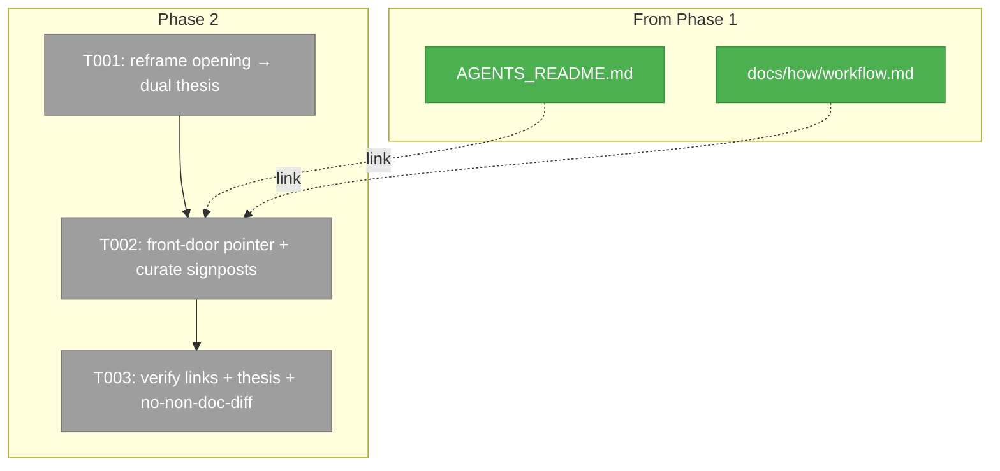
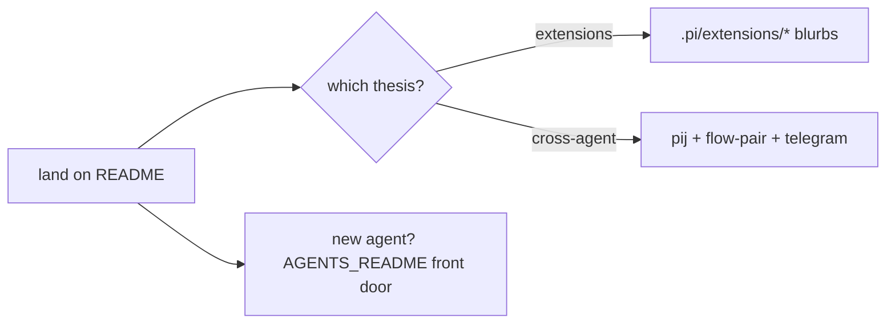

# Phase 2 Tasks — README dual-thesis reframe

**Plan**: [`../../docs-cold-start-plan.md`](../../docs-cold-start-plan.md)
**Phase**: Phase 2 — README dual-thesis reframe
**Mode**: Full · **Testing**: Manual (links + thesis read + no-non-doc-diff)
**Status**: Ready for the coder (depends on Phase 1) — planning only, no edits here

> **Scope guard:** documentation-only, single file. Edit `README.md`; change no code, no
> `justfile`, no other doc. Keep every existing accurate blurb/link; this is a **reframe of
> the top**, not an append and not a rewrite.

---

## Executive Briefing

- **Purpose**: Make `README.md` lead with the repo's dual thesis and point agents at the
  new `AGENTS_README.md` front door.
- **What We're Building**: an edited `README.md` whose opening frames "pij is BOTH a
  pi-extensions project AND a cross-agent worker system — and more".
- **Goals**:
  - ✅ Top-of-file framing of the dual thesis (not just a feature list).
  - ✅ A near-top link to `AGENTS_README.md` as the agent cold-start front door.
  - ✅ Existing feature sections preserved as accurate blurbs + links.
- **Non-Goals**:
  - ❌ Deleting accurate existing content or breaking existing relative links.
  - ❌ Re-documenting build/pi/workflow inline (those now live in the Phase 1 articles).
  - ❌ Touching any non-doc file.

## Prior Phase Context

**Phase 1 delivers (consume these here):**
- **Deliverables**: `AGENTS_README.md` (root index) + `docs/how/build.md`,
  `update-pi.md`, `workflow.md`, `skills.md`.
- **Dependencies exported**: README can now link `AGENTS_README.md` (front door) and
  `docs/how/workflow.md` (how we work). These paths exist only after Phase 1 — do not
  link them until Phase 1 is merged/landed.
- **Patterns to follow**: justfile-sourced accuracy; index-not-dump; signpost depth
  rather than duplicate it.
- **Gotcha carried forward**: the current README already lists the cross-agent features
  but **frames** only the harness thesis (`README.md:3-7`) — the fix is elevation, not
  addition.

## Pre-Implementation Check

| File | Exists? | Action | Notes |
|------|---------|--------|-------|
| `README.md` | Yes | **edit (reframe top)** | Preserve accurate feature blurbs + the "Where things are"/"Using extensions" tables. |
| `AGENTS_README.md` | (after P1) | **link target** | Link near the top as the agent front door. |
| `docs/how/workflow.md` | (after P1) | **link target** | One cross-link from the workflow/feature area. |

## Architecture Map

## Tasks

| Status | ID | Task | Domain | Path(s) | Done When | Notes |
|--------|-----|------|--------|---------|-----------|-------|
| [ ] | T001 | **Reframe the README opening** to the dual thesis: pij is BOTH a **pi-extensions project** (`.pi/extensions/*`, e.g. pij, session-sql, todo, …) AND a **cross-agent worker system** (the pij control-plane daemon + flow-pair orchestration + the Telegram bridge — agents driving agents across claude/copilot/codex/pi) — **and more**. Keep "the harness is the product" but subordinate it under the dual thesis rather than leading with it. | docs | `README.md` (top, ~lines 1–20) | The first screenful frames "both + more"; a reader who stops after the intro knows the repo is both an extensions project and a cross-agent worker system. | Finding 04; `README.md:1-20`; thesis source = research-dossier F-05,F-11,F-12 |
| [ ] | T002 | **Add the agent front-door pointer + curate signposts**: near the top, link `AGENTS_README.md` as the cold-start front door for agents ("new agent? start here"). Keep the existing feature sections (pij, session-sql, todo, minih-workbench, pi-peacock, flow-pair, telegram) as accurate blurbs + links; add one cross-link to `docs/how/workflow.md` from the workflow/cross-agent area. Do not remove accurate content or duplicate the Phase 1 articles. | docs | `README.md` | `AGENTS_README.md` linked near the top; `docs/how/workflow.md` cross-linked; all existing feature blurbs/links intact. | F-09,F-10 |
| [ ] | T003 | **Verify Phase 2**: (a) Link check — every relative link in `README.md` resolves, including the new `AGENTS_README.md` + `docs/how/workflow.md`; (b) Thesis read — the opening clearly frames "both + more"; no pre-existing link broken; (c) confirm **no non-doc file changed** (git diff touches only `README.md` this phase). | docs | `README.md` | All links resolve; thesis reads correctly; `git diff --name-only` shows only docs. | ACs 06,07,08 |

## Context Brief

**Key findings from plan**:
- **04 (High)**: README under-frames the thesis → this phase elevates, not appends (T001).
- **05/06 (Medium)**: preserve accurate feature blurbs; AGENTS_README is the new front
  door README points at (T002).

**Domain constraints**: docs-only; single-file edit; no code, no `justfile`, no contract.

**Reusable from Phase 1**: the dual-thesis language and the cross-agent synthesis are
already written in `research-dossier.md` (Answer §5–6) and `docs/how/workflow.md` — reuse
that framing for consistency.

**Mermaid flow diagram** (reader journey the README must produce):

## Discoveries & Learnings

_Populated during implementation by the coder._

| Date | Task | Type | Discovery | Resolution | References |
|------|------|------|-----------|------------|------------|

---

**STOP** — tasks only. The coder edits `README.md` from here after Phase 1 lands; a
reviewer reviews. No edits in this planning pass.
