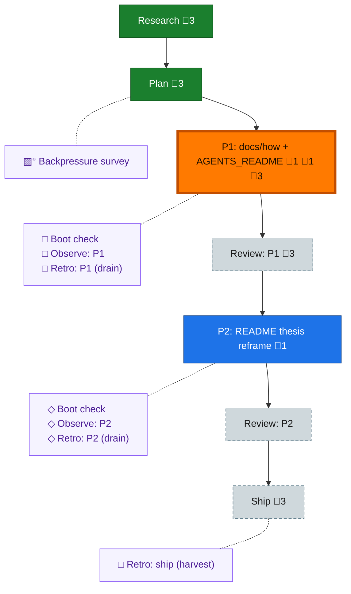

<!-- GENERATED by `harness flow render` — do not hand-edit; regenerate from the flow JSON. -->
# Flow · docs-cold-start

**Kind**: flight-plan · **Now**: phase-1 · **Next**: review-1 · **Intent**: Plan the cold-start docs pass (AGENTS_README index + README thesis + 4 new docs/how articles). · **Nodes**: 15 · **Events**: 17

**Rail**: ◆─◆─[ ◇─◇─◇─◇─◇ ]  ◆ Research · ◆ Plan · [ ◇ P1: docs/how + AGENTS_README · ◇ Review: P1 · ◇ P2: README thesis reframe · ◇ Review: P2 · ◇ Ship ]

**Legend** — colour = type/status: 🟩 done · 🟢 in-progress · 🟥 blocked · 🟦 known · ⬜ assumed · 🔶 decision · 🗣 user input · 🟪 harness chore (faded = not yet done) · 🤖 companion · 🛠 worker · 🟧 current (you are here). Badges: 💬 comments · 📄 artifacts · 📝 instructions · 🧰 chore (° optional / recommended / ‼ strongly-recommended; ✓ done · ✕ skipped).

## Node log

### phase-1 · P1: docs/how + AGENTS_README
- 📄 artifacts: tasks/phase-1-docs-how-and-agents-readme/tasks.md
- `2026-06-30T21:20:18.261Z` · — · — — Tasks authored by planning driver pij-1bdkqiq (fleet orch pij-5lztp8). Implementation deferred to coder.

### phase-2 · P2: README thesis reframe
- 📄 artifacts: tasks/phase-2-readme-thesis/tasks.md
