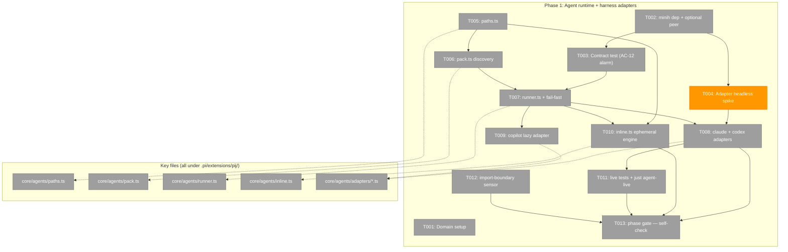
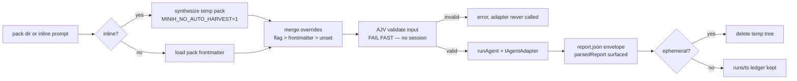
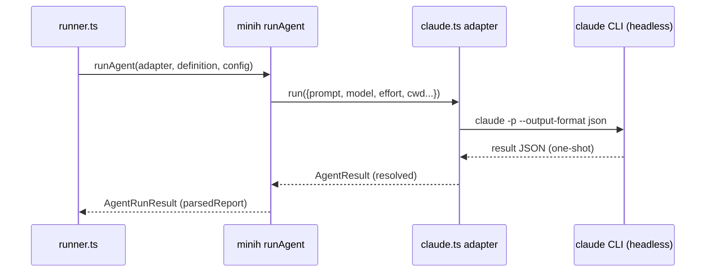

# Phase 1: Agent runtime + harness adapters — Tasks & Context Brief

**Plan**: [pij-agents-minih-plan.md](../../pij-agents-minih-plan.md)
**Phase**: 1 of 2
**Domain**: agent-runtime (NEW)
**Generated**: 2026-07-03
**Complexity**: CS-3 for this phase (pure-core TDD + one spike + live gate)

---

## Executive Briefing

- **Purpose**: Build the `agent-runtime` domain — pij embeds minih's library runner (`runAgent`) behind pij-owned harness adapters, so minih-compatible agent packs run under claude/codex/copilot with pack discovery, instantiation-time overrides, and an ephemeral/inline engine. No CLI surface yet; everything is provable with vitest + FakeAgentAdapter.
- **What We're Building**: `package.json` dep pin (`github:AI-Substrate/minih#minih-v0.2.4` + `@github/copilot-sdk` optional peer); `.pi/extensions/pij/core/agents/{types,paths,pack,runner,inline}.ts` + `adapters/{claude,codex,copilot}.ts`; co-located tests including the minih contract test (the AC-12 drift alarm) and `PIJ_AGENT_LIVE=1` live tests; domain docs; two harness sensors from the backpressure survey (`just agent-live` recipe, import-boundary test).
- **Goals**:
  - ✅ minih embedded as a library at an exact tag; contract test rides `just self-check` so tag bumps fail loudly (AC-12)
  - ✅ 3-tier pack discovery with precedence + shadowing logic (AC-01 logic layer)
  - ✅ `runAgent` wrapper: frontmatter defaults, flag overrides, AJV fail-fast **before** any adapter session (AC-03 core)
  - ✅ claude + codex headless adapters (de-risked by a spike first), copilot lazy-loaded optional peer (AC-07)
  - ✅ Ephemeral/inline engine: temp-pack synthesis, nothing left on disk, crash-sweep (AC-05/AC-06 core)
- **Non-Goals**:
  - ❌ No `pij agent` CLI verbs, USAGE, or error surface — Phase 2
  - ❌ No built-in packs shipped, no eject — Phase 2
  - ❌ No vetter migration off the minih binary (plan Key Finding 04 — explicit Non-Goal)
  - ❌ No session-resident/companion machinery (residency lifecycle is a post-v1 workshop)

## Prior Phase Context

_None — this is Phase 1._

## Pre-Implementation Check

| File | Exists? | Domain Check | Notes |
|------|---------|-------------|-------|
| `/Users/jordanknight/pi-hacking/pij/package.json` | yes | agent-runtime (internal) | modify: add `minih` git dep, `@github/copilot-sdk` optional peer + `peerDependenciesMeta`. Current deps: grammy/dotenv/picomatch only — no conflicts |
| `/Users/jordanknight/pi-hacking/pij/.pi/extensions/pij/core/agents/**` | **no** (verified) | agent-runtime NEW | create; barrel-less layout per `core/` convention (KF-05) |
| `/Users/jordanknight/pi-hacking/pij/docs/domains/agent-runtime/domain.md` | no | agent-runtime | create (G7) |
| `/Users/jordanknight/pi-hacking/pij/docs/domains/registry.md`, `domain-map.md` | yes | — | modify: add row + node/edges |
| `/Users/jordanknight/pi-hacking/pij/justfile` | yes | extension-authoring-harness | modify: add `agent-live` recipe (backpressure survey addition) |
| `/Users/jordanknight/pi-hacking/pij/vitest.config.ts` | yes | — | **no change** — include glob `.pi/extensions/**/*.test.ts` already picks up new tests, which is how the contract test reaches `just self-check` with zero wiring |
| `/Users/jordanknight/pi-hacking/pij/.pi/extensions/pij/daemon.ts` (daemon-start sweep hook) | yes | pij-control-plane | small modify in T010; **daemon runs tsx off source with no hot-reload — restart any live daemon after this lands** |

**Duplication check**: `docs/domains/registry.md` has no agent-execution concept — `agent-workbench` only *observes* minih runs; the vetter's private minih mechanics (`harness/scripts/vetters/agent.ts`) stay put per KF-04. No collision.

## Architecture Map



## Tasks

| Status | ID | Task | Domain | Path(s) | Done When | Notes |
|--------|-----|------|--------|---------|-----------|-------|
| [x] | T001 | Domain setup: author `domain.md` from the plan's agent-runtime sketch (owns discovery/adapters/ephemeral + `~/.pij` path contract; excludes observation UI, pack format, companion protocol, CLI parsing); add registry row + domain-map node/edges | agent-runtime | `/Users/jordanknight/pi-hacking/pij/docs/domains/agent-runtime/domain.md`, `docs/domains/registry.md`, `docs/domains/domain-map.md` | Registry + map render; boundaries byte-match the plan sketch | Plan G7; sketch in plan § New Domain Sketches |
| [x] | T002 | Add `"minih": "github:AI-Substrate/minih#minih-v0.2.4"` to dependencies; `@github/copilot-sdk` to peerDependencies with `peerDependenciesMeta: {"@github/copilot-sdk": {"optional": true}}` | agent-runtime | `/Users/jordanknight/pi-hacking/pij/package.json` | `npm i` clean; `import { runAgent } from "minih/runner"` and `import { FakeAgentAdapter } from "minih"` typecheck | KF-01; exact-tag pin (note the `minih-v` tag prefix); minih is NOT on the npm registry |
| [x] | T003 | **Test-first**: minih contract test — hello-world-shape fixture pack (`prompt.md` + frontmatter) under `core/agents/__fixtures__/`; test **copies fixture to a temp dir** (real `runAgent` writes `runs/<ts>/` at the pack dir), runs `FakeAgentAdapter` through the **real** `runAgent` import — **seed the fake with an envelope**: `new FakeAgentAdapter({ output: JSON.stringify({ summary: "…", retrospective: { workedWell: "…", confusing: "…", magicWand: "…" } }) })`, because a stock fake returns `output: ''` and minih's runner only writes `output/report.json` when the adapter output is truthy (`dist/runner/runner.js:1336`) — then asserts `output/report.json` satisfies the system envelope and the repo tree stays clean. Prove the alarm rings once: sabotage the import locally, watch it fail, revert (record in execution log) | agent-runtime | `/Users/jordanknight/pi-hacking/pij/.pi/extensions/pij/core/agents/contract.test.ts`, `core/agents/__fixtures__/hello-world/` | Test green + idempotent (no untracked artifacts after 2 consecutive runs); red-first proof logged; visible inside `just test`/`just self-check` with zero extra wiring | AC-02, AC-12; validation finding MEDIUM-1 (temp-dir copy is mandatory) |
| [x] | T004 | **Adapter spike**: drive one real prompt through `claude -p --output-format json` and one through `codex exec` by hand; record result shape, session-id availability, event granularity, and exit behaviour in a spike note; declare go/no-go for the headless adapter approach | agent-runtime | `/Users/jordanknight/pi-hacking/pij/docs/plans/029-pij-agents-minih/spikes/adapter-headless-spike.md` | Spike note answers workshop 001 Q1 (event granularity vs `IAgentAdapter` needs: `run→AgentResult` on idle, `compact`, `terminate`); go/no-go recorded | Plan risk #1 (Medium/High); do this before T008 — it may reshape the adapter design |
| [x] | T005 | Tests then impl: `paths.ts` — `agentsDir(pijHome)`, `tmpDir(pijHome)`, home resolution `PIJ_HOME ?? ~/.pij` as the **single** resolver (kills the 3× inline duplication in cli.ts/index.ts/daemon.ts — consumed there in Phase 2) | agent-runtime | `/Users/jordanknight/pi-hacking/pij/.pi/extensions/pij/core/agents/paths.ts`, `paths.test.ts` | Unit tests green incl. `PIJ_HOME` env isolation (temp-home fixture) | KF-05; TDD |
| [x] | T006 | Tests then impl: `pack.ts` — a dir is a pack iff `prompt.md` exists; discovery across `./agents` → `~/.pij/agents` → built-in dir (param, wired in Phase 2); precedence merge; shadowed slugs marked, not dropped | agent-runtime | `/Users/jordanknight/pi-hacking/pij/.pi/extensions/pij/core/agents/pack.ts`, `pack.test.ts` | Unit tests green: precedence order, shadow marking, `agent.json`-less packs accepted (AC-01 logic) | Dossier F-05/F-18; TDD |
| [x] | T007 | Tests then impl: `runner.ts` — frontmatter → `AgentDefinition`; overrides (model/effort/timeout/permissions) → `AgentRunConfig` with flag > frontmatter > unset precedence; result surfacing from `AgentRunResult.parsedReport`; **AJV input validation runs before `adapter.run` is ever invoked** (assert via FakeAgentAdapter call-spy) | agent-runtime | `/Users/jordanknight/pi-hacking/pij/.pi/extensions/pij/core/agents/runner.ts`, `types.ts`, `runner.test.ts` | FakeAgentAdapter tests green: defaults, each override, fail-fast (adapter.run never called on invalid input) | AC-03, AC-04 core; minih validators via `minih/runner` exports; TDD |
| [x] | T008 | Implement `adapters/claude.ts` + `adapters/codex.ts` per T004 spike: `IAgentAdapter` (`run` resolves on completion, failed `AgentResult` on error); codex clamps `minimal` effort to `low` **with a warning**; unit tests fake the subprocess | agent-runtime | `/Users/jordanknight/pi-hacking/pij/.pi/extensions/pij/core/agents/adapters/claude.ts`, `adapters/codex.ts`, `adapters/*.test.ts` | Unit tests green with faked subprocess; clamp warns; graceful degradation documented if spike found no mid-run compact/terminate | KF-06; workshop 001 D2; blocked by T004 |
| [x] | T009 | Implement `adapters/copilot.ts`: lazy `import()` wrapper around minih's `SdkCopilotAdapter`; when `@github/copilot-sdk` absent, throw a clear error naming the missing package and the install command | agent-runtime | `/Users/jordanknight/pi-hacking/pij/.pi/extensions/pij/core/agents/adapters/copilot.ts`, `adapters/copilot.test.ts` | Unit test proves both paths: peer present (fake module) loads; peer absent yields the named-package error (AC-07 second half) | Plan risk #4; KF-01 (copilot optional at composition root) |
| [x] | T010 | Tests then impl: `inline.ts` — synthesize temp pack (`prompt.md` [+ optional output schema]) under `tmpDir()/agents/<run-id>/`; run with `MINIH_NO_AUTO_HARVEST=1`; delete tree on completion (success AND failure); export `sweepStaleTmp()` and hook it into **daemon start**; run-start invocation is consumed by Phase 2's `run` verb | agent-runtime | `/Users/jordanknight/pi-hacking/pij/.pi/extensions/pij/core/agents/inline.ts`, `inline.test.ts`, `.pi/extensions/pij/daemon.ts` (sweep hook) | After an inline run: temp tree gone, no retro file, no repo writes; a planted stale tree is swept (AC-05 core); daemon tests still green | KF-02; workshop 001 D3; **restart any live daemon after landing** |
| [x] | T011 | Live validation: `adapters.live.test.ts` behind `PIJ_AGENT_LIVE=1` + `describe.skipIf` with self-documenting `it.skip` (the `vet-live` pattern verbatim) — one real claude one-shot, one real codex one-shot, each producing a valid envelope. Add `just agent-live` recipe (`PIJ_AGENT_LIVE=1 npx vitest run adapters.live`) | agent-runtime + extension-authoring-harness | `/Users/jordanknight/pi-hacking/pij/.pi/extensions/pij/core/agents/adapters/adapters.live.test.ts`, `/Users/jordanknight/pi-hacking/pij/justfile` | `just agent-live` passes locally end-to-end (AC-07); plain `just test` skips them with the env-var hint | Backpressure survey addition #1; precedent `harness/scripts/vetters/agent.live.test.ts` |
| [x] | T012 | Import-boundary sensor: vitest test asserting no file under `core/agents/**` imports daemon/telegram/tmux/grammy modules (static import scan) | agent-runtime | `/Users/jordanknight/pi-hacking/pij/.pi/extensions/pij/core/agents/boundary.test.ts` | Test green; deliberately adding a forbidden import fails it (prove once, revert) | Backpressure survey addition #2 — flips the arch-drift row from review-tier to computational |
| [x] | T013 | Phase gate: `just self-check` green end-to-end (typecheck + lint + all tests incl. contract + boundary; smoke; snapshots) with zero untracked artifacts; execution log records proof | agent-runtime | — (verification only) | `just self-check` exit 0; `git status` clean of run artifacts | The phase's deterministic done state per backpressure survey |

## Context Brief

**Key findings from plan** (act on these — full table in plan § Key Findings):
- **KF-01 (Critical)**: `runAgent(adapter, definition, config)` is exported and adapter-agnostic; copilot is optional and injected only at minih's CLI composition root → embed as library, implement `IAgentAdapter` per harness.
- **KF-02 (Critical)**: minih has **no** ephemeral/inline mode — every run writes `runs/<ts>/` rooted at the pack dir, and definitions must be on disk → `inline.ts` temp-pack layer is the workaround; upstream later.
- **KF-05 (High)**: `core/` is barrel-less (no `index.ts` anywhere) — concrete-file imports only; `PIJ_HOME ?? ~/.pij` is inlined 3× today and `paths.ts` becomes the single resolver.
- **KF-06 (Medium)**: minih `reasoningEffort` enum is `low|medium|high|xhigh` (no `minimal`) → codex adapter clamps + warns; model validation is pij-registry, warn-don't-block.
- **KF-04 (High)**: do **not** lift the vetter's private minih mechanics — v1 Non-Goal.

**Domain dependencies** (contracts this phase consumes):
- `minih` (external, exact tag): `runAgent` + `FakeAgentAdapter` + `validateInput/validateOutput/validateSystemOutput` (via `minih/runner`); `IAgentAdapter` interface (`run(options)→AgentResult` resolving on session_idle; `compact(sessionId)`; `terminate(sessionId)`); env contract `MINIH_OUTPUT_PATH`/`MINIH_PROJECT_ROOT`; `MINIH_NO_AUTO_HARVEST=1` suppresses retro harvest.
- `pij-control-plane`: nothing imported this phase — `paths.ts` is *built here for* Phase 2's consumption; daemon.ts gains only the sweep hook call.

**Domain constraints**:
- `core/agents/**` must not import daemon/telegram/tmux modules (T012 enforces); dependency direction is `cli.ts → core/agents → minih`, never the reverse.
- Tests co-located `*.test.ts` (vitest glob auto-includes); live tests `*.live.test.ts` + `describe.skipIf(!process.env.PIJ_AGENT_LIVE)`.
- minih pack format is an **external contract** — never forked, never extended; a pack that runs under pij must run under stock minih unchanged.

**Reusable from prior phases** (repo precedents, no prior phases):
- Live-gate pattern: `harness/scripts/vetters/agent.live.test.ts` (skipIf + self-documenting it.skip + justfile recipe).
- Temp-home test isolation: `mkdtemp`-based patterns in `index.test.ts`, `daemon.test.ts`, `adapters/fs-registry.test.ts`.
- `harness/test-utils.ts` helpers.

**Mermaid flow diagram** (a run through the runtime):


**Mermaid sequence diagram** (adapter seam):


## Discoveries & Learnings

_Populated during implementation by the implement verb._

| Date | Task | Type | Discovery | Resolution | References |
|------|------|------|-----------|------------|------------|

## Directory Layout

```
docs/plans/029-pij-agents-minih/
  ├── pij-agents-minih-plan.md
  ├── backpressure-coverage.md
  ├── spikes/
  │   └── adapter-headless-spike.md      # created by T004
  └── tasks/phase-1-agent-runtime-harness-adapters/
      ├── tasks.md
      └── execution.log.md               # created by the implement verb
```
