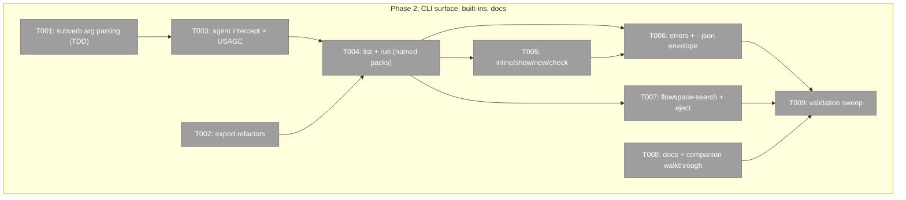

# Phase 2: `pij agent` CLI surface, built-ins, docs — Tasks & Context Brief

**Plan**: [pij-agents-minih-plan.md](../../pij-agents-minih-plan.md)
**Phase**: 2 of 2
**Domain**: pij-control-plane (+ agent-runtime consumption)
**Generated**: 2026-07-03
**Complexity**: CS-3 for this phase (CLI wiring over a tested runtime + one built-in + docs)

---

## Executive Briefing

- **Purpose**: Expose Phase 1's `core/agents/` runtime as the `pij agent` verb family exactly per workshop 002's contract — grammar, discovery, overrides, inline UX, `--json` envelopes, `E-*` errors — plus the flowspace-search built-in with eject, and the docs that make the surface scriptable by other agents.
- **What We're Building**: `agent` intercept (+`agents` alias) in the pij bin; two small export refactors; `list/run/show/new/check/eject` subverbs; `builtin-agents/flowspace-search/`; `docs/how/pij-agents.md` + AGENTS_README/RUNBOOK quick-starts.
- **Goals**:
  - ✅ Workshop-002 contract end to end: verbs, precedence, override flags (warn-don't-block), exit codes 0/1/2 (AC-01, AC-04, AC-06, AC-09, AC-10)
  - ✅ Inline `--prompt` zero-setup runs, nothing recorded (AC-05 end-to-end)
  - ✅ flowspace-search built-in: sonnet-class/low-effort default, live fs2 query, eject → shadow; **un-ejected built-ins always run the ephemeral temp-copy path** (AC-08)
  - ✅ Docs incl. the AC-11 companion walkthrough naming **zero pij code changes** (AC-11, AC-13)
- **Non-Goals**:
  - ❌ No daemon restart during this phase — the running daemon hosts the flow-pair fleet; the restart (to activate Phase 1's sweep hook) is **orchestrator-owned at fleet teardown**
  - ❌ No new runtime machinery — everything calls the tested Phase 1 API
  - ❌ No vetter migration; no session-resident agents (unchanged non-goals)

## Prior Phase Context

_Phase 1 completed this session (flow-pair dlg-0001, reviewed rev-0001 APPROVE; execution log in `../phase-1-agent-runtime-harness-adapters/execution.log.md`)._

**A. Deliverables**: `.pi/extensions/pij/core/agents/{types,paths,pack,runner,inline}.ts`, `adapters/{subprocess,claude,codex,copilot}.ts`, contract + boundary + unit + live tests (74 new, all green; `just agent-live` green with real claude 131s / codex 117s); minih dep pinned `github:AI-Substrate/minih#minih-v0.2.4`; domain docs; `just agent-live` recipe; daemon-start sweep hook in `daemon.ts`.

**B. Dependencies Exported** (the API this phase consumes — all under `.pi/extensions/pij/core/agents/`):
- `runner.ts`: `runAgentPack(request: RunPackRequest): Promise<RunPackResult>` — result is `{ok:true, runResult, report, validated} | {ok:false, code:"E-NOAGENT"|"E-BADINPUT", ...}`; `buildRunConfig`, `RunnerDeps`, `KNOWN_EFFORTS`
- `pack.ts`: `discoverAgents(sources: DiscoverySource[]): DiscoveredAgent[]` (precedence + `shadowed` marking), `isPack(dir)`, `parsePackMeta(content)` (extracts pij-only `harness` key separately — minih's `parseFrontmatter` ignores it, no format fork)
- `paths.ts`: `resolvePijHome(env)`, `agentsDir(pijHome)`, `tmpDir(pijHome)`
- `inline.ts`: `runInlineAgent(request: InlineRunRequest): Promise<RunPackResult>`, `sweepStaleTmp(pijHome)` — **call the sweep at every `pij agent run` start** (AC-05; the daemon-start hook already landed)
- ⚠️ **Gap you must fill (validation finding)**: there is NO exported helper for the ephemeral run of an *existing* pack (`--ephemeral` on a named agent, un-ejected built-ins). `runInlineAgent` synthesizes prompt-only packs (can't carry schemas/instructions), and `runAgentPack` does **not** suppress minih's retro auto-harvest — `MINIH_NO_AUTO_HARVEST=1` is set only inside `runInlineAgent` (inline.ts:63–76), and minih otherwise appends to `docs/retros/<slug>.md` on completion (`tryAutoHarvestRetro`, dist/runner/runner.js:62). Add a small `runEphemeralPack(packDir, …)` helper in `inline.ts` (Phase 2 owns it): `cpSync` the resolved pack dir (all files, schemas + instructions included) into `tmpDir(pijHome)/agents/<id>`, run via `runAgentPack` with `MINIH_NO_AUTO_HARVEST=1` set-and-restored exactly like `runInlineAgent`, delete the tree in `finally`.
- `adapters/`: `ClaudeHeadlessAdapter`, `CodexExecAdapter` (+ `codexEffort` clamp), `createCopilotAdapter()` (lazy; throws `CopilotSdkMissingError` naming the package)

**C. Gotchas & Debt**: minih `listAgents` requires a **non-empty frontmatter `description`** (packs without one resolve to E-NOAGENT — inline synthesis already handles this; `new`-scaffolded and built-in packs must carry one); system envelope enforces **≥10-char retrospective fields**; `report.json` only written when adapter output is truthy; daemon sweep hook inactive until a daemon restart (deferred, orchestrator-owned).

**D. Incomplete Items**: none within Phase 1 scope; the daemon restart is the only carry-forward.

**E. Patterns to Follow**: barrel-less concrete-file imports (no index.ts); tests co-located `*.test.ts` (vitest glob auto-includes); live tests `describe.skipIf(!process.env.PIJ_AGENT_LIVE)` + self-documenting `it.skip`; TDD for pure parsing/logic; temp-`PIJ_HOME` fs isolation in tests; warn-don't-block posture via `validateEffort`/`buildEffortWarning`.

## Pre-Implementation Check

| File | Exists? | Domain Check | Notes |
|------|---------|-------------|-------|
| `/Users/jordanknight/pi-hacking/pij/.pi/extensions/pij/cli.ts` | yes | pij-control-plane | modify: `USAGE` at :73, private `loadModels()` at :152 (used :191, :397) — moves out in T002; `agent` intercept lands in `main()` before the E-NOREG guard (telegram pattern) |
| `/Users/jordanknight/pi-hacking/pij/.pi/extensions/pij/core/cli.ts` | yes | pij-control-plane | modify: `PROVIDER_HARNESS_MAP` private at :336 → export (T002) |
| `/Users/jordanknight/pi-hacking/pij/.pi/extensions/pij/core/models/registry.ts` | yes | pij-control-plane | modify: receives exported `loadModels()` composition |
| `/Users/jordanknight/pi-hacking/pij/.pi/extensions/pij/builtin-agents/flowspace-search/` | no | agent-runtime | create: minih-format pack (contract: runs unchanged under stock minih) |
| `/Users/jordanknight/pi-hacking/pij/docs/how/pij-agents.md` | no | agent-runtime | create (dir may need creating) |
| `AGENTS_README.md`, `RUNBOOK.md` | yes | agent-runtime | modify: quick-start sections |
| `.fs2/graph.pickle` | yes (verified) | — | fs2 graph present → the AC-08 live query can run against this repo |

**Duplication check**: no existing `agent` verb in the bin; `pij models`/spawn validation already own model/effort warning helpers — reuse, don't duplicate.

## Architecture Map



## Tasks

| Status | ID | Task | Domain | Path(s) | Done When | Notes |
|--------|-----|------|--------|---------|-----------|-------|
| [x] | T001 | Tests then impl: subverb arg parsing as pure functions — `list/run/show/new/check/eject`, repeated `-p k=v`, `--prompt` (+ stdin `-`), `--ephemeral`, `--model/--effort/--harness/--permissions/--timeout/--cwd`, `--json`; exit-code mapping table (0/1/2) | pij-control-plane | `/Users/jordanknight/pi-hacking/pij/.pi/extensions/pij/core/agents/cli-args.ts` (+ `.test.ts`) | Unit tests cover happy + error paths incl. AC-09 mapping | Workshop 002 §§ grammar/flags/errors; TDD; pure function → placed in core/agents (boundary test must stay green: no daemon/telegram imports) |
| [x] | T002 | Refactors: move `loadModels()` composition from bin `cli.ts:152` into `core/models/registry.ts` (exported); `export PROVIDER_HARNESS_MAP` in `core/cli.ts:336`; bin imports both; spawn behaviour byte-equivalent | pij-control-plane | `.pi/extensions/pij/cli.ts`, `core/cli.ts`, `core/models/registry.ts` | All existing tests green; both symbols importable from core | Plan KF-03; no behaviour change — refactor only |
| [x] | T003 | Wire `agent` intercept (+ `agents` alias → `agent list`) in bin `main()` before the E-NOREG guard; add `agent` line to `USAGE` (cli.ts:73) + `AGENT_USAGE` block | pij-control-plane | `.pi/extensions/pij/cli.ts` | `pij agent` reachable with a daemon-less home; `pij agents` aliases to list; USAGE shows the verb | Telegram-intercept pattern (dossier F-11) |
| [x] | T004 | Implement `list` (3-tier `./agents` → `~/.pij/agents` → built-ins, `(shadowed)` dimmed rows, `--json` rows `{slug,source,dir,description,tags,model,reasoning,harness,shadowed}`) and `run <slug>` (record-by-default, `--ephemeral` via the `runEphemeralPack` helper — see B-exports gap note; overrides through `validateEffort`/`buildEffortWarning` — warn, never block; **call `sweepStaleTmp` at every run start**) | pij-control-plane | `.pi/extensions/pij/core/agents/cli-verbs.ts` (+ tests), `.pi/extensions/pij/cli.ts` | AC-01, AC-02, AC-04, AC-06 green against fixture packs; HARNESS column derived via models registry → `PROVIDER_HARNESS_MAP`, unknown → `?` | Workshop 002 § list/run; consumes B-exports above. **Dependency direction**: `core/agents/` must NOT import `core/cli.ts` or `core/models/` — the bin (cli.ts) injects `loadModels()` + `PROVIDER_HARNESS_MAP` into cli-verbs as deps (the `RunnerDeps` pattern), keeping agent-runtime clean of control-plane imports |
| [x] | T005 | Implement inline `run --prompt` (+ stdin `-` if the parser stays clean — workshop Q2), `show <slug>` (defaults/schemas/files + eject hint for built-ins), `new <slug>` (delegate `minih init` when binary on PATH, else bundled template — **must emit non-empty frontmatter `description`**, gotcha C), `check <slug>` (minih exported validators, per-error lines, exit 1) | pij-control-plane | same cli-verbs.ts + tests | AC-05 end-to-end (inline leaves nothing; stale trees swept); `new` output runs unchanged under both pij and stock minih; `check` catches a broken schema fixture | Workshop 002 §§ inline/show/new/check |
| [x] | T006 | Error surface + envelopes: `E-NOAGENT/E-BADINPUT/E-NOADAPTER/E-HARNESSBIN/E-PERMISSION/E-RUNFAILED` message shapes per workshop 002 § Errors; `--json` on run = `{run:{slug,status,model,harness,effort,runDir\|null,validated}, report}` stdout-only, progress stderr-only; loud `E-PERMISSION` mapped from minih `terminalReason: permission-denied` | pij-control-plane | cli-verbs.ts, cli-args.ts + tests | AC-09 + AC-10 asserted: every error path exits per table; stdout parses as JSON with zero stderr bleed | Workshop 002 § Errors — a real recorded run once died silently on permission-denied; never again |
| [x] | T007 | Ship `builtin-agents/flowspace-search/` (frontmatter: `model: claude-sonnet-4-6` — **pinned**; supersedes workshop 002's `claude-opus-4-8` examples per Jordan's directive recorded in plan § Clarifications ("built-ins default to the smallest reliable model"); `reasoning: low`, read-only+shell permissions, non-empty description; instructions inject fs2 usage incl. **graph-missing precondition** → tell user to run `fs2 scan`); resolve built-in dir relative to module URL (npm-link safe); implement `eject <slug>` → copies to `./agents/`, then shadows; **enforce un-ejected built-ins always run the ephemeral temp-copy path** (the `runEphemeralPack` helper — see B-exports gap note) — never write `runs/` into the package dir | agent-runtime | `.pi/extensions/pij/builtin-agents/flowspace-search/{prompt.md,input-schema.json,output-schema.json,instructions.md}`, cli-verbs.ts + tests | AC-08: `pij agent run flowspace-search -p query=…` answers live against this repo's graph; after the run `git status` shows zero writes under `builtin-agents/` **and zero writes under `docs/retros/`** (auto-harvest suppressed); eject → recorded runs work | Plan KF-07; fs2 surface: `fs2 search PATTERN [-m auto\|text\|regex\|semantic] [-l N]` → JSON `{results}`, exit 0/1/2 |
| [x] | T008 | Docs: `docs/how/pij-agents.md` (pack authoring, adapters, inline/ephemeral, determinism gradient, built-ins + eject, **AC-11 companion walkthrough**: coordination-enabled pack through the copilot adapter path or documented minih-binary path, explicitly naming **zero pij code changes**); quick-starts in `AGENTS_README.md` + `RUNBOOK.md` | agent-runtime | `docs/how/pij-agents.md`, `AGENTS_README.md`, `RUNBOOK.md` | AC-11 + AC-13: walkthrough is configuration-only; quick-starts show list/run/inline one-liners | Workshop 001 D5 upstream list gets a pointer, not a promise |
| [x] | T009 | Validation sweep: `just self-check` green end-to-end; scripted `--json` consumption exercise in `scratch/agent-json-consume.sh` (runs a fixture agent + inline run, asserts exit codes + envelope fields with jq); tick every AC in the execution log or record the explicit deferral reason | pij-control-plane | `scratch/agent-json-consume.sh`, execution log | Self-check exit 0; script exit 0 proving AC-10 machine-consumability; AC checklist complete | Phase gate; the daemon restart is NOT yours — leave it flagged for the orchestrator |

## Context Brief

**Key findings from plan** (full table in plan § Key Findings):
- **KF-03**: `loadModels()` private in bin (cli.ts:152), `PROVIDER_HARNESS_MAP` private (core/cli.ts:336) → T002 exports both **before** T004 consumes them.
- **KF-06**: effort/model validation is pij-registry-driven, warn-don't-block (plan-025 lineage); codex `minimal` clamp already lives in the Phase 1 adapter.
- **KF-07**: minih roots `runs/` at the pack dir → un-ejected built-ins (installed package dir!) must run the ephemeral temp-copy path; `eject` is the opt-in to recording.

**Domain dependencies**:
- `agent-runtime` (Phase 1): the B-exports above — call `runAgentPack`/`runInlineAgent`/`discoverAgents`/`sweepStaleTmp`; never re-implement discovery or run mechanics in the CLI layer.
- `minih` (external): validators for `check`; `minih init` delegation for `new`; pack format is the untouchable external contract.
- fs2 (external CLI): `fs2 search` JSON surface; graph precondition (`fs2 scan`).

**Domain constraints**: CLI layer parses and renders; core/agents executes. `cli-args.ts`/`cli-verbs.ts` live under `core/agents/` so the boundary test keeps guarding them (no daemon/telegram/tmux/grammy imports — sanity-check that constraint still holds for anything you add). Errors are loud and actionable (`E-*` + next step), exit codes are the fs2 convention.

**Reusable from prior phases**: hello-world fixture pack (`core/agents/__fixtures__/`); temp-`PIJ_HOME` test pattern; `FakeAgentAdapter` envelope-seeding helper in existing tests; `cli.integration.test.ts` precedent for bin-spawning tests.

**Mermaid flow diagram** (the CLI surface over the runtime):
```mermaid
flowchart LR
    A[pij agent <subverb>] --> B[cli-args.ts parse]
    B -- bad flags --> E1[usage + exit 1]
    B --> C{subverb}
    C -- list --> D[discoverAgents 3-tier] --> R1[table / --json rows]
    C -- run slug --> S[sweepStaleTmp] --> F[runAgentPack]
    C -- run --prompt --> S2[sweepStaleTmp] --> G[runInlineAgent]
    F --> H{ok?}
    G --> H
    H -- yes --> R2[summary or json envelope · exit 0]
    H -- no --> R3[E-* line · exit 1/2]
```

**Mermaid sequence diagram** (recorded named run):
```mermaid
sequenceDiagram
    participant U as user/agent
    participant CLI as pij agent run
    participant RT as core/agents runtime
    participant M as minih runAgent
    U->>CLI: run flowspace-search -p query=x --json
    CLI->>RT: sweepStaleTmp(); runAgentPack(req)
    RT->>RT: AJV validate input (fail fast)
    RT->>M: runAgent(adapter, def, config)
    M-->>RT: AgentRunResult (parsedReport)
    RT-->>CLI: {ok, report, validated}
    CLI-->>U: stdout {run, report} · stderr progress · exit 0
```

## Discoveries & Learnings

_Populated during implementation by the implement verb._

| Date | Task | Type | Discovery | Resolution | References |
|------|------|------|-----------|------------|------------|

## Directory Layout

```
docs/plans/029-pij-agents-minih/
  └── tasks/phase-2-pij-agent-cli-surface-built-ins-docs/
      ├── tasks.md
      └── execution.log.md   # created by the implement verb
```
