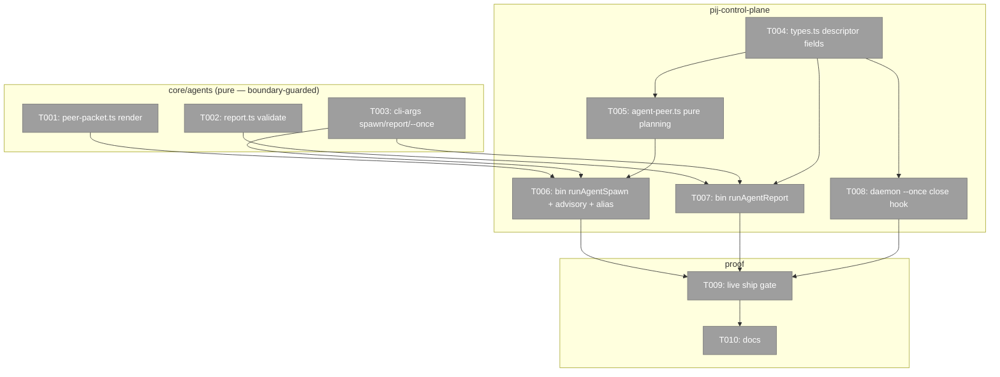
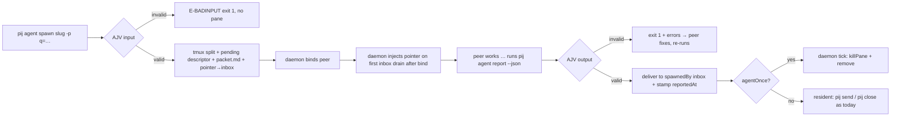
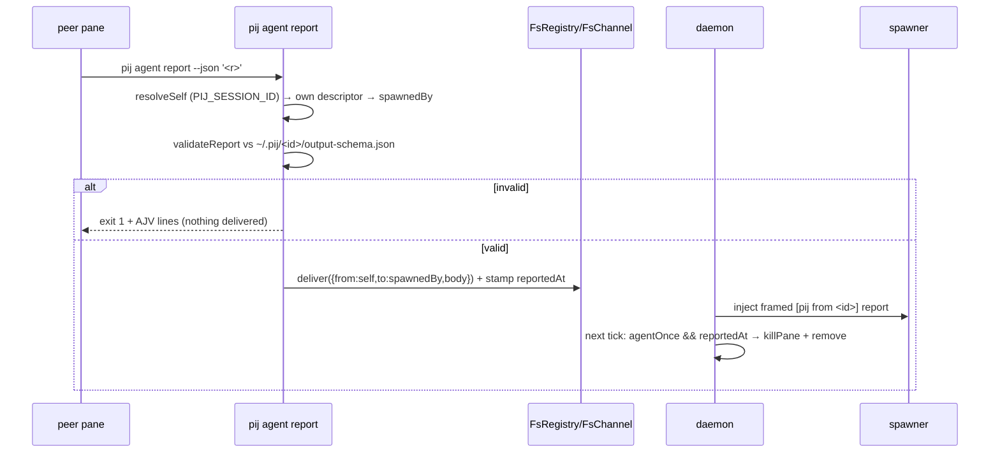

# Phase 3: Agent pack as peer (`pij agent spawn`) — Tasks & Context Brief

**Plan**: `docs/plans/029-pij-agents-minih/pij-agents-minih-plan.md` (v1.1.0, READY)
**Contract**: `docs/plans/029-pij-agents-minih/workshops/003-agent-pack-as-peer.md` (Approved — D1–D4, OQ1–3 ratified + grill-revised 2026-07-03)
**Created**: 2026-07-03
**Status**: Ready for implementation

---

## Executive Briefing

- **Purpose**: Make minih agent packs *visible and steerable*: `pij agent spawn` runs a pack as a daemon-bound tmux peer you can watch, converse with (`pij send`), and close (`pij close`) — with an explicit, schema-validated done-signal (`pij agent report`). A resident `flowspace-search` sidekick keeps its graph context warm across follow-up queries.
- **What We're Building**: Two new agent subverbs (`spawn`, `report`) + a `pij spawn --agent` alias; pure packet-rendering and report-validation helpers in `core/agents/`; spawn/report wiring at the bin layer (mirroring `runSpawn`/`runClose`); descriptor fields + daemon hook for the `--once` auto-close; the AC-18 live ship gate; docs.
- **Goals**:
  - ✅ `pij agent spawn <slug> [-p k=v] [--once]` → pane pops, packet auto-delivered after bind (AC-14)
  - ✅ `pij agent report --json '<r>'` → synchronous AJV feedback, valid reports push to the spawner (AC-15)
  - ✅ Resident default; `--once`/pack `lifecycle: once` auto-close after first report push (AC-16)
  - ✅ Always fully permissioned + one stderr advisory when a pack declares a preset (AC-17)
  - ✅ Alias + `PIJ_AGENT_LIVE=1` live scenario green (AC-18)
- **Non-Goals**:
  - ❌ Sandboxed/permission-scoped spawns (workshop 003 D4 future-hardening note — not v1.1)
  - ❌ A harness-agnostic self-close/farewell protocol (copilot coordination lane covers that harness by configuration)
  - ❌ Any daemon-side report re-prompt machinery (superseded by synchronous CLI validation — workshop 003 OQ2)
  - ❌ Changes to the one-shot `pij agent run` path or minih's runner loop (spawn mode uses pack format + validators only)

## Prior Phase Context

### Phase 1 — Agent runtime + harness adapters (shipped, `12e74af`)

- **Deliverables**: `core/agents/{types,paths,pack,runner,inline}.ts` + adapters (claude/codex/copilot, injectable `ExecCommand` seam) + co-located tests + `__fixtures__/hello-world/`.
- **Exports Phase 3 consumes**: `discoverAgents(DiscoverySource[])`, `isPack`, `parsePackMeta` (pack.ts); `resolvePijHome(env)`, `agentsDir`, `tmpDir` (paths.ts); `DiscoveredAgent`, `RunOverrides` (types.ts). Prompt-body reading is plain fs (pack.ts precedent); output validation imports straight from `minih/runner` (`validateOutput` et al.) — pij does not re-export minih.
- **Gotchas**: minih silently drops packs with empty frontmatter `description`; pij-only frontmatter keys (`harness`) are read via a separate regex, never written back — `lifecycle:` follows the same pattern; `MINIH_NO_AUTO_HARVEST` env mutation is not concurrency-safe (irrelevant here — spawn mode never runs minih's runner).
- **Patterns**: barrel-less concrete-file imports with `.js` extensions; tagged-union returns (`{ok:true,…}|{ok:false,code:"E-…"}`), never throw; DI test seams (injected exec/warn/clock); temp-`PIJ_HOME` isolation via `resolvePijHome(env)`; boundary.test.ts computationally bars daemon/telegram/tmux/grammy imports under `core/agents/**`.

### Phase 2 — CLI surface, built-ins, docs (shipped, `12e74af` incl. fix-0001)

- **Deliverables**: `core/agents/cli-args.ts` (pure parser) + `cli-verbs.ts` (verb impls, `VerbDeps` injection); bin intercept + `AGENT_USAGE` in `cli.ts` (:839); `builtin-agents/flowspace-search/`; `docs/how/pij-agents.md`.
- **Exports Phase 3 consumes**: `parseAgentArgs(args) → {ok,cmd:ParsedAgentCommand}|{ok:false,code:"E-ARG"}`, `coerceParams`, `AGENT_EXIT`/`exitCodeFor`, `AgentSubverb` (cli-args.ts); `renderAgentError` (cli-verbs.ts); bin-side `agentDeps(quiet)` wiring pattern (injects `loadModels`, `harnessForModel` via `PROVIDER_HARNESS_MAP`, warn sinks, `makeAgentAdapter` with the `PIJ_AGENT_FAKE=1` seam, `builtinDir` via `import.meta.url`, sets `PIJ_AGENT_CWD`).
- **Gotchas — the fix-0001 lesson (Key Finding 08's sibling)**: a flag existing on `ParsedAgentCommand` proves nothing — it must be threaded end-to-end and regression-tested on its **effect** (rev-0002 HIGH: `--permissions`/`--cwd` parsed but dropped). Every new flag here (`--once`, `--agent`) gets an effect-asserting test, not a parse test alone.
- **Patterns**: dependency injection — `core/agents/cli-{args,verbs}.ts` import NO `core/cli.ts`, NO `core/models/*`, NO daemon/tmux (boundary sensor); verbs return `VerbResult{stdout,stderr,exitCode}`, bin owns process I/O; stdout = machine output only; warn-never-block for model/effort.

### Control-plane seams (mapped 2026-07-03, file:line verified)

- **Spawn**: `runSpawn` (cli.ts:368) does the tmux split itself; daemon drives bind. Command line + blanket flags built by `buildControlSpawnCommand` (core/spawn.ts:248 — claude `--dangerously-skip-permissions` :251, copilot `--yolo` :264, codex bypass :273). **Pane env injection seam**: the builder's `env` record (core/spawn.ts:290-302 — already carries `PIJ_SESSION_ID`, `PIJ_HARNESS`, `PIJ_PARENT_ID`, `PIJ_SPAWN_TASK`) emitted as tmux `-e` flags (adapters/tmux.ts:100-102). Pending descriptor written via `FsRegistry` (cli.ts:587); daemon polls (`TICK_MS` 600ms, daemon.ts:43,74).
- **Bind + packet-after-bind delivery**: `driveSession` (core/daemon/loop.ts:140) classifies readiness, binds (`applyBinding`, core/binding.ts:13). The daemon drains a session's inbox **only once it is bound and owned** (`owns = lifecycle==="bound" && daemonOwnsDelivery`, daemon.ts:99-110) — so an inbox message written at spawn time simply **persists durably and is injected on the first `drainInbox` after bind**. Packet-after-bind is therefore existing machinery: deliver the packet pointer to the new peer's inbox at spawn and the daemon does the rest. (The `SendBuffer` at router.ts:51/daemon.ts:104-109 covers only the send-outruns-bind edge *within* a drain — it is NOT the packet's delivery path; a pre-bind session is never drained at all.)
- **Send/push**: `pij send` → `FsChannel.deliver` atomic write into `~/.pij/<to>/inbox/msg-*.json` (adapters/channel.ts:43-55); daemon drains + injects framed `[pij from <sender>]` (router.ts:27). Parent relationship = descriptor `spawnedBy` (core/types.ts:73) + child env `PIJ_PARENT_ID`. Dead/stalled pushes: `pushWholeLifeTransition` (daemon.ts:160).
- **Self-identity inside a pane**: `resolveSelf` (core/discovery.ts:77) — precedence `PIJ_SESSION_ID` env → lone descriptor by cwd → `$TMUX_PANE` match. **There is no `PIJ_SELF`** — the workshop's `PIJ_SELF` maps to the existing `PIJ_SESSION_ID`, already injected at spawn (core/spawn.ts:291). No new env var needed.
- **Close**: `runClose` (cli.ts:734), pure `planClose` ownership check `spawnedBy === self` (core/close.ts:57-76), teardown `TmuxAdapter.killPane` + `reg.remove`. Auto-close hook: the daemon tick already re-writes descriptors (daemon.ts:133-136) and holds `paneId`.
- **Descriptor extension**: `SessionDescriptor` (core/types.ts:47-117) — all control-plane fields optional/migration-safe. Do **NOT** overload `lifecycle` (it types the bind state machine); add independent optional fields.

## Pre-Implementation Check

| File | Exists? | Domain Check | Notes |
|------|---------|-------------|-------|
| `.pi/extensions/pij/core/agents/peer-packet.ts` | create | agent-runtime ✓ | pure; boundary sensor must stay green |
| `.pi/extensions/pij/core/agents/report.ts` | create | agent-runtime ✓ | pure; imports `minih/runner` validateOutput only |
| `.pi/extensions/pij/core/agents/cli-args.ts` | modify | agent-runtime ✓ | add `spawn`/`report` subverbs + `--once`; stays pure |
| `.pi/extensions/pij/core/agent-peer.ts` | create | pij-control-plane ✓ | pure planning (env build, once-close decision) — sibling of core/spawn.ts / core/close.ts; NOT under core/agents (needs descriptor/channel types) |
| `.pi/extensions/pij/core/spawn.ts` | modify | pij-control-plane ✓ | `parseSpawnArgs` gains `--agent <slug>` (alias) |
| `.pi/extensions/pij/core/types.ts` | modify | pij-control-plane ✓ | additive optional descriptor fields (`agentPack?`, `agentOnce?`, `reportedAt?`) |
| `.pi/extensions/pij/cli.ts` | modify | pij-control-plane ✓ | `runAgentSpawn`/`runAgentReport` handlers (bin layer, mirrors `runSpawn`/`runClose`); AGENT_USAGE lines |
| `.pi/extensions/pij/daemon.ts` | modify | pij-control-plane ✓ | once-close hook in tick; **daemon runs tsx off source — restart required after edits** |
| `.pi/extensions/pij/core/agents/peer.live.test.ts` | create | pij-control-plane (test) | AC-18 scenario; `describe.skipIf(!PIJ_AGENT_LIVE)` |
| `docs/how/pij-agents.md` | modify | agent-runtime ✓ | § spawn mode |

Duplication scan: no existing spawn-a-pack or self-report concept in `docs/domains/*/domain.md` § Concepts; `PIJ_SPAWN_TASK` env exists but is unconsumed for control-plane harnesses (confirmed core/harness/claude.ts:132-143) — the packet-via-inbox design deliberately does not use it.

## Architecture Map



## Tasks

| Status | ID | Task | Domain | Path(s) | Done When | Notes |
|--------|-----|------|--------|---------|-----------|-------|
| [x] | T001 | Tests then impl: `peer-packet.ts` — `renderPeerPacket(pack, params, opts)` pure render of the first-turn packet: prompt.md body + instructions.md + coerced `-p` params + report-contract clause naming the **literal** command `pij agent report --json '<json matching the schema below>'` + the pack's output-schema inlined when present. Extend `boundary.test.ts` to cover the new file. | agent-runtime | `/Users/jordanknight/pi-hacking/pij/.pi/extensions/pij/core/agents/peer-packet.ts`, `peer-packet.test.ts`, `boundary.test.ts` | Red-first tests: packet contains prompt body, instructions, params, the literal report command string, inlined schema; no daemon/tmux imports (boundary green) | Plan 3.1; KF-08 (weak models follow *named* mechanisms — retro DL-001) |
| [x] | T002 | Tests then impl: `report.ts` — `validateReport(payload: unknown, schemaJson?: string) → {valid: boolean, errors: string[]}` wrapping minih `validateOutput` (import from `minih/runner`); no schema → `{valid:true}` pass-through; AJV error lines verbatim. | agent-runtime | `/Users/jordanknight/pi-hacking/pij/.pi/extensions/pij/core/agents/report.ts`, `report.test.ts` | Red-first tests: valid / invalid (errors verbatim) / no-schema paths | Plan 3.2 |
| [x] | T003 | Tests then impl: `cli-args.ts` — add `spawn` + `report` to `AgentSubverb`; `spawn` accepts slug/`--prompt`, `-p` repeats, `--once`, existing override flags; `report` accepts `--json '<payload>'` (required). Exit-code rows for any new error codes in `AGENT_EXIT`. Parser stays pure. | agent-runtime | `/Users/jordanknight/pi-hacking/pij/.pi/extensions/pij/core/agents/cli-args.ts`, `cli-args.test.ts` | Red-first tests: happy + error paths for both subverbs; `--once` lands on the parsed command; report without `--json` → `E-ARG` | Plan 3.3; per fix-0001 lesson every flag later gets an EFFECT test (T006/T008), not just parse |
| [x] | T004 | `types.ts` (control-plane): additive optional `SessionDescriptor` fields — `agentPack?: string` (slug or "inline"), `agentPackDir?: string` (resolved pack dir at spawn; `~/.pij/<id>/pack/` for inline), `agentOnce?: boolean`, `reportedAt?: string` (ISO). Do NOT touch `lifecycle` (bind state machine). | pij-control-plane | `/Users/jordanknight/pi-hacking/pij/.pi/extensions/pij/core/types.ts` | tsc green; existing registry tests unaffected (fields optional/migration-safe per core/types.ts:74 convention) | Plan 3.4/3.6; seam map §6 |
| [x] | T005 | Tests then impl: `core/agent-peer.ts` — pure planning helpers: `buildAgentPeerEnv(base, {agentCwd})` (adds `PIJ_AGENT_CWD`; `PIJ_SESSION_ID`/`PIJ_PARENT_ID` already ride core/spawn.ts:290-302); `permissionsAdvisory(meta) → string|null` (one loud line when pack declares a preset); `lifecycleFor(cmd, meta) → "resident"|"once"` (flag > pack `lifecycle:` frontmatter > resident — read the pij-only key via the same separate-regex pattern as `harness`); `planOnceClose(descriptor) → boolean` (`agentOnce && reportedAt` set). | pij-control-plane | `/Users/jordanknight/pi-hacking/pij/.pi/extensions/pij/core/agent-peer.ts`, `agent-peer.test.ts` | Red-first tests: env merge, advisory exactly-once wording, precedence table (flag/frontmatter/default), once-close truth table | Plan 3.4/3.6; workshop D3/D4 |
| [x] | T006 | Bin `runAgentSpawn` (cli.ts, mirrors `runSpawn` cli.ts:368): resolve pack via `discoverAgents` (project→user→builtin; `--prompt` synthesizes an inline pack dir under `~/.pij/<id>/pack/`); **AJV-validate `-p` input against input-schema BEFORE any tmux call** (`E-BADINPUT` exit 1, no pane); derive harness/model/effort (pack frontmatter + overrides, warn-never-block); resolve the **caller** via `resolveSelf` and stamp `spawnedBy` exactly as `runSpawn` does (cli.ts:483-484,599); `buildControlSpawnCommand` with T005 env; write pending descriptor incl. `agentPack`/`agentPackDir` and **`agentOnce := lifecycleFor(cmd, meta) === "once"`** (T005 — never the raw `--once` flag, or frontmatter-once silently breaks) + copy output-schema.json to `~/.pij/<id>/output-schema.json` when present; render packet (T001) to `~/.pij/<id>/packet.md` and `FsChannel.deliver` a short pointer message (packet path + "read and follow it") to the new id — it persists in the peer's inbox and the daemon injects it on the first `drainInbox` after bind (daemon.ts:99-110); print `permissionsAdvisory` to stderr; blanket permission flags always (D4). Wire `pij spawn --agent <slug>` in `parseSpawnArgs` (core/spawn.ts:459) forwarding to this path. | pij-control-plane | `/Users/jordanknight/pi-hacking/pij/.pi/extensions/pij/cli.ts`, `/Users/jordanknight/pi-hacking/pij/.pi/extensions/pij/core/spawn.ts`, `spawn.test.ts` | Effect tests (fixture registry/channel, no real tmux): bad input → no split called + exit 1; descriptor carries the new fields; **a pack with frontmatter `lifecycle: once` and NO flag yields `agentOnce: true`** (and flag-off + no frontmatter yields false); packet file written; pointer message lands in the new id's inbox; `spawnedBy` stamped from the caller; advisory printed exactly once; alias forwards verbatim | Plan 3.4; AC-14/16/17; KF-09; seam map §1-2; pointer-not-body follows flow-pair discipline |
| [x] | T007 | Bin `runAgentReport` (cli.ts, mirrors `runClose` cli.ts:734): `resolveSelf` (core/discovery.ts:77 — `PIJ_SESSION_ID` env precedence; NOT a new `PIJ_SELF`); no identity → clear `E-*` error exit 1; read own descriptor → `spawnedBy` (absent → clear error); validate payload via T002 against `~/.pij/<id>/output-schema.json` (invalid → exit 1 + AJV lines on stderr, **nothing delivered**); valid → `FsChannel.deliver({from: self, to: spawnedBy, body: report})` + stamp `reportedAt` on own descriptor via `FsRegistry.write`; repeatable (second report re-delivers + re-stamps). | pij-control-plane | `/Users/jordanknight/pi-hacking/pij/.pi/extensions/pij/cli.ts`, test alongside | Effect tests: no-PIJ_SESSION_ID error; invalid-blocked (channel spy never called); valid → inbox write + reportedAt stamped; second call delivers again | Plan 3.5; AC-15; seam map §6-7 |
| [x] | T008 | Daemon `--once` close hook: in `tick()`, for descriptors with `planOnceClose(d)` true (T005) → `killPane(paneId)` + `registry.remove(id)` (the report is already durable in the parent's inbox — delivery to the parent pane is independent of the reporter's pane). Never touches non-agent peers; stalled/dead watchdog path unchanged. **Restart the daemon after this lands** (tsx off source, no hot-reload). | pij-control-plane | `/Users/jordanknight/pi-hacking/pij/.pi/extensions/pij/daemon.ts`, `daemon.test.ts` | Fixture tests: once+reported → closed on next tick (and NOT before reportedAt); resident+reported → untouched; non-agent descriptors → untouched; mutation-worthy assertion (test flips when the guard is removed) | Plan 3.6; AC-16; INS-008 lesson: make the latch load-bearing in the fixture |
| [~] | T009 | Live ship gate `peer.live.test.ts` behind `PIJ_AGENT_LIVE=1` (+ `just agent-live` already runs the glob): **precondition — the test driver must have a resolvable pij identity** (set `PIJ_SESSION_ID` to a registered test session, or adopt first), or `spawnedBy` is never stamped and the report round-trip cannot complete (cli.ts:483-484,599). Then: spawn `flowspace-search` resident on claude → packet pointer injected after bind → real fs2 answer → peer runs `pij agent report` (round-trip received in spawner inbox, schema-valid) → `pij send` follow-up answered → separate `--once` spawn auto-closes after its report (pane gone, descriptor removed). Record the run in the execution log. | pij-control-plane | `/Users/jordanknight/pi-hacking/pij/.pi/extensions/pij/core/agents/peer.live.test.ts` | The whole scenario green against a real claude peer; skipped (not failed) without the env flag | Plan 3.7; AC-18; the ship gate — do not tick without a real run |
| [x] | T010 | Docs: `docs/how/pij-agents.md` § spawn mode (verbs, packet/report contract, lifecycle table, permissions posture + advisory, alias, `PIJ_SESSION_ID` note); AGENTS_README + RUNBOOK one-liners. | agent-runtime | `/Users/jordanknight/pi-hacking/pij/docs/how/pij-agents.md`, `AGENTS_README.md`, `RUNBOOK.md` | Docs match shipped flags exactly; workshop 003 linked as the contract | Plan 3.8; AC-13 |

## Context Brief

**Key findings from plan**:
- KF-08 (High): weak models don't infer report mechanisms — the packet names the literal `pij agent report` command (T001), field-proven by retro DL-001.
- KF-09 (High): daemon panes have no human for permission prompts — blanket flags always; advisory only (T005/T006).
- fix-0001 lesson (Phase 2): every advertised flag needs an **effect** regression test, not a parse test — applied to `--once` (T008 fixture) and `--agent` (T006 forward test).

**Domain dependencies** (contracts this phase consumes):
- `agent-runtime`: `discoverAgents`/`isPack`/`parsePackMeta` (pack.ts) — pack resolution; `resolvePijHome`/`agentsDir` (paths.ts) — path contract; `parseAgentArgs`/`AGENT_EXIT` (cli-args.ts) — arg surface.
- `minih/runner` (external, never forked): `validateInput` (T006 fail-fast), `validateOutput` (T002).
- `pij-control-plane`: `buildControlSpawnCommand` + env seam (core/spawn.ts:248,290) — spawn; `FsChannel.deliver` (adapters/channel.ts:43) — packet pointer + report transport; inbox drained only after bind (daemon.ts:99-110) — packet timing; `resolveSelf` (core/discovery.ts:77) — report identity; `planClose` semantics (core/close.ts:57) — close consistency.

**Domain constraints**:
- `core/agents/**` must not import daemon/tmux/registry/channel (boundary.test.ts) → peer *verbs* live at the bin layer + `core/agent-peer.ts`; only pure render/validate helpers go in `core/agents/`.
- Additive-only descriptor changes; never overload `lifecycle`.
- Pack format is minih's — `lifecycle:` is a pij-only frontmatter key read via separate regex (the `harness` precedent), never written back.
- stdout = machine output only; progress/warnings/advisory on stderr.

**Reusable from prior phases**: temp-`PIJ_HOME` test isolation; fixture packs (`__fixtures__/hello-world/`, `builtin-agents/flowspace-search/`); `PIJ_AGENT_FAKE=1` bin seam (irrelevant to spawn-mode paths but keeps `run` tests hermetic); live-gate pattern + `just agent-live`; tagged-union error style + `renderAgentError`.

**Flow (happy path)**:


**Sequence (report round-trip)**:


## Discoveries & Learnings

_Populated during implementation by the implement verb._

| Date | Task | Type | Discovery | Resolution | References |
|------|------|------|-----------|------------|------------|

---

```
docs/plans/029-pij-agents-minih/
  ├── pij-agents-minih-plan.md
  ├── workshops/003-agent-pack-as-peer.md   # the contract
  └── tasks/phase-3-agent-pack-as-peer-pij-agent-spawn/
      ├── tasks.md                          # this file
      └── execution.log.md                  # created by the implement verb
```
