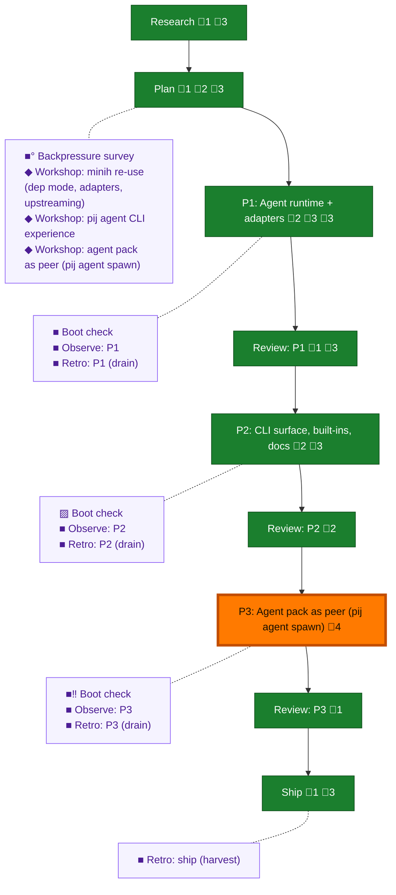

<!-- GENERATED by `harness flow render` — do not hand-edit; regenerate from the flow JSON. -->
# Flow · pij-agents-minih

**Kind**: flight-plan · **Now**: phase-3 · **Intent**: Phase 3: agent pack as peer — next: 5 tasks dossier, then flow-pair implement · **Nodes**: 23 · **Events**: 86

**Rail**: ◆─◆─[ ◆─◆─◆─◆─◆─◆─◆ ]  ◆ Research · ◆ Plan · [ ◆ P1: Agent runtime + adapters · ◆ Review: P1 · ◆ P2: CLI surface, built-ins, docs · ◆ Review: P2 · ◆ P3: Agent pack as peer (pij agent spawn) · ◆ Review: P3 · ◆ Ship ]

**Legend** — colour = type/status: 🟩 done · 🟢 in-progress · 🟥 blocked · 🟦 known · ⬜ assumed · 🔶 decision · 🗣 user input · 🟪 harness chore (faded = not yet done) · 🤖 companion · 🛠 worker · 🟧 current (you are here). Badges: 💬 comments · 📄 artifacts · 📝 instructions · 🧰 chore (° optional / recommended / ‼ strongly-recommended; ✓ done · ✕ skipped).

## Node log

### research · Research
- 📄 artifacts: docs/plans/029-pij-agents-minih/research-dossier.md

### plan · Plan
- 📄 artifacts: docs/plans/029-pij-agents-minih/pij-agents-minih-plan.md, docs/plans/029-pij-agents-minih/validations/pij-agents-minih-plan-validation.md
- `2026-07-03T02:40:29.031Z` · agent · note — v1.1 amendment 2026-07-03: Phase 3 (agent pack as peer) added per workshop 003; ACs 14-18; validate-v2 re-run VALIDATED (sidecar overwritten); Plan Version 1.1.0.

### phase-1 · P1: Agent runtime + adapters
- 📄 artifacts: docs/plans/029-pij-agents-minih/tasks/phase-1-agent-runtime-harness-adapters/tasks.md, docs/plans/029-pij-agents-minih/tasks/phase-1-agent-runtime-harness-adapters/execution.log.md, docs/plans/029-pij-agents-minih/spikes/adapter-headless-spike.md
- `2026-07-02T22:30:49.974Z` · — · — — Tasks expanded (T001-T013 incl. 2 backpressure-survey sensors: just agent-live recipe, import-boundary test); validate-v2 verdict VALIDATED WITH FIXES (3 MEDIUM, all repaired — key: seed FakeAgentAdapter output or report.json never written, runner.js:1336)
- `2026-07-02T23:24:03.811Z` · — · — — Implemented via flow-pair dlg-0001 (coder copilot/opus-4.8 xhigh): T001-T013 complete, self-check exit 0 (1337 pass), agent-live green (claude 131s codex 117s), red-first proofs for AC-12 alarm + boundary sensor. daemon.ts sweep hook needs daemon restart to take effect.

### review-1 · Review: P1
- `2026-07-02T23:24:04.020Z` · — · — — Cross-model review via flow-pair rev-0001 (reviewer copilot/gpt-5.5 xhigh): APPROVE, 0 findings; Dim-0 mutation evidence real (fail-fast guard runner.ts:121 and inline rmSync both flipped their named tests); reviewer re-ran just self-check exit 0; orchestrator sanity pass confirmed hunks. Record: .flow-pair/runs/2026-07-02T22-32-26Z-github.com-AI-Substr/reviews/rev-0001.json

### ship · Ship
- `2026-07-03T02:02:34.587Z` · agent · note — Shipped direct-to-main per user instruction: commit 12e74af (64 files, +9823/-201) pushed to origin/main. No PR (repo convention). Telemetry flushed (42 segments). Ship report: ship/2026-07-03/ship-report.md. Local gates green at ship: self-check 1404 pass, consume script 0, AC-01..13 met. · refs: 12e74af

### backpressure · Backpressure survey
- 📄 artifacts: docs/plans/029-pij-agents-minih/backpressure-coverage.md
- `2026-07-02T22:15:28.889Z` · — · — — Survey verdict: Partial — every machine-provable AC is BUILDABLE inside already-planned tasks (contract test, clean-tree assertions, CLI matrix, PIJ_AGENT_LIVE suite); deterministic done state = just self-check green + live suite pre-ship; AC-11/AC-13 content stay review-tier by design

### retro-ship · Retro: ship (harvest)
- `2026-07-03T01:59:58.932Z` · agent · note — post-flight harvest 2026-07-03: 29 entries / 3 records. Top clusters: flow-pair skill gaps (9, incl. stub verbs fabricating APPROVE), pij liveness/watchdog misfires (7; SUGG-002 already encoded in 5a702e9), test-quality proofs (4, incl. vacuous stalled-latch INS-008). Improve offer to user: make flow-pair review/fix/accept stubs fail loudly instead of fabricating verdicts.

### workshop-minih-reuse · Workshop: minih re-use (dep mode, adapters, upstreaming)
- 📄 artifacts: docs/plans/029-pij-agents-minih/workshops/001-minih-reuse.md
- `2026-07-02T21:34:53.984Z` · — · decision — D1 library-primary hybrid; D2 headless subprocess adapters (daemon reserved for companions); D3 temp-pack synthesis + upstream ephemeral/inline; D5 upstream list ranked

### workshop-cli-experience · Workshop: pij agent CLI experience
- 📄 artifacts: docs/plans/029-pij-agents-minih/workshops/002-pij-agent-cli-experience.md
- `2026-07-02T21:38:22.532Z` · — · decision — Canonical 'pij agent' (alias 'pij agents'-&gt;list); built-ins served read-only from package dir + eject; named runs record by default, --ephemeral opt-out, inline always-ephemeral

### phase-2 · P2: CLI surface, built-ins, docs
- 📄 artifacts: docs/plans/029-pij-agents-minih/tasks/phase-2-pij-agent-cli-surface-built-ins-docs/tasks.md, docs/plans/029-pij-agents-minih/tasks/phase-2-pij-agent-cli-surface-built-ins-docs/execution.log.md, docs/plans/029-pij-agents-minih/validations/phase-2-tasks-validation.md
- `2026-07-02T23:35:53.612Z` · — · — — Tasks T001-T009 expanded + validate-v2 VALIDATED WITH FIXES (3 MEDIUM repaired — key: runEphemeralPack gap named, runAgentPack lacks MINIH_NO_AUTO_HARVEST; built-in pinned claude-sonnet-4-6). Dispatched as flow-pair dlg-0002 to coder pij-1e24tgq (compaction confirmed first).
- `2026-07-03T00:55:02.037Z` · — · — — Implemented via flow-pair dlg-0002 + fix-0001 (coder copilot/opus-4.8 xhigh): T001-T009 + the rev-0002 HIGH fix; self-check exit 0 (1404 pass), consume script green, AC-08 proven live against real fs2 graph, all AC-01..13 ticked.

### review-2 · Review: P2
- `2026-07-03T00:37:51.534Z` · — · — — Review round 1 (rev-0002, gpt-5.5 xhigh): FIX_REQUIRED — 1 HIGH: --permissions/--cwd parsed but silently dropped from AgentRunConfig (proven by hermetic probe; orchestrator-confirmed in source). 3 mutations all flipped named tests. Fix dispatched to coder as fix-0001.
- `2026-07-03T00:55:02.270Z` · — · — — Cross-model review complete: rev-0002 FIX_REQUIRED (1 HIGH: silent --permissions/--cwd drop, hermetic-probe proven) -&gt; fix-0001 -&gt; rev-0003 APPROVE (probe re-run: preset=yolo, cwd honoured; mutation flipped regression tests). Records: .flow-pair/runs/2026-07-02T22-32-26Z-github.com-AI-Substr/reviews/rev-000{2,3}.json

### boot-2 · Boot check
- `2026-07-03T00:55:02.577Z` · — · — — Skipped honestly: environment proven green 4x during the phase (coder + reviewer self-check re-runs); a fresh boot would have raced the live coder and added no signal.

### workshop-agent-peer · Workshop: agent pack as peer (pij agent spawn)
- `2026-07-03T02:07:15.515Z` · agent · decision — workshops/003-agent-pack-as-peer.md at Contract Ready. D1 verb=pij agent spawn; D2 first-turn packet + done-push relay, minih used for format+validators only; D3 lifecycle default resident with --once auto-close + pack lifecycle: key (OQ1: default awaits Jordan's ratification); D4 permissions enforce-on-claude/warn-on-codex-copilot. Next: plan amendment adds Phase 3 from this workshop.
- `2026-07-03T02:10:37.582Z` · user · decision — OQ1-3 ratified by Jordan 2026-07-03: OQ1 lifecycle default = resident; OQ2 = ONE auto re-prompt on output-schema failure (push annotated validated/reprompted/errors, never withheld); OQ3 = add pij spawn --agent alias now (agent spawn stays canonical). Workshop 003 Status: Approved.
- `2026-07-03T02:32:15.396Z` · user · decision — Grill session 2026-07-03 revisions ratified: value = visible/steerable minih agents + warm resident sidekicks; D2 report seam = explicit 'pij agent report' verb run by the peer (PIJ_SELF env, synchronous AJV validation exit-1 feedback) superseding fence-scraping AND the OQ2 auto re-prompt; D4 = spawn-mode always fully permissioned (pij spawn posture), permissions preset is run-mode-only + advisory stderr note, per-harness sandbox levers recorded as future hardening; Phase 3 ship gate = one PIJ_AGENT_LIVE=1 live scenario (spawn-&gt;packet-&gt;report-&gt;discourse-&gt;--once auto-close).

### phase-3 · P3: Agent pack as peer (pij agent spawn)
- `2026-07-03T03:03:22.242Z` · agent · validation — Tasks dossier written (T001-T010, tasks/phase-3-agent-pack-as-peer-pij-agent-spawn/tasks.md) grounded by 3 parallel scouts (P1/P2 as-built + control-plane seam map, file:line verified). validate-v2: VALIDATED WITH FIXES — 3 MEDIUM repaired (lifecycleFor-&gt;agentOnce wiring + frontmatter-once effect test; T009 self-identity precondition; SendBuffer mis-attribution corrected to inbox-persist-drain-after-bind, also fixed in workshop 003). Sidecar: validations/phase-3-tasks-validation.md. Ready for implementation.
- `2026-07-03T03:09:39.986Z` · agent · note — dlg-0003 dispatched 2026-07-03: coder pij-dpmxlr (copilot/claude-opus-4.8 xhigh, pane %498, canary pass) executing whole Phase 3 via packet pointer. Packet patched pre-send: allowed-scope filled, report mechanism = literal 'pij send pij-z4bt25' CLI command (DL-001 lesson), gates = just self-check, fleet addendum (no daemon restart by coder; T009 once-leg may defer to post-restart). Reviewer spawns lazily at first REVIEW.
- `2026-07-03T04:03:40.294Z` · — · — — Coder reported COMPLETE (925 pass). Orchestrator ran deferred live legs post daemon-restart (pid 86887): resident+once report round-trips PROVEN live; AC-16 --once auto-close BROKEN live (reportedAt stamp clobbered by daemon stale-copy write, daemon.ts:134-152); peer.live report assertions race the daemon inbox drain. Review dispatched to pij-16vlhw6 (review-dlg-0003.md) with live-evidence addendum.
- `2026-07-03T04:10:50.978Z` · — · — — Review verdict rev-0004: FIX_REQUIRED (HIGH: daemon descriptor lost-update clobbers reportedAt -&gt; AC-16 auto-close never latches, daemon.ts:152; HIGH: peer.live polls inbox files the daemon rmSyncs, AC-18 gate racy; LOW: no layout escape on agent spawn -&gt; E-FULL, doc-only now, full placement control queued Phase 4 per user). Verdict hand-persisted reviews/rev-0004.json. Fix packet review-fix-0002.md dispatched to coder pij-dpmxlr.

### review-3 · Review: P3
- `2026-07-03T04:36:58.849Z` · — · — — flow-pair review cycle: rev-0004 FIX_REQUIRED (daemon reportedAt lost-update; live-test drained-inbox race; E-FULL doc gap) -&gt; fix (writeMerged, all 9 sites routed; durable reportedAt anchor; docs) -&gt; rev-0005 APPROVE with 2 load-bearing mutations. Live: both peer.live legs green 69s post daemon-restart, --once auto-close beat the teardown. Verdicts hand-persisted reviews/rev-0004.json + rev-0005.json.

### boot-3 · Boot check
- `2026-07-03T03:06:07.963Z` · agent · validation — pre-flight boot 2026-07-03: harness boot verdict HEALTHY (typecheck ok, test ok — post-ship main at 12e74af). Env proven before Phase 3 dispatch.
