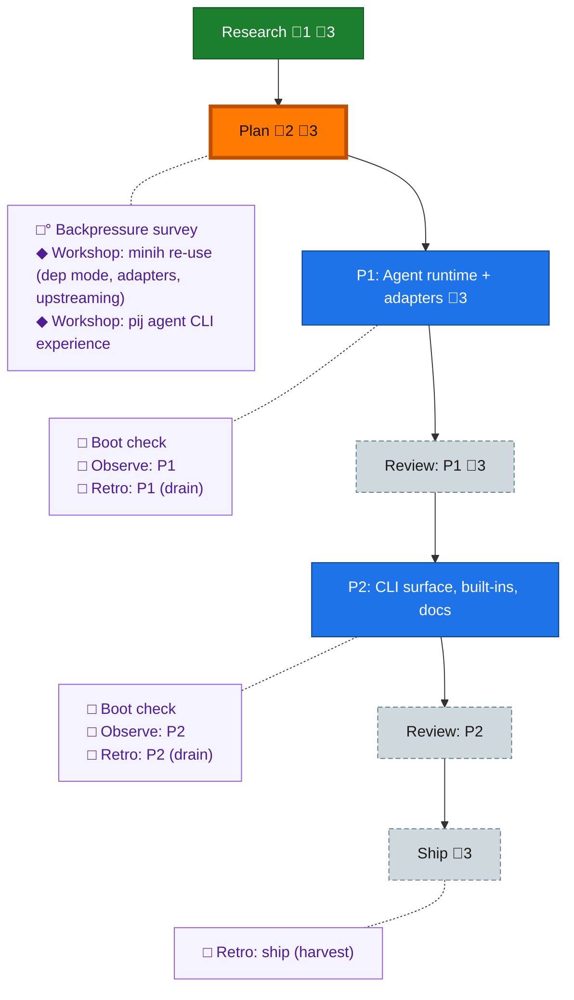

<!-- GENERATED by `harness flow render` — do not hand-edit; regenerate from the flow JSON. -->
# Flow · pij-agents-minih

**Kind**: flight-plan · **Now**: plan · **Next**: phase-1 · **Intent**: Adopt minih as pij's agent system: pij agent list/run over ./agents + ~/.pij/agents, minih-compatible input/output/validation, inline+ephemeral agents, built-ins (flowspace search), harness/model/effort pre-select with instantiation override · **Nodes**: 17 · **Events**: 26

**Rail**: ◆─◆─[ ◇─◇─◇─◇─◇ ]  ◆ Research · ◆ Plan · [ ◇ P1: Agent runtime + adapters · ◇ Review: P1 · ◇ P2: CLI surface, built-ins, docs · ◇ Review: P2 · ◇ Ship ]

**Legend** — colour = type/status: 🟩 done · 🟢 in-progress · 🟥 blocked · 🟦 known · ⬜ assumed · 🔶 decision · 🗣 user input · 🟪 harness chore (faded = not yet done) · 🤖 companion · 🛠 worker · 🟧 current (you are here). Badges: 💬 comments · 📄 artifacts · 📝 instructions · 🧰 chore (° optional / recommended / ‼ strongly-recommended; ✓ done · ✕ skipped).

## Node log

### research · Research
- 📄 artifacts: docs/plans/029-pij-agents-minih/research-dossier.md

### plan · Plan
- 📄 artifacts: docs/plans/029-pij-agents-minih/pij-agents-minih-plan.md, docs/plans/029-pij-agents-minih/validations/pij-agents-minih-plan-validation.md

### workshop-minih-reuse · Workshop: minih re-use (dep mode, adapters, upstreaming)
- 📄 artifacts: docs/plans/029-pij-agents-minih/workshops/001-minih-reuse.md
- `2026-07-02T21:34:53.984Z` · — · decision — D1 library-primary hybrid; D2 headless subprocess adapters (daemon reserved for companions); D3 temp-pack synthesis + upstream ephemeral/inline; D5 upstream list ranked

### workshop-cli-experience · Workshop: pij agent CLI experience
- 📄 artifacts: docs/plans/029-pij-agents-minih/workshops/002-pij-agent-cli-experience.md
- `2026-07-02T21:38:22.532Z` · — · decision — Canonical 'pij agent' (alias 'pij agents'-&gt;list); built-ins served read-only from package dir + eject; named runs record by default, --ephemeral opt-out, inline always-ephemeral
