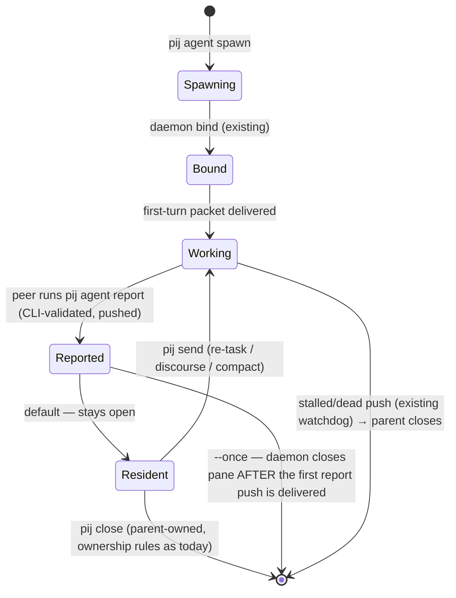

# Workshop: agent pack as peer (`pij agent spawn`)

**Type**: Integration Pattern (+ CLI Flow + State Machine elements)
**Plan**: 029-pij-agents-minih (follow-on subtask — Phase 3)
**Spec**: `../pij-agents-minih-plan.md` § Business Specification; user ask 2026-07-03 ("run it in another pane just like normal pij flow pair … long running or short running … the main agent can communicate with them, or they can be closed after they return")
**Created**: 2026-07-03T12:10:00+10:00
**Status**: Approved (OQs ratified + D2/D4 revised in grill session with Jordan, 2026-07-03)

**Value Thesis**: Plan 029 shipped agent pack as *definition* (who the agent is); this workshop settles agent pack as *peer* (how it lives) so Phase 3 codes against a fixed contract instead of re-litigating the verb shape, report seam, lifecycle, and permissions mapping mid-build — the four forks that would otherwise each cost a coder/reviewer round-trip.
**Target Proof Level**: Contract Ready
**Current Proof Level**: Contract Ready (all 3 open questions RESOLVED — user ratified 2026-07-03)

**Selected Value Axes**:
- **Implementation Readiness**: every decision names the existing pij seam it reuses (spawn path, done-push, pack validators) so Phase 3 is wiring, not invention.
- **Cross-Domain Coordination**: the agent-runtime / pij-control-plane boundary is load-bearing (enforced by `boundary.test.ts`) — this workshop states exactly what crosses it and in which direction.
- **Operator Usability**: command shapes shown as real invocations consistent with `pij spawn` + `pij agent run`.
- **Safety to Change**: lifecycle is a per-spawn flag with a pack-frontmatter default (pij-only key, minih-ignored) — the same reversible-override pattern as `harness`.

**Related Documents**:
- `002-pij-agent-cli-experience.md` — the one-shot `pij agent run` contract this extends (overrides table, error surface, `-p` coercion are reused verbatim)
- `001-minih-reuse.md` — D1 library dep; the pij-only frontmatter-key precedent (`harness`) that `lifecycle` follows
- `../../../how/pij-agents.md` — shipped behaviour of the one-shot runtime
- `docs/plans/019-*` control-plane mode — the spawn→bind→send/tail/close lifecycle this rides on

**Domain Context**:
- **Primary Domain**: pij-control-plane (spawn wiring, daemon delivery, push relay)
- **Related Domains**: agent-runtime (pack discovery, prompt rendering, schema validation — consumed as pure functions, never the reverse)

---

## Purpose

Settle the four design forks for running a minih agent pack as a **resident pij peer** — spawned into a tmux pane by the daemon, bound, addressable via `pij send`/`pij tail`, closable via `pij close` — so the Phase 3 plan amendment and task dossier are mechanical.

**Ratified value statement (grill, 2026-07-03)**: (1) minih agents become **visible and steerable** — you watch them work in a pane and converse with them, instead of headless one-shot runs; (2) **packaged research sidekicks** — a resident `flowspace-search` peer keeps its graph exploration warm, so N follow-up queries cost one cold start instead of N (`pij agent run` re-pays startup + orientation every call).

## Fresh Entrant Outcome

A fresh human or agent should be able to use this workshop to reach **Contract Ready** with no additional context. They should be able to:

- Type a `pij agent spawn` invocation and predict what pane appears, what the peer's first turn contains, and what push comes back.
- Say which existing pij/minih machinery each step reuses, and what (little) is genuinely new.
- State the lifecycle of a spawned pack-peer in both `resident` and `once` modes, including who closes it.
- Explain what happens to a `permissions: read-only` pack on each of the three harnesses.

## Key Questions Addressed

- Verb shape: new subverb vs a flag on `run`?
- How does the pack's prompt/input reach an *interactive* session, and how does the report come back?
- Lifecycle: self-close vs parent-close vs stay-open-for-discourse — what's default, what's optional?
- How does a pack's minih permission preset map onto an interactive harness session?

---

## Value Frame

| Field | Selection | Why It Matters |
|-------|-----------|----------------|
| Target Proof Level | Contract Ready | Phase 3 tasks can be written directly from the decision tables; implementation detail (exact fn signatures) belongs to the task dossier |
| Primary Value Axis | Implementation Readiness | All four forks resolved with named seams = no mid-phase design stalls |
| Supporting Value Axes | Cross-Domain Coordination, Operator Usability, Safety to Change | Boundary direction, command consistency, reversible defaults |
| Downstream Loop Improved | Implementation + Review | Coder builds against a written contract; reviewer checks conformance instead of adjudicating design |

## Decision Space

### D1 — Verb shape: `pij agent spawn` (new subverb) — **Selected**

| Option | Description | Pros | Cons | Decision |
|--------|-------------|------|------|----------|
| A. `pij agent spawn <slug>` | New subverb in the agent family | `spawn` already means "create a peer" in pij vocabulary; clean grammar; own flag set (`--once`) | One more subverb | **Selected** |
| B. `pij agent run --pane` | Flag on the one-shot verb | No new verb | Conflates two execution models (one-shot minih runner vs interactive peer); `run`'s envelope contract (`runDir`, `report`) doesn't apply | Rejected |
| C. `pij spawn --agent <slug>` | Flag on the peer verb | Reuses spawn surface directly | Splits pack UX across two verb families; pack overrides (`-p`, schemas) alien to `pij spawn` | **Selected as an alias** (OQ3 resolved): forwards to the same code path as A; A remains the canonical front door and the only place pack flags are documented |

```bash
pij agent spawn flowspace-search -p query="trace the send path"          # resident peer, pane pops
pij agent spawn flowspace-search -p query="..." --once                   # auto-closes after its report
pij agent spawn my-companion --harness copilot --effort high             # same override rails as run
pij agent spawn --prompt "Watch the test suite and report flakes"        # inline pack, peer-mode
```

Same override precedence as `run` (flag > frontmatter > unset, warn-never-block); `-p` params validated against `input-schema.json` **before any pane is created** (fail-fast `E-BADINPUT`, exit 1 — nothing to clean up).

### D2 — Delivery & report seam: interactive spawn + first-turn packet + done-push relay — **Selected**

**minih's role shrinks to pack format + validators.** Spawn mode does NOT run minih's runner loop (that loop is one-shot request/response by construction). It reuses: pack discovery (3-tier), `parsePackMeta`, prompt/instructions rendering, `validateInput`/`validateOutput`. The interactive session is pij's existing spawn machinery.

```mermaid
sequenceDiagram
    participant CLI as pij agent spawn
    participant AR as core/agents (pure)
    participant D as daemon
    participant P as peer pane
    CLI->>AR: resolve slug, validate -p input (AJV, fail-fast)
    CLI->>AR: render first-turn packet (prompt.md + instructions.md + params + report contract)
    CLI->>D: spawn --harness <h> --model <m> (existing path)
    D->>P: boot → bind (existing canary/bind machinery)
    D->>P: deliver first-turn packet (existing send path)
    P-->>P: works … when done, RUNS `pij agent report --json '<report>'`
    Note over P: CLI validates against output-schema.json SYNCHRONOUSLY — invalid = exit 1 + AJV errors on stderr; the agent fixes and re-runs the command
    P->>D: valid report lands (PIJ_SELF env identifies the sender)
    D-->>CLI: report-push { report, schemaValidated: true }
```

- **First-turn packet** = rendered system prompt + instructions + the `-p` params + an appended **report contract** clause naming the **literal command**: "when your task is complete, run `pij agent report --json '<report matching this schema>'`". No placeholders left to infer — field evidence (retro DL-001, 2026-07-02) shows weak models follow *named* report mechanisms and fail to *infer* them. Delivery is the flow-pair pointer discipline, automated: the rendered packet is written to `~/.pij/<id>/packet.md` and a short pointer message is delivered to the peer's inbox at spawn time — it persists durably in the inbox (the daemon only drains bound sessions) and is injected as the first turn on the first inbox drain after bind (existing machinery, `daemon.ts:99-110`).
- **Report seam = an explicit done-signal, not transcript scraping (grill revision, 2026-07-03).** The peer has a shell and `pij` on PATH; it signals done by running **`pij agent report --json '<report>'`**. Identity rides the **existing** `PIJ_SESSION_ID` pane env (already injected by the spawn path, `core/spawn.ts:290-302`; resolved by `resolveSelf`, `core/discovery.ts:77`) — no new env var (the draft's `PIJ_SELF` name resolved to this existing seam at task-mapping time). The spawner is the descriptor's `spawnedBy` field. Validation is **synchronous in the CLI**: when the pack has `output-schema.json`, an invalid report is rejected on the spot (exit 1, AJV errors on stderr) and never becomes a report — the agent self-corrects and re-runs. Every relayed report-push is therefore schema-valid by construction; no daemon re-prompt machinery exists. Plain discourse turns relay exactly as today, untouched — no false validation failures on chatty replies. A resident peer re-tasked via `pij send` reports again by re-running the verb (reports are repeatable). A peer that never reports is covered by the existing stalled/dead watchdog.
- **No `runs/` ledger for spawned peers** (peer transcripts already live in the control plane; `pij tail` is the audit surface). The one-shot determinism gradient (recorded/ephemeral/inline) is untouched.

**Boundary rule (enforced, existing sensor)**: `core/agents` gains only pure functions (packet rendering, report extraction/validation helpers); all daemon/tmux/spawn wiring lands in the control-plane layer, which imports `core/agents` — never the reverse. `boundary.test.ts` keeps guarding this.

### D3 — Lifecycle: default **resident**, `--once` auto-close; pack default via `lifecycle:` frontmatter — **Selected (ratified)**



| Mode | Trigger | Who closes | Use case (from the ask) |
|------|---------|-----------|--------------------------|
| **resident** (default) | `pij agent spawn <slug>` | Parent, via `pij close` | "long running … the main agent can communicate with them" |
| **once** | `--once` flag or pack `lifecycle: once` | Daemon, after the first report push is delivered (a peer that never reports falls to the stalled/dead watchdog + parent close) | "short running … closed after they return" |

- Pack frontmatter `lifecycle: resident | once` — a pij-only key exactly like `harness` (minih's `parseFrontmatter` ignores unknown keys — verified in 029; no format fork). Precedence: flag > frontmatter > `resident`.
- **Self-close (farewell) deliberately not built in v1**: the copilot coordination lane (minih `SdkCopilotAdapter`, `coordination.enabled`) already provides a farewell protocol for that harness via configuration only (029 AC-11); a harness-agnostic self-close would be new protocol machinery with no current consumer.
- Rationale for resident-as-default: peer semantics match the verb family (`pij spawn` peers are resident; parents close them), and an accidentally-closed peer is unrecoverable while an accidentally-open one costs a pane. **Ratified by Jordan 2026-07-03 (OQ1).**

### D4 — Permissions: spawned peers always run fully permissioned — **Selected (revised in grill, 2026-07-03)**

Spawn mode uses **exactly the `pij spawn` posture**: every daemon-driven pane gets its harness's blanket flag (`--dangerously-skip-permissions` / `--yolo` / codex bypass) because there is no human at the pane to approve prompts. The pack's `permissions:` field remains a **run-mode (headless) contract** — enforced by the adapters in `pij agent run`, **advisory in spawn mode**.

- When a spawned pack declares a preset, print **one loud stderr note** at spawn: `pack declares permissions: read-only — spawned peers run fully permissioned; the preset is enforced only in pij agent run`.
- The peer safety story in spawn mode is **observation + ownership**, per this feature's own thesis: the pane is visible, `pij tail` audits it, `pij close` kills it.
- No lever mapping, no refusal path, no new `E-PERMISSION` case.

> **Future hardening (explicitly not v1)**: each harness does have a real read-only lever — codex `--sandbox read-only --ask-for-approval never` (OS-level, the strongest), claude `--allowedTools` minus Write/Edit (advisory — Bash can still write), copilot `--deny-tool` scoping (wedge-risk on unanticipated tools). If a sandboxed spawn mode is ever wanted, start with codex.

## Evidence Ledger

| Evidence | Location | Supports | Status |
|----------|----------|----------|--------|
| `spawn`/bind/send/close machinery + done/stalled/dead pushes | plan 019 + shipped daemon (`12e74af` tree) | D2 reuse claims | Validated (driven all through 029's flow-pair run) |
| minih ignores unknown frontmatter keys (`harness` precedent) | 029 research + `pack.ts` tests | D3 `lifecycle:` key | Validated |
| `validateInput`/`validateOutput` exported from `minih/runner` | `dist/runner/index.d.ts` (029 dossier) | D2 fail-fast + report validation | Validated |
| Headless claude scoped-toolset table | `adapters/claude.ts` (shipped) | D4 claude mapping | Validated |
| Import boundary sensor | `core/agents/boundary.test.ts` (shipped) | D2 boundary rule | Validated |
| Weak models follow *named* report mechanisms, don't infer them | retro DL-001 (2026-07-02 drain) | D2 literal-command packet clause | Validated (live incident) |
| Per-harness read-only levers exist (codex sandbox, claude allowedTools, copilot deny-tool) | harness CLI surfaces | D4 future-hardening note only (not v1) | Draft |

## Attention Reduction

| Future Loop | Before Workshop | After Workshop |
|-------------|-----------------|----------------|
| Implementation | Four open forks, each a potential mid-phase stall | Decision tables + sequence/state diagrams to code against |
| Review | Reviewer adjudicates design taste | Reviewer checks conformance to D1–D4 |
| Agent execution | Orchestrators hand-roll packet + report conventions per run (flow-pair does today) | One rendered packet contract + schema-validated push |

## Open Questions

### OQ1: Lifecycle default — resident or once?
**RESOLVED (Jordan, 2026-07-03): resident.** Peers stay open after their report; `--once` (or pack `lifecycle: once`) opts into auto-close. D3 stands as written.

### OQ2: Invalid report (fails output-schema) — annotate only, or one automatic re-prompt?
**RESOLVED (Jordan, 2026-07-03): one auto re-prompt — then SUPERSEDED same day in the grill session.** The report seam moved from transcript fence-scraping to the explicit **`pij agent report` verb** (D2), whose **synchronous CLI validation** delivers the re-prompt's intent better: an invalid report is rejected on the spot with AJV errors on stderr (exit 1), the agent fixes it and re-runs — deterministic feedback at the point of emission, no daemon nudge machinery, and every pushed report is schema-valid by construction. The daemon-side re-prompt is therefore not built.

### OQ3: `pij spawn --agent <slug>` alias?
**RESOLVED (Jordan, 2026-07-03): add the alias now.** `pij spawn --agent <slug>` forwards to the `pij agent spawn` code path; `pij agent spawn` remains canonical and is where pack flags are documented. `pij spawn`'s help gains one line for `--agent`. (Supersedes the draft's defer recommendation.)

## Validation / Acceptance

This workshop reaches Contract Ready when:

- Each fork has a Selected decision with named reused seams (D1–D4: done).
- The lifecycle is stated as a diagram + table covering both modes and failure (stalled/dead) exit (done).
- Open questions are explicitly OQ-tracked with resolutions (done — all three ratified 2026-07-03).

**Phase 3 ship gate (ratified in grill, 2026-07-03)** — one `PIJ_AGENT_LIVE=1` live scenario, green:

1. `pij agent spawn flowspace-search` (resident, claude) → first-turn packet auto-delivered after bind.
2. Peer answers a real fs2 graph query, then runs `pij agent report` → schema round-trip, push received by the spawner.
3. `pij send` follow-up answered — resident discourse proven (warm-context value).
4. `--once` variant: pane auto-closes after its first report push.

Every new seam (spawn wiring, packet delivery, report verb, push relay, lifecycle) exercised in one script; unit tests with faked panes carry the rest.

## Quick Reference

```bash
pij agent spawn <slug> [-p k=v ...] [--once] [--model m] [--effort e] [--harness h] [--cwd d]
pij agent spawn --prompt "<task>" [--once]        # inline pack, peer-mode
pij spawn --agent <slug> [-p k=v ...]              # alias — forwards to pij agent spawn
pij agent report --json '<report>'                 # run BY THE PEER — explicit done-signal;
                                                   #   synchronous AJV validation (exit 1 + errors → fix and re-run)
pij send <id> "..."                                # discourse / re-task a resident pack-peer
pij tail <id>                                      # audit surface (no runs/ ledger in spawn mode)
pij close <id>                                     # parent-owned teardown (resident mode)
```
