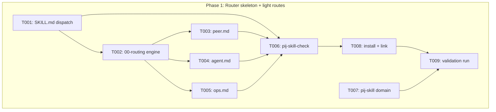
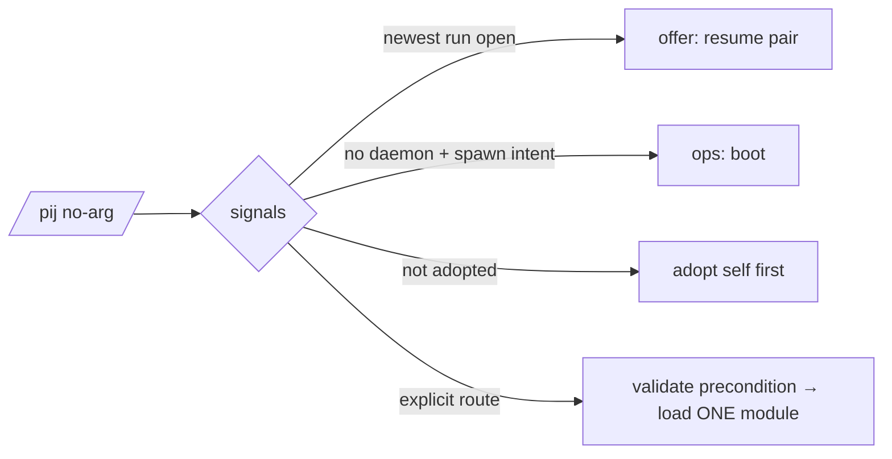

# Phase 1: Router skeleton + light routes — Tasks & Context Brief

**Plan**: `docs/plans/030-pij-router-skill/pij-router-skill-plan.md` (v1.0.0, READY)
**Phase**: 1 of 2 · **Domain**: pij-skill (NEW) · **Created**: 2026-07-03

## Executive Briefing

- **Purpose**: Stand up the `/pij` router skill — dispatch, deterministic detection, and the three routes that need no porting (peer, agent, ops) — plus the install and structural-check tooling, so Phase 2 can port flow-pair's protocol into a proven skeleton.
- **What We're Building**: `skills/pij/` mirroring the-flow's composition (SKILL.md registry/dispatch + `references/00-routing.md` engine + sibling-blind `references/routes/*.md`), a new `pij-skill` domain, and `just pij-skill-{check,install,link}` recipes.
- **Goals**:
  - ✅ `/pij` loadable in claude AND visible to pi (link), routes by intent
  - ✅ Every `pij --help` verb (+ `models`) mapped to a route / convention / non-goal
  - ✅ Token budgets enforced mechanically (`pij-skill-check` exit 0)
- **Non-Goals**:
  - ❌ No `pair.md` / `delegate.md` yet (Phase 2)
  - ❌ No touch of `skills/flow-pair/**` (engine or SKILL.md — Phase 2 shims it)
  - ❌ No `watch` module (awaits plan 029 P4); no pij CLI changes

## Prior Phase Context

_None — this is Phase 1._

## Pre-Implementation Check

| File | Exists? | Domain Check | Notes |
|------|---------|-------------|-------|
| skills/pij/SKILL.md | No — create | pij-skill (new tree) | verified: `skills/` holds only `flow-pair` |
| skills/pij/references/00-routing.md | No — create | pij-skill | |
| skills/pij/references/routes/{peer,agent,ops}.md | No — create | pij-skill | |
| justfile | Yes — modify | extension-authoring-harness | anchor: `flow-pair-link` L163, `flow-pair-install` L175; add `pij-skill-*` beside them |
| docs/domains/pij-skill/domain.md | No — create | pij-skill | |
| docs/domains/registry.md | Yes — modify | cross-domain | add one row |
| docs/domains/domain-map.md | Yes — modify | cross-domain | FP node at L15; add PS node + edges |

Duplication scan: no existing skill routing in-repo (finding 06); the `/pij` **name** collides with the `pij` bin — that's AC-08's disambiguation, not a duplicate.

## Architecture Map



## Tasks

| Status | ID | Task | Domain | Path(s) | Done When | Notes |
|--------|-----|------|--------|---------|-----------|-------|
| [x] | T001 | SKILL.md dispatch: registry table (pair/delegate/agent/peer/ops; pair+delegate rows marked *lands Phase 2*; watch *future, no module*), `/pij <route>` grammar, two load paths (guided no-arg / direct route), global invariants (never write the-flow files, pointer-only delivery, forbidden paths, persist-before-mutate, no-poll, ownership-aware teardown), alias table `/flow-pair …` → `/pij pair …`, skill≠CLI disambiguation on first screen, CLI-verb coverage table (whoami/list/state→peer · compact-self/models→conventions · daemon/phonehome/path/telegram→ops · `agent *`→agent · spawn/send/tail/close/adopt→peer · watch→future) | pij-skill | /Users/jordanknight/pi-hacking/pij/skills/pij/SKILL.md | ≤150 lines; AC-08 first screen; every bin-USAGE verb (+`models`) mapped | Findings 04, 06 |
| [x] | T002 | 00-routing.md: detection signals with exact probes — newest `.flow-pair/runs/*/run.json` `status=="open"` → **offer** resume pair (enum `open\|closed`, run.schema.json:18; missing = no signal; never auto-resume) · roster from that same newest `run.json` (`roster.<role>.{pijId, spawnedByUs}`), liveness per pijId via `pij state <id>` / presence of `~/.pij/<id>.json` · active the-flow: newest `docs/plans/*/the-flow.json` → `harness flow nav show --path <it>`, read `data.nav.now`/`next` for implement/review position → offer pair · daemon alive (`pij daemon status`) · self adopted (`pij whoami`); precedence + "a hint is never a command"; § Shared conventions: harness modes pi-vs-control-plane (**absorbs harness-modes.md, sole owner**), canary-verify, compact-early + `pij compact-self`, models via `pij models`, placement/split-cap (main+2, E-FULL), daemon-restart-after-core-change | pij-skill | /Users/jordanknight/pi-hacking/pij/skills/pij/references/00-routing.md | ≤250 lines; each signal names file/command probe; convention headings unique here | Validator fix F1; single-owner rule |
| [x] | T003 | routes/peer.md: ad-hoc colleague — spawn (harness/model/effort), adopt-self, send, tail, close (ownership), whoami/list/state views; cites § Shared conventions for canary/models/placement | pij-skill | /Users/jordanknight/pi-hacking/pij/skills/pij/references/routes/peer.md | ≤150 lines; sibling-blind; smoke-followable verbatim (AC-07) | |
| [x] | T004 | routes/agent.md: pack discovery (`pij agent list/show`), run vs spawn (`--once`/resident), params `-p k=v`, report round-trip (spawnedBy → inbox → reportedAt), authoring (`new/check/eject`), full-permissions warning (= plan 029 finding 09: spawned/resident agent peers always run fully-permissioned — blanket flags, no human at the pane to approve; pack permission presets bind `run` mode only, `spawn` prints a stderr advisory) | pij-skill | /Users/jordanknight/pi-hacking/pij/skills/pij/references/routes/agent.md | ≤150 lines; sibling-blind | |
| [x] | T005 | routes/ops.md: daemon lifecycle (`pij daemon start/status/stop/kill`), restart-after-core-change rule, registry/tmux tidy (dead descriptors, orphan panes), `phonehome`, `path`, telegram bridge | pij-skill | /Users/jordanknight/pi-hacking/pij/skills/pij/references/routes/ops.md | ≤150 lines; sibling-blind | |
| [x] | T006 | `just pij-skill-check`: registry↔module parity (**exempts rows marked *lands Phase 2* / *future*; flags a marked row whose module DOES exist**), sibling-blindness grep, line budgets (150/250/150/350-reserved), CLI-verb coverage vs `pij --help` (+`models`), duplicated-prose spot-grep (convention headings in exactly one file; **scope = `skills/pij/**` during Phase 1 — widens repo-wide at the Phase-2 shim**) | extension-authoring-harness | /Users/jordanknight/pi-hacking/pij/justfile | exit 0 on green tree; each violation named on red | Guards AC-01/02/03/05 |
| [x] | T007 | pij-skill domain: domain.md (purpose/owns/excludes per plan sketch), registry.md row, domain-map.md node + edges (consumes flow-pair, pij-control-plane, pij-messaging, agent-runtime) | pij-skill | /Users/jordanknight/pi-hacking/pij/docs/domains/pij-skill/domain.md, /Users/jordanknight/pi-hacking/pij/docs/domains/registry.md, /Users/jordanknight/pi-hacking/pij/docs/domains/domain-map.md | registry + map updated; edges match plan | G7 |
| [x] | T008 | `just pij-skill-install` (npx skills, `-s pij`, `-a '*'`) + `just pij-skill-link` (symlink → `.pi/skills/`); deploy; verify `/pij` loads in a claude session and pi sees the link | pij-skill | /Users/jordanknight/pi-hacking/pij/justfile | skill loadable in claude; pi discovery confirmed | Finding 05; anchor L163-176 |
| [x] | T009 | Validation run: `just pij-skill-check` + `just flow-pair-test` both green | — | — | both exit 0; recorded in execution log | AC-06 untouched-engine proof |

## Context Brief

**Key findings from plan (applied this phase)**:
- 04 — `pij` name overloaded (bin, domains, docs/how/pij.md) → T001 first-screen disambiguation
- 05 — install machinery keys on skill name (`-s` selector, store, `.skill-lock.json`) → T008 new recipes, old ones untouched
- 06 — the-flow pattern is the contract: registry + engine + one-module-per-step + lazy shared conventions
- (01/02/03 land in Phase 2 — fork reconcile, no-rename, verdict law)

**Domain dependencies** (consumed, no changes):
- `pij-control-plane`: spawn/adopt/daemon/tail/close/phonehome/path CLI verbs — the commands peer/ops print
- `pij-messaging`: send/state/list/whoami surface — peer route views
- `agent-runtime`: `pij agent *` surface — agent route wraps it
- `flow-pair`: `run.schema.json` status enum — T002's pair-resume probe reads it (read-only)

**Domain constraints**:
- Routes print CLI commands in fenced blocks; never import lib code (P2 boundary stays with the engine)
- Sibling-blind: a route module names no other route and not the engine; only `§ Shared conventions` citations
- Single-owner prose: conventions live solely in 00-routing.md; routes cite
- Never write `.the-flow-state.json` / `the-flow.json` / `the-flow.md` (global invariant, T001)

**Reusable**:
- Composition exemplar: `~/github/tools/skills/SDD/the-flow/` (registry shape, grammar section, alias table)
- Plan 029's live-gate discipline for the AC-07 smoke (spawn → canary → close)

**Flow** (guided `/pij` no-arg):


**Sequence** (direct route, control-plane mode):
```mermaid
sequenceDiagram
    User->>+/pij: /pij peer "spawn a gpt-5.5 colleague"
    /pij->>/pij: load routes/peer.md only
    /pij->>CLI: pij spawn --harness copilot --model gpt-5.5
    CLI-->>/pij: pij-id (daemon drives boot→bind)
    /pij->>CLI: canary: pij tail <id> (footer/model, no 400)
    /pij-->>-User: peer ready + how to send/close
```

## Discoveries & Learnings

_Populated during implementation by the implement verb._

| Date | Task | Type | Discovery | Resolution | References |
|------|------|------|-----------|------------|------------|

## Directory Layout

```
docs/plans/030-pij-router-skill/
  ├── pij-router-skill-plan.md
  ├── validations/
  └── tasks/phase-1-router-skeleton-light-routes/
      ├── tasks.md
      └── execution.log.md   # created by the implement verb
```
