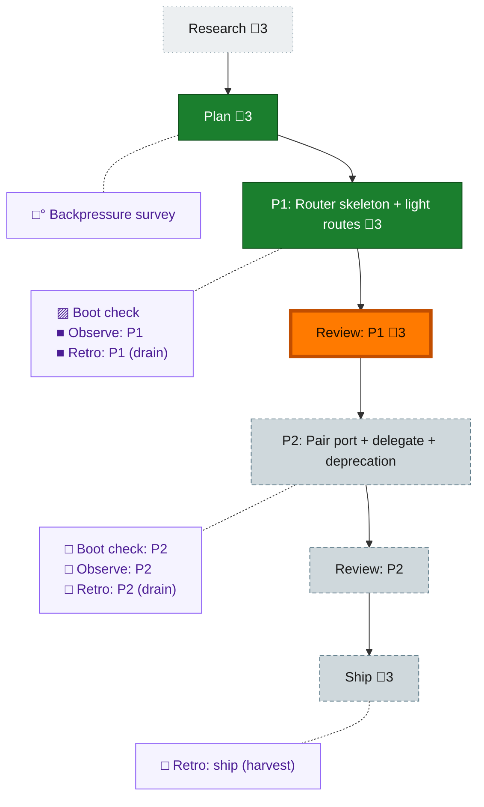

<!-- GENERATED by `harness flow render` — do not hand-edit; regenerate from the flow JSON. -->
# Flow · pij-router-skill

**Kind**: flight-plan · **Now**: review-1 · **Next**: phase-2 · **Intent**: Design a new /pij router skill (the-flow-style progressive disclosure) replacing flow-pair, which becomes one route; token-lean modules · **Nodes**: 15 · **Events**: 20

**Rail**: ◇─◆─[ ◆─◆─◇─◇─◇ ]  ◇ Research · ◆ Plan · [ ◆ P1: Router skeleton + light routes · ◆ Review: P1 · ◇ P2: Pair port + delegate + deprecation · ◇ Review: P2 · ◇ Ship ]

**Legend** — colour = type/status: 🟩 done · 🟢 in-progress · 🟥 blocked · 🟦 known · ⬜ assumed · 🔶 decision · 🗣 user input · 🟪 harness chore (faded = not yet done) · 🤖 companion · 🛠 worker · 🟧 current (you are here). Badges: 💬 comments · 📄 artifacts · 📝 instructions · 🧰 chore (° optional / recommended / ‼ strongly-recommended; ✓ done · ✕ skipped).
