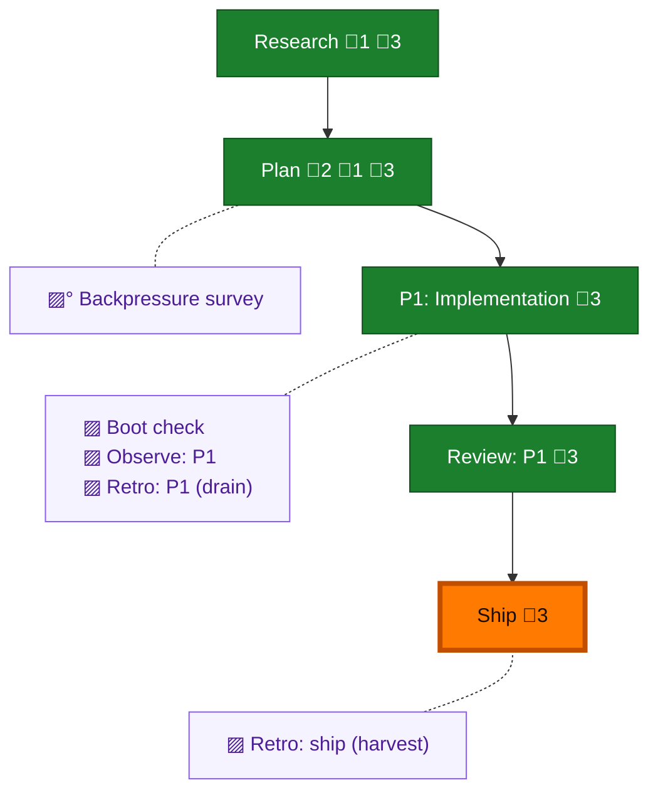

<!-- GENERATED by `harness flow render` — do not hand-edit; regenerate from the flow JSON. -->
# Flow · pij-telemetry-join-keys

**Kind**: flight-plan · **Now**: ship · **Intent**: Implement the two pij telemetry join-key features (scoped in docs/notes/telemetry-join-keys-scoping.md): (1) a pij sessions --json join-table verb surfacing the already-persisted harnessSessionId join keys; (2) harness-aware adopt session-id resolution for orchestrator self-identity, plus optional adopt --export / whoami --env sugar. · **Nodes**: 10 · **Events**: 23

**Rail**: ◆─◆─[ ◆─◆─◆ ]  ◆ Research · ◆ Plan · [ ◆ P1: Implementation · ◆ Review: P1 · ◆ Ship ]

**Legend** — colour = type/status: 🟩 done · 🟢 in-progress · 🟥 blocked · 🟦 known · ⬜ assumed · 🔶 decision · 🗣 user input · 🟪 harness chore (faded = not yet done) · 🤖 companion · 🛠 worker · 🟧 current (you are here). Badges: 💬 comments · 📄 artifacts · 📝 instructions · 🧰 chore (° optional / recommended / ‼ strongly-recommended; ✓ done · ✕ skipped).

## Node log

### research · Research
- 📄 artifacts: docs/notes/telemetry-join-keys-scoping.md

### plan · Plan
- 📄 artifacts: docs/plans/031-pij-telemetry-join-keys/pij-telemetry-join-keys-plan.md
- `2026-07-04T05:31:13.206Z` · — · validation — validate-v2: NEEDS ATTENTION (1 HIGH). copilot orchestrator self-identity blocked; claude/codex + feature-1 sound. See validations/pij-telemetry-join-keys-plan-validation.md. Fix: add ~/.copilot/session-state scanner to T006, or scope copilot out; then re-run plan.
- `2026-07-04T05:35:36.469Z` · — · validation — Re-validated after copilot re-scope (v1.1.0): VALIDATED WITH FIXES. HIGH resolved (finding 02b: copilot needs new session-state scanner, not transcriptLayout reuse). Plan is buildable.
