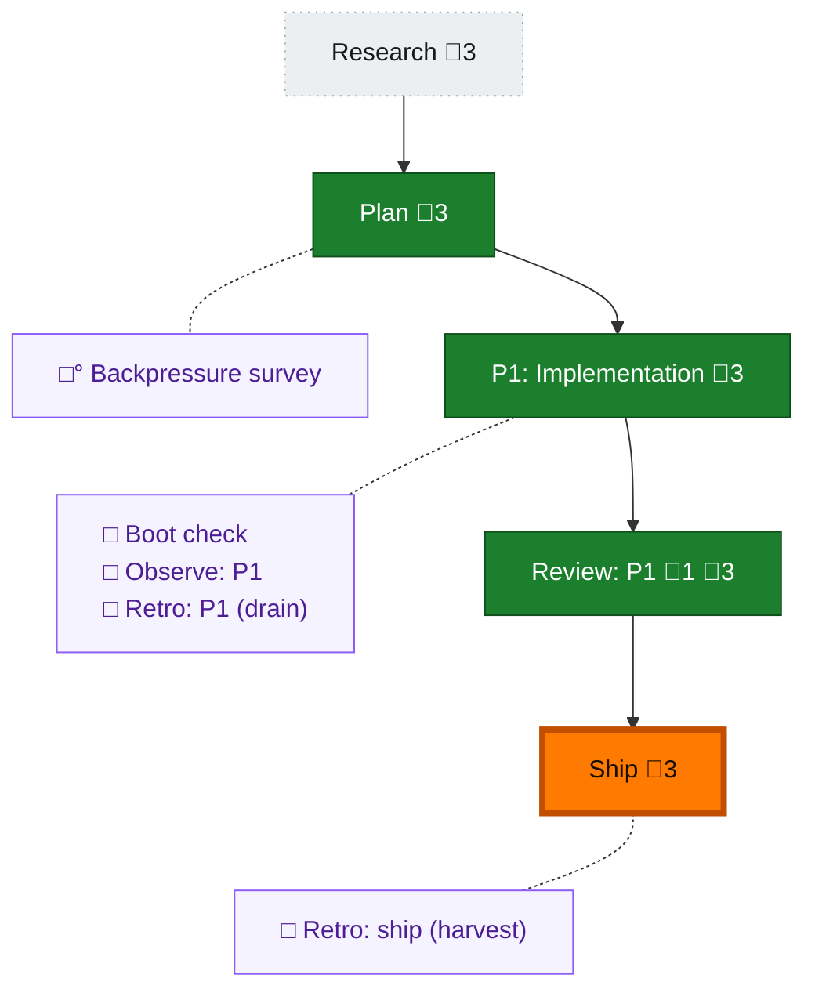

<!-- GENERATED by `harness flow render` — do not hand-edit; regenerate from the flow JSON. -->
# Flow · 032-pij-honest-send-receipts

**Kind**: flight-plan · **Now**: ship · **Next**: ship · **Nodes**: 10 · **Events**: 12

**Rail**: ◇─◆─[ ◆─◆─◆ ]  ◇ Research · ◆ Plan · [ ◆ P1: Implementation · ◆ Review: P1 · ◆ Ship ]

**Legend** — colour = type/status: 🟩 done · 🟢 in-progress · 🟥 blocked · 🟦 known · ⬜ assumed · 🔶 decision · 🗣 user input · 🟪 harness chore (faded = not yet done) · 🤖 companion · 🛠 worker · 🟧 current (you are here). Badges: 💬 comments · 📄 artifacts · 📝 instructions · 🧰 chore (° optional / recommended / ‼ strongly-recommended; ✓ done · ✕ skipped).

## Node log

### review-1 · Review: P1
- `2026-07-05T10:01:02.647Z` · — · — — Reviewer pij-1rcsb4g: FIX_REQUIRED (AC-06 false-confirm in freshTranscriptEvent) + Dim-0 PASS + harness checks GREEN. Coder fixed (idle-precondition guard + non-vacuous regression test). Lead-adjudicated APPROVE: guard verified at daemon-tmux.ts:152, regression asserts pre-busy→false & idle→true, independent harness checks GREEN (all 6 sensors).
