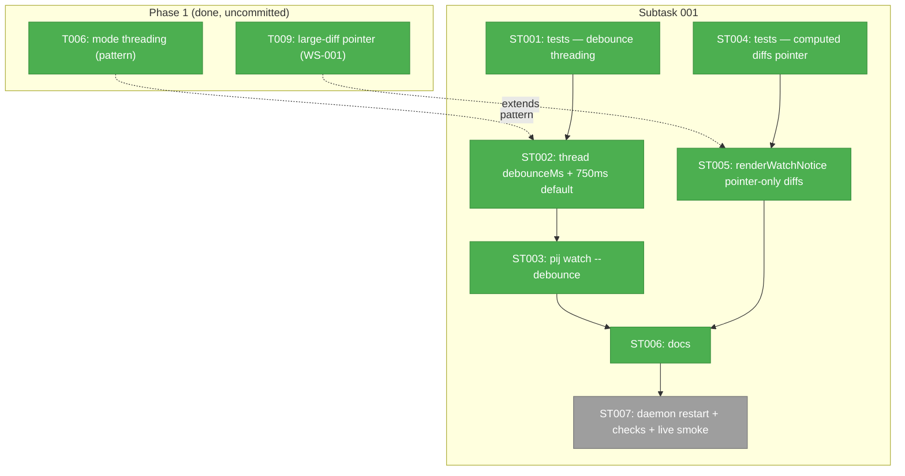
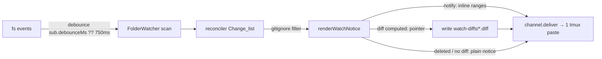
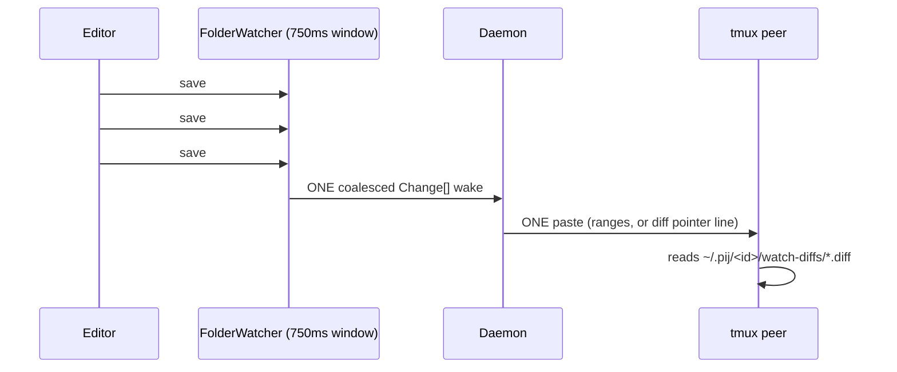

# Subtask 001: Watch collate window + diff-mode pointer delivery

**Created**: 2026-07-10
**Status**: Complete — ST001–ST007 done; code review APPROVE (`../../reviews/review.md`); uncommitted pending user GO
**Plan**: [pij-watch-rich-notices-plan.md](../../pij-watch-rich-notices-plan.md)
**Parent phase**: Phase 1: Implementation (plan tasks T001–T014, built + APPROVED, uncommitted)
**Parent tasks**: T006 (mode threading pattern — the template for threading `debounceMs`), T009 (pointer delivery — extended to all diff-mode)
**Source**: live demo on a copilot gpt-5.6-terra peer (2026-07-10); spec captured in `scratch/plan-034-watch-followup-ideas.md`
**Domain(s)**: pij-control-plane (primary), file-watch-notify (read-only reference — core is NOT modified)

---

## Parent Context

Phase 1 delivered rich watch notices: self-snapshot content baseline in the pi-free
`file-watch-notify` core, changed-line ranges (notify mode) + unified diff (diff mode)
rendered in `core/watch-subscription.ts` `renderWatchNotice`, pointer delivery for
large diffs (WS-001), `.gitignore` honoring daemon-side (WS-002), and `mode` threaded
through 5 sites (T006). No `tasks.md` dossier exists for Phase 1 — it was built by a
flow-pair run directly off the plan's task table, so **the plan table is the parent
record**.

The live demo surfaced two gaps this subtask closes:

1. **Collate window too tight.** Each `channel.deliver` = one tmux paste with its own
   `[pij from pij-watch]` header. The watcher already coalesces everything in one
   debounce window into ONE delivery, but the window is `DEFAULT_DEBOUNCE_MS = 30`
   (`file-watch-notify/store.ts:72`) — too short to absorb macOS truncate-in-place
   double fs-events or a burst of successive saves, so peers get a flurry of pastes.
2. **Inline diffs are unreadable over tmux.** `send-keys` cannot carry literal
   newlines (they would submit the peer's prompt mid-message), so the daemon flattens
   multi-line bodies — an inline unified diff arrives as one run-on line. Small diffs
   currently inline (≤60 lines AND ≤4 KiB, `watch-subscription.ts:14-15`); only large
   ones pointer-deliver. Every pij watch peer today is tmux-injected, so the inline
   diff path has no readable consumer.

## Executive Briefing

- **Purpose**: make peer-watch notices arrive as one readable paste per burst — a
  per-subscription collate (debounce) window with a 750 ms peer-watch default, and
  pointer-delivery for every diff-mode change that has a computed diff (not just
  large ones; deleted/no-diff changes keep plain notices).
- **What we're building**: thread `debounceMs?: number` through `WatchSubscription`
  exactly the way `mode` was threaded (T006 pattern), add `pij watch --debounce`,
  introduce a pij-side `DEFAULT_PEER_WATCH_DEBOUNCE_MS = 750`, and collapse
  `renderWatchNotice`'s diff-mode inline/pointer branch to pointer-only for computed
  diffs (plain-notice branches preserved).
- **Goals**:
  - ✅ a burst of edits inside the window → ONE notice / ONE tmux paste
  - ✅ truncate-in-place writers (2 fs events) collapse to one notice
  - ✅ `pij watch --debounce <n[ms|s]>` per-subscription override
  - ✅ every diff-mode change **that has a computed diff** yields a one-line
    `— diff: <path>` pointer + readable file at `~/.pij/<id>/watch-diffs/` (deleted /
    over-cap / binary changes keep their plain notices — AC-11)
- **Non-Goals**:
  - ❌ touching the `file-watch-notify` core's semantics or its `DEFAULT_DEBOUNCE_MS`
    (30 ms stays the core/pi-side default; the 750 ms default is pij-side only)
  - ❌ changing notify-mode rendering (single-line ranges inline are tmux-safe)
  - ❌ cross-wake batching/queueing (the debounce window IS the collate mechanism)
  - ❌ committing anything (034 + this subtask land together when the user says so)

## Pre-Implementation Check

| File | Exists? | Domain Check | Notes |
|------|---------|-------------|-------|
| `.pi/extensions/pij/core/types.ts` | yes (modify) | pij-control-plane contract | add optional `debounceMs` to `WatchSubscription` (L140-147) |
| `.pi/extensions/pij/core/watch-subscription.ts` | yes (modify) | pij-control-plane | `addWatch` literal + upsert branch (L61-73); `renderWatchNotice` diff branch (L144-163); `keyOf` debounce-blind (see D1 rev 2) |
| `.pi/extensions/pij/core/watch-subscription.test.ts` | yes (modify) | pij-control-plane | tests for both ideas' pure logic |
| `.pi/extensions/pij/core/daemon/watch.ts` | yes (modify) | pij-control-plane | `start()` passes `sub.debounceMs ?? DEFAULT_PEER_WATCH_DEBOUNCE_MS` to `FolderWatcher` (L155-158) |
| `.pi/extensions/pij/core/daemon/watch.test.ts` | yes (modify) | pij-control-plane | debounce plumbing assertion |
| `.pi/extensions/pij/adapters/watch-store.ts` | yes (modify) | pij-control-plane | `isWatchSubscription` accepts optional numeric `debounceMs` (L6-14) |
| `.pi/extensions/pij/cli.ts` | yes (modify) | pij-control-plane | `splitWatchFlags` (L793-812) + `runWatch` (L770) + usage strings (L136-149) |
| `docs/how/pij-peer-watch.md` | yes (modify) | doc | `--debounce`, collate semantics, computed-diff→pointer (plain notices retained) |
| `.pi/extensions/file-watch-notify/*` | yes (NOT modified) | file-watch-notify | `FolderWatcher` already takes `debounceMs` as a constructor arg (`watcher.ts:47`) — no core change needed |

**Contract change flag**: `WatchSubscription` gains an optional field — additive,
back-compat (absent ⇒ default), same shape as the `mode` addition. Sidecar files
written by older builds remain valid.

## Decisions

- **D1 (rev 2, per validate finding 1) — store key debounce-blind + UPSERT; daemon key
  debounce-aware.** A different cadence on the same glob+mode is the SAME subscription,
  so the store's `keyOf` (`watch-subscription.ts:24`) stays debounce-blind — but
  `addWatch` currently *skips* a `keyOf` match (`watch-subscription.ts:61-73`), which
  would make `pij watch --debounce 2s` on an existing glob silently ineffective.
  Therefore: (a) `addWatch` **upserts** `debounceMs` onto the existing matching sub
  (still one stored sub per glob+mode; list otherwise unchanged); (b) the daemon's
  `watchKey` (`daemon/watch.ts:201`) **includes** `debounceMs`, so a cadence change
  reconciles as dispose-old + start-new `FolderWatcher` (the window is a constructor
  arg, `watcher.ts:47` — a live watcher cannot be retuned in place). ST001 asserts
  both halves.
- **D2 — 750 ms default lives pij-side.** New exported `DEFAULT_PEER_WATCH_DEBOUNCE_MS = 750`
  (suggested home: `core/watch-subscription.ts`, beside the WS-001 thresholds — Pattern
  P5, constants live with the data). The core's `DEFAULT_DEBOUNCE_MS = 30` is untouched:
  it serves the pi-side extension, and peer delivery (a tmux paste) is the expensive
  channel that wants the long window.
- **D3 (rev 2, per validate finding) — diff mode drops the inline branch, scoped to
  changes WITH a computed diff.** All deliveries today are tmux injections; the
  flattened inline diff has no readable consumer. `DIFF_INLINE_MAX_LINES` /
  `DIFF_INLINE_MAX_BYTES` and the size branch are removed (git history preserves them
  if a newline-capable channel ever appears). The existing plain-notice branches stay:
  `deleted` and absent `c.diff` (over-cap/binary) keep emitting plain notices
  (`watch-subscription.ts:140-152`, parent AC-11). Notify mode is untouched.

## Architecture Map



## Tasks

| Status | ID | Task | Domain | Path(s) | Done When | Notes |
|--------|-----|------|--------|---------|-----------|-------|
| [x] | ST001 | Tests-first: `addWatch` stores `debounceMs` on a NEW sub and **upserts** it onto an existing glob+mode match (still exactly one stored sub); validator accepts optional number / rejects non-number; store `keyOf` debounce-blind; daemon `watchKey` debounce-AWARE — reconcile after a cadence change disposes the old `FolderWatcher` and starts a new one | pij-control-plane | `.pi/extensions/pij/core/watch-subscription.test.ts`, `.pi/extensions/pij/core/daemon/watch.test.ts` | Failing tests specify upsert + dispose/restart-on-cadence-change (D1 rev 2, both halves) | Parent T006; D1; validate finding 1 |
| [x] | ST002 | Thread `debounceMs?: number` through `WatchSubscription` (types.ts), `addWatch` literal + upsert branch (omit when undefined, mirroring `mode`), `isWatchSubscription`; include `debounceMs` in daemon `watchKey`; daemon `start()` passes `sub.debounceMs ?? DEFAULT_PEER_WATCH_DEBOUNCE_MS` (new const, 750) to `FolderWatcher`; stop importing core `DEFAULT_DEBOUNCE_MS` in daemon/watch.ts | pij-control-plane | `.pi/extensions/pij/core/types.ts`, `.pi/extensions/pij/core/watch-subscription.ts`, `.pi/extensions/pij/core/daemon/watch.ts`, `.pi/extensions/pij/adapters/watch-store.ts` | ST001 green; core files untouched | D2; Key Finding 04 pattern (lockstep sites) |
| [x] | ST003 | `pij watch --debounce <n[ms\|s]>`: parse in `splitWatchFlags` (bare integer = ms; `750ms`/`2s` suffixes; reject ≤0/NaN with a usage error), thread into `addWatch`; update watch usage strings + examples; **integration tests** in the existing CLI seam covering bare-ms, `2s`→2000, `750ms`→750, and invalid/non-positive values erroring BEFORE any store write | pij-control-plane | `.pi/extensions/pij/cli.ts`, `.pi/extensions/pij/cli.integration.test.ts` | `pij watch --debounce 2s "**/*.ts"` persists `debounceMs: 2000`; bad values error before store write; parser/persistence/error paths covered in cli.integration.test.ts (seam at L164-193) | Mirrors `--mode` parsing (L793-812); validate finding 2 |
| [x] | ST004 | Tests-first: diff-mode `renderWatchNotice` returns a pointer (+ `PointerWrite`) for every change **with a computed diff** — small (previously inline) AND large; `deleted` + absent-`c.diff` (over-cap/binary) changes still emit plain notices (AC-11); body carries `— diff: <abs path>` line only; notify mode unchanged; empty-delta suppression intact | pij-control-plane | `.pi/extensions/pij/core/watch-subscription.test.ts` | Failing tests specify diff-present→pointer + plain-notice branches preserved; existing threshold test rewritten (not deleted) to assert small-diff-pointers | Parent T009; D3 rev 2 |
| [x] | ST005 | Implement diff-present→pointer: remove the inline branch + `DIFF_INLINE_MAX_LINES`/`DIFF_INLINE_MAX_BYTES` from `renderWatchNotice`; update its doc comment (WS-001 note: every computed diff pointers; deleted/no-diff changes keep plain notices) | pij-control-plane | `.pi/extensions/pij/core/watch-subscription.ts` | ST004 green; no dangling references to the removed constants | D3 rev 2; daemon pointer-write path (watch.ts L163-170) already writes whatever `pointers` the renderer returns |
| [x] | ST006 | Update the how-guide: `--debounce` flag + collate semantics (one paste per burst, 750 ms default); diff mode pointer-delivers every computed diff (readable file, one-line notice) while deleted/no-diff (over-cap/binary) changes keep plain notices | pij-control-plane | `docs/how/pij-peer-watch.md` | Guide matches shipped behaviour; examples updated | Docs strategy from plan; D3 rev 2 |
| [x] | ST007 | Restart the pij daemon (tsx runs off source — NO hot-reload), run the full test suite (`npm test`) green, then live smoke: (a) burst of ≥3 rapid saves → exactly ONE `[pij from pij-watch]` paste; (b) diff-mode watch on a small edit → pointer line + readable multi-line file under `~/.pij/<id>/watch-diffs/` | pij-control-plane | — | Both smokes observed on a real peer; suite green | Done 2026-07-10: live orchestrators notified pre-restart; both smokes PASS (see Discoveries) |

## Context Brief

**Environment-first posture** (builder invariant #14): friction is work, not an
apology — fix small/reversible walls, otherwise capture them (execution-log
Discoveries row when harness-less) and pay them forward.

**Key findings from plan (inherited)**:
- Finding 04: threading a `WatchSubscription` field means lockstep updates or silent
  dedup collisions — per D1 rev 2, `debounceMs` stays OUT of the store `keyOf` (with
  upsert) but goes INTO the daemon `watchKey` (cadence change = watcher restart);
  assert both, don't just skip.
- Finding 05: pointers are inline path strings in `body` — `attachments` is
  telegram-only, never use it.
- Finding 08: the debounce window already coalesces a burst into ≤1 `Change`/file/wake
  and the baseline advances once per wake — lengthening the window changes NO
  reconciler semantics, only cadence.

**Hard-won demo facts (do not re-diagnose)**:
- tmux `send-keys` flattens newlines — that is WHY computed diffs must
  pointer-deliver; it is not a daemon bug.
- `printf > file` truncates in place → 2 macOS fs events; an atomic save (write-temp +
  rename) → 1. The 750 ms window absorbs the former; neither is a reconciler defect.
- Queued receipt = reliable; `delivered` = suspect (033 receipts model).

**Domain constraints**:
- `file-watch-notify` core is pi-free AND pij-free — no pij imports, no behaviour
  change in this subtask. `FolderWatcher` already accepts `debounceMs` per instance.
- `core/` in pij stays daemon-agnostic-pure where it is today: `renderWatchNotice`
  remains pure (pointer WRITES stay in daemon/watch.ts).

**Reusable from Phase 1**:
- `watch-subscription.test.ts` + `daemon/watch.test.ts` fixtures (fake `GitPort`,
  `makeWatchDeps`) cover the delivery path — extend, don't rebuild.
- The `mode` threading diff (T006) is the exact shape ST002 repeats.

**Flow (delivery path)**:


**Sequence (burst collate)**:


## After Subtask Completion

- Phase 1 + this subtask are ONE uncommitted unit — nothing lands until the user says
  commit (trailer: `Co-Authored-By: Claude Opus 4.8 <noreply@anthropic.com>` per repo
  convention for this work).
- Resume point: flight plan `docs/plans/034-pij-watch-rich-notices/the-flow.json`,
  node `p1-followups` → mark done, `nav` rejoins `review-1` (the pending review beat
  then covers Phase 1 + subtask together).

## Discoveries & Learnings

_Populated during implementation._

| Date | Task | Type | Discovery | Resolution | References |
|------|------|------|-----------|------------|------------|
| 2026-07-10 | ST001 | TDD | The new contract tests failed on all intended seams: missing persistence/upsert, permissive sidecar validation, and the inherited 30 ms daemon cadence. | Implemented the D1/D2 lockstep field threading in ST002. | `watch-subscription.test.ts`, `daemon/watch.test.ts` |
| 2026-07-10 | ST003 | TDD | Before parsing existed, `--debounce` and its value were persisted as extra globs and invalid values exited successfully. | Added a single watch-flag splitter that validates duration syntax before resolving self or writing the sidecar. | `cli.integration.test.ts`, `cli.ts` |
| 2026-07-10 | ST004 | TDD | The small-diff contract test proved the only remaining unreadable path was the inline threshold branch; large and no-diff branches already matched D3 rev 2. | Removed both thresholds and made every computed diff produce a `PointerWrite`; retained deleted/no-diff plain notices. | `watch-subscription.test.ts`, `watch-subscription.ts` |
| 2026-07-10 | ST006 | Validation | The full suite remains green with the new cadence, CLI, renderer, and docs contract: 117 files passed, 4 skipped; 1,580 tests passed, 10 skipped. Typecheck and lint also pass (lint reports existing warnings only). | Left ST007 pending for the coordinated daemon restart and live tmux smoke. | `npm test`, `just typecheck`, `just lint` |
| 2026-07-10 | ST007 | Validation | Live smoke on the restarted daemon, watching from an adopted claude session: (a) 3 atomic saves within ~450 ms → exactly ONE paste `burst.txt modified (+2/-2) lines 2,4`; (b) small diff-mode edit → ONE pointer paste + readable multi-line unified diff at `~/.pij/<id>/watch-diffs/diffy.md.diff`; `watch-diffs/` removed on last unwatch (WS-001 cleanup). All 7 live orchestrator sessions were notified before the shared-daemon restart. | ST007 closed; subtask complete. | this dossier |
| 2026-07-10 | ST007 | gotcha | `pij watch <literal-file-path>` (no glob chars) silently records a dead watch: CLI stores `dir=<file>` + `patterns:["**/*"]`, the daemon's `FolderWatcher` fails on the non-directory and is disposed with only a daemon-side log — caller sees "watching 1 subscription(s)" and never a notice. | Logged as harness observation DL-004 (normalize file→(dirname, basename) or fail loud); use globs like `dir/*.txt` meanwhile. | harness `.harness/temp/agent/session-buffer.md` |

---

```
docs/plans/034-pij-watch-rich-notices/
  ├── pij-watch-rich-notices-plan.md
  └── tasks/phase-1-implementation/
      ├── 001-subtask-watch-collate-window-and-diff-pointer.md   # this dossier
      └── 001-subtask-….log.md                                   # created by the implement verb
```
