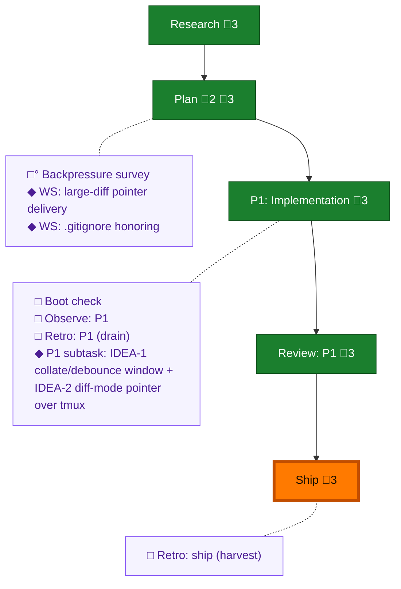

<!-- GENERATED by `harness flow render` — do not hand-edit; regenerate from the flow JSON. -->
# Flow · pij-watch-rich-notices

**Kind**: flight-plan · **Now**: ship · **Intent**: Rich file-watch notices for pij peer watch (plan 033): changed-line ranges + optional diff mode (self-snapshot baseline, pointer-delivery for large diffs) + .gitignore honoring. · **Nodes**: 13 · **Events**: 30

**Rail**: ◆─◆─[ ◆─◆─◆ ]  ◆ Research · ◆ Plan · [ ◆ P1: Implementation · ◆ Review: P1 · ◆ Ship ]

**Legend** — colour = type/status: 🟩 done · 🟢 in-progress · 🟥 blocked · 🟦 known · ⬜ assumed · 🔶 decision · 🗣 user input · 🟪 harness chore (faded = not yet done) · 🤖 companion · 🛠 worker · 🟧 current (you are here). Badges: 💬 comments · 📄 artifacts · 📝 instructions · 🧰 chore (° optional / recommended / ‼ strongly-recommended; ✓ done · ✕ skipped).

## Node log

### plan · Plan
- `2026-07-08T23:30:47.555Z` · — · validation — VALIDATED WITH FIXES — sidecar at validations/pij-watch-rich-notices-plan-validation.md; every AC now has an authoring task; G6 honest.
- `2026-07-09T00:06:51.782Z` · — · validation — VALIDATED (v1.1.0) — workshop decisions folded; READY holds. Sidecar updated.
