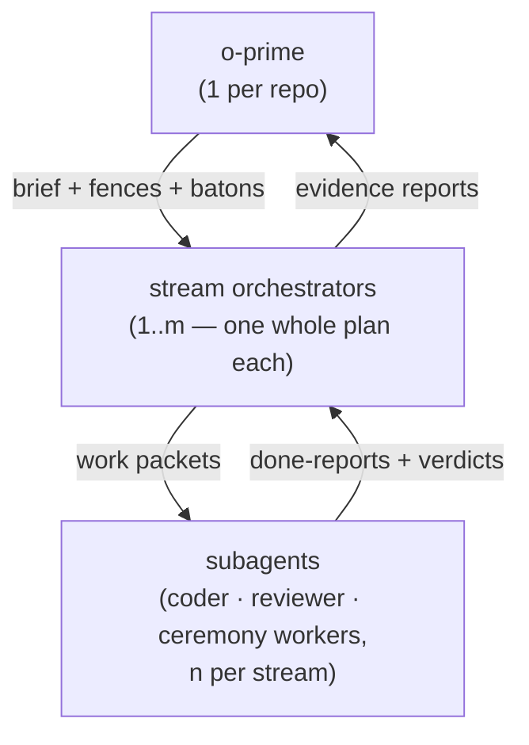

# o-prime system map
**Writer**: the o-prime (pij-1bovprr) · **Created**: 2026-07-11 (post-restart beat) · **Status**: v1 — iterating with Jordan

## Overview — the three layers

**Orchestrator lifecycle (first-class)**: `adopt → orient → preamble → work` — adoption
takes governance (canary + orient stack + roster), orientation is read-only discovery,
the **preamble** is the human-led alignment conversation that confirms the assignment
(rulings recorded to disk, closed by the preamble checkpoint report), and only then
does work begin. The o-prime holds every assignment provisional until its preamble.

Each layer boots from two inputs — **deterministic data** (files on disk it owns or
reads) and a **boot prompt** (the custom context fed in at spawn so it never
re-discovers what the system already knows). The prompt stack is three levers:
**lever 0** `orient-oprime.md` (the o-prime's own boot — portable, central),
**lever 1** `orient-global.md` (every stream — portable, central), **lever 2**
`orient-local.md` (this repo — the live tuning surface). Day-zero setup for a new
repo: `bootstrap.md`.

| Layer | Deterministic data (disk) | Boot prompt (fed at spawn) |
|---|---|---|
| **o-prime** | owns `government/` (spine · baton book · **slate** · briefs · runbook · canaries · reports); reads the protocol + every plan folder | inception brief: thesis, repo per-config (gates, batons, never-stage), project background + what matters, standing rulings |
| **stream** | owns its plan folder (flow state · reports) + granted code fences; reads protocol, spine (its fences + tree), baton book | **three-layer injection**: ① global orient (central, portable, shared across repos — `map/orient-global.md`) → ② local orient (this repo's live tuning surface — `map/orient-local.md`) → ③ item brief (the ask verbatim, fences, structure tree, prior art) |
| **subagent** | owns nothing durable — writes only inside the packet allowlist; reads the packet file | work packet: whole-phase task, action-derived allowlist, fences, gate commands, done-report format |

The boot-prompt column is the portability lever being prototyped: background that
today a human explains per-session (what the project is, what's important, where
prior art lives) gets packaged per-layer so every fresh session boots well — the
protocol doc carries the invariants, the brief carries the specifics.

### The two orient levers (POC LIVE in this folder)

Every orchestrator boots from a **standard prompt stack**, injected in order:

1. **`orient-global.md`** — the portable standard: who you are, the iron rules
   (single-writer disk, pointers, canary, preamble, verify-every-green, batons,
   report contract, ledger, teardown, honest reporting), the boot sequence. In the
   production system this is **centrally stored and shared between repos** —
   editing it tunes every o-prime deployment at once. Nothing repo-specific may
   enter it.
2. **`orient-local.md`** — this repo's overlay and the o-prime's **live tuning
   surface**: what the project is, what matters (determinism contracts, config
   doctrine, scenario proving), repo mechanics (gates, batons, never-stage, fleet
   defaults), and current portfolio context. Improved continuously as orchestrators
   reveal what they keep needing; anything that stops being repo-specific graduates
   UP to the global orient or the protocol.
3. **The item brief** — per work-item: the ask verbatim, fences, structure tree,
   prior-art pointers (unchanged from the run-01 brief format, minus everything the
   two orients now carry).

Graduation path: pane-taught lesson → local orient → global orient/protocol. That's
the 16h→15m curve as a file-move.

### Batons (first-class concept)

A **baton** is a lease on an exclusive resource — anything that breaks under two
concurrent users (build systems with shared lock dirs, single-instance app windows,
pushes to a shared trunk). Where fences partition *files*, batons serialize *time on
a resource*. First-class means:

- **One book** (`government/baton-book.md`, single-writer: the o-prime) is the whole
  truth: holder · since · purpose · queue, plus an append-only grant log. The book
  binds EVERY layer — the o-prime's own resource use goes through its own book.
- **One lifecycle**: request (with purpose) → o-prime verifies the resource is
  actually free (probe, e.g. `pgrep`; never trust the table alone after a restart)
  → pushed grant → use → return (with evidence, e.g. pushed SHAs) → o-prime verifies
  the evidence → book closed. Grants are pushed, never polled for.
- **Failure paths are part of the concept**: silent holder → verify liveness AND
  whether the purpose completed (the evidence decides, not the silence) → reclaim
  with a note. Restart → the book is FIRST on the reconcile audit (a dead holder in
  the table misleads everyone; caught live by a fresh adoptee in run 01).
- **Blocked-on-baton time is measured data** — it feeds the worktree-split decision
  and the concurrency economics of the whole system.
- **Graduation path**: run 01 runs batons as convention (files + sends) BY DESIGN —
  the run generates the requirements; the proven cycle shape then graduates into a
  mechanical primitive (`pij baton request/return/reclaim` or a harness lease verb)
  with the book retained as the human-readable evidence layer on top.

Run-01 proof: four clean cycles (two overseer snapshots, one dead-holder reclaim,
one stream push) — including the hard cases.

### The harness underneath (the standing second objective)

Every layer of this map runs *through* a deterministic layer — the repo's
**engineering harness** (`harness` CLI: boot/checks/observe/flow/scenario) — and
every layer carries the same dual goal: **the work, and the environment the work
runs through**. The o-prime system plugs into it rather than duplicating it:

- **Streams/subagents** capture friction at the moment it bites (`harness observe`),
  ride the builder flow's built-in seams (per-phase observe chores, drain, harvest),
  and prove done-ness with checks, not claims.
- **The o-prime** aggregates observations[] across streams into **encode
  candidates** — corrections become checks/commands, not chat history ("fix the
  check first, then the code"). The government's report contract is itself
  backpressure with a home.
- **Discrimination rule** (anti-neurosis): capture if a reasonable next agent would
  hit it too; encode when small or costly-recurring; improvement is offered, never
  imposed.
- Foundations: `harness-foundations/rules-of-why.md`; the o-prime run-01 ledger IS
  this loop applied to orchestration itself (three protocol amendments + two pij
  encode-candidates in the first day).

### The prime-flow — o-prime's outer flow (POC LIVE in this folder)

The slate idea below evolved (Jordan's ruling 2026-07-11) into the **prime-flow**: the
o-prime's own `harness flow` spine, one level above the builder's per-plan
flight-plans. **POC artifacts, working now**:

- `map/prime-flow.schema.json` — custom overlay (`kind: prime-flow, extends: flow-core`):
  statuses `proposed → deciding → preparing → in_flight → done | folded | dropped`
  (+ `blocked`), node types `work-item · decision · milestone`.
- `map/prime-flow.json` — the instance (`harness flow create prime-flow --slug
  secondcrack-portfolio --schema … --path … --bare`), populated with the REAL run-01
  portfolio: wi-017 (blocked — restart-suspended, artifacts point at its plan +
  report), wi-019 (folded), wi-020 (blocked), dec-next (deciding — prime never
  invents features). Node comments carry the peer/window/cwd pointers; `nav.now` =
  wi-017. Rail renders: `harness flow rail --path docs/plans/018-o-prime/map/prime-flow.json`.
- Subflows need nothing new — each in-flight item's inner life IS the builder
  command's flight-plan in its own plan folder (local repo or worktree).
- POC findings: forward-`next` references rejected (add successors first);
  create requires `--slug`; comments use `--node`; custom statuses render as
  generic rail pips (fine; status-specific pips would be a harness nicety).
- **Source-checked by pij-wmfdte (harness-engineering)**: overlay controls exactly
  `kind + statuses[] + nodeTypes[]` (chore vocab + cursor model are shared-core);
  per-node status is independent — items parked forever in `deciding` are native;
  `--path` must be in-repo (schema/template may live out-of-repo — relevant for the
  centrally-stored production schema); `node.next` arrays make parallel branches
  idiomatic (the harness-loop overlay is a shipped CYCLE example). **One design
  rule from the single-cursor caveat**: `nav.now` is ONE cursor — with N streams
  concurrently in flight, node `status` is the source of concurrent truth and the
  nav meta bag carries the active set; `nav.now` is only the o-prime's current
  attention pointer, never "the" active item.

### The slate — original intake sketch (superseded by prime-flow above; kept for the ledger)

Things-to-do arrive at the o-prime faster than they become streams: some are in
flight, some still being decided, some parked. That intake needs **deterministic
storage** with the same discipline as the rest of the government — not scrollback.

- **Store**: a `harness flow` spine with a **custom schema** — verified: `harness flow
  new slate` scaffolds a custom flow-type overlay (own statuses/fields) into
  `.harness/schemas/flows/`, and `harness flow create slate --path
  docs/plans/018-o-prime/government/slate.json` writes the instance at an arbitrary
  in-repo path. One guided writer (the o-prime), mutated only via the CLI — the same
  rule streams already follow for `the-flow.json`.
- **Item lifecycle**: `proposed → deciding → allocated (ordinal+fences reserved) →
  in-flight (stream live) → shipped | dropped | folded` (s019's fate shows `folded`
  is a real terminal state, distinct from dropped).
- **Slate ↔ spine**: the slate holds *what and why* (the ask verbatim, priority,
  Jordan's rulings on it); the spine roster holds *who and where* (peer, window,
  fences, status). An item graduates slate→spine at allocation; the slate row keeps
  the pointer.
- Run-01 retrofit examples: config-platform (proposed 07-10 → in-flight → suspended),
  cave-density (proposed → allocated → **folded** into 017), destructible-terrain
  (proposed → in-flight → suspended).

### Coordination beyond fences — worktrees

Doing multiple things in one repo is the hard case the fences+batons machinery
exists for. When contention gets structural (two streams genuinely needing the same
surfaces, or an exclusive resource becoming the bottleneck), the o-prime's escape
valve is to **suggest the human split a git worktree** for one stream — pij already
supports peers in different working directories (verified: live peers bind panes
with distinct cwds), so a stream can run against `../repo-wt-s0NN` with its own
obj/bin, its own godot window, even its own dotnet baton lane, merging back through
the normal push-main baton. Usually one repo is fine; the worktree is a suggestion
the o-prime makes *to the human*, not a unilateral move.

---

## Full map — every component and channel

The components of the o-prime orchestration system and every channel they communicate
over. Shape shown is the **real-deployment** shape: an o-prime governing three
concurrent stream sessions. Run-01 note: in the live run this map was worn by fewer
bodies — one session was overseer and another was prime (now collapsed into one
o-prime seat), and the human worked inside every layer by design. **In real deployment
there is no single "you"**: each box is its own agent session, and the *government is
not an agent at all* — it is the disk substrate (single-writer files) that any o-prime
process maintains and every layer coordinates through.

```mermaid
flowchart TD
    H["🧑 Human<br/>(direction & rulings —<br/>may enter ANY pane directly)"]

    subgraph OP["o-prime session (window: o-prime)"]
        P["o-prime agent<br/>allocation · fences · batons ·<br/>canary+brief · verify+relay · ledger"]
    end

    subgraph GOV["government substrate — DISK, single-writer files (not an agent)"]
        SP["spine.md<br/>thesis · roster · fences · rulings"]
        BB["baton-book.md<br/>exclusive-resource serialization"]
        SL["slate.json<br/>intake: proposed → deciding →<br/>allocated → in-flight → shipped/folded"]
        BR["briefs/ + canary records<br/>s0NN-brief.md, canary-s0NN.md"]
        RB["kickoff-runbook.md<br/>the repeatable process"]
        PR["run reports<br/>prime-NNNN.md (upward evidence)"]
        PROTO["docs/how/o-prime.md<br/>the protocol every layer reads"]
    end

    subgraph S1["stream session s0AA (window: s0AA-slug)"]
        SA["stream orchestrator<br/>owns ONE plan end-to-end"]
        PA["plan folder (its fence)<br/>docs/plans/0AA-*/…<br/>flow state · reports/s0AA-NNNN.md"]
        subgraph F1["fleet (panes inside the stream's window)"]
            CA["coder<br/>(whole-phase packets)"]
            RA["cold reviewer<br/>(spawned at first review)"]
        end
    end

    subgraph S2["stream session s0BB"]
        SB["stream orchestrator"]
        PB["plan folder (its fence)"]
        FB["fleet: coder + reviewer"]
    end

    subgraph S3["stream session s0CC"]
        SC["stream orchestrator"]
        PC["plan folder (its fence)"]
        FC["fleet: coder + reviewer"]
    end

    %% Human channels
    H -. "tmux pane (words = rulings,<br/>recorded to disk immediately)" .-> P
    H -. "tmux pane" .-> SA
    H -. "tmux pane" .-> CA
    H <-. "status channel (pij-telegram,<br/>self-identified one-liners)" .-> P

    %% o-prime <-> streams (control plane: pij send, daemon-pushed)
    P == "spawn → canary (nonce · identity · 2nd-send)<br/>→ brief POINTER → tree-updates" ==> SA
    P == "spawn/canary/brief" ==> SB
    P == "spawn/canary/brief" ==> SC
    SA == "report POINTERS · baton requests ·<br/>fence escalations · brief-acks" ==> P
    SB == "〃" ==> P
    SC == "〃" ==> P

    %% streams <-> their fleets (same contract, one level down)
    SA == "canary → packet pointer<br/>(action-derived allowlists)" ==> CA
    SA == "canary → review packet" ==> RA
    CA == "done-reports" ==> SA
    RA == "verdict artifacts (mutation-gated,<br/>sanity-passed APPROVE)" ==> SA

    %% disk coordination (the substrate)
    P -- "writes (single writer)" --> SP & BB & SL & BR & RB & PR
    SA -- "writes (single writer)" --> PA
    SA -. "reads: protocol · spine (fences/tree) ·<br/>baton book" .-> GOV
    SB -.-> GOV
    SC -.-> GOV
    P -. "verify: reads ONE load-bearing artifact +<br/>re-runs one cheap gate before relaying" .-> PA

    %% exclusive resources
    subgraph EX["exclusive resources (ONE holder repo-wide, via baton book)"]
        D1["dotnet build/test"]
        D2["godot / gdUnit window"]
        D3["git push → main"]
    end
    BB -- "serializes" --> EX
    SA -. "uses only while holding baton" .-> EX
    P -. "grants/reclaims (pushed, not polled);<br/>book binds o-prime too" .-> BB
```

## Channel legend

| Edge style | Channel | Properties |
|---|---|---|
| `==>` thick | **pij send** (control plane) | Daemon-pushed into the receiver's turn — push, never poll. Content is always ≤2 sentences + a **pointer**; bodies live on disk. Known hazards: mid-turn interleaving ("stepped on"), unfocused-pane Enter bug (copilot), queued-event resurrection after `pij close`. |
| `-->` solid | **disk write** (single writer) | Every shared file has exactly ONE writer. The write IS the communication: layers coordinate from disk artifacts, not conversations they never saw. |
| `-.->` dotted | **disk read / verify** | Anyone may read anything. The o-prime's read of a stream's artifact before relaying is the trust-but-verify duty. |
| `-.` dotted to human | **tmux pane / telegram** | The human outranks every channel; pane words are rulings and must land on disk immediately or they're lost to the system. |

## Communication contracts (what actually flows)

1. **Downward (o-prime → stream)**: spawn → 3-leg canary (round-trip nonce · mechanical identity · second-send input check) → brief pointer (with structure tree) → tree-updates on roster change → grants (fence amendments, batons — pushed).
2. **Upward (stream → o-prime)**: brief-ack → preamble report (s0NN-0001, read-only, before planning) → checkpoint/ship reports (claim · artifacts[] · shas[] · gates[] · observations[] · open[]) → escalations (fence, blockage) — all as pointers to files in the stream's own plan folder.
3. **Verification at every hop**: a report's claim is a claim; the receiver reads one load-bearing artifact / re-runs one cheap gate before acting or relaying. Same rule stream→fleet (mutation gates, verdict artifacts must exist on disk).
4. **Exclusive resources**: request baton → o-prime verifies free (e.g. `pgrep` for godot) → pushed grant → use → done-report → explicit handover to next in queue. Fences are the backstop when the protocol fails.
5. **Human**: enters any pane; every ruling is recorded on disk by whoever heard it, then propagated up/down as pointers.

## Run-01 worked examples (the children's real traffic)

| Flow | Real instance |
|---|---|
| Spawn→canary→brief | s017 `pij-1gx33y5`: nonce S017-4482, pane-footer identity probe, brief-ack closed leg (c) — `government/canary-s017.md` |
| Preamble report | `docs/plans/020-destructible-terrain/reports/s020-0001.md` (s020 `pij-19qw8yy` — produced before the machine restart killed its pane) |
| Checkpoint report + verify | `docs/plans/017-config-platform/reports/s017-0001.md` — prime verification caught a scratch-space write outside fences → standing `.harness/temp/<stream>/**` grant |
| Fence escalation (action-derived) | s017 validation F6 → `RandomCaveScenario.cs` + `docs/how/cave-generation.md` granted after independent grep verification |
| Fence narrowing at stream-two | s017's broad `UnitTests/**` → named list + `PathfinderParityTest.cs` grant (construction-sites-only) |
| Baton cycle | push-main: overseer requested → granted 13:02Z → committed `76b63c8` → returned+verified; cycle #2 → `f26d3fd` |
| Ruling propagation loop | Jordan's structure-tree ruling: spoken in s017's pane → relayed up → encoded into protocol § Spawning step 3 → pushed back down — one full circuit on disk |
| Stream lifecycle incl. dissolution | s019 `pij-1t7pmiw`: spawned, canaried, briefed, dissolved by ruling before work; insights transplanted into s017's brief; ordinal tombstoned |

## Deployment note (who is actually separate)

Run-01 collapsed roles into few bodies (deliberately — the experience was the data):
one session was overseer, one was prime (merged into a single o-prime seat after the
restart), and the human taught inside every layer. In **real deployment**:

- **o-prime** is one agent session; **each stream** is its own agent session; **each
  fleet worker** is its own (cheaper-harness) session. Nobody wears two hats.
- **The government is files, not a mind** — any o-prime process that dies can be
  replaced by pointing a fresh session at `government/` + the protocol doc; the spine,
  book, and briefs ARE the state (the machine-restart that prompted this map proved
  it: every pane died, the government lost nothing).
- **The human is optional per-layer** — run-01's taught apprenticeship is what later
  rounds automate away, one layer at a time, using this map's channels unchanged.
