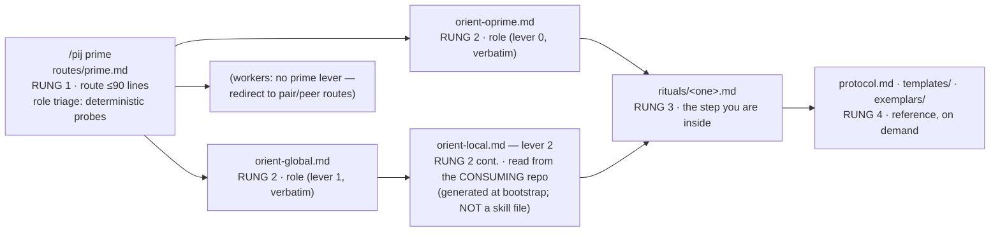

# Workshop: prime route & payload architecture (the disclosure ladder as files)

**Type**: Storage Design + Integration Pattern
**Plan**: 035-o-prime-routing-skill
**Spec**: `../requirements-spine.md` (r4 — VALIDATED, CONVERGED; pre-flow workshop per E-14/R8.6, to be recorded as pre-existing input at flow create)
**Created**: 2026-07-11
**Status**: **Approved** — o-prime (pij-uec99o) AGREED ("the ladder-as-files mapping is faithful"; D3-A split, deterministic role probes, and Q3's authority transfer called out as improvements over the source), three fidelity notes folded; Jordan ack'd 2026-07-11 ("yep implement please" — validation M5 closed).

**Value Thesis**: turns the spine's routing requirements (R1, R8) into an exact file tree + per-file contract, so the plan can phase the work mechanically, the o-prime can check ladder fidelity against ONE document, and the route text can be drafted file-by-file without re-deriving the architecture.
**Target Proof Level**: Contract Ready
**Current Proof Level**: Contract Ready

**Selected Value Axes**:
- **Agent Readiness**: every rung is a file a session loads alone — the layout IS the token-budget contract.
- **Onboarding / Accessibility**: AC-0's cold agent walks this exact tree; a wrong layout fails the plan's governing AC.
- **Cross-Domain Coordination**: cleanly splits pij-skill (text/payload) from pij-control-plane (P-fix code) work.
- **Learning Compounding**: fixes where the doomed-repo evidence lands so receipts survive R8.5.

**Related Documents**:
- `../requirements-spine.md` (R1.1–R1.5, R3.5, R8.1–R8.6, R10)
- `../research-dossier.md` (F-01..F-04, F-11; H-01, H-05)
- Upstream (transitional access only, per the R8.5 ruling): `/Users/jordanknight/games/SecondCrack/docs/plans/018-o-prime/` — map/, government/, briefs/stream-brief-template.md

**Domain Context**:
- **Primary Domain**: pij-skill (`skills/pij/**`)
- **Related Domains**: pij-control-plane (P-fix verbs the rituals invoke), builder skill (prime-flow via `harness flow`)

---

## Purpose

Decide the file architecture of the `prime` route: what the one registry row points at, what lives under `references/prime/`, which upstream artifacts vendor verbatim vs distill vs land as plan-folder evidence, and the load rules that keep the disclosure ladder honest. This makes the route-drafting and vendoring phases mechanical.

## Fresh Entrant Outcome

A fresh human or agent should be able to use this workshop to reach **Contract Ready** with no additional context. They should be able to:

- Draw the final `skills/pij/` tree after 035 and say what each new file contains and its line budget.
- Say which rung file a given session (o-prime / stream / worker / bootstrapper) loads at a given moment, and why never two.
- Execute the vendoring sweep from the disposition table alone (source → target → verbatim/distill/shape).

## Key Questions Addressed

- What does the single `prime` registry row load, and how does role fan-out work without breaching one-module-per-step? (R1.5)
- What is the exact tree under `references/prime/` and each file's contract?
- Verbatim vs distilled vs shape-only, per upstream artifact — and where does the non-runtime evidence (convergence record, encode-candidates) land? (R8.5)
- How does `pij-skill-check` extend to guard the payload? (dossier F-02)
- What are the naming decisions (row name, dir name, protocol doc home)?

---

## Value Frame

| Field | Selection | Why It Matters |
|-------|-----------|----------------|
| Target Proof Level | Contract Ready | The plan needs phaseable file specs; drafting each file's PROSE is the implement phase, not this workshop |
| Primary Value Axis | Agent Readiness | The ladder exists to hand each session exactly one rung — the tree is that contract |
| Supporting Value Axes | Onboarding, Coordination, Learning Compounding | AC-0 cold-walk; skill-vs-CLI phase split; receipts survive the doomed repo |
| Downstream Loop Improved | Implementation + o-prime's R1.2 review | Route text drafts file-by-file against a fixed tree; fidelity review checks one map |

## The ladder as a load path (the core contract)



**Load rules (bind every rung):**

1. A session loads **exactly one rung file per step**; a rung file may cite deeper rungs and `00-routing.md` § C-conventions **by pointer only** — never restate (matches the dispatch contract, SKILL.md:17).
2. `routes/prime.md` is pure triage + pointers: it carries NO doctrine. Role discovery is deterministic probes (see § prime.md contract), not self-description.
3. Levers vendor **verbatim** and are edited only upstream-in-this-repo (they are now the authoritative copies — the "upstream" of bootstrap step 4 becomes `skills/pij/references/prime/`).
4. Workers never enter the prime payload (R1.4): rung 1 redirects them to `pair`/`peer` unchanged.
5. *(o-prime fidelity note 1)* Rung 2 for a **stream** is levers 1 **and** 2: lever 2 is read from the **consuming repo** (generated at bootstrap), never from the skill — the load path is incomplete without that repo-local read. *(Receipt: map.md § lifecycle/boot-inputs.)*

## Decision Space

| Option | Description | Pros | Cons | Decision |
|--------|-------------|------|------|----------|
| D1-A: row `prime` in /pij registry, module `routes/prime.md` | One new row, same routes/ dir as siblings | Matches R1.5, plan-030 pattern, parity check | — | **Selected** |
| D1-B: separate top-level `/prime` skill | Own SKILL.md | Cleaner name | Violates the mission ("a node in the pij skill"); duplicates dispatch | Rejected |
| D1-C: row-family (`prime-oprime`, `prime-stream`…) | Role known at route time | — | Deletes rung 1 (role discovery IS the concept); answers-r1 § 3 rejects | Rejected |
| D2-A: payload dir `references/prime/` | Sibling of `routes/` | Short, matches row name | "o-prime" name lost (acceptable: row context carries it) | **Selected** |
| D3-A: runtime payload in skill, evidence in plan folder | Split by consumer (see § Storage) | Skill ships only what sessions load; receipts still vendored in-repo (R8.5) | Two vendor targets | **Selected** |
| D3-B: everything under references/prime/ | One target | Simpler sweep | Ships ~600 lines of convergence receipts to every skill install that no session ever loads | Rejected |
| D4-A: one ritual file per ritual (bootstrap/kickoff/batons/reports) | 4 files, each self-contained | Rung-3 = one file per step; kickoff stays ≤ runbook size | teardown/adoption fold into kickoff (they are its steps 13/16) | **Selected** |
| D4-B: one big rituals.md | Single file | — | Recreates the doctrine-dump anti-goal (R1.3) at rung 3 | Rejected |
| D5-A: protocol.md = rewritten o-prime.md at rung 4 | One-seat model, reshaped roles table (R10.3 shapes-not-rows) | Resolves drift in one authored file | — | **Selected** |
| D6-A: lever-2 ships as template + authoring checklist (`templates/orient-local.md`) | Bootstrap ritual writes it fresh per repo | Matches R8.1 ("written fresh"); SecondCrack's lever-2 content never ports | — | **Selected** |

## Storage — the exact tree after 035

```
skills/pij/
├── SKILL.md                        # +1 registry row: prime · "govern many agents in one repo…" · routes/prime.md
│                                   # +aliases: "stand up an o-prime" / "govern this repo" → /pij prime
└── references/
    ├── routes/
    │   └── prime.md                # RUNG 1 — triage + pointers (≤90 lines, peer.md-class)
    └── prime/
        ├── orient-oprime.md        # RUNG 2, lever 0 — VERBATIM vendor (74 lines)
        ├── orient-global.md        # RUNG 2, lever 1 — VERBATIM vendor (109 lines)
        ├── prime-flow.schema.json  # VERBATIM vendor (8 lines); instances via harness flow create --schema <this>
        ├── rituals/
        │   ├── bootstrap.md        # RUNG 3 — day-zero: seat → per-repo derivation table → government scaffold
        │   │                       #   → levers install → intake → steady state → recovery (distilled ~110→~90)
        │   ├── kickoff.md          # RUNG 3 — spawn/adopt a stream: steps 1–16 incl. teardown (13) + adoption (16)
        │   │                       #   + live deviations + E-16 yield rules ref (distilled ~47→~60 w/ E-16)
        │   ├── batons.md           # RUNG 3 — book-as-convention lifecycle (until P-07 primitive):
        │   │                       #   request→verify-free→grant→use→return→verify-evidence; reclaim; self-grant
        │   └── reports.md          # RUNG 3 — report contract fields + verify-one-hop-up moves + digest channel (R2.6)
        ├── templates/
        │   ├── spine.md            # government spine SHAPE (header/roster/fences/ledger/rulings — empty rows;
        │   │                       #   incl. Sequencing-watch table + per-stream fences-section shapes — both
        │   │                       #   load-bearing in run-01: SEQ-01..08 + every grant lived there)
        │   ├── baton-book.md       # book SHAPE (table + grant-log format — no rows)
        │   ├── stream-brief.md     # adapted from upstream briefs/stream-brief-template.md (+structure-tree field, R3.5)
        │   └── orient-local.md     # lever-2 authoring TEMPLATE + checklist (what to derive, incl. bootstrap step-2
        │   │                       #   table + an explicit "mandatory orient reads" block — files that don't auto-load,
        │   │                       #   PRD/AGENTS equivalents; that gap cost run-01 a missed design pillar)
        ├── protocol.md             # RUNG 4 — rewritten o-prime.md: one-seat model, overseer-optional,
        │                           #   roles table (new rows), escalation/report/window-naming shapes (R10)
        └── exemplars/
            ├── canary-record.md    # one real canary record (from canary-s017.md, ids intact — history, labeled)
            └── grant-log.md        # grant-log excerpts: first grant · self-grant · silent-holder reclaim · breach

docs/plans/035-o-prime-routing-skill/
└── vendored/                       # R8.5 EVIDENCE BASE (receipts, not runtime payload)
    ├── encode-candidates.md        # the requirements seed (verbatim, frozen)
    ├── pij-prime-concept-briefing.md
    ├── pij-prime-answers-r1.md     # (r1+r2 sections)
    ├── pij-prime-spine-validation.md
    ├── bootstrap.md · kickoff-runbook.md · map.md   # distillation SOURCES, frozen for diffability
    └── orient-local.secondcrack.md # lever-2 worked example (labeled, never shipped)
```

**Line budgets** (route-module class discipline, dossier F-01): `prime.md` ≤90 · each ritual ≤90 · `protocol.md` ≤170 (o-prime.md is 168 today) · templates are skeletons, not docs.

## `routes/prime.md` — rung-1 contract (what the one screen contains)

| Section | Content | Receipt |
|---|---|---|
| Job line | "govern many agents in one repo: one o-prime seat, stream orchestrators below, government as single-writer files" | briefing § one paragraph |
| Role triage table | Deterministic probes → exactly one pointer: ① no `government/` dir in repo → **bootstrapper** → `rituals/bootstrap.md` · ② `government/spine.md` roster lists MY pij id as the seat (or I'm told to take the seat) → **o-prime** → `orient-oprime.md` · ③ roster lists me as a stream / I hold an adoption brief → **stream** → `orient-global.md` · ④ I'm a fleet worker → redirect to `pair`/`peer`, stop | R1.2 rung 1; detection-signal style of 00-routing.md |
| Ritual index | verb-style table: bootstrap · kickoff/adopt · baton cycle · report/verify · teardown → one rituals/ pointer each | R1.2 rung 3 |
| Prime invariants | government single-writer (R2.2) · no long blocking subagents in an orchestrator seat + role-addressed sends (R9.8 mitigation) · rulings to disk on landing (R6.3) — cited, one line each | validation M-class receipts |
| Preconditions | adopt per § C1; daemon per peer route; canary per § C2 (3-leg extension lives in kickoff ritual) | existing conventions |
| Failure modes | E-NOID/E-AMBIG at seat boot → registry hygiene (INC-001 class); roster/reality drift → restart audit → `rituals/bootstrap.md` § recovery | bootstrap § recovery |

## Vendoring disposition table (the R8.5 sweep, executable as-is)

| Upstream source (SecondCrack, transitional) | Target | Mode |
|---|---|---|
| `map/orient-oprime.md` | `references/prime/orient-oprime.md` | **Verbatim** (this copy becomes authoritative) |
| `map/orient-global.md` | `references/prime/orient-global.md` | **Verbatim** (same) |
| `map/prime-flow.schema.json` | `references/prime/prime-flow.schema.json` | **Verbatim** |
| `map/bootstrap.md` | `rituals/bootstrap.md` + frozen copy in `vendored/` | **Distill** (keep derivation table + recovery playbook; SecondCrack answers column stays as labeled worked example) |
| `government/kickoff-runbook.md` | `rituals/kickoff.md` + frozen copy | **Distill** (+ E-16 yield rules, + P-02/P-03 verb updates as they ship) |
| `map/map.md` §§ batons, lifecycle, channel legend | `rituals/batons.md`, `protocol.md` | **Distill** (concept prose → ritual/reference form) |
| `docs/how/o-prime.md` | `references/prime/protocol.md` | **Rewrite** (R10: one-seat, overseer-optional, new roles rows, keep shapes) |
| `briefs/stream-brief-template.md` | `templates/stream-brief.md` | **Adapt** (+ mandatory structure-tree field) |
| `government/spine.md`, `baton-book.md` | `templates/spine.md`, `templates/baton-book.md` | **Shape only** (strip all run-01 rows/rulings) |
| `government/canary-s017.md` | `exemplars/canary-record.md` | **Excerpt** (labeled history) |
| `baton-book.md` grant log (4 named entries) | `exemplars/grant-log.md` | **Excerpt** (first grant · self-grant 04:43Z · reclaim 01:47Z · breach 04:29Z) |
| `encode-candidates.md`, briefing, answers r1+r2, spine-validation | `docs/plans/035-…/vendored/` | **Verbatim, frozen** (evidence base; never shipped in skill) |
| `government/briefs/pij-prime-war-stories.md` *(added post-review — Jordan's testimony ruling; path corrected per plan-validation M2)* | `vendored/` verbatim + `exemplars/` story-excerpts + tone source for all route text | **Verbatim + excerpt** (testimony pairing with encode-candidates' distillate) |
| `map/orient-local.md` | `vendored/orient-local.secondcrack.md` + informs `templates/orient-local.md` | **Example + template** (content never ports — R8.1) |

## Gates & Reasons

- **`pij-skill-check` extension** (dossier F-02): registry row `prime` ↔ `routes/prime.md` exists ↔ every file the route/rituals point at exists under `references/prime/` (pointer-integrity sweep: grep pointers, stat targets). AC-0.1 depends on this — a dangling rung pointer strands the cold agent.
- **Line-budget check**: warn when a rung file exceeds its budget class (soft — advisory, matching invariant "never gate").
- **Fidelity gate**: the o-prime's R1.2 review of drafted route text against THIS workshop's tree (standing engagement).

## Attention Reduction

| Future Loop | Before Workshop | After Workshop |
|-------------|-----------------|----------------|
| Plan (1b) | Phases must derive file layout from spine prose | Phases lift the tree + disposition table verbatim |
| Vendoring sweep | Judgment call per artifact | Executable table: source → target → mode |
| Route drafting | Author decides per-file scope ad hoc | Each file has a contract + line budget + receipts |
| o-prime R1.2 review | Reviews prose against its memory of run-01 | Reviews one tree + one triage-table contract |
| AC-0 validation design | Cold-walk path implicit | The load path IS the mermaid diagram; probe list explicit |

## Open Questions

### Q1: Do the rituals/ pages teach P-gap workarounds or the fixed verbs?
**RESOLVED**: both, phased — rituals draft against TODAY's CLI (pane-footer canary probe, re-run-close), and the 035 P-fix phases (P-01/02/03) update the affected ritual lines in the same plan; P-07/P-08 meanwhile-mitigations stay as standing text until their own ordinals ship (spine R9 dispositions).

### Q2: Does `prime.md` handle the "no tmux / no daemon" cold start?
**RESOLVED**: rung 1 carries preconditions by citation only (§ C1 adopt, daemon auto-start per peer route); `rituals/bootstrap.md` § preconditions owns the full day-zero list (git repo, harness CLI ambient, tmux, pij daemon) — vendored from upstream bootstrap § preconditions.

### Q3: Who updates the verbatim levers going forward?
**RESOLVED**: the skill-references copies become the single authoritative upstream (answers-r1 § 1's central-tune argument); o-primes in consuming repos propose tunes as encode candidates riding reports — exactly the graduation path (R7.1), with `skills/pij/references/prime/` as the top rung's home.

## Validation / Acceptance

This workshop reaches Contract Ready when:

- Every file in § Storage has a stated contract (content + mode + budget) — ✅ (tree + disposition table)
- The load path is drawable and rule-bound — ✅ (mermaid + 4 load rules)
- The vendoring sweep is executable without further judgment — ✅ (disposition table)
- The run-01 o-prime agrees the ladder mapping is faithful (R1.2) — ✅ AGREED with three non-blocking notes, all folded (lever-2 load rule 5; spine template sequencing-watch + fences shapes; orient-local mandatory-reads block). Jordan's ack flips Status to Approved.
