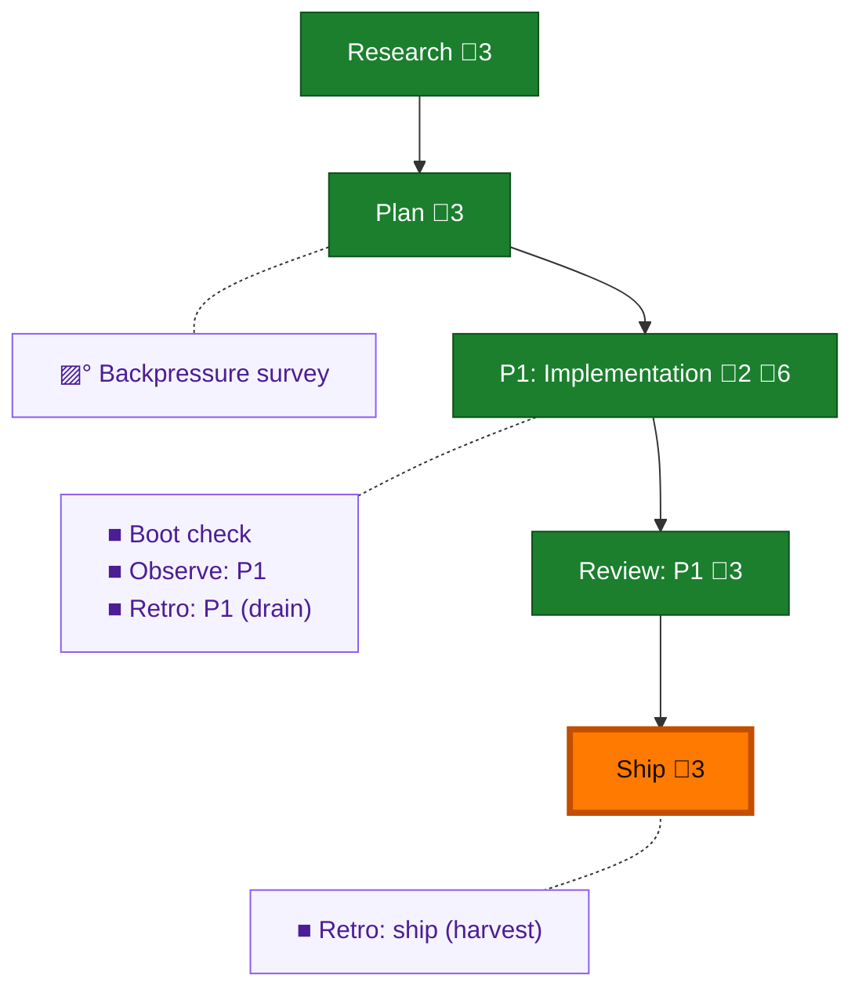

<!-- GENERATED by `harness flow render` — do not hand-edit; regenerate from the flow JSON. -->
# Flow · pij-orchestration-baton

**Kind**: flight-plan · **Now**: ship · **Intent**: i think 07 here is a good opportunity to dogfood. we can set up an orchestrator and have it work through adding baton. i think it should be pij orchestration baton though, so we can add more orchestration primitives later. · **Nodes**: 10 · **Events**: 23

**Rail**: ◆─◆─[ ◆─◆─◆ ]  ◆ Research · ◆ Plan · [ ◆ P1: Implementation · ◆ Review: P1 · ◆ Ship ]

**Legend** — colour = type/status: 🟩 done · 🟢 in-progress · 🟥 blocked · 🟦 known · ⬜ assumed · 🔶 decision · 🗣 user input · 🟪 harness chore (faded = not yet done) · 🤖 companion · 🛠 worker · 🟧 current (you are here). Badges: 💬 comments · 📄 artifacts · 📝 instructions · 🧰 chore (° optional / recommended / ‼ strongly-recommended; ✓ done · ✕ skipped).

## Node log

### phase-1 · P1: Implementation
- `2026-07-11T09:22:17.608Z` · agent · note — Fleet roster (P9 fallback — run.json lacks a roster verb): coder=pij-1vstguw (copilot gpt-5.6-sol xhigh, pane %260, pid-args-verified, spawnedByUs=true, dlg-0001); reviewer=lazy at first REVIEW (planned: claude-opus-4.7-1m-internal xhigh)
- `2026-07-11T09:57:03.872Z` · agent · note — Baton/commit choreography APPROVED by o-prime: fix → re-review → APPROVE → request daemon-restart + git-index TOGETHER; cli.ts window closes at the pathspec commit (E-16). Riders: ① daemon-restart grant carries a quiescence beat (s037 fleet delivery affected); ② attach the reviewer's unified-0 additive proof (reviews/review.phase-1.dlg-0001.md § Mandatory conformance evidence) to the window-close report — pre-satisfies the E-16 check.
