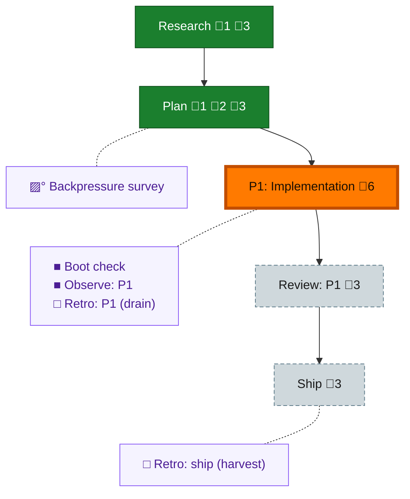

<!-- GENERATED by `harness flow render` — do not hand-edit; regenerate from the flow JSON. -->
# Flow · pij-broadcast

**Kind**: flight-plan · **Now**: phase-1 · **Intent**: i want the ability to send the same message to multiple pij agents at the same time like a broadcast. · **Nodes**: 10 · **Events**: 13

**Rail**: ◆─◆─[ ◐─◇─◇ ]  ◆ Research · ◆ Plan · [ ◐ P1: Implementation · ◇ Review: P1 · ◇ Ship ]

**Legend** — colour = type/status: 🟩 done · 🟢 in-progress · 🟥 blocked · 🟦 known · ⬜ assumed · 🔶 decision · 🗣 user input · 🟪 harness chore (faded = not yet done) · 🤖 companion · 🛠 worker · 🟧 current (you are here). Badges: 💬 comments · 📄 artifacts · 📝 instructions · 🧰 chore (° optional / recommended / ‼ strongly-recommended; ✓ done · ✕ skipped).

## Node log

### research · Research
- 📄 artifacts: docs/plans/037-pij-broadcast/research-dossier.md

### plan · Plan
- 📄 artifacts: docs/plans/037-pij-broadcast/pij-broadcast-plan.md, docs/plans/037-pij-broadcast/validations/pij-broadcast-validation.md
- `2026-07-11T09:36:51.021Z` · user · decision — Jordan selected the messaging surface: keep single-target \`pij send &lt;id&gt; &lt;message&gt;\` unchanged; add broadcast as repeatable \`--to\` flags, with honest per-recipient results. Do not use \`pij orchestration broadcast\`.
