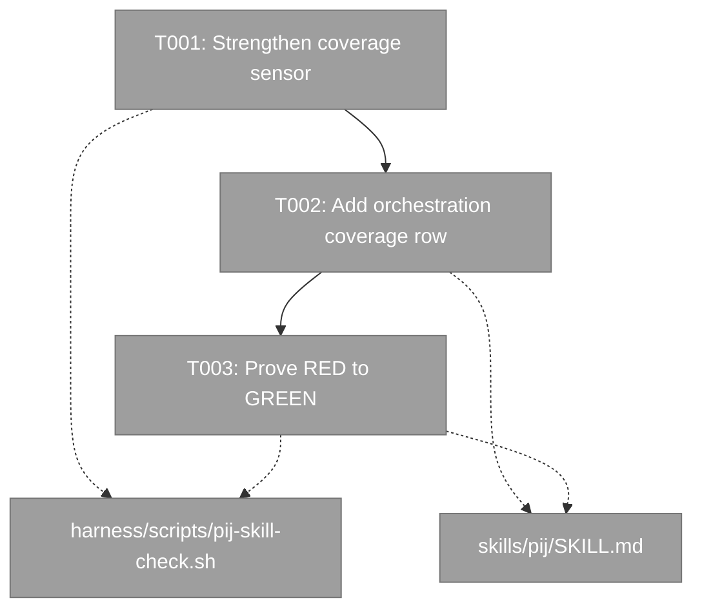
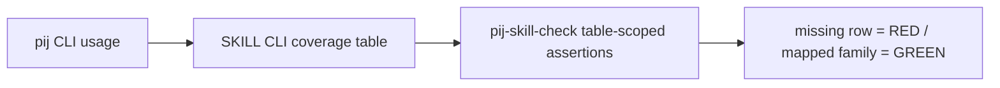
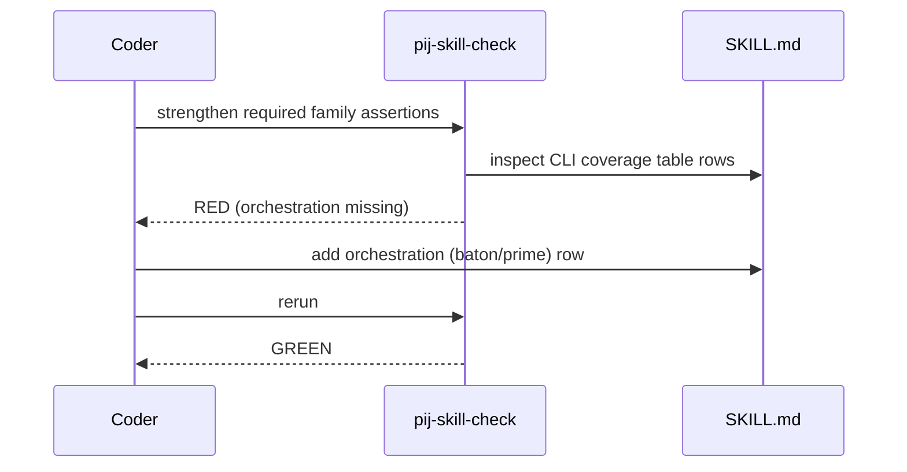

# Phase 1 tasks — Repair orchestration CLI coverage sensor

## Executive Briefing

**Purpose**: Fix the structural skill gate before product code so it proves every shipped `pij` CLI family is mapped in `skills/pij/SKILL.md`. The current whole-file grep and static verb list allow the orchestration family to be absent while the gate reports green.

**What We're Building**: A table-scoped CLI coverage check that requires `orchestration`, `baton`, and `prime`, plus the matching public coverage row and a precise distinction between `/pij prime` and `pij orchestration prime`.

**Goals**

- Make the current SKILL file fail before its missing row is added.
- Prevent unrelated route/prose mentions from satisfying CLI coverage.
- Restore the complete skill gate to green without changing route registry semantics.
- Persist exact RED-to-GREEN evidence.

**Non-Goals**

- No product CLI, descriptor, daemon, route payload, or domain-doc changes.
- No changes outside the two Phase 1 fence files and this plan folder.
- No new test framework.

## Prior Phase Context

Phase 1 has no implementation predecessor. Research and plan validation established:

- `skills/pij/SKILL.md:34-45` claims every CLI verb has a home but omits `orchestration`.
- `harness/scripts/pij-skill-check.sh:86-90` searches the whole SKILL file and omits the orchestration family from its static list.
- The o-prime ruled the sensor repair in scope and required it before product code.

## Pre-Implementation Check

| File | Exists? | Domain Check | Notes |
|------|---------|--------------|-------|
| `/Users/jordanknight/pi-hacking/pij/harness/scripts/pij-skill-check.sh` | yes | `extension-authoring-harness` internal | Modify only CLI-coverage extraction/list; preserve every other gate. |
| `/Users/jordanknight/pi-hacking/pij/skills/pij/SKILL.md` | yes | `pij-skill` public contract | Live skill surface; route registry must remain exactly one active `prime` row. |

## Architecture Map



## Tasks

| Status | ID | Task | Domain | Path(s) | Done When | Notes |
|--------|-----|------|--------|---------|-----------|-------|
| [x] | T001 | Strengthen the CLI-coverage sensor: extract only table rows under `## CLI-verb coverage`, then require `orchestration`, `baton`, and `prime` in addition to the existing families. Run the gate before editing SKILL.md. | `extension-authoring-harness` | `/Users/jordanknight/pi-hacking/pij/harness/scripts/pij-skill-check.sh` | The current SKILL produces a non-zero gate result naming missing orchestration coverage; registry, sibling-blindness, budgets, pointer, evidence, and portability checks still execute. | Complete in dlg-0001; RED evidence in `execution.log.md`. |
| [x] | T002 | Add an `orchestration` coverage row naming `baton` and `prime`; revise the following note to distinguish the `/pij prime` skill route from the `pij orchestration prime` CLI primitive without claiming no CLI relationship. | `pij-skill` | `/Users/jordanknight/pi-hacking/pij/skills/pij/SKILL.md` | The row is in the CLI coverage table, the route registry is unchanged, SKILL remains within 150 lines, and wording is unambiguous. | Complete in dlg-0001; live payload files remained untouched. |
| [x] | T003 | Run and record the restored gate, focused diff checks, and line budget; capture the exact negative and positive commands/results in `execution.log.md`. | `extension-authoring-harness` / `pij-skill` | `/Users/jordanknight/pi-hacking/pij/harness/scripts/pij-skill-check.sh`, `/Users/jordanknight/pi-hacking/pij/skills/pij/SKILL.md`, `/Users/jordanknight/pi-hacking/pij/docs/plans/038-pij-prime-designation/tasks/phase-1-repair-orchestration-cli-coverage-sensor/execution.log.md` | `just pij-skill-check` exits 0; `git diff --check` is clean; the execution log contains RED before T002 and GREEN after T002; no file outside the phase fence changed. | Complete; reviewer mutation proof RED -> byte-identical restore -> GREEN. |

## Context Brief

Environment friction is work, not an apology: fix small/reversible things, otherwise capture it with `harness observe`; record any proof gap in the execution log so the next agent does not rediscover it.

### Key findings from plan

- **Finding 04**: whole-file grep plus a static list omitted the family and let unrelated `prime` prose satisfy coverage.
- **Ruling**: the check is repaired before product code.
- **Live-surface constraint**: this phase may edit `skills/pij/SKILL.md`, but not the route payload files reserved for ship-time Phase 2.

### Domain dependencies

- `extension-authoring-harness`: `just pij-skill-check` is the structural backpressure surface.
- `pij-skill`: CLI coverage is a public mapping contract; route registry/module parity remains separate.

### Domain constraints

- Shell remains POSIX-compatible with the existing script style.
- No new dependencies or test framework.
- Preserve route registry parity, sibling-blindness, budgets, pointer integrity, frozen evidence, and portability checks.
- Keep `/pij` skill route syntax distinct from the `pij` binary syntax.

### Reusable patterns

- Existing `registry_rows` extraction demonstrates section-scoped table parsing.
- `PIJ_SKILL_ROOT` allows isolated gate probes without changing the installed skill.
- `just pij-skill-check` is the canonical composite for this surface.





## Discoveries & Learnings

| Date | Task | Type | Discovery | Resolution | References |
|------|------|------|-----------|------------|------------|

## Directory Layout

```text
docs/plans/038-pij-prime-designation/
├── pij-prime-designation-plan.md
└── tasks/
    └── phase-1-repair-orchestration-cli-coverage-sensor/
        ├── tasks.md
        └── execution.log.md
```
