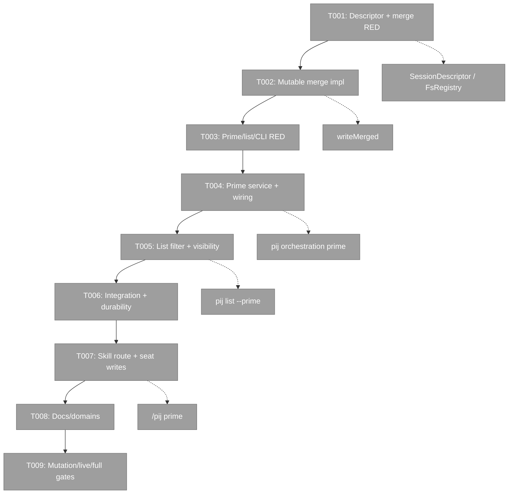
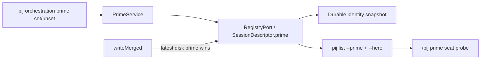
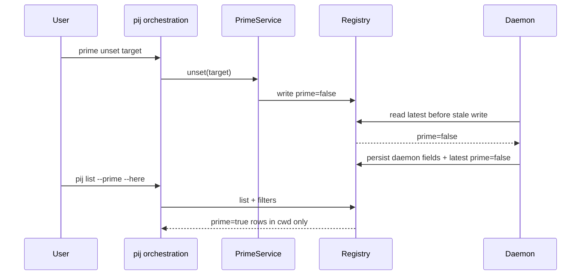

# Phase 2 tasks — Ship prime designation end-to-end

## Executive Briefing

**Purpose**: Deliver the first-class prime designation contract across the registry, orchestration CLI, list surface, daemon concurrency seam, durable identity behavior, `/pij prime` route, and operator/domain documentation.

**What We're Building**:

- `SessionDescriptor.prime?: boolean`.
- `pij orchestration prime set|unset [<id>] [--json]`.
- `pij list --prime [--here] [--json]` plus ordinary-list visibility.
- Latest-on-disk authority for mutable prime state during daemon writes.
- Registry-first o-prime route detection and write-side bootstrap/handover instructions.

**Goals**

- Satisfy AC-01 through AC-09 and AC-11/12 from the unified plan.
- Preserve legacy descriptors, unrelated descriptor fields, existing CLI output fields, and government fallbacks.
- Prove mutable merge behavior with RED-first tests and mutations.
- Keep live skill payload edits until product code/tests are green.

**Non-Goals**

- No `--folder` flag, automatic election, uniqueness policy, ACLs, audit metadata, prime role enum, or sidecar store.
- No package/lockfile changes.
- No government-file writes by product code.
- No push; commit and restart remain baton-controlled.

## Prior Phase Context

### Deliverables

- `harness/scripts/pij-skill-check.sh` now reads only CLI coverage table rows and requires `orchestration`, `baton`, and `prime`.
- `skills/pij/SKILL.md` now maps `orchestration (baton/prime)` and distinguishes `/pij prime` from `pij orchestration prime`.
- Phase 1 execution and review artifacts are complete and mutation-backed.

### Dependencies Exported

- `just pij-skill-check` is the deterministic gate for all Phase 2 live skill edits.
- The coverage table must retain the new orchestration row through ship.

### Gotchas & Debt

- Flow-pair peer/model roster features described by the route are not in the live CLI; the orchestrator tracks peers in plan artifacts.
- `flow-pair observe` cannot pathscope around unrelated dirty forbidden files; reviewer packets use exact git pathspecs.
- Custom mutation test commands require `harness/scripts/flow-pair-mutate.sh`, not the two-argument `just flow-pair-mutate` wrapper.
- The machine baton store currently lacks the ruled `git-index`/`daemon-restart` definitions; commit/restart must wait for o-prime resolution.

### Incomplete Items

- Phase 1 commit awaits the git-index baton/window.
- No Phase 2 product file has been touched.

### Patterns to Follow

- Tests before implementation at each seam.
- Optional additive descriptor fields.
- Pure core services over injected ports.
- Strict tagged-union errors; no silent fallback.
- Pathscoped diff/review in the shared dirty tree.

## Pre-Implementation Check

| File / Surface | Exists? | Domain Check | Notes |
|----------------|---------|--------------|-------|
| `/Users/jordanknight/pi-hacking/pij/.pi/extensions/pij/core/types.ts` | yes | `pij-messaging` contract | Additive optional field only; SW-4 contention seam. |
| `/Users/jordanknight/pi-hacking/pij/.pi/extensions/pij/core/daemon/loop.ts` + test | yes | `pij-control-plane` internal | Mutable latest-authority must remain distinct from append-only `reportedAt`. |
| `/Users/jordanknight/pi-hacking/pij/.pi/extensions/pij/core/orchestration/prime.ts` + test | no | `pij-orchestration` internal | New pure service; no new store. |
| `/Users/jordanknight/pi-hacking/pij/.pi/extensions/pij/core/orchestration/cli.ts` + test | yes | `pij-orchestration` contract/internal | Baton-only parser today; extend family without breaking baton. |
| `/Users/jordanknight/pi-hacking/pij/.pi/extensions/pij/core/discovery.ts` + test | yes | `pij-messaging` internal | Add filter beside exact-cwd filter. |
| `/Users/jordanknight/pi-hacking/pij/.pi/extensions/pij/core/cli.ts` + test | yes | `pij-messaging` contract/internal | Additive list boolean/projection. |
| `/Users/jordanknight/pi-hacking/pij/.pi/extensions/pij/cli.ts` + integration test | yes | `pij-control-plane` cross-domain/internal | Exact self resolution for omitted target; baton actor fallback remains baton-only. |
| `/Users/jordanknight/pi-hacking/pij/.pi/extensions/pij/core/session.test.ts`, `core/binding.test.ts` | yes | messaging/control-plane tests | Generic spread/snapshot contracts should preserve true and false. |
| `/Users/jordanknight/pi-hacking/pij/skills/pij/references/routes/prime.md` | yes | `pij-skill` contract | SHIP-TIME only; registry-first read with durable fallbacks. |
| `/Users/jordanknight/pi-hacking/pij/skills/pij/references/prime/rituals/bootstrap.md` | yes | `pij-skill` contract | SHIP-TIME only; currently 91/90 advisory lines before edits. |
| `/Users/jordanknight/pi-hacking/pij/skills/pij/references/prime/templates/seat-handover.md` | yes | `pij-skill` contract | SHIP-TIME only; transfer write-side. |
| `/Users/jordanknight/pi-hacking/pij/docs/how/pij-prime.md` | yes | `pij-skill` cross-domain | Existing since Plan 035; additive registry-designation section only (spine Seq 31 correction). |
| Operator/domain docs in Domain Manifest | yes | existing domains | Section/row additions only. |

## Architecture Map



## Tasks

| Status | ID | Task | Domain | Path(s) | Done When | Notes |
|--------|-----|------|--------|---------|-----------|-------|
| [x] | T001 | Add the additive `prime?: boolean` descriptor contract, then write RED tests where latest disk `false` beats stale computed `true` and latest disk `true` beats stale false/absence. Extend restart/reattach fixtures so tests compile and preserve both values. | `pij-messaging` / `pij-control-plane` | `/Users/jordanknight/pi-hacking/pij/.pi/extensions/pij/core/types.ts`, `/Users/jordanknight/pi-hacking/pij/.pi/extensions/pij/core/daemon/loop.test.ts`, `/Users/jordanknight/pi-hacking/pij/.pi/extensions/pij/core/session.test.ts`, `/Users/jordanknight/pi-hacking/pij/.pi/extensions/pij/core/binding.test.ts` | New merge tests compile and fail on stale-value assertions; durability tests fail only where implementation behavior is absent; existing tests remain diagnostic. | Complete; exact three-test RED declared and observed. |
| [x] | T002 | Implement explicit mutable externally-owned prime merging while preserving current append-only `reportedAt`, daemon-owned clears, and dissolved persisted truth. | `pij-control-plane` | `/Users/jordanknight/pi-hacking/pij/.pi/extensions/pij/core/daemon/loop.ts` | T001 merge/durability tests green; existing `reportedAt`, `failureReason`, and dissolved tests remain green; no generic unsafe cast. | Complete; reviewer mutation A RED -> byte-identical restore -> GREEN. |
| [x] | T003 | Write RED tests for `PrimeService`, prime grammar/dispatch/error mapping, exact self targeting, list `--prime`, human/JSON visibility, strict invalid forms, and real scratch-registry CLI behavior. | `pij-orchestration` / `pij-messaging` / `pij-control-plane` | `/Users/jordanknight/pi-hacking/pij/.pi/extensions/pij/core/orchestration/prime.test.ts`, `/Users/jordanknight/pi-hacking/pij/.pi/extensions/pij/core/orchestration/cli.test.ts`, `/Users/jordanknight/pi-hacking/pij/.pi/extensions/pij/core/discovery.test.ts`, `/Users/jordanknight/pi-hacking/pij/.pi/extensions/pij/core/cli.test.ts`, `/Users/jordanknight/pi-hacking/pij/.pi/extensions/pij/cli.integration.test.ts` | RED suite covers set/unset optional id, idempotence, E-NOID, E-AMBIG/no-write, explicit operator target, `--prime --here`, legacy undefined/false, ordinary marker, JSON boolean, and baton regression. | Complete; strict valued-boolean gap added through dlg-0003. |
| [x] | T004 | Implement the pure `PrimeService`, orchestration `prime set|unset [id]` parser/dispatch/output/error map, and production wiring with exact self resolution for omitted ids. | `pij-orchestration` / `pij-control-plane` | `/Users/jordanknight/pi-hacking/pij/.pi/extensions/pij/core/orchestration/prime.ts`, `/Users/jordanknight/pi-hacking/pij/.pi/extensions/pij/core/orchestration/cli.ts`, `/Users/jordanknight/pi-hacking/pij/.pi/extensions/pij/cli.ts` | Service/grammar/integration tests green; same-value writes are idempotent; explicit id bypasses self resolution; omitted id surfaces E-AMBIG rather than `"operator"`; baton behavior unchanged. | Complete; final review APPROVE. |
| [x] | T005 | Implement prime filtering and visibility in discovery/list surfaces. | `pij-messaging` | `/Users/jordanknight/pi-hacking/pij/.pi/extensions/pij/core/discovery.ts`, `/Users/jordanknight/pi-hacking/pij/.pi/extensions/pij/core/cli.ts` | `pij list --prime` returns only true; `--here` composes; normal human rows identify prime; JSON adds `prime:boolean`; existing output fields and self marker remain. | Complete; reviewer mutation B RED -> byte-identical restore -> GREEN. |
| [x] | T006 | Complete real CLI, migration, and durable identity verification over scratch `PIJ_HOME`; tighten any implementation exposed by real adapters. | `pij-control-plane` / `pij-messaging` | `/Users/jordanknight/pi-hacking/pij/.pi/extensions/pij/cli.integration.test.ts`, `/Users/jordanknight/pi-hacking/pij/.pi/extensions/pij/core/session.test.ts`, `/Users/jordanknight/pi-hacking/pij/.pi/extensions/pij/core/binding.test.ts` | Scratch CLI proves self/other set, list all/here, unset, unknown/ambiguous no-write; legacy descriptor and reattachment preserve values; global registry untouched. | Complete; strict real-CLI negative path verified. |
| [x] | T007 | After product tests are green, update the SHIP-TIME skill payload: registry-first route triage, bootstrap self-designation, and handover incoming-set/outgoing-live-unset. | `pij-skill` | `/Users/jordanknight/pi-hacking/pij/skills/pij/references/routes/prime.md`, `/Users/jordanknight/pi-hacking/pij/skills/pij/references/prime/rituals/bootstrap.md`, `/Users/jordanknight/pi-hacking/pij/skills/pij/references/prime/templates/seat-handover.md` | Route mechanically checks current id in `pij list --prime --here --json`; roster/human/brief fallbacks remain; bootstrap/handover commands are ordered persist-before-mutate; line budgets/pointers/portability green; o-prime look obtained before touching commit. | Implementation complete; o-prime pre-commit look pending. |
| [x] | T008 | Update operator and domain documentation, including the stale no-daemon opening. | docs domains | `/Users/jordanknight/pi-hacking/pij/docs/how/pij.md`, `/Users/jordanknight/pi-hacking/pij/docs/how/pij-prime.md`, `/Users/jordanknight/pi-hacking/pij/docs/domains/pij-messaging/domain.md`, `/Users/jordanknight/pi-hacking/pij/docs/domains/pij-orchestration/domain.md`, `/Users/jordanknight/pi-hacking/pij/docs/domains/pij-control-plane/domain.md`, `/Users/jordanknight/pi-hacking/pij/docs/domains/pij-skill/domain.md`, `/Users/jordanknight/pi-hacking/pij/docs/domains/registry.md`, `/Users/jordanknight/pi-hacking/pij/docs/domains/domain-map.md` | Syntax, honor-system posture, migration/durability, merge ownership, route consumption, and domain relationships are current; no new domain; section/row additions only. | Complete; existing `pij-prime.md` corrected as additive. |
| [x] | T009 | Perform reviewer mutation proofs, targeted/full gates, and live verification. Request daemon-restart baton only for production daemon proof; restore/clean scratch state. | all | `/Users/jordanknight/pi-hacking/pij/docs/plans/038-pij-prime-designation/tasks/phase-2-ship-prime-designation-end-to-end/execution.log.md` | Prime merge mutations go RED -> byte-identical restore -> GREEN; focused tests, full pij suite, `just pij-skill-check`, `harness checks`, and live scratch/production verification green; no unowned registry/daemon residue. | Complete; production descriptor restored to absent marker, daemon baton returned, post-migration `harness checks` all green. |

## Context Brief

Environment friction is work, not an apology: fix small/reversible issues, otherwise capture them with `harness observe`; record every hard wall or proof gap so the next agent inherits a command/check instead of another inference.

### Key findings from plan

- **Finding 01**: latest disk prime value must beat stale daemon snapshots, including `false`.
- **Finding 02**: mutable and append-only externally-owned fields need separate semantics.
- **Finding 03**: omitted target must use exact self resolution, never baton actor fallback.
- **Finding 05**: orchestration grammar is baton-only and must become a true primitive family.
- **Finding 06**: durability already exists through full-descriptor snapshot/spread contracts.

### Domain dependencies

- `pij-messaging`: `SessionDescriptor`, `RegistryPort`, `resolveSelf`, `filterByFolder`, list grammar/result contracts.
- `pij-orchestration`: primitive-family parser/dispatch and honor-system posture.
- `pij-control-plane`: production `FsRegistry`, top-level bin intercept, daemon write coordinator.
- `pij-skill`: registry-first route triage with durable government fallbacks.
- `extension-authoring-harness`: Phase 1 skill coverage gate, targeted vitest, mutation helper, smoke, and `harness checks`.

### Domain constraints

- `core/` remains pi-free; relative imports use `.js`.
- Tagged-union results; no broad catches or silent defaults.
- No `any`, inline imports, dynamic type imports, or new dependencies.
- Descriptor field is optional/additive; unrelated fields preserved.
- Persist before mutate in skill bootstrap/handover instructions.
- Ship-time skill files stay untouched until product tests are green.
- Daemon source changes are not live until restart; request the baton, never restart unilaterally.

### Reusable from Phase 1

- Table-scoped `just pij-skill-check` now guards orchestration/prime mapping.
- Canaried coder/reviewer fleet can be reused after user-directed model decision; no automatic compaction.
- Pathscoped review packet pattern avoids unrelated shared-tree changes.





## Discoveries & Learnings

| Date | Task | Type | Discovery | Resolution | References |
|------|------|------|-----------|------------|------------|

## Directory Layout

```text
docs/plans/038-pij-prime-designation/
├── pij-prime-designation-plan.md
└── tasks/
    ├── phase-1-repair-orchestration-cli-coverage-sensor/
    │   ├── tasks.md
    │   └── execution.log.md
    └── phase-2-ship-prime-designation-end-to-end/
        ├── tasks.md
        └── execution.log.md
```
