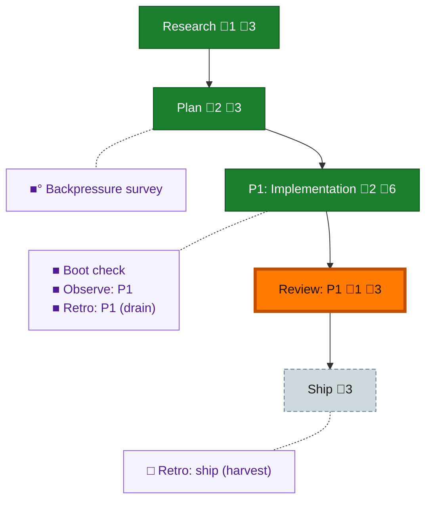

<!-- GENERATED by `harness flow render` — do not hand-edit; regenerate from the flow JSON. -->
# Flow · dependency-chores-audit

**Kind**: flight-plan · **Now**: review-1 · **Next**: ship · **Intent**: need another one that goes through and looks at all the chores that dependabot has set up to make sure we have updated dependencies. · **Nodes**: 10 · **Events**: 25

**Rail**: ◆─◆─[ ◆─◆─◇ ]  ◆ Research · ◆ Plan · [ ◆ P1: Implementation · ◆ Review: P1 · ◇ Ship ]

**Legend** — colour = type/status: 🟩 done · 🟢 in-progress · 🟥 blocked · 🟦 known · ⬜ assumed · 🔶 decision · 🗣 user input · 🟪 harness chore (faded = not yet done) · 🤖 companion · 🛠 worker · 🟧 current (you are here). Badges: 💬 comments · 📄 artifacts · 📝 instructions · 🧰 chore (° optional / recommended / ‼ strongly-recommended; ✓ done · ✕ skipped).

## Node log

### research · Research
- 📄 artifacts: docs/plans/039-dependency-chores-audit/research-dossier.md

### plan · Plan
- 📄 artifacts: docs/plans/039-dependency-chores-audit/dependency-chores-audit-plan.md, docs/plans/039-dependency-chores-audit/validations/dependency-chores-audit-plan-validation.md

### phase-1 · P1: Implementation
- 📄 artifacts: docs/plans/039-dependency-chores-audit/reports/phase-1-checkpoint.md, .harness/records/retro/2026-07-11/006-039-dependency-chores-audit.md

### review-1 · Review: P1
- 📄 artifacts: docs/plans/039-dependency-chores-audit/reviews/review.phase-1.md

### backpressure · Backpressure survey
- 📄 artifacts: docs/plans/039-dependency-chores-audit/backpressure-coverage.md
