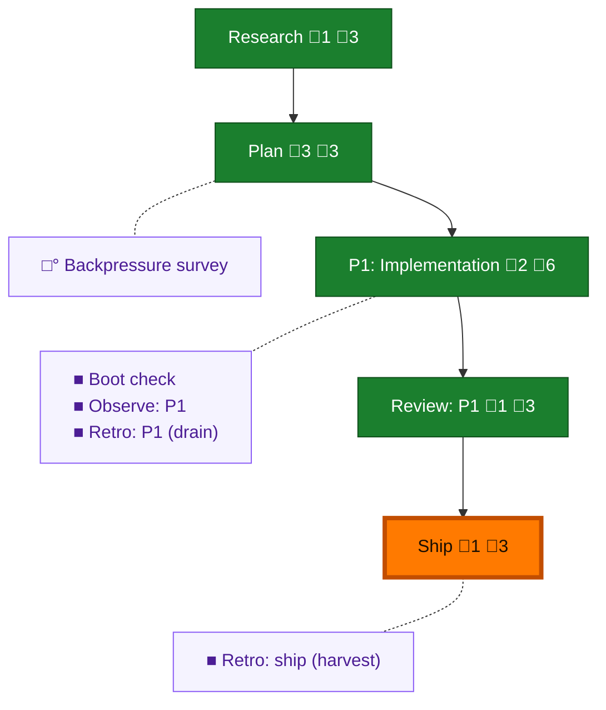

<!-- GENERATED by `harness flow render` — do not hand-edit; regenerate from the flow JSON. -->
# Flow · memorable-pij-session-ids

**Kind**: flight-plan · **Now**: ship · **Intent**: you know how some apps like docker and others get cool random but not random names like cool-barista or alpha-pinetree etc... how they do that? could we do that for pij names instead of the random ones? pij-grifting-lamp · **Nodes**: 10 · **Events**: 23

**Rail**: ◆─◆─[ ◆─◆─◆ ]  ◆ Research · ◆ Plan · [ ◆ P1: Implementation · ◆ Review: P1 · ◆ Ship ]

**Legend** — colour = type/status: 🟩 done · 🟢 in-progress · 🟥 blocked · 🟦 known · ⬜ assumed · 🔶 decision · 🗣 user input · 🟪 harness chore (faded = not yet done) · 🤖 companion · 🛠 worker · 🟧 current (you are here). Badges: 💬 comments · 📄 artifacts · 📝 instructions · 🧰 chore (° optional / recommended / ‼ strongly-recommended; ✓ done · ✕ skipped).

## Node log

### research · Research
- 📄 artifacts: docs/plans/040-memorable-pij-session-ids/research-dossier.md

### plan · Plan
- 📄 artifacts: docs/plans/040-memorable-pij-session-ids/memorable-pij-session-ids-plan.md, docs/plans/040-memorable-pij-session-ids/validations/memorable-pij-session-ids-plan-validation.md, docs/plans/040-memorable-pij-session-ids/rulings.md

### phase-1 · P1: Implementation
- 📄 artifacts: docs/plans/040-memorable-pij-session-ids/execution.log.md, docs/plans/040-memorable-pij-session-ids/reports/t009-live-proof.md

### review-1 · Review: P1
- 📄 artifacts: docs/plans/040-memorable-pij-session-ids/reviews/review.phase-1.md

### ship · Ship
- 📄 artifacts: docs/plans/040-memorable-pij-session-ids/reports/ship-report.md
