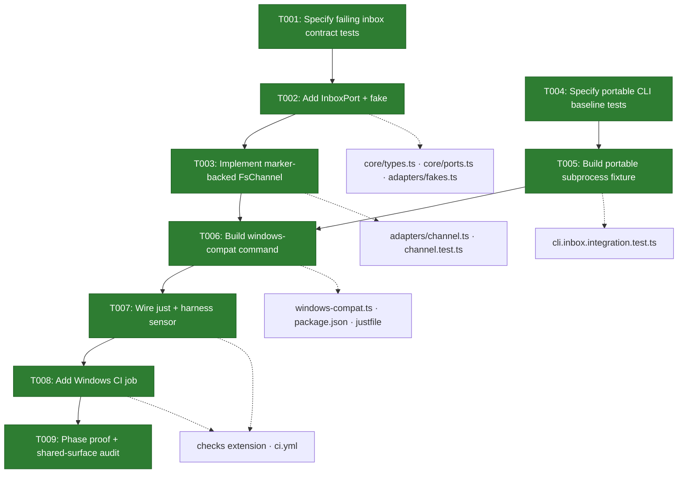
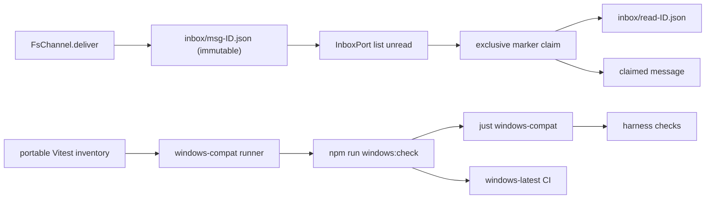
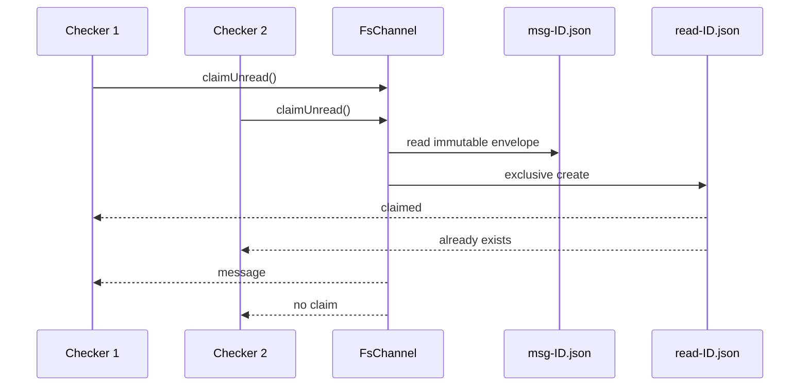

# Phase 1 Tasks — Portable Backpressure and Durable Inbox

**Plan**: [pij-inbox-no-tmux-plan.md](../../pij-inbox-no-tmux-plan.md)
**Phase**: Phase 1: Portable Backpressure and Durable Inbox
**Status**: Implemented — ready for review; hosted Windows evidence awaits branch publication
**Rulings**: [rulings.md](../../rulings.md)
**Fences**: [requested-fences.md](../../requested-fences.md)

## Executive Briefing

### Purpose

Establish the portable proof substrate and durable inbox-read primitives before
any user-facing pull command exists. This phase makes the later inbox work safe
to build: immutable message envelopes, exclusive marker claims, a platform-neutral
subprocess fixture, a named `windows-compat` harness sensor, and real Windows CI.

### What We're Building

- A pi-free `InboxPort` contract and fake implementation.
- Marker-backed unread/claim/mark operations in `FsChannel`, preserving current
  atomic delivery and watcher behavior.
- A portable CLI integration fixture that requires neither tmux nor POSIX shell
  scripts.
- One cross-platform `windows:check` command wrapped by `just windows-compat`,
  `harness checks`, `just self-check`, and a `windows-latest` CI job.

### Goals

- ✅ Prove messages remain immutable and read state is one atomic sidecar marker.
- ✅ Prove concurrent readers cannot both claim one message.
- ✅ Prove legacy message files require no migration.
- ✅ Encode Windows compatibility as a deterministic harness signal.
- ✅ Preserve current dependencies, lockfile, Linux CI, and tmux smoke.

### Non-Goals

- ❌ No `pij inbox` parser or user-facing output yet.
- ❌ No ambient native-session registration.
- ❌ No daemon, router, pi receiver, or tmux consumption changes.
- ❌ No package dependency/version changes or `package-lock.json` write.
- ❌ No skill/docs/domain-contract update; those land in Phase 3.

## Prior Phase Context

Phase 1 has no prior implementation phase.

Authoritative planning inputs:

- [Research dossier](../../research-dossier.md)
- [Approved CLI workshop](../../workshops/001-cli-layout.md)
- [Backpressure coverage](../../backpressure-coverage.md)
- [Validation verdict](../../validations/pij-inbox-no-tmux-plan-validation.md)

## Pre-Implementation Check

| File | Exists? | Domain Check | Notes |
|------|---------|--------------|-------|
| `/Users/jordanknight/pi-hacking/pij/.pi/extensions/pij/core/types.ts` | yes | `pij-messaging` contract | Add read vocabulary only; all persisted fields additive. |
| `/Users/jordanknight/pi-hacking/pij/.pi/extensions/pij/core/ports.ts` | yes | `pij-messaging` contract | Add `InboxPort`; core stays pi-free. |
| `/Users/jordanknight/pi-hacking/pij/.pi/extensions/pij/adapters/fakes.ts` | yes | `pij-messaging` internal | Add a real in-memory fake, not mocks. |
| `/Users/jordanknight/pi-hacking/pij/.pi/extensions/pij/adapters/fakes.test.ts` | yes | `pij-messaging` internal | Canonical tests for the new fake port; Phase 1 fence addendum requested. |
| `/Users/jordanknight/pi-hacking/pij/.pi/extensions/pij/adapters/channel.ts` | yes | `pij-messaging` internal | Preserve atomic `deliver()` and watch poll/debounce behavior. |
| `/Users/jordanknight/pi-hacking/pij/.pi/extensions/pij/adapters/channel.test.ts` | yes | `pij-messaging` internal | Extend real-filesystem fixtures; tests precede implementation. |
| `/Users/jordanknight/pi-hacking/pij/.pi/extensions/pij/cli.inbox.integration.test.ts` | no — create | cross-domain test boundary | Phase 1 supplies portable whoami/send baseline; Phase 2 extends inbox flow. |
| `/Users/jordanknight/pi-hacking/pij/harness/scripts/windows-compat.ts` | no — create | `extension-authoring-harness` internal | Cross-platform process orchestration; no shell-specific chains inside code. |
| `/Users/jordanknight/pi-hacking/pij/.harness/extensions/checks/extension.ts` | yes | harness contract | Shared sensor inventory; add one stage, preserve all existing sensors. |
| `/Users/jordanknight/pi-hacking/pij/.harness/extensions/checks/instructions.md` | yes | harness contract | Keep sensor list and quick/full semantics accurate. |
| `/Users/jordanknight/pi-hacking/pij/package.json` | yes | shared harness surface | Scripts-only edit; preserve s040 dependency pins. |
| `/Users/jordanknight/pi-hacking/pij/justfile` | yes | shared harness surface | Thin recipe + self-check composition; canonical interface remains `just`. |
| `/Users/jordanknight/pi-hacking/pij/.github/workflows/ci.yml` | yes | shared rollout surface | Add isolated Windows job; preserve s039 Linux job byte-semantics. |
| `/Users/jordanknight/pi-hacking/pij/package-lock.json` | yes | excluded | Must remain byte-identical because no dependency change is planned. |

No duplicate inbox-read concept exists in the current `pij-messaging` Concepts
table or source. The closest precedent is the CLI-owned watch sidecar and
`FsRegistry`'s exclusive no-replace claim pattern; reuse the atomicity principle,
not those domain-specific APIs.

## Architecture Map



## Tasks

| Status | ID | Task | Domain | Path(s) | Done When | Notes |
|--------|-----|------|--------|---------|-----------|-------|
| [x] | T001 | Write failing real-filesystem tests for the inbox read contract: lexical unread order; immutable message JSON; one exclusive marker claim; two concurrent claimers collectively return each message once; idempotent mark; legacy messages without markers; marker existence authoritative despite malformed optional metadata; receipts classifiable without user rendering. | pij-messaging | `/Users/jordanknight/pi-hacking/pij/.pi/extensions/pij/adapters/channel.test.ts` | The new tests fail against the current `FsChannel`, use `tmpdir()` + `node:path`, require no sleeps except existing watcher tests, and precisely encode R-001/AC-02/AC-03. | Tests first; findings 01/02; R-001. |
| [x] | T002 | Add the pi-free inbox vocabulary and port plus an in-memory fake: delivered/read record shapes, claim result tagged union, list/claim/mark operations, and fake concurrency semantics matching exclusive first-writer ownership. | pij-messaging | `/Users/jordanknight/pi-hacking/pij/.pi/extensions/pij/core/types.ts`; `/Users/jordanknight/pi-hacking/pij/.pi/extensions/pij/core/ports.ts`; `/Users/jordanknight/pi-hacking/pij/.pi/extensions/pij/adapters/fakes.ts`; `/Users/jordanknight/pi-hacking/pij/.pi/extensions/pij/adapters/fakes.test.ts` | Fake-backed unit tests pass; new core/port/fake code has no `any`, throws, pi imports, or dynamic imports; marker/read types are additive and message wire shape is unchanged. Whole-tree typecheck is explicitly deferred to T003 because T001 intentionally references not-yet-implemented `FsChannel` methods. | P2/P3/P4/P7/P8; do not add premature channel stubs merely to green T002. |
| [x] | T003 | Implement marker-backed read operations in `FsChannel` without changing `deliver()` or `watch()` behavior. Use a same-filesystem, no-replace atomic marker claim; retain `msg-*.json`; sort by message id; treat marker existence as read; surface malformed message errors through the tagged contract without silently claiming them. | pij-messaging | `/Users/jordanknight/pi-hacking/pij/.pi/extensions/pij/adapters/channel.ts`; `/Users/jordanknight/pi-hacking/pij/.pi/extensions/pij/adapters/channel.test.ts` | T001 turns green; existing channel watcher/delivery tests remain green; concurrent claim proof passes on macOS/Linux and is eligible for the Windows lane; message files remain byte-identical after reads. | Persist marker before returning the claimed message; no call-site filesystem writes. |
| [x] | T004 | Write failing subprocess-integration tests for a platform-neutral CLI harness: sandboxed `PIJ_HOME`, descriptors/identity fixtures written with Node APIs, CLI launched via `process.execPath` + tsx entrypoint, and current `whoami`/`send` baseline proved without tmux, shebang scripts, `chmod`, or PATH fake binaries. Every test that launches a real subprocess declares an explicit Vitest timeout at authoring time. | extension-authoring-harness / pij-messaging | `/Users/jordanknight/pi-hacking/pij/.pi/extensions/pij/cli.inbox.integration.test.ts` | Tests fail until the portable fixture is complete; each subprocess test carries an explicit timeout; test code contains no `/bin/sh`, `#!/bin/sh`, executable-bit dependency, hard-coded path separator, or fake tmux. | Government Seq 43 grant condition; new file avoids the legacy fixture. |
| [x] | T005 | Complete the portable subprocess fixture and green its baseline. Keep helpers ready for Phase 2's two-shell inbox scenario; assert raw message delivery and stable JSON parsing using real filesystem state. | extension-authoring-harness / pij-messaging | `/Users/jordanknight/pi-hacking/pij/.pi/extensions/pij/cli.inbox.integration.test.ts` | The baseline passes on the current OS, every subprocess test has an explicit timeout, every run is isolated under a temporary `PIJ_HOME`, and processes/files are cleaned up deterministically. | No user-facing inbox behavior in this phase. |
| [x] | T006 | Build one cross-platform `windows-compat` runner that executes the portable proof inventory: typecheck, lint, focused channel/fake/portable CLI tests, and reports the failing stage with its exit code. Expose it as `npm run windows:check`. Launch npm stages through `process.execPath` plus the npm CLI path (`process.env.npm_execpath` or an explicit resolved npm CLI), never a bare `npm`/`npx`/`.bin` executable assumption. | extension-authoring-harness | `/Users/jordanknight/pi-hacking/pij/harness/scripts/windows-compat.ts`; `/Users/jordanknight/pi-hacking/pij/package.json` | `npm run windows:check` exits 0 locally; the runner contains no shell command strings or bare shim execution, fails clearly when the npm CLI cannot be resolved, preserves child exit codes, and leaves package dependencies/`package-lock.json` unchanged. | R-003 supersession; prevents Windows `.cmd`/ENOENT drift before T008. |
| [x] | T007 | Add `just windows-compat`, compose it into `just self-check`, and add a named non-heavy `windows-compat` sensor to `harness checks`; update the checks briefing and summary text without changing existing sensor order/semantics. | extension-authoring-harness | `/Users/jordanknight/pi-hacking/pij/justfile`; `/Users/jordanknight/pi-hacking/pij/.harness/extensions/checks/extension.ts`; `/Users/jordanknight/pi-hacking/pij/.harness/extensions/checks/instructions.md` | `just windows-compat` passes; `harness checks --quick` reports `windows-compat: pass`; `just self-check` invokes the same underlying command; existing sensors remain present. | Jordan: `i think windows checks in to harness pleease /eng-harness-flow`. |
| [x] | T008 | Add an isolated `windows-latest` CI job for Node 24 that installs with `npm ci` and runs `npm run windows:check`. Preserve the existing Ubuntu Node matrix and audit behavior. | extension-authoring-harness | `/Users/jordanknight/pi-hacking/pij/.github/workflows/ci.yml` | Workflow syntax is valid; diff adds only the Windows job; existing Linux job remains functionally unchanged; the Windows run is green. | Exact superseding selection at `2026-07-12T00:38:11.468Z`; shared s039 history. |
| [x] | T009 | Run the Phase 1 proof and audit the shared surfaces: targeted channel/fake/portable tests, `just windows-compat`, `harness checks --quick`, `just typecheck`, `just lint`; verify dependency sections and `package-lock.json` are unchanged; record results and any friction in the execution log. | cross-domain | All Phase 1 paths; `/Users/jordanknight/pi-hacking/pij/docs/plans/041-pij-inbox-no-tmux/tasks/phase-1-portable-backpressure-and-durable-inbox/execution.log.md` | Every command is green, Windows CI evidence is linked, no excluded/shared content drift exists, and the phase is ready for review. | Do not run full tmux smoke merely to prove Phase 1; full `harness checks` remains the ship gate. |

## Context Brief

Environment friction is work, not an apology: fix small/reversible issues;
otherwise capture them with `harness observe`, and record the workaround and
candidate encoding in the execution log.

### Key Findings from the Plan

- **Finding 01**: daemon delete-on-consume destroys the immutable history that
  later pull reads require; this phase supplies the retained-message/read-marker
  substrate.
- **Finding 02**: pi's current in-memory `seen` set is not durable; the new port
  must be reusable by CLI, pi, and daemon consumers in later phases.
- **Finding 06**: current CI and CLI integration fixtures do not prove Windows;
  Phase 1 builds the deterministic sensor and real runner.
- **Finding 07**: first-use inbox must eventually run before E-NOREG; the portable
  fixture created here must allow Phase 2 to prove that path without tmux.

### Domain Dependencies

- `pij-messaging`: `PijMessage` and `Result<T>` (`core/types.ts`) define the
  immutable wire envelope and tagged error contract.
- `pij-messaging`: `DeliveryPort` (`core/ports.ts`) and `FsChannel.deliver()`
  establish atomic inbox writes that read operations must not regress.
- `pij-messaging`: `FakeDelivery` and other concrete fakes
  (`adapters/fakes.ts`) are the testing pattern; do not introduce mock libraries.
- `extension-authoring-harness`: `just self-check` and `.harness` checks are the
  single composite proof surfaces; new proof is wrapped, not duplicated.

### Domain Constraints

- Nothing under `core/` imports pi or Node filesystem APIs.
- Side effects remain behind ports/adapters; `FsChannel` owns inbox filesystem
  operations.
- Use tagged unions, no broad catches or silent success-shaped fallbacks.
- Relative imports use `.js`; no inline/dynamic imports; no `any`.
- Preserve the existing message filename/wire format and watcher semantics.
- Read markers are additive sidecars; no migration or envelope rewrite.
- Tests target core/fakes/real filesystem adapters, not extension wiring.
- `package.json` is scripts-only; no dependency/lockfile mutation.
- Canonical composite commands remain `just`; the harness sensor wraps the same
  portable command.
- Every real-subprocess Vitest case declares an explicit timeout at definition
  time; do not rely on the suite-wide 5-second default.

### Reusable Patterns

- `FsChannel.deliver()` stages then atomically renames within one directory.
- `FsRegistry.publishNoReplace()` proves exclusive first-writer ownership; reuse
  the no-replace principle while keeping inbox behavior in `FsChannel`.
- `FsChannel.watch()` already combines `fs.watch` with polling; do not tie marker
  correctness to watcher event reliability.
- Existing CLI integration uses sandboxed `PIJ_HOME`; replace only the
  platform-specific fake process setup in the new portable file.

### System Flow



### Claim Sequence



## Discoveries & Learnings

_Populated during implementation by the implement verb._

| Date | Task | Type | Discovery | Resolution | References |
|------|------|------|-----------|------------|------------|
| 2026-07-12 | T003 | decision | Direct `openSync(..., "wx")` gives the portable no-replace claim; marker metadata can remain optional because existence is authoritative. | Read and validate the immutable message first, then exclusively create and fsync the marker before returning the claim. | `adapters/channel.ts`; R-001 |
| 2026-07-12 | T007 | insight | Biome ignores `.harness/extensions/**`, so the checks extension has no targeted formatter/typecheck path. | Proved the edited extension by reloading its briefing and running `harness checks --quick`; captured harness observation `INS-001`. | `.harness/extensions/checks/`; execution log |
| 2026-07-12 | T009 | gotcha | The report-only package audit rewrites `vetted.date` fields in `.pi/packages.yaml`. | Restored only audit-authored date drift after each gate and captured harness observation `DL-004`. | `harness/scripts/packages.ts`; execution log |
| 2026-07-12 | T009 | workaround | A hosted Windows result cannot exist until the reviewed branch is published. | Validated YAML locally and recorded the isolated job; first `windows-latest` run is the post-publication evidence seam. | `.github/workflows/ci.yml`; execution log |

**Types**: `gotcha` | `research-needed` | `unexpected-behavior` | `workaround` |
`decision` | `debt` | `insight`

## Directory Layout

```text
docs/plans/041-pij-inbox-no-tmux/
├── pij-inbox-no-tmux-plan.md
├── rulings.md
├── requested-fences.md
└── tasks/
    └── phase-1-portable-backpressure-and-durable-inbox/
        ├── tasks.md
        └── execution.log.md
```
