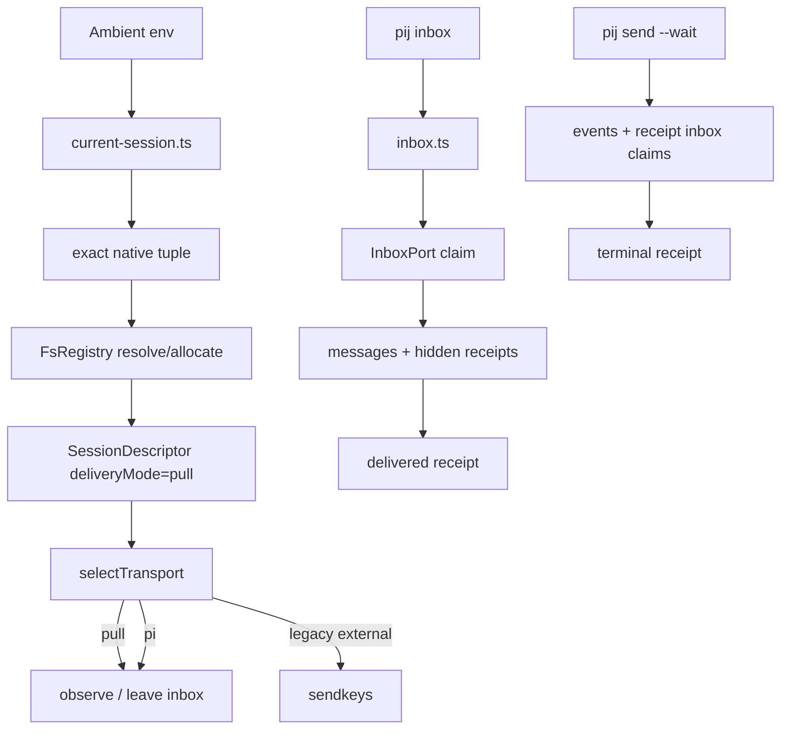

# Phase 2 Tasks — Inbox CLI and Ambient Registration

**Plan**: [pij-inbox-no-tmux-plan.md](../../pij-inbox-no-tmux-plan.md)
**Phase**: Phase 2: Inbox CLI and Ambient Registration
**Status**: Atomic Append Fix Complete — Awaiting Cold Re-review
**Worktree**: `/Users/jordanknight/pi-hacking/pij-worktrees/s041-inbox-no-tmux`
**Rulings**: [rulings.md](../../rulings.md)
**Fences**: [requested-fences.md](../../requested-fences.md)

## Executive Briefing

### Purpose

Deliver the first usable no-tmux product surface: grouped `pij inbox` commands,
ambient native-session identity, durable first-use registration, pull-safe send
and receipt semantics, and a daemon ownership guard that prevents a running
daemon from consuming pull mail.

### What We're Building

- Pure ambient identity and inbox command modules.
- Additive `deliveryMode: "push" | "pull"` descriptor semantics.
- Durable exact-native self-resolution and registration using existing
  `FsRegistry` identity APIs.
- Delivery-mode-aware transport, daemon ownership, routing, send preflight, and
  receipt classification.
- `pij inbox [check|register]`, bare aliasing, indefinite/finite wait, JSON/human
  output, and `pij adopt --current`.
- A portable two-shell round-trip proving register → wait → send → read → receipt
  with no tmux and no daemon.

### Goals

- ✅ Preserve every legacy pi/tmux path when `deliveryMode` is absent.
- ✅ Deploy and live-prove the pull ownership guard before enabling registration.
- ✅ Resolve Claude, Copilot, and Codex from their ambient native identities.
- ✅ Let dead-pid pull peers accept durable mail while dead push/dissolved peers fail.
- ✅ Make `send --wait` and `pij inbox` race safely over receipt envelopes.
- ✅ Keep all subprocess tests explicitly timed and Windows-compatible.

### Non-Goals

- ❌ No tmux/pi post-consumption read markers yet; Phase 3 owns that convergence.
- ❌ No skill, operator-guide, or domain-document refresh; Phase 3 owns guidance.
- ❌ No changes to `fs-registry.ts`, `discovery.ts`, `spawn.ts`, or
  `core/harness/copilot.ts`.
- ❌ No headless spawning or daemon lifecycle redesign.
- ❌ No inbox retention, history, search, or GC.

## Delegation Boundary

Phase 2 intentionally uses **two coder packets**, overriding flow-pair's normal
whole-phase packet rule because the o-prime requires a reviewed live daemon guard
before inbox registration can be enabled:

1. **Ownership tranche**: T001–T005.
2. **Orchestrator gate**: T006 — cold review, daemon-restart baton, live proof.
3. **Inbox tranche**: T007–T012.

No worker may cross T006 on inference or self-approval.

## Prior Phase Context

### A. Deliverables

- `core/types.ts`, `core/ports.ts`, `adapters/fakes.ts`, and
  `adapters/channel.ts` now expose the marker-backed inbox substrate.
- `cli.inbox.integration.test.ts` and `windows:check` provide the portable
  subprocess lane used by this phase.

### B. Dependencies Exported

- `DeliveredMessage`, `InboxReadMarker`, `InboxClaim`, and `InboxMark`.
- `InboxPort.listUnread`, `claimUnread`, and `markRead`.
- `FakeInbox` and `FsChannel` implementations.

### C. Gotchas & Debt

- `FsChannel.watch()` must keep using `realpathSync.native()` on Windows.
- A stale daemon consumes external harness inboxes unless `deliveryMode` reaches
  the daemon ownership call sites before registration is exposed.

### D. Incomplete Items

- User-facing inbox parsing/output, ambient registration, receipt processing,
  and daemon delivery-mode ownership are all Phase 2 work.

### E. Patterns to Follow

- Core stays pi-free and uses tagged unions.
- Immutable `msg-*.json`; exclusive `read-*.json` marker claims.
- Side effects through ports or thin bin/adapters; no global mutable state.

## Pre-Implementation Check

| File | Exists? | Domain Check | Notes |
|------|---------|--------------|-------|
| `.pi/extensions/pij/core/inbox.ts` | no — create | `pij-messaging` internal | Pure grouped grammar, one-pass processing, output models. |
| `.pi/extensions/pij/core/inbox.test.ts` | no — create | `pij-messaging` internal | Workshop examples and receipt/output contract. |
| `.pi/extensions/pij/core/current-session.ts` | no — create | `pij-control-plane` internal | Pure env → native tuple and descriptor construction. |
| `.pi/extensions/pij/core/current-session.test.ts` | no — create | `pij-control-plane` internal | Claude/Copilot/Codex ambiguity and registration planning. |
| `.pi/extensions/pij/core/types.ts` | yes | `pij-messaging` contract | Add optional `deliveryMode`; legacy absence unchanged. |
| `.pi/extensions/pij/core/ports.ts` | yes | `pij-messaging` contract | Add inbox dependency to CLI through existing `InboxPort`; avoid expanding `RegistryPort`. |
| `.pi/extensions/pij/core/harness/types.ts` | yes | `pij-control-plane` contract | Optional delivery-mode argument; absent behavior byte-semantic. |
| `.pi/extensions/pij/core/harness/pi.ts` | yes | `pij-control-plane` internal | Daemon ownership predicate receives delivery mode. |
| `.pi/extensions/pij/core/daemon/router.ts` | yes | `pij-control-plane` internal | Pull descriptor routes to observe/leave-on-disk. |
| `.pi/extensions/pij/core/daemon/router.test.ts` | yes | `pij-control-plane` internal | Prove pull, pi, bound/unbound tmux matrix. |
| `.pi/extensions/pij/core/binding.ts` | yes | cross-domain contract | Add `CODEX_THREAD_ID`; reattach can set pull mode. |
| `.pi/extensions/pij/core/binding.test.ts` | yes | `pij-control-plane` internal | Preserve Claude/Copilot and prove Codex. |
| `.pi/extensions/pij/core/cli.ts` | yes | `pij-messaging` internal | Ambient self callback, pull liveness/receipt semantics. |
| `.pi/extensions/pij/core/cli.test.ts` | yes | `pij-messaging` internal | Preflight, initial receipt, and ambient self regression matrix. |
| `.pi/extensions/pij/cli.ts` | yes | `pij-control-plane` internal | Pre-E-NOREG inbox intercept, registration, waits, adopt alias. |
| `.pi/extensions/pij/cli.integration.test.ts` | yes | `pij-control-plane` internal | Preserve existing control-plane behavior. |
| `.pi/extensions/pij/cli.inbox.integration.test.ts` | yes | portable integration | Phase 2 addendum granted; extend two-shell scenario. |
| `.pi/extensions/pij/daemon.ts` | yes | `pij-control-plane` internal | Addendum granted: ownership filtering only. |
| `.pi/extensions/pij/daemon.test.ts` | yes | `pij-control-plane` internal | Addendum granted: regression + pull non-ownership proof. |
| `adapters/fs-registry.ts`, `core/discovery.ts`, `core/spawn.ts`, `core/harness/copilot.ts` | yes | excluded | Consume existing APIs; no writes. |

## Architecture Map



## Tasks

| Status | ID | Task | Domain | Path(s) | Done When | Notes |
|--------|-----|------|--------|---------|-----------|-------|
| [x] | T001 | Write failing ambient-identity and self-resolution tests: Claude non-empty id; Copilot canonical UUID with matching-state validation supplied by the bin; Codex `CODEX_THREAD_ID` canonical UUID plus exact rollout path; zero signals; multiple signals → `E-AMBIG`; `PIJ_SESSION_ID` override; exact durable reverse lookup before pane/cwd fallback. | pij-control-plane / pij-messaging | `/Users/jordanknight/pi-hacking/pij-worktrees/s041-inbox-no-tmux/.pi/extensions/pij/core/current-session.test.ts`; `/Users/jordanknight/pi-hacking/pij-worktrees/s041-inbox-no-tmux/.pi/extensions/pij/core/binding.test.ts`; `/Users/jordanknight/pi-hacking/pij-worktrees/s041-inbox-no-tmux/.pi/extensions/pij/core/cli.test.ts` | Tests fail on the current resolver and preserve all existing Claude/Copilot/pane regression cases. | Ownership packet; no production code first. |
| [x] | T002 | Implement pure ambient identity types/resolution and descriptor planning. Extend phonehome env resolution for Codex, let `reattachIdentity` optionally set delivery mode, and inject an optional ambient-self resolver into `CliDeps` so existing verbs reverse-resolve the durable join without changing `RegistryPort` or `FsRegistry`. Production bin reuses current Copilot state validation and exact Codex rollout lookup. | pij-control-plane / pij-messaging | `/Users/jordanknight/pi-hacking/pij-worktrees/s041-inbox-no-tmux/.pi/extensions/pij/core/current-session.ts`; `/Users/jordanknight/pi-hacking/pij-worktrees/s041-inbox-no-tmux/.pi/extensions/pij/core/binding.ts`; `/Users/jordanknight/pi-hacking/pij-worktrees/s041-inbox-no-tmux/.pi/extensions/pij/core/cli.ts`; `/Users/jordanknight/pi-hacking/pij-worktrees/s041-inbox-no-tmux/.pi/extensions/pij/cli.ts` | T001 turns green; duplicate signals fail loudly; fresh subprocess self resolution survives absent live descriptors; excluded files are untouched. | `process.ppid` is thin-bin runtime metadata, never identity authority. |
| [x] | T003 | Write failing delivery-mode tests: legacy selectTransport matrix unchanged; pull external → inbox/observe; daemon ownership false for pull; router never buffers/injects pull; dead-pid pull send accepted; dead push/dissolved rejected; pull initial receipt queued with “awaiting inbox check”; daemon tick leaves seeded pull message file present; tmux-bound injection regressions unchanged. | pij-control-plane / pij-messaging | `/Users/jordanknight/pi-hacking/pij-worktrees/s041-inbox-no-tmux/.pi/extensions/pij/core/harness/types.test.ts`; `/Users/jordanknight/pi-hacking/pij-worktrees/s041-inbox-no-tmux/.pi/extensions/pij/core/harness/pi.test.ts`; `/Users/jordanknight/pi-hacking/pij-worktrees/s041-inbox-no-tmux/.pi/extensions/pij/core/daemon/router.test.ts`; `/Users/jordanknight/pi-hacking/pij-worktrees/s041-inbox-no-tmux/.pi/extensions/pij/core/cli.test.ts`; `/Users/jordanknight/pi-hacking/pij-worktrees/s041-inbox-no-tmux/.pi/extensions/pij/daemon.test.ts` | Tests fail before implementation and cover both additive guard and unchanged tmux behavior. | Finding 08/10; addendum grant. |
| [x] | T004 | Add optional `SessionDescriptor.deliveryMode`, thread it through transport/ownership/router/send classification, and update daemon ownership call sites. Pull descriptors are durable mailbox targets regardless of pid; dissolved always fails; legacy absence preserves current pi/tmux behavior. Do not change daemon delete/mark behavior. | pij-messaging / pij-control-plane | `/Users/jordanknight/pi-hacking/pij-worktrees/s041-inbox-no-tmux/.pi/extensions/pij/core/types.ts`; `/Users/jordanknight/pi-hacking/pij-worktrees/s041-inbox-no-tmux/.pi/extensions/pij/core/harness/types.ts`; `/Users/jordanknight/pi-hacking/pij-worktrees/s041-inbox-no-tmux/.pi/extensions/pij/core/harness/pi.ts`; `/Users/jordanknight/pi-hacking/pij-worktrees/s041-inbox-no-tmux/.pi/extensions/pij/core/daemon/router.ts`; `/Users/jordanknight/pi-hacking/pij-worktrees/s041-inbox-no-tmux/.pi/extensions/pij/core/cli.ts`; `/Users/jordanknight/pi-hacking/pij-worktrees/s041-inbox-no-tmux/.pi/extensions/pij/daemon.ts` | T003 turns green; no unrelated daemon hunk; existing bound tmux sends and receipts remain byte-semantic. | Ownership guard only; Phase 3 owns delete-to-marker. |
| [x] | T005 | Run the ownership tranche static proof and prepare a sandboxed live canary: targeted harness/router/CLI/daemon tests, typecheck, lint, plus a fixture/command that seeds a bound external pull descriptor and message and proves one worktree daemon tick leaves it on disk. Update execution log, then stop for T006. | cross-domain | `/Users/jordanknight/pi-hacking/pij-worktrees/s041-inbox-no-tmux/.pi/extensions/pij/core/current-session.ts`; `/Users/jordanknight/pi-hacking/pij-worktrees/s041-inbox-no-tmux/.pi/extensions/pij/core/current-session.test.ts`; `/Users/jordanknight/pi-hacking/pij-worktrees/s041-inbox-no-tmux/.pi/extensions/pij/core/binding.ts`; `/Users/jordanknight/pi-hacking/pij-worktrees/s041-inbox-no-tmux/.pi/extensions/pij/core/binding.test.ts`; `/Users/jordanknight/pi-hacking/pij-worktrees/s041-inbox-no-tmux/.pi/extensions/pij/core/harness/types.ts`; `/Users/jordanknight/pi-hacking/pij-worktrees/s041-inbox-no-tmux/.pi/extensions/pij/core/harness/types.test.ts`; `/Users/jordanknight/pi-hacking/pij-worktrees/s041-inbox-no-tmux/.pi/extensions/pij/core/harness/pi.ts`; `/Users/jordanknight/pi-hacking/pij-worktrees/s041-inbox-no-tmux/.pi/extensions/pij/core/harness/pi.test.ts`; `/Users/jordanknight/pi-hacking/pij-worktrees/s041-inbox-no-tmux/.pi/extensions/pij/core/daemon/router.ts`; `/Users/jordanknight/pi-hacking/pij-worktrees/s041-inbox-no-tmux/.pi/extensions/pij/core/daemon/router.test.ts`; `/Users/jordanknight/pi-hacking/pij-worktrees/s041-inbox-no-tmux/.pi/extensions/pij/core/cli.ts`; `/Users/jordanknight/pi-hacking/pij-worktrees/s041-inbox-no-tmux/.pi/extensions/pij/core/cli.test.ts`; `/Users/jordanknight/pi-hacking/pij-worktrees/s041-inbox-no-tmux/.pi/extensions/pij/cli.ts`; `/Users/jordanknight/pi-hacking/pij-worktrees/s041-inbox-no-tmux/.pi/extensions/pij/daemon.ts`; `/Users/jordanknight/pi-hacking/pij-worktrees/s041-inbox-no-tmux/.pi/extensions/pij/daemon.test.ts`; `/Users/jordanknight/pi-hacking/pij-worktrees/s041-inbox-no-tmux/docs/plans/041-pij-inbox-no-tmux/tasks/phase-2-inbox-cli-and-ambient-registration/execution.log.md` | All targeted gates pass; proof command is deterministic; no user-facing inbox verb is exercised live. | Coder reports tranche complete, not phase complete. |
| [x] | T006 | **ORCHESTRATOR GATE**: cold-review T001–T005, require Dim-0 removal of pull ownership to go RED, obtain `daemon-restart` baton, restart the live daemon from worktree source, run the seeded pull-mail canary, and verify an existing tmux-bound send still lands. | pij-control-plane | `/Users/jordanknight/pi-hacking/pij-worktrees/s041-inbox-no-tmux/docs/plans/041-pij-inbox-no-tmux/reviews/phase-2-ownership-review.md`; `/Users/jordanknight/pi-hacking/pij-worktrees/s041-inbox-no-tmux/.pi/extensions/pij/daemon.ts`; `/Users/jordanknight/pi-hacking/pij-worktrees/s041-inbox-no-tmux/.pi/extensions/pij/daemon.test.ts`; `/Users/jordanknight/pi-hacking/pij-worktrees/s041-inbox-no-tmux/docs/plans/041-pij-inbox-no-tmux/tasks/phase-2-inbox-cli-and-ambient-registration/execution.log.md` | Reviewer `APPROVE`; baton grant recorded; pull file survives; tmux regression passes; only then dispatch T007–T012. | No worker self-approval; o-prime broadcasts restart. |
| [x] | T007 | Write failing pure inbox CLI contract tests from Workshop 001: default/check/register grammar; optional numeric wait; unknown subcommands/flags; stable human/JSON outputs; hidden receipt envelopes; message order; command/attachment projection; timeout result; delivered-receipt actions. | pij-messaging | `/Users/jordanknight/pi-hacking/pij-worktrees/s041-inbox-no-tmux/.pi/extensions/pij/core/inbox.test.ts` | Tests encode every workshop example and error row before implementation. | Inbox packet starts after T006. |
| [x] | T008 | Implement `core/inbox.ts`: tagged command/result types, strict parser, one-pass list/claim processing, receipt suppression/event action, normal-message projection, delivered-receipt action, and human/JSON render helpers. No filesystem, timers, or process globals. | pij-messaging | `/Users/jordanknight/pi-hacking/pij-worktrees/s041-inbox-no-tmux/.pi/extensions/pij/core/inbox.ts`; `/Users/jordanknight/pi-hacking/pij-worktrees/s041-inbox-no-tmux/.pi/extensions/pij/core/inbox.test.ts` | T007 turns green; marker `readAt` is supplied by caller clock; malformed messages surface; commands are reported, never executed. | Reuse `InboxPort` and `parseReceiptBody`/`receiptBody`. |
| [x] | T009 | Implement first-use current registration and CLI wiring before E-NOREG. `pij inbox` aliases check; `register` and `adopt --current` call one operation; existing pane-bound descriptors preserve push; no-pane external identities set pull; exact identity reuse preserves durable metadata; help text includes the grouped surface. | pij-control-plane | `/Users/jordanknight/pi-hacking/pij-worktrees/s041-inbox-no-tmux/.pi/extensions/pij/cli.ts`; `/Users/jordanknight/pi-hacking/pij-worktrees/s041-inbox-no-tmux/.pi/extensions/pij/core/current-session.ts`; `/Users/jordanknight/pi-hacking/pij-worktrees/s041-inbox-no-tmux/.pi/extensions/pij/core/current-session.test.ts`; `/Users/jordanknight/pi-hacking/pij-worktrees/s041-inbox-no-tmux/.pi/extensions/pij/cli.integration.test.ts` | Empty `PIJ_HOME` auto-creates registration; repeated registration reuses id; no harness/session-id/export flags required; existing adopt/spawn paths stay green. | Use existing `FsRegistry.allocateIdentity`/write; no registry source edit. |
| [x] | T010 | Implement wait and receipt loops. Inbox check without wait is immediate; bare wait has no deadline; numeric wait exits 0 with `timedOut:true`; wake claims all current unread messages. Claimed receipt envelopes append a durable receipt event before marking; `send --wait` polls events plus exclusively claimed receipt envelopes so concurrent inbox check cannot lose the terminal state. | pij-messaging / pij-control-plane | `/Users/jordanknight/pi-hacking/pij-worktrees/s041-inbox-no-tmux/.pi/extensions/pij/cli.ts`; `/Users/jordanknight/pi-hacking/pij-worktrees/s041-inbox-no-tmux/.pi/extensions/pij/core/inbox.ts`; `/Users/jordanknight/pi-hacking/pij-worktrees/s041-inbox-no-tmux/.pi/extensions/pij/core/inbox.test.ts`; `/Users/jordanknight/pi-hacking/pij-worktrees/s041-inbox-no-tmux/.pi/extensions/pij/core/cli.test.ts` | Event-first and envelope-first races pass; broadcast correlation remains ordered; existing 15-second send-wait default is unchanged. | Poll cadence stays bounded; no silent catches. |
| [x] | T011 | Extend the portable two-shell integration for auto-register → wait → send → read → delivered receipt → sender wait, with a dead target pid and no daemon/tmux. Add Claude/Copilot/Codex fixtures and finite-timeout JSON proof. Every spawned-process test declares an explicit Vitest timeout at authoring time. | pij-messaging / pij-control-plane | `/Users/jordanknight/pi-hacking/pij-worktrees/s041-inbox-no-tmux/.pi/extensions/pij/cli.inbox.integration.test.ts`; `/Users/jordanknight/pi-hacking/pij-worktrees/s041-inbox-no-tmux/.pi/extensions/pij/cli.integration.test.ts` | End-to-end passes on macOS/Linux and `windows:check`; no POSIX scripts, chmod, fake tmux, or path-separator assumptions in the portable file. | Phase 2 portable addendum granted. |
| [x] | T012 | Run Phase 2 completion proof: all targeted suites, `just windows-compat`, `just typecheck`, `just lint`, `harness checks --quick`; audit excluded files and package/lockfile unchanged; update task statuses and execution log with decisions, live gate evidence, and deferred Phase 3 convergence. | cross-domain | Exact T001–T011 path union; `/Users/jordanknight/pi-hacking/pij-worktrees/s041-inbox-no-tmux/docs/plans/041-pij-inbox-no-tmux/tasks/phase-2-inbox-cli-and-ambient-registration/tasks.md`; `/Users/jordanknight/pi-hacking/pij-worktrees/s041-inbox-no-tmux/docs/plans/041-pij-inbox-no-tmux/tasks/phase-2-inbox-cli-and-ambient-registration/execution.log.md` | Gates are green, fence diff is exact, no excluded writes exist, and phase is ready for cold review. | Full smoke/ship gate remains later; liveness cadence applies to both worker seats. |

## Context Brief

Environment friction is work: capture retries, outages, missing proof, and
workarounds immediately. Copilot silence is outage-class first; check worker
liveness on the standing cadence, poke a live stalled seat before redispatch, and
redispatch only after pokes fail.

### Key Findings

- **Finding 03**: harness kind alone cannot distinguish tmux push from pull.
- **Finding 04**: ambient identity exists; Codex phonehome is the missing adapter.
- **Finding 05/09**: receipts are hidden but must remain durable and race-safe.
- **Finding 07**: inbox registration must intercept before E-NOREG.
- **Finding 08**: pull mail bypasses pid-based dead rejection.
- **Finding 10**: pull ownership must be reviewed/deployed before registration.

### Domain Dependencies

- `pij-messaging`: Phase 1 `InboxPort` and marker contracts.
- `pij-control-plane`: exact durable identity records and reattachment.
- `pij-control-plane`: transport/router/daemon ownership seam.
- `extension-authoring-harness`: portable Windows lane and explicit subprocess
  timeout doctrine.

### Domain Constraints

- `core/` remains pi-free; side effects stay behind dependencies or thin bin.
- Additive descriptor field only; legacy absence is current behavior.
- No writes to `fs-registry.ts`, `discovery.ts`, `spawn.ts`, or Copilot harness.
- No dynamic/inline imports or `any`; relative imports use `.js`.
- Persist/claim before returning consumed data.
- Existing tmux behavior gets explicit regression proof before daemon restart.
- Daemon restart requires baton and reviewer approval.
- No live registration/check proof before the ownership guard is deployed.

### Packet Scope

Ownership packet allowed paths: T001–T005 production/tests plus Phase 2 task/log.
Inbox packet allowed paths: T007–T012 production/tests plus Phase 2 task/log.
Both packets forbid `.flow-pair/**`, government, flow files, package/lockfile,
and every excluded source path.

## Discoveries & Learnings

_Populated during implementation._

| Date | Task | Type | Discovery | Resolution | References |
|------|------|------|-----------|------------|------------|
| 2026-07-12 | T012 | Noteworthy | Report-only package audit refreshes `.pi/packages.yaml` vet timestamps. | Restored audit-only timestamp drift; dependency manifests and lockfile have no implementation diff. | `harness checks --quick`; prior DL-004 |
| 2026-07-12 | F-001 | Review fix | A later receipt/claim failure could discard an earlier claimed user result. | Receipt envelopes are prevalidated before claims; later claim failures return partial messages/actions plus a terminal failure for render-before-error handling. | `core/inbox.ts`; named F-001 regressions |
| 2026-07-12 | F-002 | Review fix | Receipt markers could become durable before their terminal receipt event. | Receipt actions now persist/reuse the event before `markRead`; retries recover after mark failure and uncorrelated receipts are also persisted/marked. | `persistReceiptEnvelope`; named F-002 regressions |
| 2026-07-12 | F-003 | Review fix | Present invalid ambient signals were treated as absent and allowed pane/cwd fallback. | Invalid/mismatched Copilot and Codex signals return tagged errors before compatibility fallback. | production CLI subprocess table |
| 2026-07-12 | F-002 residual | Review addendum | Check-then-append allowed concurrent receipt consumers to publish duplicate durable events. | Added additive `EventLogPort.appendOnce`; real/fake implementations provide atomic per-key first-writer ownership, and receipt persistence uses the envelope id key before marking. | adapter + fake + dual-consumer + Windows hard-link races |
| 2026-07-12 | F-002 sanity | Orchestrator fix | Unconditional merge sorting changed legacy out-of-order NDJSON reads, and the stale-consumer regression observed the first event. | Append-only reads now return file order when no atomic files exist; the regression delegates to one fake but returns the same stale empty read snapshot to both consumers. | new adapter ordering case + corrected stale wrapper |

## Directory Layout

```text
docs/plans/041-pij-inbox-no-tmux/tasks/
├── phase-1-portable-backpressure-and-durable-inbox/
└── phase-2-inbox-cli-and-ambient-registration/
    ├── tasks.md
    └── execution.log.md
```
