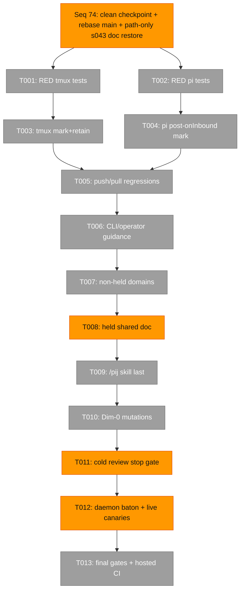
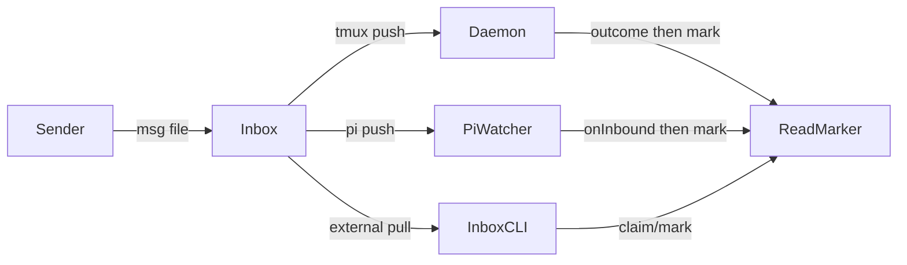
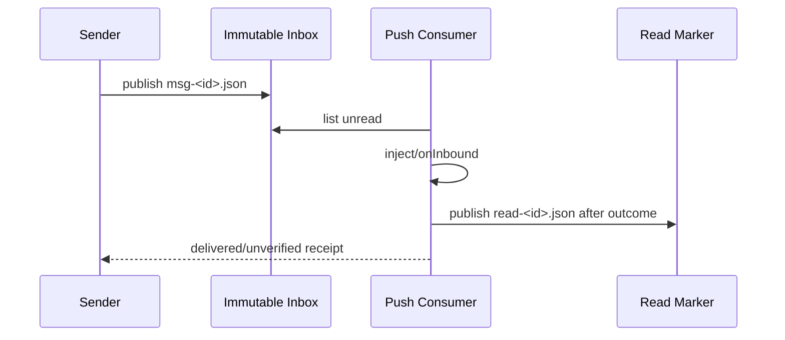

# Phase 3 Tasks — Push-Path Convergence and Guidance

**Plan**: `../../pij-inbox-no-tmux-plan.md`
**Phase**: Phase 3: Push-Path Convergence and Guidance
**Status**: IMPLEMENTED — REVIEW FIXES COMPLETE, RE-REVIEW PENDING
**Complexity**: CS 4

## Executive Briefing

Phase 3 converges the legacy tmux and pi push consumers onto the immutable
message plus atomic read-marker contract delivered in Phases 1–2. It then updates
operator/agent guidance, proves the timing invariants through mutation and live
canaries, and closes the plan without widening into shared smoke-harness debt.

### What We're Building

- Tmux messages remain on disk and receive read markers only after an injection
  outcome.
- Pi messages receive read markers only after `PijSession.onInbound` returns.
- Receipt envelopes remain hidden and marker-backed rather than deleted.
- `/pij`, CLI help, operator docs, and domain contracts distinguish push from
  pull delivery.
- Reviewer approval precedes the daemon-restart baton and live deployment proof.

### Goals

- ✅ Satisfy AC-06, AC-07, AC-11, AC-12, AC-13, and AC-14.
- ✅ Preserve Phase 2 pull non-ownership and all legacy descriptor behavior.
- ✅ Make marker ownership and post-consumption timing mutation-resistant.
- ✅ Land skill edits last and respect the held shared domain document.

### Non-Goals

- ❌ No message-history search, retention policy, or garbage collection.
- ❌ No `FsRegistry`, discovery, spawn, Copilot harness, package, or lock changes.
- ❌ No D-032/D-033 smoke-harness work; R-004 makes that shared debt non-blocking.
- ❌ No daemon restart before cold review approval and a granted baton.
- ❌ No hand-edit or temporary repoint of `~/.agents/skills/pij`; it remains
  symlinked to the main checkout until merge/deployment.

## Prior Phase Context

### Phase 1 — Portable Backpressure and Durable Inbox

#### A. Deliverables

- `InboxPort.listUnread`, `claimUnread`, and `markRead`.
- `FsChannel` immutable `msg-*.json` plus exclusive `read-*.json`.
- `FakeInbox`, Windows compatibility sensor, and portable subprocess fixture.

#### B. Dependencies Exported

- `InboxReadMarker`, `InboxClaim`, `InboxMark`, and `DeliveredMessage`.
- Marker existence is authoritative; `markRead()` is the push-path primitive.
- `realpathSync.native()` is required for Windows watcher paths.

#### C. Gotchas & Debt

- Every real subprocess test needs an explicit Vitest timeout.
- `pkg audit` refreshes vetted timestamps and that drift must be restored.
- Message envelopes are never rewritten or deleted.

#### D. Incomplete Items

- Tmux and pi push consumers still use delete/in-memory seen behavior.
- Hosted Windows evidence must be re-captured after final Phase 3 changes.

#### E. Patterns to Follow

- One marker writer: consumers call `InboxPort`; no call-site filesystem marker.
- Tagged results, pi-free core, real fakes, immutable envelopes, tests first.

### Phase 2 — Inbox CLI and Ambient Registration

#### A. Deliverables

- Pull registration and current-session resolution for Claude/Copilot/Codex.
- `pij inbox`, wait loops, durable receipt convergence, and `deliveryMode`.
- Pull-aware daemon/router/send ownership.
- Atomic `EventLogPort.appendOnce` receipt publication.

#### B. Dependencies Exported

- `DeliveryMode = "push" | "pull"`; absence preserves legacy behavior.
- `daemonOwnsDelivery(harness, deliveryMode)` and pull non-ownership guards.
- Receipt event publication precedes marker publication.

#### C. Gotchas & Debt

- The s043 R8 hold is satisfied at Spine Seq 74. Before dispatch, the orchestrator
  commits this planning dossier, rebases `origin/main`, then path-scoped restores
  only `docs/domains/pij-control-plane/domain.md` from
  `origin/s043/telegram-last-speaker-routing` at commit
  `a831930bdcc190f58abf31f153131c0953227d9c` (blob
  `844464ee03dcbc54e3a660245ddac93095b0a5a7`). Never merge or stack s043 commits.
- Skill edits are live and therefore land last.
- R-004 forbids further s041 work on the unrelated trust-prompt smoke debt.

#### D. Incomplete Items

- Post-outcome tmux markers, post-`onInbound` pi markers, push/pull guidance,
  mutation proof, and live daemon deployment remain.

#### E. Patterns to Follow

- Preserve pull non-ownership at every daemon gate.
- Event/marker ordering must remain persist-before-mutate.
- Cold review plus Dim-0 proof precedes shared daemon deployment.

## Pre-Implementation Check

| File | Exists? | Domain Check | Notes |
|---|---|---|---|
| `/Users/jordanknight/pi-hacking/pij-worktrees/s041-inbox-no-tmux/.pi/extensions/pij/daemon.ts` | Yes | pij-control-plane | Replace message deletion with post-outcome `markRead`; receipts mark without injection. |
| `/Users/jordanknight/pi-hacking/pij-worktrees/s041-inbox-no-tmux/.pi/extensions/pij/daemon.test.ts` | Yes | pij-control-plane | Add retained-envelope, timing, receipt, pull, and failure regressions. |
| `/Users/jordanknight/pi-hacking/pij-worktrees/s041-inbox-no-tmux/.pi/extensions/pij/core/daemon/loop.ts` | Yes | pij-control-plane | Keep pure outcome contract; comments/types may clarify post-outcome ownership. |
| `/Users/jordanknight/pi-hacking/pij-worktrees/s041-inbox-no-tmux/.pi/extensions/pij/core/daemon/loop.test.ts` | Yes | pij-control-plane | Test injection outcomes and non-consumed observe/buffer paths. |
| `/Users/jordanknight/pi-hacking/pij-worktrees/s041-inbox-no-tmux/.pi/extensions/pij/index.ts` | Yes | pij-messaging | Mark after `session.onInbound`; keep single pi importer and P10 handler. |
| `/Users/jordanknight/pi-hacking/pij-worktrees/s041-inbox-no-tmux/.pi/extensions/pij/index.test.ts` | Yes | pij-messaging | Prove post-callback marker and reload/no-replay behavior. |
| `/Users/jordanknight/pi-hacking/pij-worktrees/s041-inbox-no-tmux/.pi/extensions/pij/cli.ts` | Yes | pij-control-plane / pij-messaging | Help text only; no new parser behavior planned. |
| `/Users/jordanknight/pi-hacking/pij-worktrees/s041-inbox-no-tmux/.pi/extensions/pij/cli.integration.test.ts` | Yes | pij-control-plane | Help regression; subprocess rows require explicit timeout. |
| `/Users/jordanknight/pi-hacking/pij-worktrees/s041-inbox-no-tmux/skills/pij/SKILL.md` | Yes | pij-skill | Edit last. |
| `/Users/jordanknight/pi-hacking/pij-worktrees/s041-inbox-no-tmux/skills/pij/references/00-routing.md` | Yes | pij-skill | Add deterministic non-tmux pull guidance without duplicating peer prose. |
| `/Users/jordanknight/pi-hacking/pij-worktrees/s041-inbox-no-tmux/skills/pij/references/routes/peer.md` | Yes | pij-skill | Non-tmux peers use `pij inbox --wait`; tmux/pi remain push-first. |
| `/Users/jordanknight/pi-hacking/pij-worktrees/s041-inbox-no-tmux/docs/how/pij.md` | Yes | operator docs | Document register/check/wait and push/pull semantics. |
| `/Users/jordanknight/pi-hacking/pij-worktrees/s041-inbox-no-tmux/docs/domains/pij-messaging/domain.md` | Yes | pij-messaging | Add immutable inbox/read-marker and atomic receipt concepts. |
| `/Users/jordanknight/pi-hacking/pij-worktrees/s041-inbox-no-tmux/docs/domains/pij-skill/domain.md` | Yes | pij-skill | Add non-tmux inbox guidance contract. |
| `/Users/jordanknight/pi-hacking/pij-worktrees/s041-inbox-no-tmux/docs/domains/pij-control-plane/domain.md` | Yes | pij-control-plane | Before T001, rebase `origin/main`, then restore only this path from approved s043 commit `a831930b` (blob `844464ee…`); T008 adds s041-only text. |
| `/Users/jordanknight/pi-hacking/pij-worktrees/s041-inbox-no-tmux/docs/domains/registry.md` | Yes | domain index | Additive concept/path references only. |
| `/Users/jordanknight/pi-hacking/pij-worktrees/s041-inbox-no-tmux/docs/domains/domain-map.md` | Yes | domain index | Preserve domain ownership direction. |

## Architecture Map



## Tasks

| Status | ID | Task | Domain | Path(s) | Done When | Notes |
|---|---|---|---|---|---|---|
| [x] | T001 | Write failing tmux push-consumer tests for retained `msg-*`, post-outcome `read-*`, marker-aware listing plus second-tick no-replay, receipt exclusion plus durable receipt-event-before-marker persistence, sender-wait visibility, send failure isolation, no-pane skip/no-duplicate buffering, and pull non-ownership. | pij-control-plane / pij-messaging | `/Users/jordanknight/pi-hacking/pij-worktrees/s041-inbox-no-tmux/.pi/extensions/pij/daemon.test.ts`; `/Users/jordanknight/pi-hacking/pij-worktrees/s041-inbox-no-tmux/.pi/extensions/pij/core/daemon/loop.test.ts` | Named tests are RED against delete-on-consume, raw marker-blind scans, mark-before-outcome, receipt-marker-without-event, or repeated no-pane buffering behavior and preserve Phase 2 pull cases. | Tests first; do not edit production in this task. |
| [x] | T002 | Write failing pi-wiring tests proving `markRead` occurs only after `PijSession.onInbound`, receipts stay hidden, and reload/start does not replay marked history. | pij-messaging | `/Users/jordanknight/pi-hacking/pij-worktrees/s041-inbox-no-tmux/.pi/extensions/pij/index.test.ts` | Named tests are RED before wiring changes and observe call ordering plus marker persistence. | Keep tests at wiring boundary; no `core/session.ts` fence. |
| [x] | T003 | Replace daemon raw directory/delete consumption with marker-aware `FsChannel`/`InboxPort.listUnread()` plus post-outcome marking; retain envelopes; append/reuse each receipt's durable event before marking it without injection; skip draining entirely until a bound target has a pane; preserve terminal receipt emission. | pij-control-plane / pij-messaging | `/Users/jordanknight/pi-hacking/pij-worktrees/s041-inbox-no-tmux/.pi/extensions/pij/daemon.ts`; `/Users/jordanknight/pi-hacking/pij-worktrees/s041-inbox-no-tmux/.pi/extensions/pij/core/daemon/loop.ts`; tests from T001 | T001 turns GREEN; marked retained history is skipped on later ticks, successful/unverified injection marks after outcome, failed/unconsumed/no-pane messages remain unread, the buffer is not repeatedly populated, receipts never wake peers, and external sender waits observe terminal states. | Reuse the Phase 2 event-before-marker contract; preserve all three pull ownership guards. |
| [x] | T004 | Mark pi messages only after `session.onInbound` returns. Durable read markers own cross-start/reload history; the existing process-local `seen` set remains unchanged as the within-process `fs.watch`/poll watermark. Derive the initial watermark in `index.ts` from durable unread/read state, then call `markRead` after `onInbound`. | pij-messaging | `/Users/jordanknight/pi-hacking/pij-worktrees/s041-inbox-no-tmux/.pi/extensions/pij/index.ts`; `/Users/jordanknight/pi-hacking/pij-worktrees/s041-inbox-no-tmux/.pi/extensions/pij/index.test.ts` | T002 turns GREEN; startup/reload cannot replay marked history; live poll/watch scans remain once-only; daemon still never drains pi or pull inboxes. | Keep `FsChannel.watch()` and `adapters/channel.ts` untouched/outside the fence; one `session_start` handler for all reasons remains intact. |
| [x] | T005 | Run the combined push/pull regression set and add any missing contract assertions for legacy descriptors, receipts, commands, and send failure isolation. | pij-control-plane / pij-messaging | T001–T004 path union; existing Phase 2 ownership/inbox tests | Targeted daemon/loop/index/ownership/inbox tests are GREEN with no excluded-path diff. | Every subprocess case has explicit timeout. |
| [x] | T006 | Update CLI help and operator guide for `pij inbox`, first-use registration, finite/indefinite wait, and push-vs-pull behavior. | pij-control-plane / pij-messaging | `/Users/jordanknight/pi-hacking/pij-worktrees/s041-inbox-no-tmux/.pi/extensions/pij/cli.ts`; `/Users/jordanknight/pi-hacking/pij-worktrees/s041-inbox-no-tmux/.pi/extensions/pij/cli.integration.test.ts`; `/Users/jordanknight/pi-hacking/pij-worktrees/s041-inbox-no-tmux/docs/how/pij.md` | Help tests and docs state that non-tmux external peers pull while tmux/pi peers stay push-first. | No parser change; R-004 smoke debt excluded. |
| [x] | T007 | Refresh non-held domain contracts and indexes for immutable inboxes, delivery ownership, atomic receipt events, and the new skill guidance seam. | pij-messaging / pij-skill | `/Users/jordanknight/pi-hacking/pij-worktrees/s041-inbox-no-tmux/docs/domains/pij-messaging/domain.md`; `/Users/jordanknight/pi-hacking/pij-worktrees/s041-inbox-no-tmux/docs/domains/pij-skill/domain.md`; `/Users/jordanknight/pi-hacking/pij-worktrees/s041-inbox-no-tmux/docs/domains/registry.md`; `/Users/jordanknight/pi-hacking/pij-worktrees/s041-inbox-no-tmux/docs/domains/domain-map.md` | Concepts/contracts/history and domain ownership are current without touching the held control-plane document. | Additive documentation only. |
| [x] | T008 | Add only the s041 delivery-ownership/read-marker contract to the control-plane domain document already path-restored by the Seq 74 pre-dispatch gate. Preserve the exact approved s043 baseline from `origin/s043/telegram-last-speaker-routing` commit `a831930bdcc190f58abf31f153131c0953227d9c`, blob `844464ee03dcbc54e3a660245ddac93095b0a5a7`. | pij-control-plane | `/Users/jordanknight/pi-hacking/pij-worktrees/s041-inbox-no-tmux/docs/domains/pij-control-plane/domain.md`; Phase 3 execution log; branch/worktree history | The execution log records the source ref/blob; the file contains all approved s043 text plus additive s041 text only; no other s043 path or commit is present. | PR #11 must merge before PR #9; after #11 merges, rebase `origin/main` so the s043 baseline becomes ancestry. Never merge/stack s043 commits and never stash a dirty tree. |
| [x] | T009 | Update `/pij` skill source guidance last: deterministic mode detection routes non-tmux peers to `pij inbox --wait` with auto-registration; tmux/pi peers remain push-first. | pij-skill | `/Users/jordanknight/pi-hacking/pij-worktrees/s041-inbox-no-tmux/skills/pij/SKILL.md`; `/Users/jordanknight/pi-hacking/pij-worktrees/s041-inbox-no-tmux/skills/pij/references/00-routing.md`; `/Users/jordanknight/pi-hacking/pij-worktrees/s041-inbox-no-tmux/skills/pij/references/routes/peer.md` | `just pij-skill-check` passes; progressive disclosure, verb coverage, compact discipline, and push-not-poll remain intact. | Edit last, after T008. `~/.agents/skills/pij` points to main, so this is source proof only; no live deployment claim before merge. |
| [x] | T010 | Perform two mandatory mutations: remove marker ownership/post-outcome timing and remove the push/pull guidance branch; record RED, restore byte-identically, and record GREEN. | extension-authoring-harness / pij-skill | T001–T009 test and skill path union; Phase 3 execution log | Both named proofs fail for the intended reason; pre/post SHA-256 matches; restored targeted gates pass. | Dim-0; no broad mutation. |
| [x] | T011 | Stop implementation, audit the exact fence/package diff, complete the execution log, and obtain cold Copilot GPT-5.6 Sol xhigh review approval before any daemon restart. If T008 could not run before dispatch, perform a targeted T001–T007 review/checkpoint first, then the final whole-phase review here. | cross-domain | Phase 3 task/log/review/report artifacts; T001–T010 path union | Reviewer verdict is APPROVE/APPROVE_WITH_NOTES with mutation evidence; critical/high findings are fixed and re-reviewed; any pre-rebase checkpoint was independently reviewed. | Orchestrator gate; compact coder before review and reviewer before verdict handling. |
| [x] | T012 | Request the daemon-restart baton, restart from the reviewed worktree, and live-prove one tmux send retains its envelope, gains a marker after injection, and resolves the sender's terminal wait through the persisted receipt event; also prove one no-tmux pull round-trip. | pij-control-plane / extension-authoring-harness | Reviewed daemon/index code; sandboxed/live evidence in execution log | Baton lease/return recorded; message, event, and marker paths prove ordering; sender wait resolves terminally; no spawn during freezes. | No restart before T011 approval. |
| [x] | T013 | Run final plan proof: targeted tests, `just pij-skill-check`, `just windows-compat`, `harness checks`, plan validation, excluded/package audit, push, and hosted Node 22/24/Windows evidence. Record post-merge live skill deployment verification as a ship handoff because the global skill symlink remains on main. | cross-domain | Full Phase 3 path union; Plan 041 artifacts; PR #9 | All owned sensors pass; R-004 smoke ruling is represented honestly; hosted matrix is green; execution/tasks/flow/retro/velocity are complete; live skill verification is not falsely claimed pre-merge. | Restore audit-only vetted timestamp drift before commit. |

### Cold Review Fix Work — `dlg-0001-fix-001`

| Status | Finding | Coder-owned disposition | Proof |
|---|---|---|---|
| [x] | F-001 | Finalize each same-target tmux message before attempting the next one; successful markers and terminal receipts survive a later send failure, while the failed message stays unread. | Same-target two-message regression plus second-tick no-replay assertion. |
| [x] | F-002 | Preserve the synthetic-watch envelope, require its matching marker, and prove marker-aware unread listing is empty. | Granted `watch.test.ts` regression is green; phantom `pij-watch` assertion is unchanged. |
| [x] | F-003 | Parse the C1 receive table as exact columns and assert the peer-route push/pull clauses. | Receive-column inversion mutation goes RED; byte-identical restore goes GREEN. |
| [x] | Fix proof | Run focused regressions, full tests, typecheck, lint, skill validation, and `harness checks --quick`; restore package-audit timestamp drift. | Exact counts and hashes are in `execution.log.md`. |

T011 remains open for the orchestrator-owned cold re-review. T012-T013 remain
untouched.

## Context Brief

Environment friction is work, not an apology: fix small reversible problems;
otherwise capture them with `harness observe` and record the resolution here.

### Key Findings

- Push consumers must mark only after their irreversible consumption outcome.
- Receipt envelopes are internal and must never wake/bill a tmux or pi peer.
- Pull descriptors remain daemon-unowned, including heartbeat, pending drive,
  buffer, and bound-drain paths.
- Skill guidance is a live shared surface and therefore lands last.
- The control-plane domain document is a real cross-stream hold, not a soft note.

### Domain Dependencies

- `pij-messaging`: `InboxPort.markRead`, immutable messages, receipts, and
  `PijSession.onInbound`.
- `pij-control-plane`: `drainTmuxInbox`, `daemonOwnsDelivery`, router outcomes,
  daemon restart/baton discipline.
- `pij-skill`: route registry, deterministic detection, compact discipline, and
  push-not-poll conventions.
- `extension-authoring-harness`: Windows lane, mutation proof, full signal
  inventory, and tmux/driver evidence.

### Domain Constraints

- `core/` remains pi-free.
- Side effects stay in `daemon.ts`/`index.ts`; relative imports use `.js`.
- No `any`, no dynamic/inline imports, no broad catches or silent success.
- Existing configurable keybinding and legacy descriptor behavior stay unchanged.

### Reusable from Prior Phases

- `FakeInbox`, `FsChannel.markRead`, marker concurrency tests.
- `deliveryMode`, pull ownership canary, portable two-shell fixture.
- `EventLogPort.appendOnce`, real Windows hard-link race.
- Phase 2 reviewer and coder seats, if still healthy after compaction.





## Discoveries & Learnings

| Date | Task | Type | Discovery | Resolution | References |
|---|---|---|---|---|---|
| 2026-07-12 | T003 | delivery ownership | Retaining a bound message without a pane would let the old router buffer the same unread envelope every tick. | `Daemon.drainInbox` now returns before listing or preparing any inbox content until the bound target has a pane. | `daemon.ts`; named no-pane regression |
| 2026-07-12 | T008 | shared contract | Rewording an existing s043 row would violate the byte-preserved baseline even if semantics improved. | Restored the exact source row and represented s041 only through additive rows/bullets/history; zero deletion lines versus blob `844464ee…`. | `docs/domains/pij-control-plane/domain.md` additive diff |
| 2026-07-12 | T011 fix | partial delivery | Returning a whole target's outcomes as one batch loses already-completed progress when a later send throws. | The daemon drains and finalizes one message at a time, and performs independent whole-life/provider notification work before the fallible inbox drain. | F-001 regression; full `daemon-push.test.ts` gate |

## Directory Layout

```text
docs/plans/041-pij-inbox-no-tmux/
  ├── pij-inbox-no-tmux-plan.md
  └── tasks/phase-3-push-path-convergence-and-guidance/
      ├── tasks.md
      └── execution.log.md
```

---

## Critical Insights (2026-07-12)

| # | Insight | Decision |
|---|---|---|
| 1 | Daemon-consumed receipt envelopes need a durable event before their marker or external sender waits still time out. | T001/T003/T012 explicitly prove receipt-event persistence and terminal sender wait. |
| 2 | Retaining a no-pane message while repeatedly buffering it would duplicate the queue on every tick. | Skip daemon inbox draining until a bound target has a pane; test unread/no-buffer behavior. |
| 3 | The held shared domain doc cannot be safely rebased into a dirty worktree or obtained by stacking the unmerged s043 branch. | Spine Seq 74 requires a clean planning commit, rebase of `origin/main`, then a path-only restore from approved s043 commit `a831930b` / blob `844464ee…`; T008 adds s041-only text. |
| 4 | Worktree skill edits are source-only because the global skill symlink points to main. | Validate with `just pij-skill-check`; defer live deployment proof to post-merge handoff. |
| 5 | Retained message files make the daemon's raw directory scan replay marked history. | Replace raw scanning with marker-aware `listUnread()` and prove second-tick no-replay. |

Action items: encoded in T001, T003, T008, T009, T011, T012, and T013.
