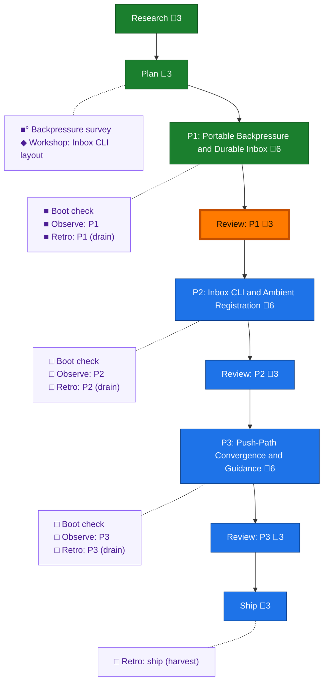

<!-- GENERATED by `harness flow render` — do not hand-edit; regenerate from the flow JSON. -->
# Flow · pij-inbox-no-tmux

**Kind**: flight-plan · **Now**: review-1 · **Next**: phase-2 · **Intent**: Pij inboxes for when we don't have TMUX (mostly for when we on windows) · **Nodes**: 21 · **Events**: 38

**Rail**: ◆─◆─[ ◆─◆─◇─◇─◇─◇─◇ ]  ◆ Research · ◆ Plan · [ ◆ P1: Portable Backpressure and Durable Inbox · ◆ Review: P1 · ◇ P2: Inbox CLI and Ambient Registration · ◇ Review: P2 · ◇ P3: Push-Path Convergence and Guidance · ◇ Review: P3 · ◇ Ship ]

**Legend** — colour = type/status: 🟩 done · 🟢 in-progress · 🟥 blocked · 🟦 known · ⬜ assumed · 🔶 decision · 🗣 user input · 🟪 harness chore (faded = not yet done) · 🤖 companion · 🛠 worker · 🟧 current (you are here). Badges: 💬 comments · 📄 artifacts · 📝 instructions · 🧰 chore (° optional / recommended / ‼ strongly-recommended; ✓ done · ✕ skipped).
