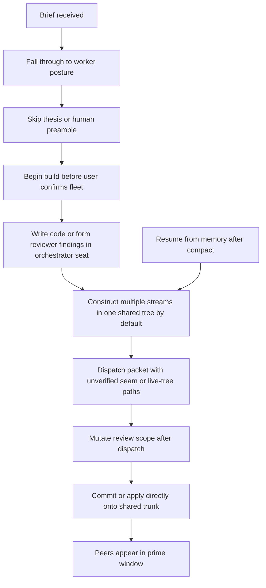

# 042 — pij orchestrator-routing skill: requirements spine

**Mission**: make the correct behavior automatic for a prime-briefed stream orchestrator: understand the work, align with the human, plan through Builder, validate cold, wait for the user's build configuration, delegate implementation and review inside a stream worktree, then land through `/builder 8 ship` and a PR.

**Status**: post-interview r2 — lived evidence folded · **Writer**: `pij-vital-tiglon` · **Date**: 2026-07-12

**Authoritative inputs**:

- `original-ask.md` — Jordan's wishlist §2, verbatim.
- `rulings.md` — in-pane sequencing and `/thesis` rulings.
- `government/briefs/s042-brief.md` — stream scope, fences, report contract, and interview waiver.
- `skills/pij/references/prime/orient-global.md` — portable stream-orchestrator contract.
- `skills/pij/references/routes/prime.md` and `skills/pij/references/routes/pair.md` — current route boundaries.
- `research/vendored/s042-interview-uec99o-response.md` — o-prime, four stream orchestrators, and one fleet's orchestrator/reviewer/coder vertical slice, vendored verbatim.
- `research/vendored/s042-observations-mine-r3.md` — opus deep-mine of run-01 retros, observation buffers, reviews, and execution lessons.
- `research/vendored/s042-interview-uec99o-provenance.md` — source and artifact SHA-256 fingerprints.

---

## AC-0 — governing acceptance test

> A newly briefed orchestrator, with no transcript history and no extra reminder from the user, follows the whole orchestrator journey without doing delegated implementation itself.

Evidence must show that the orchestrator:

1. occupies its own tmux window rather than the prime's window;
2. lands first in a role-stating orchestrator module rather than worker posture;
3. reads the ordered orient stack and invokes `/thesis` before planning;
4. completes a human preamble and records the selected peer configuration;
5. uses guided `/builder` through exploration, workshops/POCs when warranted, and planning;
6. proves acceptance criteria are satisfiable and source-verifies every claimed dependency seam;
7. obtains a cold `/validate-v2` verdict against a frozen plan artifact;
8. stops and waits for the user's build instruction;
9. constructs in a dedicated stream worktree/branch and uses `/pij pair` with a named coder and separate reviewer as splits in the orchestrator's window;
10. sends immutable, worktree-scoped packets and lets the reviewer form findings independently;
11. proves new runtime behavior through an execution leg, not static review alone;
12. keeps the o-prime current and lands through `/builder 8 ship` → branch push → PR → watched CI → confirmed merge; and
13. verifies worker/reviewer claims without becoming the implementer or reviewer, while retaining shared-tree staging/commit choreography only as fallback.

## R1 — deterministic route into the orchestrator role

- **R1.1** A briefed stream orchestrator routes to one dedicated progressive-disclosure module; it must not fall through to generic peer, worker, or o-prime behavior.
- **R1.2** Routing is based on deterministic evidence: current pij identity plus the stream brief/roster role, not on a model's self-selected persona.
- **R1.3** The module states the role boundary immediately: the orchestrator owns outcome, planning, delegation, verification, reporting, and escalation; its fleet owns implementation and deep review.
- **R1.4** The route must fail loudly when the brief or role evidence is missing or contradictory rather than inventing an assignment.
- **R1.5** The module remains progressive-disclosure compliant: one route/module at a time, with pointers to Builder, validation, and pair contracts instead of copied doctrine.
- **R1.6** The disclosure ladder is module-first, then `orient-global → orient-local → stream brief → /thesis → preamble`; the role boundary must land before any heavy orient read.

## R2 — automatic thesis before procedural work

- **R2.1** After reading the orient stack and brief, the orchestrator actually invokes the installed `/thesis` skill through the host skill mechanism.
- **R2.2** The invocation happens before Builder planning and before proposing implementation details.
- **R2.3** The thesis output frames the preamble around purpose, current truth, destination, and invariants; it does not replace the human preamble.
- **R2.4** A missing `/thesis` skill is surfaced as a blocking setup error for this route; the orchestrator must not improvise a thesis-shaped answer from memory.
- **R2.5** Run-01 proves the value of arriving at preamble with a crisp thesis-shaped read, but did not practice the named `/thesis` step; the shipped route must test the actual invocation rather than claim historical proof.

## R3 — human preamble and durable rulings

- **R3.1** Assignment remains provisional through `adopt → orient → preamble`; planning starts only after the human confirms the work.
- **R3.2** The orchestrator arrives at preamble with the ask location, its thesis, its proposed next move, and material open questions.
- **R3.3** Human words in-pane are rulings and land immediately in the plan folder.
- **R3.4** The preamble closes with an upward checkpoint file using `claim · artifacts[] · shas[] · gates[] · observations[] · open[]`.
- **R3.5** The route asks for and records the preferred coder/reviewer configuration at the top of the durable work artifacts.
- **R3.6** The default profile is separate Copilot peers using `gpt-5.6-sol` at `xhigh` effort unless the user chooses another named harness/model combination.
- **R3.7** Applying the default requires reading it back to the human and recording that confirmation verbatim.
- **R3.8** Same-model separate-session review is the default lived pattern; cross-model critics are recommended for CS-4+ plan validation and ship/capstone verdicts.

## R4 — Builder owns exploration and planning

- **R4.1** The orchestrator creates or resumes a CLI-owned Builder flight plan; it never hand-edits `the-flow.json` or `the-flow.md`.
- **R4.2** Guided `/builder` is the planning authority: explore first when the surface is not already understood, then produce the unified business specification and implementation plan.
- **R4.3** After exploration, the orchestrator explicitly surfaces workshop and POC opportunities to the user.
- **R4.4** Workshops/POCs run only where they resolve a real decision, test a risky assumption, or materially change phase design.
- **R4.5** Workshop decisions become authoritative plan inputs and are folded back through a fresh plan pass.
- **R4.6** The orchestrator may perform short read-only investigation, artifact preparation, and verification locally; it does not perform implementation tasks that belong to the future coder.
- **R4.7** A workshop earns its place only when its outcome changes a plan sentence, phase boundary, acceptance criterion, or risk treatment.
- **R4.8** Before a plan can gate work, the orchestrator validates that every acceptance criterion is mathematically and operationally satisfiable.

## R5 — cold plan validation

- **R5.1** A completed plan is frozen with a recorded SHA before validation.
- **R5.2** `/validate-v2` runs cold in a fresh subagent or pij peer that did not author the plan.
- **R5.3** The validator receives the artifact path and frozen SHA, not a prose retelling of the plan.
- **R5.4** The validator checks plan claims against live source, task paths against fences, acceptance-criterion satisfiability, and dependency seams rather than reviewing prose alone.
- **R5.5** Cross-model validation is the default for CS-4+ plans because lived runs found material plan/contract gaps at this seam.
- **R5.6** Findings route back through Builder planning; the plan is re-frozen and revalidated until its recorded verdict is acceptable.
- **R5.7** The orchestrator independently verifies the verdict artifact exists and matches the frozen SHA before reporting it upward.

## R6 — wait-for-build-configuration gate

- **R6.1** A validated plan does not authorize implementation.
- **R6.2** The orchestrator stops at a visible `WAITING_FOR_BUILD_CONFIG` state and tells the user which recorded default will apply if they choose it.
- **R6.3** No coder or reviewer is spawned and no implementation packet is dispatched until the user gives the build instruction or explicitly confirms the recorded default.
- **R6.4** The selected coder and reviewer harness/model/effort are recorded before fleet creation.
- **R6.5** A later user override replaces the recorded selection explicitly; the route never silently mixes old and new configuration.
- **R6.6** Hold instructions state the principle—use the wait for all non-contending preparation—rather than an exhaustive list that permits idle time once its examples are exhausted.

## R7 — delegated implementation with separate review

- **R7.1** Implementation runs through `/pij pair`, using one named coder peer and one separate named reviewer peer.
- **R7.2** "Separate reviewer" means a distinct session and pane even when the selected model is the same as the coder's.
- **R7.3** Before dispatch, the orchestrator source-verifies every claimed exported seam; an absent seam becomes a brokered fence/grant decision, never a coder approximation or unauthorized cross-fence edit.
- **R7.4** The coder packet freezes the exact worktree/branch, parent SHA, composition, allowed paths, forbidden paths, evidence schema, tests, mutation/budget proof, baton ownership, and done signal.
- **R7.5** Construction defaults to one git worktree and branch per stream; coder and reviewer operate inside that worktree. Scratch/staging plus apply-window choreography is retained only when worktrees are unavailable.
- **R7.6** The reviewer is acquired cold and aimed at the semantic/runtime surface the orchestrator's deterministic checks cannot prove; it receives the actual diff and an immutable review packet.
- **R7.7** After review dispatch, environment or scope changes require stop-and-rebrief; incremental mid-review addenda are forbidden.
- **R7.8** The orchestrator supplies constraints and late evidence but lets the reviewer form findings before adding review conclusions.
- **R7.9** Review findings return to the coder as a narrowed fix packet; no fix packet may be rendered from an empty or unpersisted findings set.
- **R7.10** The orchestrator performs the final cheap sanity check over the load-bearing hunk and proof before accepting a reviewer verdict.
- **R7.11** New-behavior work carries a real execution/smoke leg because static cold review cannot clear runtime semantics.
- **R7.12** Healthy coder/reviewer peers are compacted and reused across phases; only peers spawned by this orchestrator are torn down.

## R8 — tmux placement is part of the contract

- **R8.1** Every new stream orchestrator is created in a new tmux window in the governing tmux session.
- **R8.2** An orchestrator pane must never be inserted into the o-prime's window.
- **R8.3** The orchestrator's coder and reviewer panes are splits inside the orchestrator's own window and inherit the stream worktree as their working directory.
- **R8.4** Placement is mechanically verified from registry/canary evidence plus a tmux pane snapshot before the stream is marked ready.
- **R8.5** A placement mismatch is repaired before work starts and recorded as an incident/observation; it is not accepted as harmless layout drift.
- **R8.6** This topology is lived evidence, not a speculative preference: all four interviewed fleets used orchestrator-owned windows with worker/reviewer splits and an isolated o-prime window.

## R9 — resume, compaction, and communication

- **R9.1** Durable state lives in the plan folder and Builder flight plan, so `/compact` or seat replacement does not erase position.
- **R9.2** After compaction or a long gap, the orchestrator re-derives state from substrate—identity, git history, flow/government files, then re-verified peer claims—before acting; memory is never position truth.
- **R9.3** Pointer communication is mandatory for briefs, plans, packets, verdicts, and reports; messages carry paths, not bodies.
- **R9.4** Cross-stream contact routes through the o-prime unless a human-recorded waiver exists.
- **R9.5** The orchestrator never runs long blocking subagents in its own seat; use a spawned peer when validation or research would make the seat deaf.
- **R9.6** Daemon restarts, spawn freezes, and exclusive git operations obey the o-prime's baton/window notices.
- **R9.7** The orchestrator keeps its o-prime current throughout the journey with event-driven pointer reports at preamble, plan/validation completion, phase checkpoints, blockers, human rulings, coordination changes, and ship; it does not wait until the end or send empty heartbeat chatter.

## R10 — worktree construction, PR landing, and fallback discipline

- **R10.1** Each stream constructs in its own git worktree and branch; git isolates working trees and indexes so sibling construction does not require hand-rolled quarantine or trunk apply windows.
- **R10.2** The o-prime records the stream's worktree path and branch in the brief/roster before spawn; the orchestrator verifies both before planning or dispatch.
- **R10.3** The default landing seam is `/builder 8 ship`: push the stream branch, open a PR, watch CI, and merge through the PR using the verb's separate confirmations.
- **R10.4** Worktrees isolate trees, not claims: dependency seams, parent SHAs, acceptance criteria, review composition, and evidence remain substrate-verified.
- **R10.5** Measurement work still serializes on timing purity even across worktrees; a holder's verified return, never process inference, closes the baton window.
- **R10.6** Merge conflicts and cross-stream contract collisions move to the PR/merge seam; the o-prime still brokers ownership and sequencing.
- **R10.7** If a worktree cannot be used, fallback shared-tree work requires scratch/staging for new source, pathspec commits, staged-set verification, and commit slots while siblings hold apply windows.
- **R10.8** Wrapper commands are not assumed build-neutral; the orchestrator verifies what each composite command actually runs before granting concurrent use.

## R11 — structural backpressure

- **R11.1** `skills/pij/SKILL.md` registers the orchestrator route/module exactly once.
- **R11.2** `just pij-skill-check` verifies registry/module parity, relative-link integrity, line budget, and progressive-disclosure boundaries for the new surface.
- **R11.3** The check asserts the module contains or resolves: module-first role landing, real `/thesis`, human preamble, Builder, cold `/validate-v2`, AC/seam verification, wait-for-build-config, stream worktree/branch, `/pij pair`, immutable packets, aimed separate review, tmux placement, prime reporting, and `/builder 8 ship`.
- **R11.4** The check fails if the module permits direct implementation, premature reviewer findings, mutable review scope, unverified dependency seams, empty-finding fix packets, shared-trunk construction as the default, direct trunk landing, or implementation before user fleet confirmation.
- **R11.5** Live-deployed skill changes require `just pij-skill-check`, targeted tests, and an o-prime look before commit.

## R12 — field evidence and learning

- **R12.1** The current session's initial "awaiting work packet" misclassification is the first regression fixture: a spawn task naming an orchestrator must not route to worker posture.
- **R12.2** The `pij-uec99o` interview prioritizes `OBSERVED` lived evidence; `RECOMMENDED` material is secondary design input, never authority over Jordan's rulings.
- **R12.3** Cross-government interview material is vendored verbatim with SHA-256 provenance before citation.
- **R12.4** The evidence set includes a complete fleet vertical slice—stream orchestrator, read-only reviewer, and implementation coder—plus four stream-orchestrator accounts.
- **R12.5** Contradictions and interviewer self-corrections remain visible; the product must not retcon the lived record to fit the design.

## Lived-evidence anchors

- **Packaging was the dominant orchestrator risk in the shared-tree run**: every shared-tree defect came from packet paths, quarantine/registration surfaces, manifests, or unverified premises rather than reviewed production code; worktree-per-stream construction is selected to delete most of this class structurally.
- **Commit safety remains a fallback/trunk concern**: one bare shared-index commit swept 24 sibling-staged files with zero fileset overlap; worktree-local commits avoid that index collision, while shared-trunk fallback retains strict discipline.
- **Retro-to-packet learning compounds**: in-window fix loops fell from P2's 3 to P3's 0 after retro norms were copied verbatim into dispatch packets; P3 landed 585/585 first-run green.
- **Independence is structural and aimed**: same-model separate-session review found real HIGH defects; cross-model validation/review added value at CS-4+ plan and capstone seams.
- **Static review has a ceiling**: 3 of 8 new-behavior facts in one phase escaped static review and surfaced only in the execution window.
- **Unsatisfiable gates are plan defects**: one impossible acceptance bar consumed three windowed runs and two review holds.
- **Substrate-first converged independently**: orchestrator, reviewer, and coder all reached the same rule—verify the live seam and immutable composition before binding another seat to it.

---

## New-orchestrator journey

```mermaid
flowchart TD
    A[Prime allocates stream worktree, branch, brief, and tmux window]
    B[Spawn or adopt orchestrator in its window and worktree]
    C[Canary: nonce, registry identity, footer model and effort]
    D[Deliver brief pointer and receive brief-ack]
    E[Dedicated module states orchestrator role and boundary]
    F[Read global orient, local orient, and item brief in order]
    G[Invoke /thesis through host skill mechanism]
    H[Human preamble confirms assignment]
    I[Ask, read back, and record coder plus reviewer configuration]
    J[Write preamble checkpoint upward]
    K[Create or resume guided Builder flight plan]
    L[Explore current code and evidence]
    M{Workshop or POC needed?}
    N[Run focused workshop or POC]
    O[Builder writes unified spec and implementation plan]
    P[Prove AC satisfiability, fences, and claimed source seams]
    Q[Freeze plan SHA]
    R[Cold cross-model /validate-v2 reads plan and live source]
    S{Verdict acceptable for frozen SHA?}
    T[Fold findings into Builder plan]
    U[WAITING_FOR_BUILD_CONFIG]
    V[User confirms default or names coder and reviewer config]
    W[Verify worktree/branch, source seams, and missing grants]
    X[Start /pij pair; create coder and reviewer splits in worktree]
    Y[Freeze worktree-scoped coder packet and immutable composition]
    Z[Coder implements bounded phase]
    AA[Freeze and aim separate reviewer packet]
    AB[Reviewer forms findings independently]
    AC{Fix required?}
    AD[Persist findings and return narrowed fix packet to coder]
    AE[Run execution/smoke proof for new behavior]
    AF[Sanity-check proof and commit on stream branch]
    AG[Checkpoint o-prime with paths, SHAs, gates, and blockers]
    AH{More phases?}
    AI[/builder 8 ship: push branch, open PR, watch CI]
    AJ[Confirmed PR merge; report and tear down owned peers]

    A --> B --> C --> D --> E --> F --> G --> H --> I --> J --> K --> L --> M
    M -- Yes --> N --> O
    M -- No --> O
    O --> P --> Q --> R --> S
    S -- No --> T --> O
    S -- Yes --> U --> V --> W --> X --> Y --> Z --> AA --> AB --> AC
    AC -- Yes --> AD --> Z
    AC -- No --> AE --> AF --> AG --> AH
    AH -- Yes --> W
    AH -- No --> AI --> AJ
```

## Explicit anti-journey



Every edge in this anti-journey is a failure the route and its structural checks must make difficult or impossible.

## Open design questions after the interview

1. Does the dedicated orchestrator landing live as a new top-level route or as a role module selected inside `prime`?
2. How can `pij-skill-check` prove a real host `/thesis` invocation rather than merely finding the word in prose?
3. Should cross-model validation be mandatory for CS-4+ plans and capstone reviews, or remain a strong default?
4. Where should current `flow-pair` fix-packet ingestion be repaired so reviewer findings cannot disappear into an empty fix packet?
5. Should tmux topology verification become a pij CLI affordance or remain a skill-driven `tmux list-panes` check?
6. Which layer owns worktree creation/cleanup and records the branch/path: kickoff ritual only, or a future pij CLI affordance?
