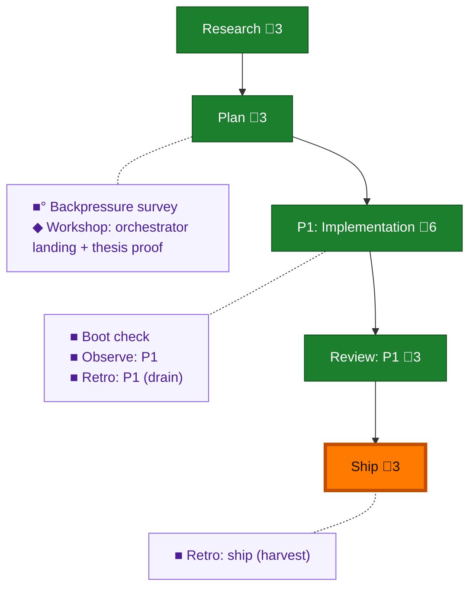

<!-- GENERATED by `harness flow render` — do not hand-edit; regenerate from the flow JSON. -->
# Flow · pij-orchestrator-routing-skill

**Kind**: flight-plan · **Now**: ship · **Intent**: Build the skill module a briefed pij orchestrator routes to: auto-run /thesis, guide preamble and /builder planning, cold /validate-v2, wait for user build config, then /pij pair with a named coder and separate reviewer in the orchestrator's own tmux window. · **Nodes**: 11 · **Events**: 34

**Rail**: ◆─◆─[ ◆─◆─◆ ]  ◆ Research · ◆ Plan · [ ◆ P1: Implementation · ◆ Review: P1 · ◆ Ship ]

**Legend** — colour = type/status: 🟩 done · 🟢 in-progress · 🟥 blocked · 🟦 known · ⬜ assumed · 🔶 decision · 🗣 user input · 🟪 harness chore (faded = not yet done) · 🤖 companion · 🛠 worker · 🟧 current (you are here). Badges: 💬 comments · 📄 artifacts · 📝 instructions · 🧰 chore (° optional / recommended / ‼ strongly-recommended; ✓ done · ✕ skipped).
