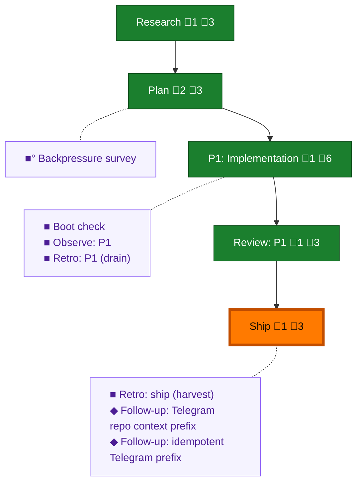

<!-- GENERATED by `harness flow render` — do not hand-edit; regenerate from the flow JSON. -->
# Flow · telegram-last-speaker-routing

**Kind**: flight-plan · **Now**: ship · **Intent**: GitHub issue #8 — bare Telegram messages route to the last agent that spoke; reply-to and explicit name matching remain unchanged. · **Nodes**: 12 · **Events**: 45

**Rail**: ◆─◆─[ ◆─◆─◆ ]  ◆ Research · ◆ Plan · [ ◆ P1: Implementation · ◆ Review: P1 · ◆ Ship ]

**Legend** — colour = type/status: 🟩 done · 🟢 in-progress · 🟥 blocked · 🟦 known · ⬜ assumed · 🔶 decision · 🗣 user input · 🟪 harness chore (faded = not yet done) · 🤖 companion · 🛠 worker · 🟧 current (you are here). Badges: 💬 comments · 📄 artifacts · 📝 instructions · 🧰 chore (° optional / recommended / ‼ strongly-recommended; ✓ done · ✕ skipped).

## Node log

### research · Research
- 📄 artifacts: docs/plans/043-telegram-last-speaker-routing/research-dossier.md

### plan · Plan
- 📄 artifacts: docs/plans/043-telegram-last-speaker-routing/telegram-last-speaker-routing-plan.md, docs/plans/043-telegram-last-speaker-routing/validations/telegram-last-speaker-routing-plan-validation.md

### phase-1 · P1: Implementation
- 📄 artifacts: docs/plans/043-telegram-last-speaker-routing/execution.log.md

### review-1 · Review: P1
- 📄 artifacts: docs/plans/043-telegram-last-speaker-routing/reviews/review.phase-1-r3.md

### ship · Ship
- 📄 artifacts: docs/plans/043-telegram-last-speaker-routing/ship/2026-07-12/ship-report.md

### backpressure · Backpressure survey
- 📄 artifacts: docs/plans/043-telegram-last-speaker-routing/backpressure-coverage.md

### retro-1 · Retro: P1 (drain)
- 📄 artifacts: .harness/records/retro/2026-07-12/003-043-telegram-last-speaker-routing.md

### retro-ship · Retro: ship (harvest)
- 📄 artifacts: .harness/records/retro/2026-07-12/003-043-telegram-last-speaker-routing.md

### change-001 · Follow-up: Telegram repo context prefix
- 📄 artifacts: docs/plans/043-telegram-last-speaker-routing/reviews/review.r8-r2.md

### change-002 · Follow-up: idempotent Telegram prefix
- 📄 artifacts: docs/plans/043-telegram-last-speaker-routing/reviews/review.r9-r2.md, docs/plans/043-telegram-last-speaker-routing/ship/2026-07-12/ship-report.md
