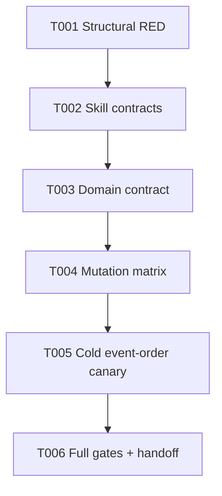
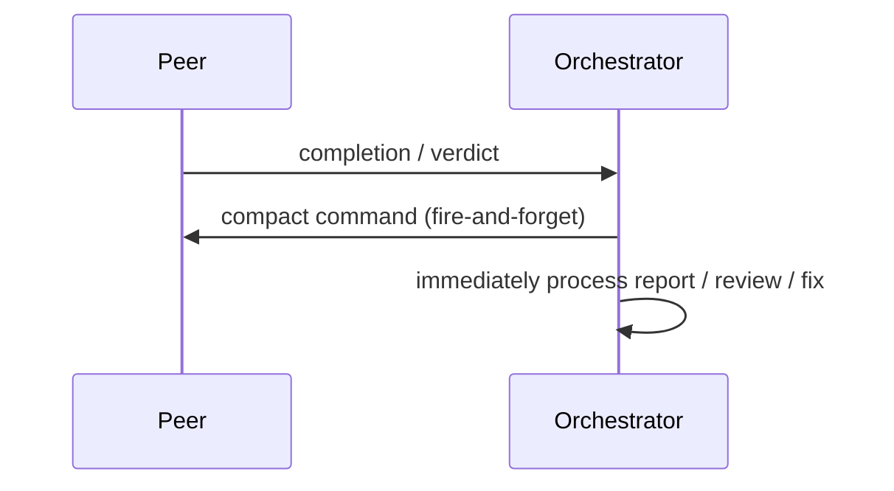

# Phase 1: Completion-First Peer Compaction

## Executive Briefing

**Purpose**: Restore completion-time compact as an always-loaded, route-executable, fire-and-forget interrupt and make the contract mutation-resistant. Preserve every PR #9 delivery-owned-waiting behavior while changing no product mechanics.

**What We're Building**: A five-file skill/harness change: structural RED first, root/C3/pair contract updates, domain alignment, mutation proof, and a cold reusable-peer event-order canary.

**Goals**

- ✅ Compact is the first action after coder completion and reviewer verdict.
- ✅ Compact sends never use `--wait` and never gate report/review/fix work.
- ✅ Root invariant 5 and C7 continue requiring external `pij inbox --wait`.
- ✅ One-shot auto-dissolve remains an explicit `E-DEAD` exception.
- ✅ Structural mutations prevent future compression or ownership drift.

**Non-Goals**

- ❌ No CLI, daemon, messaging, flow-pair engine, package, schema, or dependency changes.
- ❌ No daemon restart or global skill-link mutation.
- ❌ No broad rejection of `--wait`; only compact waiting is forbidden.

## Prior Phase Context

Research and planning are complete. Plan v1.8 is R9 `VALIDATED` at sha256 `a422da9f735a2be20fd00c9ed9fb8a147d876791cf2bf9164760b83c9c277018` on post-PR9 base `1336291a5a2285d37487cf83bda86b7438ba93c4`.

## Pre-Implementation Check

| File | Exists? | Domain Check | Notes |
|------|---------|--------------|-------|
| `/Users/jordanknight/pi-hacking/pij-worktrees/s044-compact-before-redispatch/skills/pij/SKILL.md` | yes | `pij-skill` contract | Preserve root invariant 5 exactly; add completion interrupt separately. |
| `/Users/jordanknight/pi-hacking/pij-worktrees/s044-compact-before-redispatch/skills/pij/references/00-routing.md` | yes | `pij-skill` contract | Modify C3 only; preserve C1/C7 external pull semantics. |
| `/Users/jordanknight/pi-hacking/pij-worktrees/s044-compact-before-redispatch/skills/pij/references/routes/pair.md` | yes | `pij-skill` contract | Restore route-local completion sequence and reload-first safety. |
| `/Users/jordanknight/pi-hacking/pij-worktrees/s044-compact-before-redispatch/harness/scripts/pij-skill-check.sh` | yes | `extension-authoring-harness` cross-domain | Sensor first; `PIJ_SKILL_ROOT` fixture seam exists. |
| `/Users/jordanknight/pi-hacking/pij-worktrees/s044-compact-before-redispatch/docs/domains/pij-skill/domain.md` | yes | `pij-skill` contract | Preserve Pull guidance concept, invariant, and plan-041 history row. |

## Architecture Map



## Tasks

| Status | ID | Task | Domain | Path(s) | Done When | Notes |
|--------|-----|------|--------|---------|-----------|-------|
| [x] | T001 | Extend `pij-skill-check` with exact root invariant 5, root completion interrupt, C3, pair, and C7 marker/order checks. Reject compact `--wait` and receipt gates without rejecting `pij inbox --wait`; capture focused RED before payload edits. | `extension-authoring-harness` | `/Users/jordanknight/pi-hacking/pij-worktrees/s044-compact-before-redispatch/harness/scripts/pij-skill-check.sh` | Current payload fails only the newly added completion contract while existing PR #9 checks remain green. | Structural sensor first. |
| [x] | T002 | Add the always-loaded completion interrupt, replace C3 receipt gating with reusable/live fire-and-forget semantics plus one-shot boundary, and restore a concise route-local compact-early sequence for coder/reviewer completion. | `pij-skill` | `/Users/jordanknight/pi-hacking/pij-worktrees/s044-compact-before-redispatch/skills/pij/SKILL.md`; `/Users/jordanknight/pi-hacking/pij-worktrees/s044-compact-before-redispatch/skills/pij/references/00-routing.md`; `/Users/jordanknight/pi-hacking/pij-worktrees/s044-compact-before-redispatch/skills/pij/references/routes/pair.md` | Root invariant 5 unchanged; compact first/no `--wait`/immediate continuation explicit; C1/C7 and inbox waiting byte-faithful; line budgets pass. | Historical baseline `eee2367`, superseded by R5. |
| [x] | T003 | Add completion-first compaction to the `pij-skill` domain concepts/invariants/history without duplicating route prose. | `pij-skill` | `/Users/jordanknight/pi-hacking/pij-worktrees/s044-compact-before-redispatch/docs/domains/pij-skill/domain.md` | Completion concept and structural/cold proof are named; Pull guidance seam and plan-041 history remain intact. | No `docs/how` change. |
| [x] | T004 | Mutation-prove every load-bearing marker with copied `PIJ_SKILL_ROOT` fixtures. | `extension-authoring-harness` | `.harness/temp/s044/**`; `/Users/jordanknight/pi-hacking/pij-worktrees/s044-compact-before-redispatch/harness/scripts/pij-skill-check.sh` | Root invariant removal, root interrupt removal, C3 ownership/lifecycle removal, pair ordering/reviewer/safety removal, C7 pull removal, compact `--wait`, and receipt-gate mutations each fail; unchanged inbox-wait fixture remains green; sources byte-identical after tests. | No mocks. |
| [x] | T005 | Run isolated reusable-peer coder-completion and reviewer-verdict canaries against the worktree skill. | `pij-skill` | `.harness/temp/s044/**`; `docs/plans/044-compact-before-redispatch/validation/cold-completion-canary.md`; `docs/plans/044-compact-before-redispatch/validation/one-shot-compact-evidence.md` | Event trace shows compact send without `--wait` first, immediate report/review/fix continuation, no receipt polling/blocking, correct worktree skill resolution, and retained one-shot `E-DEAD` boundary. | Project-local skill only; never repoint global main. |
| [x] | T006 | Run `just pij-skill-check`, mutation matrix, cold canary, and `harness checks`; persist changed paths and handoff for cold review. | `extension-authoring-harness` | all five granted files plus plan evidence | Non-plan diff equals the exact five-file grant; gates green except any explicitly ruled pre-existing smoke debt; no forbidden path touched. | Do not commit/push/restart. |

## Context Brief

Environment friction is work: fix small reversible issues, otherwise capture them with `harness observe` and record them in the execution log.

**Key findings**

- The old monolithic skill made compact an unmistakable first-action interrupt.
- R5 supersedes all receipt waiting: send compact and continue immediately.
- PR #9 makes `pij inbox --wait` a required external delivery primitive; compact wait checks must be narrow.
- Root invariant 5 and C7 require independent preservation sensors.

**Domain constraints**

- `pij-skill`: progressive disclosure; C3 shared prose remains single-owner.
- `extension-authoring-harness`: checks must prove exact contract markers without overclaiming universal LLM behavior.
- `pij-messaging` / `pij-control-plane`: consume existing compact and receipt behavior only.



## Discoveries & Learnings

| Date | Task | Type | Discovery | Resolution | References |
|------|------|------|-----------|------------|------------|

## Directory Layout

```text
docs/plans/044-compact-before-redispatch/
  tasks/phase-1-completion-first-peer-compaction/
    tasks.md
    execution.log.md
```
