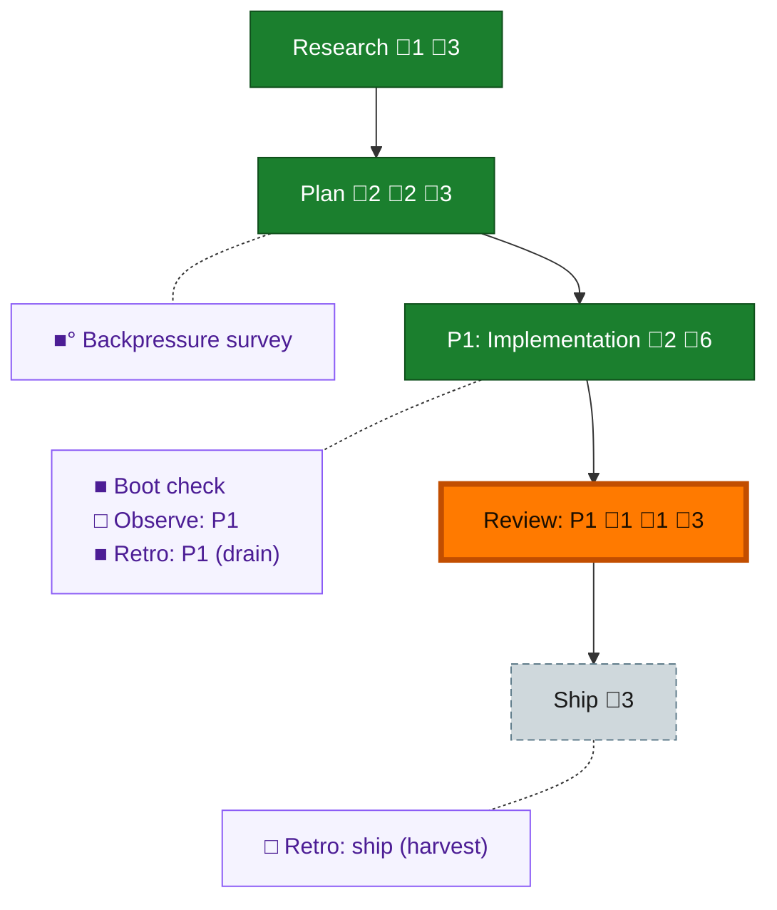

<!-- GENERATED by `harness flow render` — do not hand-edit; regenerate from the flow JSON. -->
# Flow · compact-before-redispatch

**Kind**: flight-plan · **Now**: review-1 · **Next**: ship · **Intent**: Investigate and plan a mechanical compact-before-redispatch guarantee at the dispatch seam without assuming the implementation shape. · **Nodes**: 10 · **Events**: 30

**Rail**: ◆─◆─[ ◆─◆─◇ ]  ◆ Research · ◆ Plan · [ ◆ P1: Implementation · ◆ Review: P1 · ◇ Ship ]

**Legend** — colour = type/status: 🟩 done · 🟢 in-progress · 🟥 blocked · 🟦 known · ⬜ assumed · 🔶 decision · 🗣 user input · 🟪 harness chore (faded = not yet done) · 🤖 companion · 🛠 worker · 🟧 current (you are here). Badges: 💬 comments · 📄 artifacts · 📝 instructions · 🧰 chore (° optional / recommended / ‼ strongly-recommended; ✓ done · ✕ skipped).

## Node log

### research · Research
- 📄 artifacts: docs/plans/044-compact-before-redispatch/research-dossier.md

### plan · Plan
- 📄 artifacts: docs/plans/044-compact-before-redispatch/compact-before-redispatch-plan.md, docs/plans/044-compact-before-redispatch/validation/compact-before-redispatch-plan-validation-r9.md
- `2026-07-12T22:30:01.709Z` · — · decision — Jordan R5 superseded receipt gating: compact is fire-and-forget with no --wait; plan v1.5 requires cold revalidation.
- `2026-07-13T00:01:35.252Z` · — · validation — Post-PR9 reread found material C7 push-vs-pull drift; plan v1.7 preserves inbox waiting and requires cold revalidation.

### phase-1 · P1: Implementation
- 📄 artifacts: docs/plans/044-compact-before-redispatch/reports/coder-completion-dlg-0002.md, docs/plans/044-compact-before-redispatch/validation/cold-completion-canary.md

### review-1 · Review: P1
- 📄 artifacts: docs/plans/044-compact-before-redispatch/reviews/review.phase-1.md
- `2026-07-13T03:19:39.128Z` · — · validation — Cold review FIX_REQUIRED: F-001 execution/progress artifact absent; F-002 additive receipt-gate mutation stayed green.

### backpressure · Backpressure survey
- 📄 artifacts: docs/plans/044-compact-before-redispatch/backpressure-coverage.md

### retro-1 · Retro: P1 (drain)
- 📄 artifacts: .harness/records/retro/2026-07-13/001-044-compact-before-redispatch-phase-1.md
