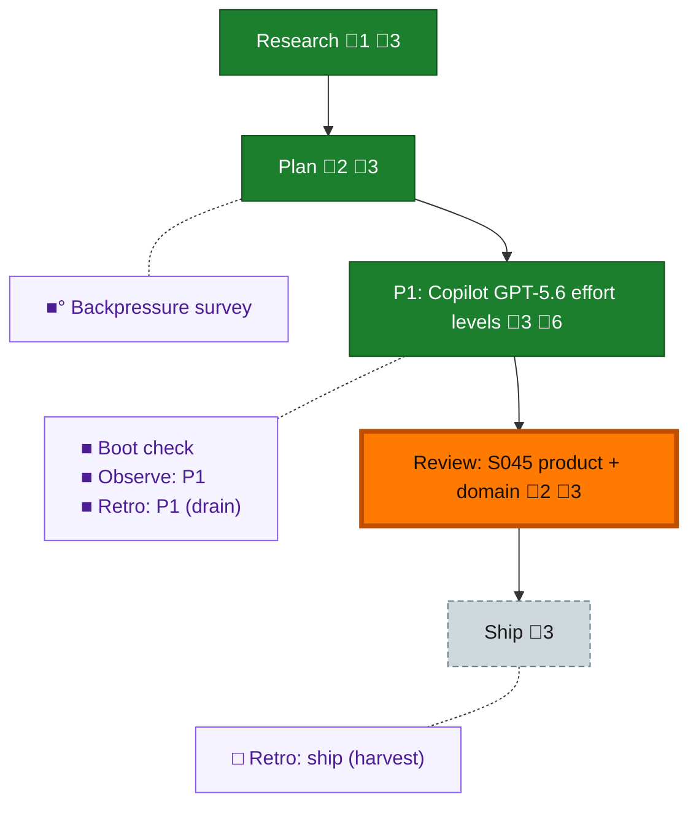

<!-- GENERATED by `harness flow render` — do not hand-edit; regenerate from the flow JSON. -->
# Flow · copilot-5-6-effort-levels

**Kind**: flight-plan · **Now**: review-1 · **Next**: ship · **Intent**: next thing is copilot is not advertising the correct efffort levelts for sol, terra, luna. · **Nodes**: 10 · **Events**: 27

**Rail**: ◆─◆─[ ◆─◆─◇ ]  ◆ Research · ◆ Plan · [ ◆ P1: Copilot GPT-5.6 effort levels · ◆ Review: S045 product + domain · ◇ Ship ]

**Legend** — colour = type/status: 🟩 done · 🟢 in-progress · 🟥 blocked · 🟦 known · ⬜ assumed · 🔶 decision · 🗣 user input · 🟪 harness chore (faded = not yet done) · 🤖 companion · 🛠 worker · 🟧 current (you are here). Badges: 💬 comments · 📄 artifacts · 📝 instructions · 🧰 chore (° optional / recommended / ‼ strongly-recommended; ✓ done · ✕ skipped).

## Node log

### research · Research
- 📄 artifacts: docs/plans/045-copilot-5-6-effort-levels/research-dossier.md

### plan · Plan
- 📄 artifacts: docs/plans/045-copilot-5-6-effort-levels/copilot-5-6-effort-levels-plan.md, docs/plans/045-copilot-5-6-effort-levels/validations/copilot-5-6-effort-levels-plan-validation.md

### phase-1 · P1: Copilot GPT-5.6 effort levels
- 📄 artifacts: docs/plans/045-copilot-5-6-effort-levels/reviews/review.phase-1.dlg-0002.md, docs/plans/045-copilot-5-6-effort-levels/reviews/review.domain-integration.dlg-0004.md, docs/plans/045-copilot-5-6-effort-levels/tasks/phase-1/execution.log.md

### review-1 · Review: S045 product + domain
- 📄 artifacts: docs/plans/045-copilot-5-6-effort-levels/reviews/review.phase-1.dlg-0002.md, docs/plans/045-copilot-5-6-effort-levels/reviews/review.domain-integration.dlg-0004.md

### backpressure · Backpressure survey
- 📄 artifacts: docs/plans/045-copilot-5-6-effort-levels/backpressure-coverage.md

### retro-1 · Retro: P1 (drain)
- 📄 artifacts: .harness/records/retro/2026-07-13/001-045-copilot-5-6-effort-levels.md
