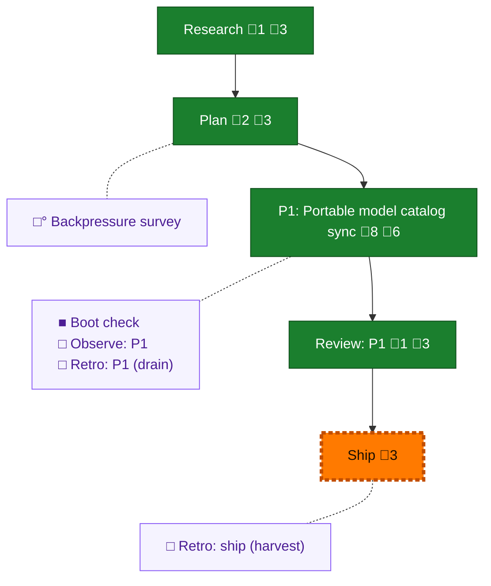

<!-- GENERATED by `harness flow render` — do not hand-edit; regenerate from the flow JSON. -->
# Flow · portable-pi-models

**Kind**: flight-plan · **Now**: ship · **Intent**: models needs to be in, auth out, skills out; exclude local provider · **Nodes**: 10 · **Events**: 25

**Rail**: ◆─◆─[ ◆─◆─◇ ]  ◆ Research · ◆ Plan · [ ◆ P1: Portable model catalog sync · ◆ Review: P1 · ◇ Ship ]

**Legend** — colour = type/status: 🟩 done · 🟢 in-progress · 🟥 blocked · 🟦 known · ⬜ assumed · 🔶 decision · 🗣 user input · 🟪 harness chore (faded = not yet done) · 🤖 companion · 🛠 worker · 🟧 current (you are here). Badges: 💬 comments · 📄 artifacts · 📝 instructions · 🧰 chore (° optional / recommended / ‼ strongly-recommended; ✓ done · ✕ skipped).

## Node log

### research · Research
- 📄 artifacts: docs/plans/047-portable-pi-models/research-dossier.md

### plan · Plan
- 📄 artifacts: docs/plans/047-portable-pi-models/portable-pi-models-plan.md, docs/plans/047-portable-pi-models/validations/portable-pi-models-plan-validation.md

### phase-1 · P1: Portable model catalog sync
- 📄 artifacts: .pi/models.json, harness/scripts/sync-models.ts, harness/scripts/sync-models.test.ts, justfile, AGENTS.md, RUNBOOK.md, docs/how/build.md, docs/how/update-pi.md

### review-1 · Review: P1
- 📄 artifacts: docs/plans/047-portable-pi-models/reviews/review.phase-1.md
