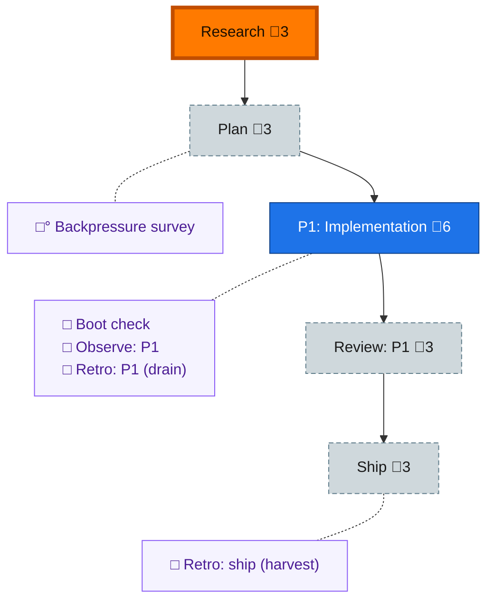

<!-- GENERATED by `harness flow render` — do not hand-edit; regenerate from the flow JSON. -->
# Flow · focus-agents

**Kind**: flight-plan · **Now**: research · **Intent**: Focus agents — freeze a peer's golden native-session context as a named immutable checkpoint and launch fresh forks on demand across pi/claude/copilot/codex · **Nodes**: 10 · **Events**: 1

**Rail**: ◐─◇─[ ◇─◇─◇ ]  ◐ Research · ◇ Plan · [ ◇ P1: Implementation · ◇ Review: P1 · ◇ Ship ]

**Legend** — colour = type/status: 🟩 done · 🟢 in-progress · 🟥 blocked · 🟦 known · ⬜ assumed · 🔶 decision · 🗣 user input · 🟪 harness chore (faded = not yet done) · 🤖 companion · 🛠 worker · 🟧 current (you are here). Badges: 💬 comments · 📄 artifacts · 📝 instructions · 🧰 chore (° optional / recommended / ‼ strongly-recommended; ✓ done · ✕ skipped).
