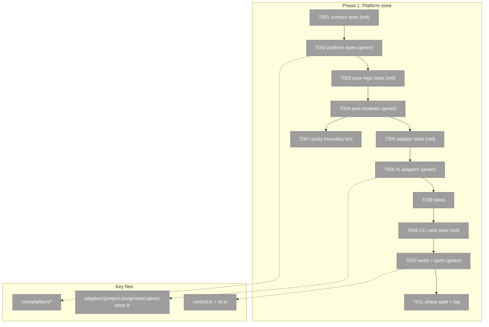

# Phase 1: Platform store — tasks & context brief
**Plan**: [pij-grown-up-plan.md](../../pij-grown-up-plan.md) (v1.1.0 READY) · **Phase**: 1 of 4 · **Created**: 2026-07-16
**Mode**: Full · TDD (tests precede impl, house fakes discipline) · Ultracode build (max 5 agents/workflow — R5)

## Executive Briefing

- **Purpose**: Stand up the machine-wide platform store — Project, Assignment, and SpineEvent records with an attribution envelope — plus the fs adapters and `pij project` / `pij spine` CLI verbs over them. Every later phase writes *through* this layer, so its schemas and append-only semantics are the load-bearing deliverable.
- **What We're Building**: `core/platform/` (pure types + logic), three fs adapters under new `~/.pij` subdirs (`projects/`, `assignments/`, `spine/`), fakes for downstream phases, and pure-core CLI verbs with `--json` envelopes.
- **Goals**: ✅ schema-versioned records with type guards · ✅ append-only attributed unified spine log (replay-idempotent) · ✅ project CRUD/link verbs (AC-01) · ✅ spine append + exact `--peer`/`--project` filters (AC-02) · ✅ attribution envelope on every write (AC-03) · ✅ architecture purity of the new core.
- **Non-Goals**: ❌ node/descriptor changes (Phase 2) · ❌ tree enforcement (Phase 3) · ❌ spine markdown render + migration posture (Phase 4) · ❌ any canonical/global/daemon mutation (R3 — all tests run in temp `PIJ_HOME`).

## Pre-Implementation Check

| File | Exists? | Domain Check | Notes |
|------|---------|-------------|-------|
| `.pi/extensions/pij/core/platform/types.ts` (+ .test) | create | pij-orchestration ✓ | no existing project/assignment/spine module anywhere (scout: NEW confirmed) |
| `.pi/extensions/pij/core/platform/project.ts` / `assignment.ts` / `spine.ts` (+ .tests) | create | pij-orchestration ✓ | pure core — no pi/daemon/tmux imports |
| `.pi/extensions/pij/core/platform/boundary.test.ts` | create | pij-orchestration ✓ | clone of `core/agents/boundary.test.ts` pattern |
| `.pi/extensions/pij/adapters/project-store.ts` / `assignment-store.ts` / `spine-store.ts` (+ .tests) | create | pij-orchestration ✓ | subdir law — Finding 01 (focus-store.ts:59 precedent) |
| `.pi/extensions/pij/adapters/fakes.ts` | modify | pij-messaging ✓ | append three fakes; existing fake pattern (FakeBatonStore:44 etc.) |
| `.pi/extensions/pij/core/cli.ts` | modify | pij-control-plane ✓ | ParsedCommand:72 · ALLOWED_FLAGS:308 · MAX_POS:322 · parseArgs:367 · dispatch:748 · CliDeps:60 |
| `.pi/extensions/pij/cli.ts` (bin) | modify | pij-control-plane ✓ | wire new CliDeps ports in `deps()` (cli.ts:373); USAGE constant lives here (cli.ts:179); no bin intercept needed (pure verbs) |

Duplication scan: `docs/domains/*/domain.md` § Concepts + source grep — no existing Project/Assignment/Spine concept (pij-orchestration owns batons/primes only). Contract changes: **additive only** (new verbs, new ports) — no existing contract altered.

## Architecture Map



## Tasks

**Path prefix convention**: `…/` = `/Users/jordanknight/pi-hacking/pij-worktrees/s054-pij-grown-up/.pi/extensions/pij/` in every row below (T011's log path is spelled absolute in-row).
**Spine `kind` contract (validate F1)**: `kind` is an open string for external writers (WS-5); pij-emitted kinds are centralized as exported constants in `core/platform/types.ts` — Phase 1 emits `project-created` and `project-set`.
**Actor acquisition (validate F2)**: actor = `selfId(deps)` (precedent `core/cli.ts:601`); `--actor <label>` is always accepted as an *asserted* identity (WS-5 anyone-can-write) — the envelope carries `actorProvenance: resolved|asserted`; an unresolvable caller without `--actor` errors naming that flag.

| Status | ID | Task | Domain | Path(s) | Done When | Notes |
|--------|-----|------|--------|---------|-----------|-------|
| [x] | T001 | Contract tests (red): `Project{schema_version,slug,description,repo?: gitCommonDir,planPath?,primeId?,created{actor,ts}}` (repo? per WS-2 verbatim), `Assignment{schema_version,id,nodeId,projectSlug?,task,states[] (event refs),opened{actor,ts},closed?{actor,ts,reason: done|cancelled|failed|superseded}}` (FULL binding spec, plan §Phase 1 — no elision), `SpineEvent{schema_version,seq,ts,actor,kind,peer?,project?,repo?,refs[],prev?,next?,verifiedBy?}` + type guards rejecting unversioned/malformed/foreign records; `asg-general-<nodeId>` id form; slug collision suffix rule | pij-orchestration | `/Users/jordanknight/pi-hacking/pij-worktrees/s054-pij-grown-up/.pi/extensions/pij/core/platform/types.test.ts` | tests exist, enumerate every field + rejection case, and FAIL (nothing implements them) | V-01 binding spec is the authority; field name `schema_version` per WS-4 verbatim (naming deviation from FocusManifest's `version` — recorded here); guard precedent focus-store.ts:30-49 |
| [x] | T002 | Implement `core/platform/types.ts` — record types, guards, attribution envelope | pij-orchestration | `…/core/platform/types.ts` | T001 green; `just typecheck` clean | `schema_version` literal per record (pattern per FocusManifest, types.ts:27) |
| [x] | T003 | Pure-logic tests (red): project create (kebab-slug + `-2` collision), assignment open/close lifecycle + implicit-general materialization rule, spine event build + `filterEvents`-style exact `--peer`/`--project` filtering | pij-orchestration | `…/core/platform/{project,assignment,spine}.test.ts` | failing tests cover AC-01/02 logic + lifecycle edges (double-close, close-with-reason) | reuse `filterEvents` shape (core/events.ts:21-35) as the filter precedent |
| [x] | T004 | Implement pure modules `project.ts`, `assignment.ts`, `spine.ts` | pij-orchestration | `…/core/platform/{project,assignment,spine}.ts` | T003 green | memorable-id generator: `core/memorable-id.ts` (exports memorablePijIdCandidate/memorablePijIdCandidates; returns SessionId-typed Results — asg reuse needs a thin wrapper/type widening) |
| [x] | T005 | Adapter tests (red, real fs in `mkdtempSync` temp `PIJ_HOME`): layouts `projects/<slug>/project.json`, `assignments/<id>.json`, `spine/events.ndjson`; atomic write, append idempotence (`appendOnce` dedupe), `lastSeq` crash recovery, duplicate-replay no-op; **append-only immutability**: append N events, snapshot first N−1 lines, append again → prior lines byte-identical, count only grows; **phantom-peer regression**: `FsRegistry.list()` unaffected by all three subdirs | pij-orchestration | `…/adapters/{project-store,assignment-store,spine-store}.test.ts` | failing tests incl. AC-03 replay/idempotence + immutability + Finding 01 regression | copy fs-registry.test.ts:114 temp-home pattern |
| [x] | T006 | Implement fs adapters reusing `writeJsonAtomic` (adapters/atomic-file.ts:60-75), `publishNoReplace` (fs-registry.ts:751-776), `FsEventLog` append/lastSeq/appendOnce (adapters/event-log.ts:37-73) | pij-orchestration | `…/adapters/{project-store,assignment-store,spine-store}.ts` | T005 green | subdir law (Finding 01); no top-level `~/.pij/*.json` ever |
| [x] | T007 | Architecture purity test: `core/platform/**` imports no pi/daemon/tmux/telegram/adapters modules | pij-orchestration | `…/core/platform/boundary.test.ts` | test green; proves core purity (backpressure row) | clone `core/agents/boundary.test.ts` |
| [x] | T008 | Fakes: `FakeProjectStore`, `FakeAssignmentStore`, `FakeSpineLog` (in-memory Map pattern) appended to fakes.ts; T005's contract cases (append idempotence, dedupe, collision, immutability) parameterized as a shared suite run against BOTH fs adapters and fakes | pij-messaging | `…/adapters/fakes.ts` | fakes compile, satisfy the ProjectStore/AssignmentStore/SpineLog port types, shared contract suite green against fakes, and T009 imports only fakes (no fs adapter import) | FakeBatonStore:44 / FakeEventLog:172 patterns; contract-parity keeps fakes honest |
| [x] | T009 | CLI verb tests (red): parse+dispatch `pij project create "<desc>" [--json]`, `project list/show/set --plan/--prime`, `pij spine append --kind … --refs …`, `spine events --peer/--project [--since] --json` — envelope shapes, flag validation, filter exactness, attribution stamping (actor = caller identity); **write→event coupling**: `project create`/`project set` each produce exactly one attributed spine event (kind, actor, refs to the project) asserted against FakeSpineLog (AC-03 core clause) | pij-control-plane | `…/core/cli.test.ts` (extend) | failing tests cover AC-01/02 verb surface end-to-end against fakes + the AC-03 coupling assertions | family-verb precedent: runFocus (cli.ts:932-1070) |
| [x] | T010 | Implement verbs: ParsedCommand + ALLOWED_FLAGS + MAX_POS + parseArgs + dispatch entries, USAGE update, `CliDeps` gains `projectStore`/`assignmentStore`/`spineLog` ports wired in bin `deps()` | pij-control-plane | `…/core/cli.ts`, `…/cli.ts` | T009 green; `pij project`/`pij spine` work against temp PIJ_HOME | Finding 06 (two-tier verb table); USAGE is the advertised surface |
| [x] | T011 | Phase gate: `just typecheck` + `just test` full green; execution log complete; observations drained-ready | — | `/Users/jordanknight/pi-hacking/pij-worktrees/s054-pij-grown-up/docs/plans/054-pij-grown-up/tasks/phase-1-platform-store/execution.log.md` | both commands exit 0; log records what changed + proof outputs | backpressure Proof Plan Phase 1 |

## Context Brief

**Environment-first posture**: environment friction is work, not an apology — fix small/reversible things, otherwise `harness observe` it, and pay every hard wall or proof-gap forward.

**Key findings from plan**:
- Finding 01 (Critical): top-level `~/.pij/*.json` mints phantom peers — subdirs only; T005 carries the explicit regression test.
- Finding 03 (High): `PijEvent` has no actor — the attribution envelope is this phase's contract; append idempotence via `appendOnce`, consumed-marker pattern reserved for Phase 2 anomalies.
- Finding 06 (High): verbs are two-tier — everything here is pure-core; no bin intercepts.
- V-01 binding spec (plan §Phase 1) is the Assignment authority — do not re-derive.

**Domain dependencies**:
- `pij-messaging`: `PijEvent`/seq/event-log ports (`EventLogPort`, adapters/event-log.ts) — spine log substrate; `filterEvents` (core/events.ts) — query shape.
- `pij-control-plane`: CLI parse/dispatch surfaces (core/cli.ts) — verb registration; memorable-id generator — assignment ids.
- `extension-authoring-harness`: `just typecheck`/`just test` gates; mkdtemp test pattern.

**Domain constraints**: `core/platform/**` stays pure (no pi/adapters imports — T007 enforces); adapters own all fs; CLI owns all parsing; additive-only everywhere (no existing contract edits); all writes attributed (WS-5: anyone writes, everything logged).

**Reusable**: `writeJsonAtomic`, `publishNoReplace`, `FsEventLog`, `filterEvents`, FocusManifest guard pattern, FakeBatonStore/FakeEventLog fake shapes, fs-registry.test temp-home rig, focus.test env save/restore, boundary.test import scanner.

**Flow diagram**:
```mermaid
flowchart LR
    A[pij CLI verb] --> B[core/platform pure logic] --> C[attribution envelope] --> D[fs adapter] --> E[(~/.pij/projects|assignments|spine)]
    E --> F[spine events --peer/--project queries]
```

**Sequence diagram**:
```mermaid
sequenceDiagram
    Actor->>CLI: pij project create "desc" --json
    CLI->>Platform: create(desc, actor)
    Platform->>Platform: slug + collision check
    Platform->>Store: write project.json (atomic)
    Platform->>SpineLog: append created-event {actor, ts, refs}
    Store-->>CLI: record
    CLI-->>Actor: JSON envelope
```

## Discoveries & Learnings

_Populated during implementation by the implement verb._

| Date | Task | Type | Discovery | Resolution | References |
|------|------|------|-----------|------------|------------|

```
docs/plans/054-pij-grown-up/
  ├── pij-grown-up-plan.md
  └── tasks/phase-1-platform-store/
      ├── tasks.md
      └── execution.log.md   # created by the implement verb
```
