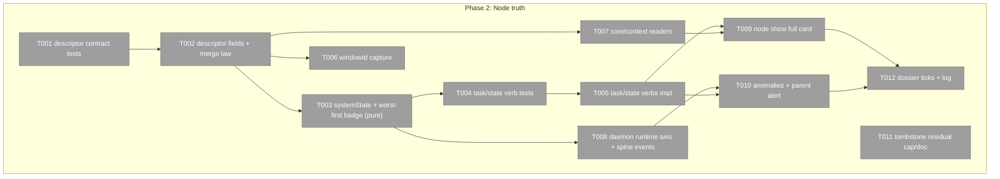
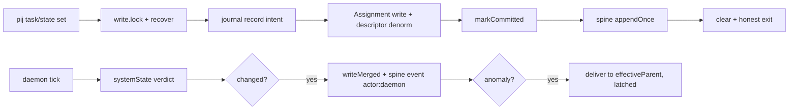
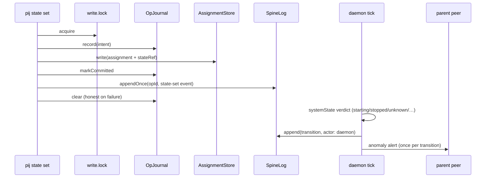

# Phase 2: Node truth — two-axis states, assignments, metadata, anomalies

**Plan**: `docs/plans/054-pij-grown-up/pij-grown-up-plan.md` §Phase 2 · **Generated**: 2026-07-17 · **Status**: BUILD COMPLETE (coder pij-general-llama, 2026-07-17) — awaiting review

## Executive Briefing

**Purpose**: Nodes stop lying. Every peer descriptor carries honest mechanical truth (`systemState`, daemon-computed) and per-assignment semantic truth (`semanticState`, CLI/agent-declared), plus the metadata a UI needs (context gauges, window addressability) — and disagreement between the axes becomes a queryable anomaly with a parent alert.

**What We're Building**: additive descriptor fields (`currentAssignment`, `semanticState`, `systemState`, `windowId`, `contextMax`, `contextCurrent{value,asOf,provenance}`); `pij task set` / `pij state set` writing Assignment records + attributed spine events through P1's journal-first coupled-write machinery; worst-first badge derivation; `pij node show --json` full card; `pij anomalies --json` + daemon parent alert; daemon runtime-axis verdicts `starting`/`stopped`/`unknown` appended to the spine with `actor: daemon` (V-05).

**Goals**
- ✅ Two-axis state honesty: mechanical axis never guesses (`unknown` over heuristics); semantic axis is per-assignment with implicit-general fallback
- ✅ Every state/task mutation is an attributed spine event (AC-03 discipline continues)
- ✅ Terminal addressability: `windowId` captured at spawn/adopt + daemon backfill (AC-09)
- ✅ Context gauges honest: real reads or `unknown`, never estimates (AC-09)
- ✅ Anomalies are queries + one-shot parent alerts, never auto-action (AC-06/07)
- ✅ P1 carry-in resolved: Windows tombstone-growth residual capped or formally documented

**Non-Goals**
- ❌ Tree/parent enforcement, adoption, `pij link` events (Phase 3)
- ❌ Spine markdown render, migration posture, skill route, public-contract docs (Phase 4)
- ❌ Any heuristic inference of context or state (honest-`unknown` law)
- ❌ Exposing legacy per-peer `events.ndjson` as public contract (stays delivery-transport internal)
- ❌ Daemon auto-remediation of anomalies (alert once, act never)

## Prior Phase Context (Phase 1: Platform store — APPROVED cycle 6, 19 findings root-cause dead)

**A. Deliverables**: pure `core/platform/{types,project,assignment,spine,journal,time,ports}.ts` (+tests, purity sensor); fs adapters `{project,assignment,spine}-store.ts`, `op-journal.ts` (phase-aware, tombstoned), `platform-write-lock.ts` (machine-wide, never-steal), `atomic-file.ts` (+`fsyncDirBestEffort` reporting); `fakes.ts` contract twins with `failNext` hooks; shared parity suite `platform-stores.contract.test.ts`; CLI verbs `project create|list|show|set`, `spine append|events`; CliDeps ports wired in bin `deps()` (cli.ts:401–405).

**B. Dependencies Exported (P2 consumes)**: `Assignment {schema_version,id,nodeId,projectSlug?,task,states:number[],opened,closed?{...reason}}` + `openAssignment`/`closeAssignment`/`materializeGeneralIfMissing`/`appendStateRef`/`generalAssignmentId` (asg-general-<nodeId>) — pure logic + store + fakes EXIST, CLI surface deliberately deferred to P2; `buildSpineEvent(input): Result<SpineEventDraft>` (drafts carry NO seq — port allocates); `SpineLogPort.append/appendOnce/hasOnce/lastSeq/read`; `OpJournalPort.record/markCommitted/clear/pending` (all Result, tombstone semantics); `withPlatformWriteLock`; `isoTimestamp`; attribution envelope `{actor,ts,refs[],prev?,next?,verifiedBy?,actorProvenance}`; `resolveActor` + E-NOID law; coupled-write template at core/cli.ts:1514–1601 (project-create) — the ONLY legal state+event pattern.

**C. Gotchas & Debt (binding on P2)**: seq minting inside SpineLogPort ONLY; journal-first coupled write for every state+event mutation (lock → recover → record → state write → markCommitted → appendOnce → clear, with J2 honest-clear exits); corroboration matrix is load-bearing — additive fields MUST flow through `canonicalProjectJson`-style canonicalization or recovery misjudges; types.ts zero-import law; own-property guard law; temp `PIJ_HOME` test law + phantom-peer law (nothing new at PIJ_HOME top level); no-throw dispatch (Results, not the backstop); `--prime`-style flag valence trap → new valued flags need `VALUED_FLAG_OVERRIDES` rows; cli.test.ts legacy block frozen; fakes.ts append-only. **Carry-in residual (cycle-6): Windows-only unbounded tombstone growth + O(N) `pending()` scan — cap or document (T011).**

**D. Incomplete Items**: assignment CLI verbs (this phase); WS-6 vocabulary + system_state (this phase — also s055 watchdog stream's consumption seam, re-sync promised at P2-complete); anomaly consumed-marker; seq-ref `Number.isInteger` tightening (needs contract amendment — NOT this phase unless trivially foldable with a test).

**E. Patterns to Follow**: TDD red-first per task; port-first-then-fan-out for any ports.ts change; contract-suite fs↔fake parity for every new port/store behavior; real-fs crash probes as regressions; E-ARG (input, exit 64) vs E-NOREG (infra, naming path + manual remedy); bare JSON.stringify outputs; ultracode workflow shape (red-writer → disjoint implementers → 2-lens adversarial audit → fixer → green-confirmer); honest failure over forged history — daemon writers inherit this posture.

## Pre-Implementation Check

| File | Exists? | Domain | Notes |
|------|---------|--------|-------|
| `.pi/extensions/pij/core/types.ts` | ✅ modify | pij-messaging | `SessionDescriptor` L67–170; new additive block after L155 pattern; `SemanticState` type is NEW (WS-6 vocab absent from code) |
| `.pi/extensions/pij/core/state.ts` | ✅ modify | pij-control-plane | pure; `liveness()` 3 verdicts today; systemState fn + worst-first badge slot here |
| `.pi/extensions/pij/core/daemon/loop.ts` | ✅ modify | pij-control-plane | `MUTABLE_EXTERNALLY_OWNED_FIELDS` L149 (+`currentAssignment`,`semanticState`,`currentTask` denorm; `systemState` stays OUT — daemon-owned); `writeMerged` L158–180 |
| `.pi/extensions/pij/daemon.ts` | ✅ modify | pij-control-plane | `tick()` L123–259 single-step injectable (Finding 10); verdict+latch pattern `pushWholeLifeTransition` L265–301; `PushedTransition` L57 extend |
| `.pi/extensions/pij/core/spawn.ts` | ✅ modify | pij-control-plane | `PendingDescriptorInput` L226–258 (+windowId beside paneId L230); `buildPendingDescriptor` L348–370 |
| `.pi/extensions/pij/adapters/tmux.ts` | ✅ modify | pij-control-plane | `splitWindow` L87–124 / `newWindow` L47–76: extend `-F '#{pane_id} #{window_id}'`, split parse |
| `.pi/extensions/pij/cli.ts` (bin) | ✅ modify | pij-control-plane | spawn paneId L1342; adopt L1623+ (`display-message #{window_id}` precedent daemon.ts:457); `deps()` L386–408 wires context readers; USAGE L184 |
| `.pi/extensions/pij/core/cli.ts` | ✅ modify | pij-control-plane | `ParsedCommand` L94–189, `ALLOWED_FLAGS` L384, `MAX_POS` L404, `FAMILY_SUBCOMMANDS` L365, `VALUED_FLAG_OVERRIDES` L373, `dispatchPlatform` L1512–1750, coupled-write template L1514–1601; `state` verb sibling L1357–1402; forest renderers L1761–1823 (additive spread = free flow-through) |
| `.pi/extensions/pij/core/models/registry.ts` | ✅ modify | pij-control-plane | `ModelEntry` L16–32 has NO contextWindow; `parseModelsJson` L86–128 drops it; `loadModels()` L268–304 reads `~/.pi/agent/models.json` — **ruling: extend THIS reader (single authoritative path); plan-manifest mention of repo `.pi/models.json` is the schema exemplar, not a second source** |
| `.pi/extensions/pij/core/context/` | ❌ create | pij-control-plane | contextMax join + contextCurrent readers (pi/claude/codex; copilot ⇒ unknown); precedents: agents/adapters/claude.ts:15 usage parse, codex.ts:72 |
| `.pi/extensions/pij/core/tree.ts` | ✅ modify (light) | pij-messaging | `toNode` L255–270 spreads raw descriptor — additive fields free; `effectiveParent` L15–17 = AC-07 parent resolver (NOT spawnedBy) |
| `.pi/extensions/pij/adapters/fakes.ts` | ✅ modify (append-only) | pij-messaging | FakeTmux L357 needs windowId; platform fakes exist |
| anomaly module (`core/anomalies.ts`) | ❌ create | pij-control-plane | pure queries: axis-disagreement w/ threshold, unverified done, foreign hold-clear |
| `.pi/extensions/pij/adapters/op-journal.ts` | ✅ modify (T011 only) | pij-orchestration | tombstone cap/compaction OR documented residual |

**Contract-change flags (higher risk)**: `MUTABLE_EXTERNALLY_OWNED_FIELDS` semantics (daemon-clobber surface); `ModelEntry` shape (models registry consumers); `PushedTransition` union; descriptor additive block (AC-11 legacy round-trip mandatory); **`recoverPendingOps` signature widens to take the assignment store and `resolveOp`/`resolveCommitted` learn assignment-op adjudication (T005 — expected, port-first, rationale logged)**. Any OTHER P1 port signature change → port-first, alone, with rationale.

## Architecture Map



## Tasks

| Status | ID | Task | Domain | Path(s) | Done When | Notes |
|--------|-----|------|--------|---------|-----------|-------|
| [x] | T001 | Contract tests (RED): additive descriptor fields `currentAssignment?`, `semanticState?`, `systemState?`, `windowId?`, `contextMax?`, `contextCurrent?{value,asOf,provenance}` + NEW `SemanticState` type/guard (WS-6: blocked\|question\|hold\|waiting\|ready\|failed\|cancelled\|done) + `SystemState` (starting\|working\|idle\|stalled\|stopped\|dead\|unknown) + AC-11 legacy-descriptor round-trip (old JSON loads, unknown fields survive) | pij-messaging | `.pi/extensions/pij/core/types.test.ts` (or new descriptor.test block) | failing tests enumerate every field, guard rejections (own-property law), legacy round-trip | plan 2.1; types.ts:106 comment-class additive block |
| [x] | T002 | Implement descriptor fields + `SemanticState`/`SystemState` types + add `currentTask`/`currentAssignment`/`semanticState` to `MUTABLE_EXTERNALLY_OWNED_FIELDS` (systemState stays daemon-owned, OUT of list); writeMerged no-clobber proof test | pij-messaging | `core/types.ts`, `core/daemon/loop.ts` | T001 green; daemon merge test proves CLI-stamped fields survive a daemon tick write | plan 2.2, Finding 04 |
| [x] | T003 | Pure derivation (tests+impl): `systemStateOf(...)` in `core/state.ts` extending liveness to 7-state mechanical axis (starting hold-until-bind, stopped=suspended pane, unknown=missing telemetry — never a guess) + worst-first badge over {systemState, open assignments' semanticStates} with explicit severity order | pij-control-plane | `core/state.ts`, `core/state.test.ts` | AC-04/AC-05 derivation cases green incl. multi-assignment worst-first; no heuristic branch anywhere | plan 2.3/2.6 pure half; WS-6 |
| [x] | T004 | CLI verb tests (RED): `pij task set <node> "<task>" [--project <slug>]`, `pij state set <node> <state> [--assignment <id>] [--refs <r>…]`, and the AC-06 verify write `pij state verify <node> [--assignment <id>]` (verifying actor = resolved attribution; stamps `verifiedBy` on the done state's event chain and flips unverified-done) — parse (ALLOWED_FLAGS/MAX_POS/FAMILY_SUBCOMMANDS/valence), dispatch, JSON envelopes, E-NOID attribution, implicit `asg-general-<nodeId>` materialization on first write, descriptor denorm (`currentAssignment`/`semanticState`/`currentTask`), coupled-write fault matrix via fakes `failNext` (journal/record/state/append/clear branches incl. J2 honest-clear exits) | pij-control-plane | `core/cli.test.ts` | red suite covers AC-05 scenarios + AC-06 flip (unverified done → verified on subsequent verify write) + every fault branch of the coupled template | plan 2.3 + AC-06 traceability (2.3/2.8); template core/cli.ts:1514–1601; VALUED_FLAG_OVERRIDES for `--project`/`--assignment`/`--refs` |
| [x] | T005 | Implement `task set`/`state set`/`state verify`: journal-first coupled write (Assignment record write + attributed spine event kinds `task-set`/`state-set`/`state-verified` w/ structured refs `[node:<id>, assignment:<id>, project:<slug>?]` + prev/next semantic values) + descriptor denorm via registry write; `canonicalAssignmentJson` mirroring the project canonicalization law; **extend recovery adjudication in `core/platform/journal.ts`** — `resolveOp`/`resolveCommitted` today hard-reject non-project intents (journal.ts:96–104) and treat non-project committed ops as uncoupled (hasOnce replay = the J1 forge for assignment coupled ops, journal.ts:145–166); adjudicate `task-set`/`state-set`/`state-verified` intents against the assignment store via canonical prev/next, widen `recoverPendingOps(journal, spineLog, projectStore, assignmentStore)` + its call sites — this IS an expected P1 contract-function signature change (port-first, alone, rationale logged) | pij-control-plane | `core/cli.ts`, `core/platform/assignment.ts`, **`core/platform/journal.ts`**, `core/platform/ports.ts` (if signatures move), bin `cli.ts` deps | T004 green; spine events visible via `spine events --peer`; recovery/corroboration matrix holds for assignment ops incl. intent-window and committed-window crash probes (contract-suite additions — J1/K1-class pins for assignments) | plan 2.3; AC-03/AC-05/AC-06; critic finding: without journal.ts extension, first assignment-op crash wedges all platform writes or forges history |
| [x] | T006 | windowId capture (tests+impl): tmux adapter `-F '#{pane_id} #{window_id}'` parse split (spawn+newWindow), `PendingDescriptorInput.windowId`, adopt `display-message -p -t <pane> '#{window_id}'`, daemon backfill for legacy live nodes (once, via writeMerged), FakeTmux windowId | pij-control-plane | `adapters/tmux.ts`, `core/spawn.ts`, bin `cli.ts`, `daemon.ts`, `adapters/fakes.ts` | AC-09 proof test: `select-window -t <windowId>` targets the node's window (fake-tmux assertion + real capture format pin) | plan 2.4, Finding 05; precedent daemon.ts:457 |
| [x] | T007 | `core/context/` (tests+impl): `contextMax` via boundModel→`loadModels()` join (extend `ModelEntry.contextWindow` + `parseModelsJson`; authoritative path stays `~/.pi/agent/models.json`); `contextCurrent` readers — pi in-process (extend PiRuntimePort), claude transcript usage-sum, codex rollout `total_token_usage` tail; copilot ⇒ `{value: unknown, provenance}`; absent source NEVER guesses | pij-control-plane | `core/context/*` (new), `core/models/registry.ts`, `adapters/pi-runtime.ts` | AC-09 gauge fields green; every reader returns provenance; unknown-not-guess pinned per harness | plan 2.5, Finding 08; purity: readers are adapters-side or injected — keep core/context pure logic + ports |
| [x] | T008 | Daemon runtime axis (tests+impl): `starting` written at spawn/adopt (holds until first bind/readiness verdict), `stopped` (suspended pane), `unknown` (missing telemetry) beside dead/stalled; persist via writeMerged; **every mechanical-axis TRANSITION appends spine event `actor: daemon` (V-05)** with refs to node; anomaly evidence refs point at those events; single-step `tick()` tests with FakeTmux/FakeProcess; legacy per-peer events.ndjson untouched/internal. **Daemon-side platform architecture (critic finding — untasked gap)**: the daemon has NO platform ports today — it constructs its own Fs adapters (spineLog/opJournal/platformWriteLock, mirroring bin `deps()`, cli.ts:401–405) or receives them via `DaemonPorts`; the write-lock is a synchronous blocking primitive — a lock-contended or recovery-blocked tick SKIPS the append honestly (logged once) instead of stalling the delivery loop; the transition latch flips ONLY after a successful append (retry next tick on failure — no lost V-05 events, no spam) | pij-control-plane | `daemon.ts`, `core/daemon/loop.ts`, `core/state.ts` | AC-04 green: just-spawned-unbound reads `starting`; readiness-regex failure lands `unknown` w/ provenance; transition spam impossible (latch-after-successful-append pinned); fake-port tests pin lock-contended-skip + retry-next-tick postures | plan 2.6, V-02/V-05; uncoupled append, lock+recovery-gated, non-blocking tick |
| [x] | T009 | `pij node show <id> --json` (tests+impl): full card — identity, lifecycle, two-axis states, currentAssignment + open assignments join, task, windowId/paneId, contextMax/contextCurrent, boundModel/effort, parent — field-by-field assertion; list/tree flow-through pins (additive spread) | pij-control-plane | `core/cli.ts`, `core/cli.test.ts` | AC-09 full card asserted field-by-field; tree JSON carries new fields free | plan 2.7; sibling of `state` verb L1357–1402 |
| [x] | T010 | `pij anomalies --json` + parent alert (tests+impl): pure `core/anomalies.ts` queries — **axis-disagreement per AC-07/WS-6: semantic-active + system `idle` beyond threshold** (the ruled, non-negotiable case — the 1ca01u5 44h lost-dispatch shape; dead/stalled/stopped disagreement MAY be added as additional cases), unverified `done` (semantic done w/o verifiedBy), foreign hold-clear (hold cleared by actor ≠ setter); daemon alert via existing deliver+latch (`PushedTransition` + anomaly kind) to `effectiveParent` (parentId ?? spawnedBy), once per transition, NO auto-action | pij-control-plane | `core/anomalies.ts` (new), `daemon.ts`, `core/cli.ts` | AC-06/AC-07 green incl. semantic-active + system-idle > threshold regression (44h incident shape); alert fires exactly once per transition (latch test); query returns evidence refs (spine seqs) | plan 2.8 + AC-07 wording; 1ca01u5 44h incident regression |
| [x] | T011 | P1 carry-in: Windows tombstone growth — implement bounded tombstone compaction (sweep resolved tombstones older than N behind load-bearing dir-fsync when supported; retain-all where not) OR ship a documented-residual note in port docs + ops diagnostic; decision logged with rationale | pij-orchestration | `adapters/op-journal.ts` (+test) or port docs | either: compaction pinned by real-fs test (no correctness regression vs cycle-5/6 probes) or residual documented in ports.ts contract text + review sign-off | cycle-6 non-blocking residual; do NOT weaken tombstone retention semantics (J1/K1 pins must stay green) |
| [x] | T012 | Dossier ticks + execution log wrap; biome/tsc/full-suite gates; NEW PATH notifications reconciled | — | this file, `execution.log.md` | all tasks ticked, gates recorded, fence audit self-check clean | P1 T011 pattern |

## Context Brief

**Environment-first posture**: environment friction is work, not an apology — fix small/reversible things, otherwise `harness observe` it (execution-log Discoveries row as fallback); pay every hard wall forward.

**Key findings from plan**:
- Finding 04: daemon `writeMerged` clobber risk → externally-owned field list is the mechanism; prove no-clobber with a real merge test (T002)
- Finding 05: windowId via `split-window -P` format extension + `display-message` backfill (T006)
- Finding 08: context readers per-harness; copilot has no source → `unknown` (T007)
- Finding 10: daemon tested via single-step `tick()` + fake ports — no live tmux in tests (T008)
- V-05 ruling: mechanical transitions are spine events with `actor: daemon` — anomaly evidence chains to them (T008/T010)
- WS-6: semantic vocabulary is human-ruled — do not extend/rename it

**Domain dependencies**:
- `pij-orchestration` (P1 platform): coupled-write template, SpineLogPort/OpJournalPort/PlatformWriteLockPort/AssignmentStorePort + fakes — T005/T008 write through them
- `pij-messaging`: descriptor types + registry writeMerged law — T001/T002
- `pij-control-plane`: cli parse/dispatch tables, state.ts derivations, daemon tick — T003–T010

**Domain constraints**: core/platform purity sensor (no fs/process in production platform files — context READERS live adapters-side or behind injected ports); types.ts zero-import law; registry descriptor writes only via established write paths (writeMerged / registry API), never raw fs; all tests in mkdtemp `PIJ_HOME`; phantom-peer law.

**Reusable from prior phases**: platform fakes w/ `failNext`; ContractRig parity suite; coupled-write fault-matrix test patterns (cli.test.ts F2/G/J/K blocks); real-fs crash-probe pattern; canonical-JSON law + helpers; `resolveActor`/E-NOID tests.

**Flow diagram**:


**Sequence diagram**:


## Discoveries & Learnings

_Populated during implementation by the implement verb._

| Date | Task | Type | Discovery | Resolution | References |
|------|------|------|-----------|------------|------------|

## Directory layout

```
docs/plans/054-pij-grown-up/
  ├── pij-grown-up-plan.md
  └── tasks/phase-2-node-truth/
      ├── tasks.md
      └── execution.log.md   # created by the implement verb
```
