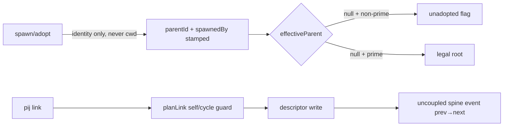

# Phase 3: Enforced tree + adoption

**Plan**: `docs/plans/054-pij-grown-up/pij-grown-up-plan.md` §Phase 3 · **Generated**: 2026-07-17 · **Status**: BUILD COMPLETE (coder pij-general-llama, 2026-07-17) — awaiting review

## Executive Briefing

**Purpose**: Every non-prime node resolves a caller-verified parent; orphans surface as `unadopted` (an adoption axis, separate from runtime state and structural problems); re-parenting becomes evented history on the spine.

**What We're Building**: caller-truth parent derivation at both spawn paths (the issue-#20 fix — cwd never consulted); adopt `--parent` honored end-to-end; prime-as-legal-root; additive `unadopted` projection in tree/list; `pij link` emitting an uncoupled spine event `{prevParent, newParent, actor}` with `spawnedBy` immutable provenance; cycle rejection retained. Plus three P2-review carry-ins (purity sensor over `core/context`, denorm self-healing race, dead codex output).

**Goals**
- ✅ AC-08: parent = the INVOKING SESSION, from identity (PIJ_SESSION_ID / pane-exact), never from cwd cohabitation
- ✅ `unadopted` enumerable machine-wide as a UI query shape (WS-1, carp's split: adoption axis ≠ runtime axis ≠ structural problem)
- ✅ Re-parent history reconstructable from the spine (`spine events --peer <child>`)
- ✅ All tree/parent tests are BEHAVIOR CONTRACTS that survive the s051 convergence (SW-7)

**Non-Goals**
- ❌ Rewriting `resolveSelf`/identity internals or ownership/close-authority semantics — that is s051's territory; P3 bypasses the cwd branch at parent-derivation call sites only
- ❌ Skill route content (P4 3.4→4.3 handoff — P3 ships the hint text + query shape only)
- ❌ Any auto-adoption or auto-re-parenting — surfacing only

## SW-7 drift-risk declaration (s051 convergence)

s051 (identity integrity; issues #19/#20, spawnedBy vs parentId close-authority) is mid-fix with an uncertain landing (G7 stopped on a Jordan ruling). **Nothing landed exists to build against**, so P3 carries **explicit drift risk** under these controls:
1. **Smallest-diff rule**: P3 changes parent DERIVATION at the two spawn call sites (`cli.ts:1231-1234`, `cli.ts:1144-1149`) and adopt application (`cli.ts:1987-1992`); it does NOT rewrite `resolveSelf` (`core/discovery.ts:118-156`), `current-session.ts`, or any close-ownership path — s051's zone stays untouched.
2. **Behavior-contract law** (every P3 test): assert OUTCOMES — `effectiveParent(descriptor)` equals the resolved caller; cwd-neighbors never become parents; `spawnedBy` byte-stable across `pij link`; self/cycle rejected — never internal call shapes. Contracts must survive a converged implementation that replaces the internals.
3. **Named reconciliation point**: s054 ship checklist 4.6 (convergence re-read of main) — re-run P3's behavior contracts against s051's landed semantics; green = converged, red = reconcile excursion routed through dove. Second-lander-rebases stands.

## Prior Phase Context (P1 APPROVED c6 · P2 APPROVED c1 — see phase-2-node-truth/tasks.md §Prior Phase Context for P1 detail)

**P2 exports P3 consumes**: uncoupled V-05 spine-append pattern (`core/daemon/runtime-axis.ts:117-156` — write-lock → recovery gate → `buildSpineEvent` → plain `append`, never journaled; doctrine: descriptor is state truth, event is telemetry/history); `SPINE_KIND_*` constant style (`core/platform/types.ts:74-86`, kebab strings like `"system-state"`); `platformWritePorts(deps)` (`core/cli.ts:986`); windowId + node-truth descriptor fields; `MUTABLE_EXTERNALLY_OWNED_FIELDS` law (loop.ts). **Binding laws unchanged**: seq inside port; no-throw dispatch; own-property guards; temp PIJ_HOME + phantom-peer; types.ts zero-import; fakes append-only; cli.test.ts legacy block frozen; biome clean. **The no-op-set precedent** (adjudicated SOUND in P1): an attributed no-op write still appends its event — named for T004's no-op-link decision.

**P2 review carry-ins (this phase, T006)**: MED — `core/context/gauge.ts` pure but UNSENSORED (boundary sensor doesn't scan `core/context/`); LOW — `denormDescriptor` (core/cli.ts:1682) raw read-modify-write self-healing race; LOW — dead codex `contextWindow` output field.

## Pre-Implementation Check

| Surface | Anchor | Action |
|---|---|---|
| Control-plane spawn parent derivation | `cli.ts:1231-1234` (`filterByFolder(reg0.list(), cwd)` → `resolveSelf` lone-local fallback = the #20 bug), written at `:1376-1377` | MODIFY — parent from identity only (env id / pane-exact); never the cwd lone-local branch |
| pi spawn `announceTo` | `cli.ts:1144-1149` (same cwd fallback) | MODIFY — same rule |
| `resolveSelf` | `core/discovery.ts:118-156` | DO NOT MODIFY (s051 zone) — bypass for parent derivation at call sites |
| `buildPendingDescriptor` | `core/spawn.ts:352-378` | keep (inputs change) |
| adopt `--parent` | parse exists `core/spawn.ts:744-801`; applied `cli.ts:1987-1992`; cycle pre-check `cli.ts:1753-1784` | MODIFY — root/absence semantics (absence ⇒ explicit unadopted candidate, prime ⇒ legal root) |
| `pij link` dispatch | `core/cli.ts:1306-1321` (descriptor-only today; `current?.parentId` = prevParent) | MODIFY — add uncoupled spine event |
| `planLink` self/cycle rejection | `core/tree.ts:19-51` (E-SELF :27, cycle walk :34-48; mutates parentId ONLY) | KEEP + contract-pin |
| `spawnedBy` provenance | written once (`session.ts:189`, `cli.ts:1376`), preserved on re-register (`session.ts:161`), never re-assigned | KEEP — pin byte-stability as stated contract |
| `unadopted` flag | NET-NEW: `toNode` `core/tree.ts:255-270` + `SessionTreeNode` `core/types.ts:296-303`; JSON emits free (`core/cli.ts:2440-2469` spreads raw) | CREATE — non-prime && `effectiveParent === null`; distinct from `TreeProblem` (structural) |
| Prime detection | `SessionDescriptor.prime?: boolean` `core/types.ts:140-141`, `filterPrime` `discovery.ts:105-108` | consume — prime parentless = legal root, never `unadopted` |
| New spine kind | `core/platform/types.ts:74-86` | CREATE — `SPINE_KIND_NODE_LINKED = "node-linked"` (style-matched to "system-state"; coder may propose better, log ruling) |
| Carry-in: purity sensor | `core/platform/boundary.test.ts` production scan | MODIFY — add `core/context/` to scanned production surface |
| Carry-in: denorm race | `core/cli.ts:1682` (`denormDescriptor`, call sites :2055/:2152) | MODIFY — smallest fix per review note (re-read-merge or writeMerged reuse) |
| Carry-in: dead codex field | context reader output | MODIFY — remove or wire; smallest honest fix |

## Tasks

| Status | ID | Task | Domain | Path(s) | Done When | Notes |
|--------|-----|------|--------|---------|-----------|-------|
| [x] | T001 | Behavior-contract tests (RED): parent caller-truth — PIJ_SESSION_ID set ⇒ child's `effectiveParent` = that id even with cwd-neighbor descriptors present; env unset + pane-exact match ⇒ pane identity, **matched against the FULL registry list — incl. a case where the caller's pane matches from a DIFFERENT cwd than its registered folder** (adopted-peer-in-worktree shape); env unset + only cwd-cohabitants ⇒ parent ABSENT (never inferred), both spawn paths; adopt `--parent` honored; adopt parentless ⇒ `effectiveParent === null`; prime parentless = legal root; issue-#20 regression shape reproduced then killed | pij-messaging | `core/spawn.test.ts`, `core/cli.test.ts`, bin-path tests | red suite pins AC-08 outcomes only (no internal call-shape assertions — SW-7 law); cross-cwd pane-match case present | plan 3.1, Finding 07 |
| [x] | T002 | Implement caller-truth parent derivation at both spawn call sites + adopt application; **pane-exact parent matching runs against the FULL registry list — cwd plays NO role anywhere in parent derivation** (the cwd-filtered `filterByFolder` set must not gate it); cwd lone-local branch bypassed for PARENT purposes (resolveSelf untouched); prime-as-root invariant | pij-messaging | `cli.ts` (both sites + adopt), `core/spawn.ts` (inputs if needed) | T001 green incl. cross-cwd pane case; s051-zone files untouched (`git diff --name-only` proof: no discovery.ts/current-session.ts/close.ts changes) | plan 3.2, WS-1 |
| [x] | T003 | `unadopted` adoption-axis projection: additive `SessionTreeNode` flag (non-prime && effectiveParent null), separate from `TreeProblem`; tree/list JSON flow-through pins + human badge; machine-wide enumerability pin (`pij tree --json` filter path) | pij-messaging | `core/tree.ts`, `core/types.ts`, `core/cli.ts` (human render), tests | AC-08 projection green; unadopted ≠ problem ≠ runtime state (three axes independently assertable); prime never flagged | plan 3.2/3.4, carp's split |
| [x] | T004 | `pij link` spine event: new `SPINE_KIND_NODE_LINKED` constant; uncoupled append per V-05 pattern (write-lock → recovery gate → buildSpineEvent → plain append) with `prev`=prevParent, `next`=newParent, `actor`, `peer`=childId, refs `[node:<child>, parent:<new>]`; **`--root` link shape RULED: `next` OMITTED (envelope `next?` is string-typed — never null/sentinel) + refs `[node:<child>]` only, prev still carried; log the ruling** ; `spawnedBy` byte-stable across link (contract pin); self/cycle rejection retained pins; no-op link decision (unchanged parent): follow the adjudicated no-op-set precedent OR justify divergence — log ruling either way | pij-messaging | `core/cli.ts` (link dispatch), `core/platform/types.ts` (kind), `core/tree.ts` pins, tests | event visible via `spine events --peer <child>`; history reconstructable (link A→B→C→**root** replays from spine incl. the root hop); append-failure path honest (lock/recovery-gated like runtime-axis) | plan 3.3; V-05 pattern reuse; validation F1 |
| [x] | T005 | Adoption guidance surface: unadopted enumeration query shape finalized in tree/list JSON + skill-facing hint text constant (content only — route lands P4 4.3); execution-log note handing the P4 route its consumption contract | pij-messaging | `core/tree.ts`/`core/cli.ts`, hint constant module, tests | unadopted nodes enumerable machine-wide with stable JSON shape a UI/skill can consume (AC-08/WS-1) | plan 3.4 |
| [x] | T006 | P2-review carry-ins: (a) extend purity boundary sensor to scan `core/context/` production files (MED); (b) fix `denormDescriptor` (core/cli.ts:1682, call sites :2055/:2152) self-healing race with smallest sound mechanism (LOW); (c) remove/wire dead codex `contextWindow` output (LOW) — TDD where testable, one commit per item or coherent pair | pij-control-plane | `core/platform/boundary.test.ts`, `core/cli.ts:1682` area, context reader | sensor red on a planted `node:fs` import in core/context; race pinned; no dead output fields | reviews/p2-review-001.md notes 1–3 |
| [x] | T007 | Dossier ticks + execution log wrap; gates (tsc, fenced, FULL, biome); fence self-audit incl. s051-zone untouched proof | — | this file, `execution.log.md` | all tasks ticked, gates recorded, SW-7 proof line in log | |

## Context Brief

**Environment-first posture**: unchanged (harness observe on friction; execution-log Discoveries fallback).

**Key findings/rulings in force**: Finding 07 (#20 caller-truth); WS-1 (adoption axis split); V-05 (uncoupled descriptor-truth events); no-op-set precedent (named for T004); SW-7 (behavior contracts + smallest-diff + named reconciliation).

**Domain constraints**: `pij-messaging` primary; platform purity laws unchanged; registry descriptor writes via established paths only; temp PIJ_HOME everywhere.

**Reusable**: runtime-axis uncoupled append as the T004 template; P2's FakeTmux windowId join; platform fakes + failNext; contract-suite patterns.

## Discoveries & Learnings

_Populated during implementation._

| Date | Task | Type | Discovery | Resolution | References |
|------|------|------|-----------|------------|------------|
| 2026-07-17 | T001 | Noteworthy | Red run's cross-cwd pane case failed twice-over: fixture pane %77 collided with a legacy copilot fixture in full-file order — the new derivation correctly refused the genuinely ambiguous pane | Fixtures retargeted to %777; ambiguity-refusal is itself a pinned contract | cli.integration.test.ts |
| 2026-07-17 | T004 | Noteworthy | Ruling: link event `prev` = effectiveParent(current), not raw parentId — records the tree truth the link replaces; packet anchor note said `current?.parentId` | Implemented + logged; flagged for reviewer | execution.log.md T004 |
| 2026-07-17 | T004 | Noteworthy | With the bin's stores wired, `pij link` now REQUIRES attribution (F2): pre-existing integration composition test linked with unresolvable self and started failing | Test updated to pin the refusal + attribute via PIJ_SESSION_ID; behavior change surfaced for review | cli.integration.test.ts |
| 2026-07-17 | T006a | Noteworthy | New sensor's first pass flagged gauge.ts header comment "no fs, no process." (source-level regex) | Comment reworded; sensor NOT weakened (same posture as platform files) | boundary.test.ts |
| 2026-07-17 | T006c | Deferred | Rollout-reported model_context_window removed, not wired — a fallback contextMax would need a precedence ruling vs the models.json join (AC-09) | Backlog candidate noted for P4/later | gauge.ts doc |
| 2026-07-17 | T007 | Noteworthy | Live smoke: link attribution via resolveSelf retains lone-local convenience (attribution ≠ parent derivation — s051's self-identity contract untouched by design); default tree filters dead-pid fixtures (--all shows them) | Expected behavior, recorded as evidence | smoke transcript |
