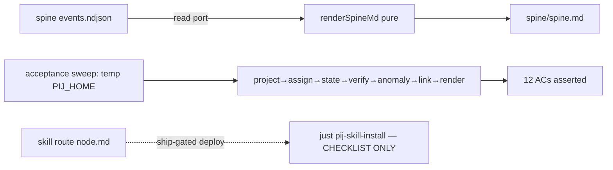

# Phase 4: Governance contract — render, migration, skill, docs

**Plan**: `docs/plans/054-pij-grown-up/pij-grown-up-plan.md` §Phase 4 · **Generated**: 2026-07-17 · **Status**: BUILD COMPLETE (coder pij-general-llama, 2026-07-17) — awaiting review

## Executive Briefing

**Purpose**: Ship the consumer contract — the spine becomes human-readable (markdown render), the migration posture becomes explicit (dual-run, human cutover), the skill fabric learns the new verbs, and the on-disk platform becomes a documented public contract a UI author can build from alone.

**What We're Building**: pure `render-spine-md.ts` + `pij spine render`; `docs/how/pij-governance-migration.md`; the `node` skill route (worktree-only); `docs/how/pij-platform.md` + README pointer; the isolated acceptance sweep proving all 12 ACs; the ship checklist.

**Goals**
- ✅ AC-10: byte-stable spine render; dual-run posture documented; cutover = explicit human ruling artifact (NEVER executed here — R4)
- ✅ AC-12: a UI author can implement list/tree/card from `pij-platform.md` alone (incl. derivation rules for anything not materialized)
- ✅ All 12 ACs demonstrated in one isolated harness run (temp PIJ_HOME, fakes, single-step tick — R3 fence)
- ✅ T006c precedence question RULED and documented

**Non-Goals / HARD STOPS**
- ❌ **R3**: NO `just pij-skill-install` (deploy is a ship-checklist step); NO live daemon/global state/real `~/.pij` anywhere in the sweep
- ❌ **R4**: cutover NOT executed — prose spine (`government/spine.md`) stays authoritative; `prime-flow.json` untouched (freeze/supersede NOTE only)
- ❌ NO wiring of the codex rollout max unless the T006c ruling explicitly rules it in (default: document no-wire)

## Prior Phase Context (P1 c6 ✅ · P2 c1 ✅ · P3 c1 ✅ — earlier dossiers carry detail)

**Exports consumed**: full platform store + verbs (P1); node truth two-axis + gauges + anomalies (P2); caller-truth tree + unadopted + node-linked events (P3). `SpineLogPort.read(query?)` (ports.ts:159) is the render's data source — the port has NO markdown-write method; the peer-packet-consistent choice is pure module + bin-side fs write. **Binding laws unchanged** (purity sensor now covers core/context; temp PIJ_HOME; no-throw dispatch; frozen legacy block; fakes append-only; biome).

**Carry-ins**: T006c codex `model_context_window` precedence unruled (gauge.ts:75-96 documents the deliberate non-read; reviews p2:191-193 + p3:62,71 say "P4 before any wiring"); P3 LOW note — link descriptor write outside platform lock (pre-existing, doctrine-consistent; DOCUMENT in platform doc's consistency notes, no code change ruled).

## Pre-Implementation Check

| Artifact | Path | Action | Anchors |
|---|---|---|---|
| 4.1 render module | `.pi/extensions/pij/core/platform/render-spine-md.ts` (+test) | CREATE | style: `core/agents/peer-packet.ts:62` (`sections[] → join`, pure, exported interfaces); Finding 09 (plan:160); byte-stable (plan:238) |
| 4.1 `spine render` verb | `core/cli.ts` + bin `cli.ts` | MODIFY | union :199-214; family map :422 (`"append\|events\|render"`); ALLOWED_FLAGS :457-458; MAX_POS :484-485; parse switch :856/:881; routing :1702-1745; execute sibling :2019-2053; `deps.pijHome` (bin cli.ts:177/:403) → write `join(pijHome,"spine","spine.md")` bin-side |
| 4.2 migration doc | `docs/how/pij-governance-migration.md` | CREATE | style: `docs/how/pij-prime.md:1-8`; E309 = harness-CLI fail-closed on legacy `government/prime-flow.json` (research-dossier:34,47; workshop 001:43); prime-flow.json is FROZEN — note only |
| 4.3 skill route | `skills/pij/references/routes/node.md` | CREATE | convention: `routes/ops.md:1-6` (H1 job line, sibling-blind blockquote, `**Job**:`, bash blocks, diagnosis table) |
| 4.3 registry rows | `skills/pij/SKILL.md` | MODIFY | routes table :21-32; CLI-verb coverage :37-44 (project/spine/task/state/node/anomalies rows); ≤150-line budget |
| 4.3 gate script | `harness/scripts/pij-skill-check.sh` | MODIFY (fence extension, notify) | parity loop :18-42 auto-covers new row; ADD `node` to sibling-blindness route list :47 and the HARD 150-line budget loop :69 (NOT the :81 advisory soft_budget loop — that one only warns) |
| 4.4 platform doc | `docs/how/pij-platform.md` | CREATE | AC-12: every record schema (Project/Assignment/SpineEvent/descriptor node-truth fields), anomaly queries, UI derivation rules (worst-first badge, unadopted, effectiveParent, gauge provenance), consistency notes (uncoupled-event doctrine incl. P3 LOW note) |
| 4.4 README pointer | `README.md` | MODIFY | after :53 (`docs/how/pij.md` pointer) + `## Where things are` table :196-212 |
| 4.5 acceptance sweep | new test file(s) | CREATE | patterns: `core/daemon/runtime-axis.test.ts:47-77` (rig over full fake set, single-step tick) + `cli.integration.test.ts` (mkdtemp PIJ_HOME, real bin subprocess, spine events e2e :1155) |
| 4.6 ship checklist | `docs/plans/054-pij-grown-up/ship/ship-checklist.md` | CREATE | R3-gated steps LISTED not executed: daemon-restart baton → live two-peer demo (AC-07) → `just pij-skill-install` → s051/s052 convergence re-read (SW-7 reconciliation) |
| T006c ruling | doc text (platform doc §derivation rules) | RULE + DOCUMENT | gauge.ts:75-96, :123-132; context-reader.ts:56-61; default = no-wire, models.json join sole contextMax source |

## Tasks

| Status | ID | Task | Domain | Path(s) | Done When | Notes |
|--------|-----|------|--------|---------|-----------|-------|
| [x] | T001 | Pure `render-spine-md.ts` (tests RED first): `renderSpineMd(events, opts?): string` — peer-packet style (sections[]→join, no fs/process, exported interfaces); byte-stable for identical input (pinned by double-render); tolerant of unknown kinds/additive fields (renders them honestly, never drops); empty spine renders a valid header-only doc; covers all current kinds (project-created/set, task-set, state-set, state-verified, system-state, node-linked) with prev/next + refs + attribution rendered | pij-orchestration | `core/platform/render-spine-md.ts`(+test) | AC-10 render green; byte-stability + unknown-kind + empty pins; purity sensor covers it automatically | plan 4.1, Finding 09 |
| [x] | T002 | `pij spine render` verb: parse tables (family map, flags incl. `--json`, MAX_POS 0) + dispatch + execute — mechanism RULED: bin intercepts `spine render` BEFORE core dispatch (mirroring the cli.ts:2693 two-tier precedent — Finding 06), reads via FsSpineLog, calls pure `renderSpineMd`, writes `join(pijHome,"spine","spine.md")` with atomic write reuse; core parse tables STILL gain the row for usage/E-ARG parity (core execute path returns E-NOREG naming the bin requirement if reached without intercept); `--json` envelope reports path + bytes + event count; temp-home integration test proves file lands + is byte-identical to pure render | pij-control-plane | `core/cli.ts`, bin `cli.ts`, `cli.integration.test.ts` | AC-10 verb green end-to-end in temp PIJ_HOME; USAGE updated; no port signature change (write stays bin-side) | plan 4.1 |
| [x] | T003 | `docs/how/pij-governance-migration.md`: dual-run posture (JSON spine + prose spine coexist; PROSE stays authoritative), cutover = explicit human ruling artifact (template stub for the ruling included), prime-flow.json E309 freeze/supersede note (file untouched, why, what supersedes it when ruled) | — | `docs/how/pij-governance-migration.md` | doc states the contract unambiguously (AC-10); R4 language explicit; docs/how header style | plan 4.2, R4 |
| [x] | T004 | Skill route (WORKTREE ONLY — R3): `references/routes/node.md` (task/state/project/node/anomalies usage + adoption nudge consuming P3's T005 contract + ADOPTION_HINT), SKILL.md registry row + CLI-coverage rows, extend `pij-skill-check.sh` sibling-blindness list (:47) + HARD budget loop (:69) with `node` (never the advisory soft_budget loop); `just pij-skill-check` GREEN in worktree; `just pij-skill-install` NEVER RUN (ship checklist step) | pij-skill | `skills/pij/references/routes/node.md`, `skills/pij/SKILL.md`, `harness/scripts/pij-skill-check.sh` | check green; SKILL.md ≤150 lines; node.md sibling-blind + ≤150 MECHANICALLY enforced — `grep -n node harness/scripts/pij-skill-check.sh` hits in BOTH the :47 list and the :69 loop; install absent from every command run | plan 4.3, R3 hard stop |
| [x] | T005 | `docs/how/pij-platform.md` (public contract): every record schema verbatim-accurate to types (Project/Assignment/SpineEvent envelope/descriptor node-truth block), file layout (`~/.pij/{projects,assignments,spine}`), anomaly queries + evidence refs, UI derivation rules (worst-first badge order, unadopted predicate, effectiveParent, gauge provenance semantics, spine.md regeneration), consistency notes (uncoupled-event doctrine: descriptor truth vs event telemetry incl. the P3 link-lock note) + README pointer (both slots) | — | `docs/how/pij-platform.md`, `README.md` | AC-12: UI-author-sufficient (deterministic check: every field named in the doc exists in types.ts and vice versa for the public surface); README pointers land | plan 4.4, WS-4 |
| [x] | T006 | T006c RULING + document: default ruling = models.json join is the SOLE contextMax source; rollout-reported `model_context_window` stays unwired (self-reported max needs its own trust story); record in platform doc §derivation rules + a Discoveries row. Code untouched unless the coder can DISPROVE the default with evidence (then port-first + checkpoint) | pij-control-plane | platform doc §derivation | ruling text in doc; gauge.ts/context-reader.ts unchanged (or disproof checkpointed) | reviews p2/p3 carry-in |
| [x] | T007 | Acceptance sweep (R3-fenced): ONE isolated harness exercising the full roundtrip — temp PIJ_HOME + fake tmux/process + daemon single-step tick(); the chain must GENERATE every AC's evidence, explicitly: SEED one pre-054 legacy descriptor into the temp home BEFORE the flow (AC-11 load + round-trip) → project create + `project list`/`project set` (AC-01 all clauses) → `spine append` + `spine events --peer` and `--project` EXACTNESS (returned set == expected set, nothing more — AC-02) → duplicate append proving idempotence (AC-03 replay clause) → task/state set (implicit general + explicit assignment) → state verify → runtime-axis ALL THREE verdicts (starting-hold, suspended→stopped, missing-telemetry→unknown — AC-04) → anomaly query + parent-alert latch (AC-06/07) → unadopted projection (AC-08) → link re-parent event → `pij node show --json` FULL-card assertion (axes, gauges, windowId — AC-09) → `spine render` (AC-10) → assert all 12 ACs field-level (map each AC to its generating step + assertion in comments); then run full `harness checks` (8 stages; environmental smoke failure → isolated-verify + honest report, never masked) | — | new sweep test file(s) | all 12 ACs demonstrated in-fence; suite green; `harness checks` result recorded verbatim in execution log | plan 4.5, V-04, Finding 10 |
| [x] | T008 | Ship checklist doc (LISTED, not executed): daemon-restart baton (memory: no hot-reload) → live two-peer AC-07 demo → `just pij-skill-install` (4.3 deploy) → s051/s052 convergence re-read incl. SW-7 reconciliation (re-run P3 behavior contracts vs landed main) → PR gate reminder (s051 lands first — R2/standing) + dossier ticks + log wrap + gates | — | `docs/plans/054-pij-grown-up/ship/ship-checklist.md`, this file, execution log | checklist exists, every step R3-annotated, NOTHING executed; all tasks ticked; gates recorded | plan 4.6, V-04 |

## Context Brief

**Hard-stop recap (violations are review CRITICALs)**: R3 — no skill install, no live daemon, no real `~/.pij`; R4 — no cutover, prime-flow.json byte-untouched. The sweep + checks run from the worktree only.

**Fence amendment (ruled, this dossier)**: `harness/scripts/pij-skill-check.sh` is explicitly IN-fence for T004 ONLY — the 4.3 gate must actually enforce the new route (declining the edit leaves the check silently green while node.md goes unpoliced). Record a Discoveries row when edited.

**Reusable**: runtime-axis rig (full fake set) + anomaly-sweep rig; cli.integration temp-home subprocess pattern; atomic write helpers; docs/how header style; ops.md route style.

## Discoveries & Learnings

_Populated during implementation._

| Date | Task | Type | Discovery | Resolution | References |
|------|------|------|-----------|------------|------------|
| 2026-07-17 | T007 | Noteworthy | First full `harness checks` run failed ONLY at smoke: `waitIdle timed out after 30000ms` while the pi boot cold-cloned `.pi/git/.../pi-askuserquestion` (network clone ate the idle window) — environmental, not a code failure. Isolated `npm run smoke` = 9/9 ✓; full re-run = ALL 8 STAGES PASS | Re-run green; verbatim results in execution log | execution.log.md T007 |
| 2026-07-17 | T006 | Noteworthy | T006c RULED (default upheld, no disproof found): the models.json join via `boundModel` is the SOLE contextMax source; codex rollout `model_context_window` stays unwired — a self-reported max needs its own trust story and registry-vs-rollout precedence would need a human ruling. Recorded in `docs/how/pij-platform.md` § UI derivation rules; `gauge.ts`/`context-reader.ts` byte-untouched this leg | Documented; code unchanged | pij-platform.md §derivation; gauge.ts:75-96 |
| 2026-07-17 | T004 | Noteworthy | Fence-amendment file `pij-skill-check.sh` edited at a THIRD anchor beyond the two ruled ones: the §4 CLI-verb-coverage required list (:89) also gained `project spine task node anomalies` — same gate-must-enforce rationale as the ruled :47/:69 edits (without it the new coverage rows are unpoliced) | Check green; flagged for review as a call beyond the dossier's named anchors | pij-skill-check.sh:89 |
