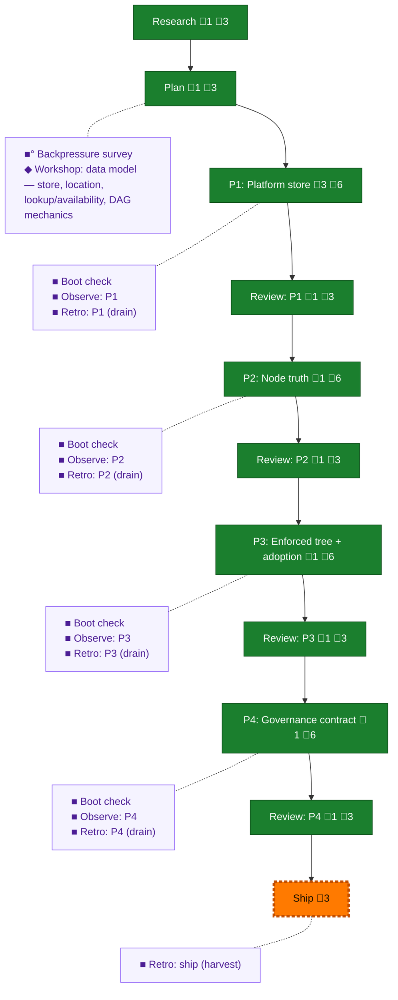

<!-- GENERATED by `harness flow render` — do not hand-edit; regenerate from the flow JSON. -->
# Flow · pij-grown-up

**Kind**: flight-plan · **Now**: ship · **Next**: review-1 · **Intent**: PIJ grows up: deterministic JSON governance spine (peer-filterable), first-class projects (plan-linked, prime-assigned, task lists), proper parent DAG with adoption, node current-task + system_state/orchestrator-state split, node metadata (model, context max/current, harness, thinking level), tmux terminal addressability — UI-shaped data, UI itself OOS · **Nodes**: 26 · **Events**: 87

**Rail**: ◆─◆─[ ◆─◆─◆─◆─◆─◆─◆─◆─◇ ]  ◆ Research · ◆ Plan · [ ◆ P1: Platform store · ◆ Review: P1 · ◆ P2: Node truth · ◆ Review: P2 · ◆ P3: Enforced tree + adoption · ◆ Review: P3 · ◆ P4: Governance contract · ◆ Review: P4 · ◇ Ship ]

**Legend** — colour = type/status: 🟩 done · 🟢 in-progress · 🟥 blocked · 🟦 known · ⬜ assumed · 🔶 decision · 🗣 user input · 🟪 harness chore (faded = not yet done) · 🤖 companion · 🛠 worker · 🟧 current (you are here). Badges: 💬 comments · 📄 artifacts · 📝 instructions · 🧰 chore (° optional / recommended / ‼ strongly-recommended; ✓ done · ✕ skipped).

## Node log

### research · Research
- `2026-07-16T09:38:15.762Z` · agent · validation — pre-flight boot verdict: UNHEALTHY — npm ci --min-release-age=null fails E404 pi-tui-0.80.6.tgz absent from packagefeedproxy (known s052 lock boundary, PR #25; package/lock hard-excluded from s054 fence). Boot/Interact/Observe unrunnable without node_modules. Planning proceeds (no runtime needed); boot-1 chore re-attempts at phase-1 after s052 lands. Observation DL-001 captured (worktree handover lacked npm ci; plain npm ci collides min-release-age/before on npm 11.10).

### plan · Plan
- `2026-07-16T10:11:21.920Z` · user · decision — Round 1: Full mode, Full TDD, targeted mocks (fakes at boundaries), hybrid docs (README + docs/how). Round 2: per-assignment semantic states (option B) — Jordan: 'B... is that silly?' → affirmed with implicit-general-assignment fallback for ambient work. Domains: extend pij-messaging, pij-control-plane, pij-orchestration, pij-skill; no NEW domain.

### phase-1 · P1: Platform store
- `2026-07-16T10:35:30.920Z` · agent · validation — Phase 1 tasks dossier written + ultracode-verified (3-lens workflow wf_7d185eba, 11 findings: 1 HIGH write→event coupling gap + 10 MED — ALL folded): tasks/phase-1-platform-store/tasks.md, 11 tasks T001-T011, TDD-ordered, contract-parity fakes, schema_version naming per WS-4, repo? per WS-2. Build config R5: ultracode, max 5 agents/workflow. Awaiting human GO post-compact.
- `2026-07-16T10:48:27.222Z` · agent · note — R6 gate passed: validate-v2 on tasks.md → 3 MEDIUM folded (kind constants, actor provenance, path prefixes) → VALIDATED WITH FIXES. Packet dispatched to coder pij-dizzy-angelfish (ultracode, max 5 agents; canonical-cwd hazard fenced in packet).
- `2026-07-16T13:51:42.329Z` · agent · validation — verdict:complete reason:T001-T011 shipped by pij-dizzy-angelfish across 6 commits (232d716..835f203); orchestrator re-ran gates — tsc clean, just test 2354 passed/11 skipped exit 0; fence audit clean (23 files all in allowed prefixes) time:2026-07-16T13:52Z

### review-1 · Review: P1
- `2026-07-17T01:36:55.794Z` · agent · validation — verdict:APPROVE via R7 cold cross-model protocol (copilot gpt-5.6-sol @ xhigh, 6 cycles, 19 findings root-cause dead, whole-of-P1 attested) — reviews/p1-review-006.md; gates re-proven by orchestrator each cycle (final: tsc clean, fenced 729/1, full 2574/11/0); non-blocking residual carried to P2: Windows-only tombstone growth + O(N) pending() scan (cap or documented residual). time:2026-07-17T01:37Z

### backpressure · Backpressure survey
- `2026-07-16T10:24:31.374Z` · agent · validation — decision:route verdict:Partial (2 RUN · 12 EXTEND · 2 BUILD · 1 ABSENT) time:2026-07-16T10:32Z basis_sha256:7a46a9a0bef2b940dd3f98e13f4feee5da8408c14a420395665a170db279c09c — artifact backpressure-coverage.md; EXTEND gaps are the plan's own TDD tasks; BUILD rows parked in 4.6 ship checklist; no re-plan needed

### boot-1 · Boot check
- `2026-07-16T10:49:43.380Z` · agent · validation — verdict:HEALTHY (harness boot: typecheck ok, test ok — real /eng-harness-flow --hook pre-flight invocation, envelope ready:true) time:2026-07-16T10:49:28Z worktree@8d89497

### observe-1 · Observe: P1
- `2026-07-16T13:49:47.386Z` · agent · validation — decision:done reason:real capture DL-003 release-age-policy full-suite flake recorded in .harness/temp/agent/session-buffer.md time:2026-07-16T13:49Z

### retro-1 · Retro: P1 (drain)
- `2026-07-16T13:51:28.519Z` · agent · validation — decision:done reason:real post-coding drain — 3 entries (DL-001..003) saved all-kept to .harness/records/retro/2026-07-16/001-054-p1-platform-store.md, buffer cleared; R8 autonomy safe default time:2026-07-16T13:52Z

### retro-ship · Retro: ship (harvest)
- `2026-07-17T05:43:22.776Z` · agent · validation — decision:done reason:real post-flight harvest — harness retro insights over plan 054: 4 records, 6 entries, top cluster difficulty/tooling n=3 (release-age-policy flake family DL-002/003 + boot-verdict pollution — RECURRENT, encoding candidates on record), watchdog-toil entry already status:suggested (s055 = encoding), pkg-audit harness-itself entry awaiting human-authorized upstream issue. Improve offer presented to Jordan in-pane (highest-leverage: flake fix/quarantine). No lifecycle ops without the human. time:2026-07-17T06:40Z

### phase-2 · P2: Node truth
- `2026-07-17T03:04:30.863Z` · agent · validation — verdict:complete reason:T001-T012 shipped by pij-general-llama across 9 commits (7b04e20..47dea9b); orchestrator re-ran gates — tsc clean, full vitest 2764 passed/11 skipped/0 failed; fence audit clean (41 files all in-fence, daemon.ts additive-only per SW-6); 9 coder rulings logged for review adjudication time:2026-07-17T03:05Z

### review-2 · Review: P2
- `2026-07-17T03:21:41.823Z` · agent · validation — verdict:APPROVE via R7 cold cross-model protocol (copilot gpt-5.6-sol @ xhigh, SINGLE cycle) — reviews/p2-review-001.md: all 6 ACs met, 9 coder rulings a-i adjudicated SOUND, SW-6 daemon.ts additivity clean, J1/K1+legacy pins green, widened assignment recovery proven on real-fs crash probes A-D. 3 non-blocking notes carried to P3 as inputs: MED core/context purity unsensored, LOW denorm self-healing race, LOW dead codex contextWindow output. time:2026-07-17T03:20Z

### boot-2 · Boot check
- `2026-07-17T01:59:36.793Z` · agent · validation — verdict:UNHEALTHY-qualified (real /eng-harness-flow --hook pre-flight invocation; harness boot envelope: typecheck ok code 0, just test code 1 with SINGLE failure = documented release-age-policy pwsh ETIMEDOUT flake, 7th hit, isolated rerun 6/6 PASS; fenced platform surface green — full vitest 2574/11/0 at 42516ad verification). Work proceeds; flake outside s054 fence, captured to observe buffer DL-001 (boot-verdict pollution + quarantine-list suggestion). time:2026-07-17T02:00Z worktree@62d30cd

### observe-2 · Observe: P2
- `2026-07-17T03:02:55.545Z` · agent · validation — decision:done reason:real capture DL-001 (release-age-policy flake polluting harness boot verdicts at phase seams, 7th hit, quarantine-list suggestion) recorded in .harness/temp/agent/session-buffer.md during boot-2 seam time:2026-07-17T02:00Z

### retro-2 · Retro: P2 (drain)
- `2026-07-17T03:04:03.431Z` · agent · validation — decision:done reason:real post-coding drain — 1 entry (DL-001 boot-verdict flake pollution, RECURRENCE of 2026-07-16 DL-002/003 family) saved kept to .harness/records/retro/2026-07-17/001-054-p2-node-truth.md, buffer cleared; R8 safe default, routing deferred to human-present harvest time:2026-07-17T03:04Z

### phase-3 · P3: Enforced tree + adoption
- `2026-07-17T04:21:13.050Z` · agent · validation — verdict:complete reason:T001-T007 shipped by pij-general-llama via /builder 6 implement (first mandate dispatch), 7 commits 81106dc..99372bf; orchestrator re-ran gates — tsc clean, FULL 2797/11/0; fence clean; s051-zone diff proof re-run personally = 0; SW-7 hard-stop never triggered time:2026-07-17T04:24Z

### review-3 · Review: P3
- `2026-07-17T04:35:33.918Z` · agent · validation — verdict:APPROVE via R7 protocol (single cycle) — reviews/p3-review-001.md: AC-08 confirmed both paths + adopt (#20 killed), SW-7 independently verified by reviewer (zone diff EMPTY, contracts outcome-only), rulings a-g all sound (b = legit contract evolution outside frozen block; e = sensor red-verified via live plant), frozen legacy block byte-identical. 2 LOW notes: link descriptor write outside platform lock (pre-existing, doctrine-consistent); T006c codex contextWindow precedence deferred to P4. time:2026-07-17T04:50Z

### boot-3 · Boot check
- `2026-07-17T03:41:08.892Z` · agent · validation — verdict:HEALTHY (real /eng-harness-flow --hook pre-flight invocation; harness boot envelope: typecheck code 0, just test code 0 — flake did not fire) time:2026-07-17T03:52Z worktree@b4493ba

### observe-3 · Observe: P3
- `2026-07-17T04:20:16.045Z` · agent · validation — decision:done reason:real capture DL-001 (orchestrator watchdog re-arm toil, ~15 manual loops, s055 verb = encoding) in .harness/temp/agent/session-buffer.md; coder frictions rode execution-log Discoveries per implement-verb fallback time:2026-07-17T04:20Z

### retro-3 · Retro: P3 (drain)
- `2026-07-17T04:20:54.451Z` · agent · validation — decision:done reason:real post-coding drain — 1 entry (DL-001 watchdog re-arm toil, status:suggested — s055 stream IS the encoding) saved to .harness/records/retro/2026-07-17/002-054-p3-enforced-tree.md, buffer cleared; coder frictions in execution-log Discoveries per implement-verb fallback time:2026-07-17T04:23Z

### phase-4 · P4: Governance contract
- `2026-07-17T05:27:47.375Z` · agent · validation — verdict:complete reason:T001-T008 shipped via /builder 6 implement, 9 commits 0ef6839..5b7e65c; orchestrator re-ran gates — tsc clean, FULL 2832/11/0, pij-skill-check green; fence clean; R4 byte-proof re-run personally (prime-flow.json hash-object == HEAD blob 9b7d5b5); sw-zones diff = 0; 12-AC sweep in one isolated roundtrip; harness checks all-8 green (coder, verbatim) time:2026-07-17T05:57Z

### review-4 · Review: P4
- `2026-07-17T05:42:26.176Z` · agent · validation — verdict:APPROVE via R7 protocol (single cycle, PLAN-CLOSING) — reviews/p4-review-001.md: 12-AC sweep verified GENERATIVE over real fs+bin; R3/R4 independently verified (blob-frozen prime-flow, no residue); rulings a-e sound; docs byte-accurate; node route policed at all three gate anchors; whole-of-plan P1-P4 ATTESTED review-clean, all 19 prior findings root-cause dead. LOW carry to ship §2: pre-existing pij() helper leaks ambient PIJ_SESSION_ID (false-red on cli.integration:1139 only from a pij seat; fix = clear the env var like P4 tests do). time:2026-07-17T06:25Z

### boot-4 · Boot check
- `2026-07-17T04:50:39.163Z` · agent · validation — verdict:HEALTHY (real /eng-harness-flow --hook pre-flight invocation; harness boot envelope: typecheck code 0, just test code 0) time:2026-07-17T05:20Z worktree@50a3568

### observe-4 · Observe: P4
- `2026-07-17T05:27:30.270Z` · agent · validation — decision:done reason:real capture DL-001 (pkg-audit write-side-effect fence hazard, harness-itself class) in session buffer, verified against coder revert evidence time:2026-07-17T05:52Z

### retro-4 · Retro: P4 (drain)
- `2026-07-17T05:27:30.584Z` · agent · validation — decision:done reason:real post-coding drain — 1 entry (DL-001 pkg-audit side-effect, harness-itself ⇒ upstream-issue route deferred to human-present harvest) saved to .harness/records/retro/2026-07-17/003-054-p4-governance-contract.md, buffer cleared time:2026-07-17T05:56Z
