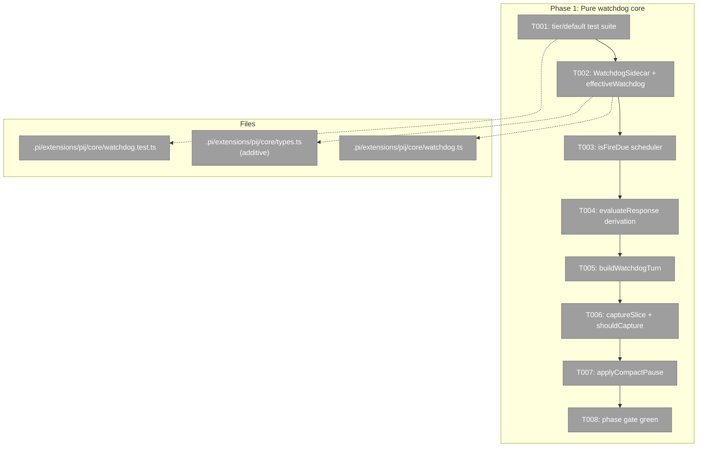
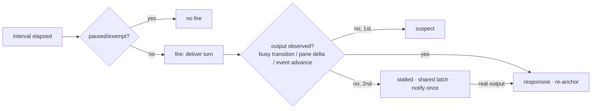
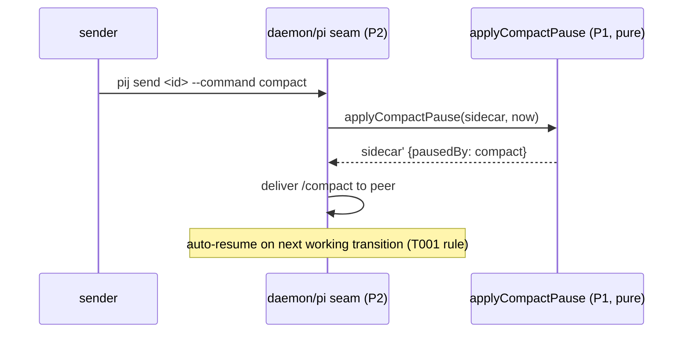

# Phase 1: Pure watchdog core — Tasks & Context Brief

**Plan**: [pij-watchdog-plan.md](../../pij-watchdog-plan.md) (v1.0.1, sha 14b03626…)
**Phase**: 1 of 3 · **Domain**: pij-messaging · **Created**: 2026-07-17

### Executive Briefing

- **Purpose**: Everything about watchdog behaviour that is decidable without I/O
  becomes TDD'd pure functions, so Phase 2's daemon wiring is thin composition
  over proven semantics — the same shape as `state.ts`/`binding.ts`.
- **What We're Building**: `core/watchdog.ts` — sidecar config resolution, the
  fire scheduler, the three pause tiers, the delivered-but-no-output
  (unresponsive) derivation with its typed input-availability shape, the
  self-teaching turn builder, the capture policy, and the shared compact-pause
  hook — plus the additive `WatchdogSidecar` type in `types.ts`.
- **Goals**:
  - ✅ D1 default-on semantics (absent sidecar = 20-min watchdog)
  - ✅ D2 pause tiers (self / compact / exempt) with exact resume rules
  - ✅ D4 self-masking guard proven before any daemon code exists
  - ✅ D7 paneless degradation typed, not implied
  - ✅ D3 capture caps enforced at boundaries
- **Non-Goals**: ❌ No daemon wiring, no CLI verbs, no fs/tmux I/O, no
  descriptor writes, no changes to `binding.ts`'s spawn phone-home watchdog.

### Pre-Implementation Check

| File | Exists? | Domain Check | Notes |
|------|---------|-------------|-------|
| `.pi/extensions/pij/core/watchdog.ts` | no — create | pij-messaging ✓ (pure core beside state.ts) | No name clash on disk; `evaluateWatchdog` lives in binding.ts (spawn-scoped, untouched — D6) |
| `.pi/extensions/pij/core/watchdog.test.ts` | no — create | pij-messaging ✓ | Mirrors state.test.ts / binding.test.ts conventions |
| `.pi/extensions/pij/core/types.ts` | yes — modify | pij-messaging ✓ contract | ADDITIVE ONLY (s054/s051 overlap recorded in brief); `WatchdogSidecar` beside `WatchSubscription` (types.ts:224) |

Duplication scan: `core/` carries no watchdog module; the only "watchdog" symbols
are `evaluateWatchdog` (binding.ts:257) / `WATCHDOG_TIMEOUT_MS` (daemon/loop.ts:408)
— the spawn phone-home pair — and state.ts's `"stalled"` hint; all
consumed/respected, not duplicated.

### Architecture Map



### Tasks

| Status | ID | Task | Domain | Path(s) | Done When | Notes |
|--------|-----|------|--------|---------|-----------|-------|
| [x] | T001 | Write the failing tier/default suite: absent sidecar ⇒ enabled @ 1_200_000 ms; `pausedBy:"self"` resumes ONLY by verb; `pausedBy:"compact"` auto-resumes on next observed working transition; `exempt` never fires and is excluded from derivation; interval override respected | pij-messaging | /Users/jordanknight/pi-hacking/pij-worktrees/s055-pij-watchdog/.pi/extensions/pij/core/watchdog.test.ts | Suite exists, enumerates every D1/D2 rule, fails for want of implementation | Plan 1.1; TDD first |
| [x] | T002 | Add `WatchdogSidecar` (additive, beside `WatchSubscription`) + `effectiveWatchdog(sidecar?)` config resolution | pij-messaging | …/core/types.ts · …/core/watchdog.ts | T001 config/tier cases green; `just typecheck` green; zero imports from daemon/** | Plan 1.2; Finding 06 — sidecar is CLI-owned/daemon-read |
| [x] | T003 | Tests+impl `isFireDue(cfg, lastFireAt, lastEventAt, nowMs)`: anchored to activity, re-anchors when the peer works, NEVER skips fires during a freeze, no drift accumulation | pij-messaging | same two files | Property-style cases: frozen peer receives every scheduled fire; active peer's clock re-anchors; paused/exempt ⇒ never due | Plan 1.3; AC-01/05 |
| [x] | T004 | Tests+impl `evaluateResponse(inputs)` → `responsive \| suspect \| stalled` with a typed input-availability shape: pane inputs OPTIONAL (paneless pi ⇒ event-advance-only, D7); 2 consecutive silent delivered fires ⇒ `stalled`; recovery clears; daemon-injected turn text excluded from "output" (D4) | pij-messaging | same two files | Frozen-pane fixture ⇒ stalled; paneless fixture ⇒ stalled from event silence alone; self-masking fixture reads responsive ONLY on real output | Plan 1.4; Findings 01/02; validation-001 M2 |
| [x] | T005 | Tests+impl `buildWatchdogTurn(id, ordinal, cfg)`: names exact pause/resume commands, fire ordinal, "keep going if working / pause me if done" etiquette; notes capture-n/a for paneless watchers | pij-messaging | same two files | Snapshot test; body ≤ ~400 chars; contains `pij watchdog pause` and `pij watchdog resume` verbatim | Plan 1.5; AC-02 |
| [x] | T006 | Tests+impl `captureSlice(paneText, policy)` + `shouldCapture(policy, anomaly)`: tail-only, line cap ∧ byte cap (defaults 40/4096), hard ceiling 200/16384, anomaly-only default gating | pij-messaging | same two files | Boundary cases green: empty pane, exactly-at-cap, over-cap, multibyte characters at the byte boundary, always/never/anomaly modes | Plan 1.6; D3; AC-07 |
| [x] | T007 | Tests+impl `applyCompactPause(sidecar, nowMs)` shared pure hook (single implementation both P2 seams will call) | pij-messaging | same two files | Sets `pausedBy:"compact"` idempotently; already-self-paused stays self-paused (a stronger claim is never downgraded); exempt unchanged | Plan 1.7; Finding 05; AC-04 |
| [x] | T008 | Phase gate: full existing suite + new suite green | pij-messaging | worktree root | `just typecheck` ∧ `just test` ∧ `just lint` all green in the worktree | Backpressure Proof Plan Phase 1 |

### Context Brief

**Environment-first posture** (builder invariant #14): environment friction is
work, not an apology — fix small/reversible things, otherwise `harness observe`
it; every hard wall paid forward is one the next agent never re-hits.

**Key findings from plan**:
- Finding 01 (Critical): the freeze is invisible by design today — the derivation
  must key on *delivered fires*, never on `state`/banners. T004 is the heart of
  the phase.
- Finding 02 (Critical): the observer can mask the freeze it probes — D4's
  exclusion of daemon-injected text is proven here (T004), before any daemon
  code can get it wrong.
- Finding 06: sidecar is CLI-owned/daemon-read; nothing in this phase writes
  descriptors.

**Domain dependencies** (consumed concepts — read, do not modify):
- `pij-messaging/state.ts`: `STALE_AFTER_MS`, `liveness()`, `isStalled()`,
  `classifyDeathReason(pane, hint)` — the existing vocabulary T004's verdicts
  must compose with (`"stalled"` already exists in `DeathReason`).
- `pij-messaging/types.ts`: `Result`/`ok`/`err` conventions, `WatchSubscription`
  (the sidecar shape precedent at types.ts:224), `SessionDescriptor`.
- `pij-control-plane/readiness.ts` (Phase-2 consumer, referenced in tests only
  as fixtures): `BUSY_RE` semantics inform what "output" means.

**Domain constraints**:
- `core/watchdog.ts` is PURE: no fs, no tmux, no clock reads — `nowMs` is a
  parameter (the repo's P5 pattern: thresholds live with the data they
  constrain).
- No imports from `core/daemon/**` (dependency direction: daemon composes core,
  never the reverse).
- `types.ts` changes ADDITIVE ONLY (recorded s054 P2 / s051 overlap).
- Do not touch `binding.ts` (D6 — the spawn phone-home watchdog is out of scope).

**Reusable from prior phases**: none (first phase). Test conventions to copy:
`state.test.ts` (pure-fn tables), `binding.test.ts` (decision-object asserts),
death-reason fixtures for pane-tail text.

**Mermaid flow diagram** (fire → response derivation):


**Mermaid sequence diagram** (compact auto-pause, pure seam):


### Discoveries & Learnings

_Populated during implementation by the implement verb._

| Date | Task | Type | Discovery | Resolution | References |
|------|------|------|-----------|------------|------------|

### Directory layout

```
docs/plans/055-pij-watchdog/
  ├── pij-watchdog-plan.md
  └── tasks/phase-1-pure-watchdog-core/
      ├── tasks.md
      └── execution.log.md   # created by the implement verb
```
