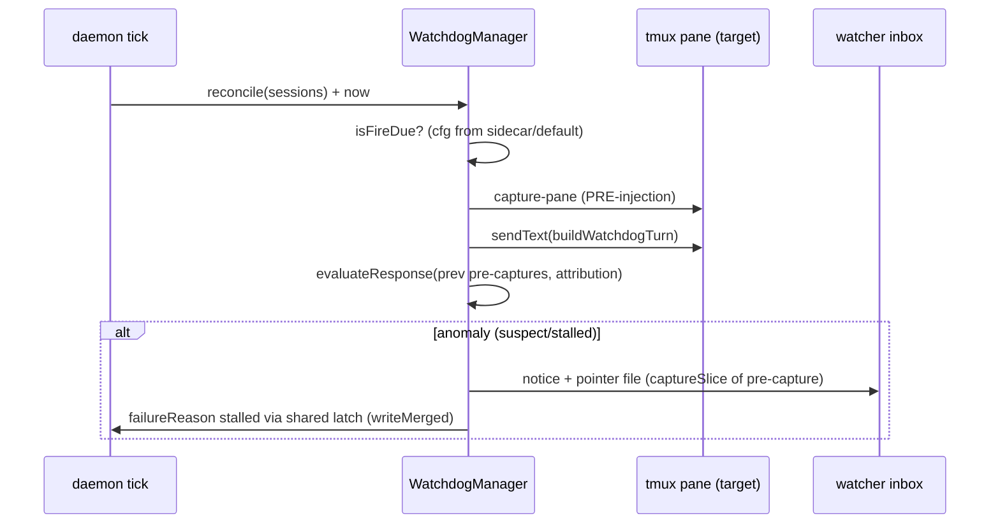

# Phase 2: Daemon manager + CLI surface — Tasks & Context Brief

**Plan**: [pij-watchdog-plan.md](../../pij-watchdog-plan.md) (v1.0.1, sha 14b03626…)
**Phase**: 2 of 3 · **Domain**: pij-control-plane · **Created**: 2026-07-17

### Executive Briefing

- **Purpose**: Wire the proven pure core into the fabric — the daemon fires,
  pauses, derives, and captures; the CLI exposes the verbs the self-teaching
  turns name.
- **What We're Building**: a `WatchdogManager` (mirroring `PeerWatchManager`)
  mounted in the daemon tick; a CLI-owned sidecar store; compact auto-pause at
  both harness seams; the stalled wiring through the SHARED whole-life latch;
  watcher captures as pointer files; `pij watchdog …` verbs + state surfaces.
- **Goals**:
  - ✅ Every registered session default-on supervised (AC-01), turns delivered
    over the existing ownership split (AC-10)
  - ✅ Compact auto-pause on BOTH seams (AC-04)
  - ✅ `stalled` derived + one notice per episode via the shared latch (AC-05/06)
  - ✅ Cost-bounded watcher captures (AC-07) · exemption first-class (AC-08)
  - ✅ Verbs: status/pause/resume/exempt/watch/unwatch/list + `--no-watchdog`
- **Non-Goals**: ❌ No live-daemon restart (proofs are P3, temp-daemon); ❌ no
  changes to spawn phone-home watchdog; ❌ no `system_state` invention (WS-6
  vocabulary via existing `failureReason:"stalled"` only — s054 P2 owns the
  first-class field); ❌ no pane-text parsing for limits/thaw (superseded).

### Prior Phase Context (Phase 1 — pure watchdog core)

- **Deliverables**: `core/watchdog.ts` (pure, 26-test suite), additive
  `WatchdogSidecar`/`WatchdogPauseTier` in `types.ts`. Commit `bb863b0`.
- **Dependencies exported** (the exact API this phase composes):
  `effectiveWatchdog(sidecar?)` · `applyWatchdogResume` · `applyWorkingTransition`
  · `applyCompactPause` · `isFireDue(cfg,lastFireAt,lastEventAt,nowMs)` ·
  `evaluateResponse(inputs)` (typed optional pane observations,
  `*WasWatchdog` attribution on event/pane/working signals) ·
  `buildWatchdogTurn(id,ordinal,cfg)` · `shouldCapture`/`captureSlice` +
  `DEFAULT_/MAX_CAPTURE_*` · `DEFAULT_WATCHDOG_INTERVAL_MS`.
- **Gotchas & debt**: attribution is typed, never inferred from text — the
  daemon must SUPPLY honest attribution (it knows what it injected); a busy
  transition caused by delivering the watchdog turn is watchdog-attributable
  (review CRITICAL-1's exact lesson). Pane observations optional ⇒ pi peers
  pass event signals only.
- **Patterns to follow**: injected-ports manager + fakes
  (`core/daemon/watch.ts` + its test is the shipped template); `writeMerged`
  for EVERY daemon descriptor write; sidecar CLI-owned/daemon-read with a
  revision cache.
- **Incomplete items**: none carried forward.

### Pre-Implementation Check

| File | Exists? | Domain Check | Notes |
|------|---------|-------------|-------|
| `.pi/extensions/pij/core/daemon/watchdog-manager.ts` | no — create | pij-control-plane ✓ | Mirror `watch.ts` `PeerWatchManager` shape |
| `.pi/extensions/pij/core/daemon/watchdog-manager.test.ts` | no — create | pij-control-plane ✓ | Mirror `watch.test.ts` fake-port conventions |
| `.pi/extensions/pij/adapters/watchdog-store.ts` | no — create | pij-control-plane ✓ | `FsWatchdogStore` beside `adapters/watch-store.ts` (`FsWatchStore`, the donor): sidecar `~/.pij/<id>/watchdog.json`, CLI-writes/daemon-reads, revision cache. Store PORT interface lives with the manager in `core/daemon/` (I/O in adapters, never core — validation-003 M1) |
| `.pi/extensions/pij/daemon.ts` | yes — modify | pij-control-plane ⚠ SW-6 | SMALLEST possible diff (s054 P2 concurrently edits this file on its own branch — second lander rebases); mount manager in `tick()`, thread attribution, exclude watchdog turns from `paneSig` refresh |
| `.pi/extensions/pij/core/daemon/router.ts` | yes — modify | pij-control-plane ⚠ SW-6 | tmux compact seam → `applyCompactPause` write via store |
| `.pi/extensions/pij/core/session.ts` | yes — modify | pij-messaging | pi compact seam: `onInbound` → `ports.pi.compact()` (~line 376) — same shared hook (validation-001 M1) |
| `.pi/extensions/pij/index.ts` | yes — modify | pij-control-plane | pi-peer watchdog turn framing (inbox delivery path) |
| `.pi/extensions/pij/core/cli.ts` | yes — modify | pij-messaging | `pij watchdog status\|pause\|resume\|exempt\|watch\|unwatch\|list`; spawn `--no-watchdog`; `state`/`list --json` watchdog block |
| `.pi/extensions/pij/core/types.ts` | yes — modify | pij-messaging contract | Additive only: descriptor `lastWatchdogFireAt?`; broaden `DeathReason` "stalled" doc comment (D8) |
| `.pi/extensions/pij/core/state.ts` | yes — modify (additive) | pij-messaging | Only if a small pure helper is genuinely needed; prefer composing `evaluateResponse` untouched |

Duplication scan: no watchdog manager/store exists anywhere under `core/`;
`PeerWatchManager`/`FsWatchStore`/`WatchSidecar` are the pattern donors, not
collision risks.

### Architecture Map

```mermaid
flowchart TD
    classDef pending fill:#9E9E9E,stroke:#757575,color:#fff
    classDef completed fill:#2E7D32,stroke:#1B5E20,color:#fff
    subgraph Phase2["Phase 2: Daemon manager + CLI surface"]
        T001["T001: fake-port manager suite"]:::completed
        T002["T002: FsWatchdogStore + WatchdogManager"]:::completed
        T003["T003: tick mount + attribution + paneSig guard"]:::completed
        T004["T004: stalled wiring, shared latch"]:::completed
        T005["T005: compact auto-pause both seams"]:::completed
        T006["T006: watcher captures + pointer files"]:::completed
        T007["T007: CLI verbs + state surfaces"]:::completed
        T008["T008: phase gate green"]:::completed
        T001 --> T002 --> T003 --> T004 --> T005 --> T006 --> T007 --> T008
    end
```

### Tasks

| Status | ID | Task | Domain | Path(s) | Done When | Notes |
|--------|-----|------|--------|---------|-----------|-------|
| [x] | T001 | Write the failing fake-port `WatchdogManager` suite: reconcile against registry snapshots; fire-due → deliver (tmux `sendText` vs pi inbox split, AC-10); pre-bind/pending sessions never fired; exempt/paused never fired; dispose on close/dissolve; per-session fire ordinal; pre-injection pane capture taken BEFORE `sendText` | pij-control-plane | …/core/daemon/watchdog-manager.test.ts | Suite enumerates every behaviour with fakes (mirror watch.test.ts), RED for want of implementation | Plan 2.1; TDD first |
| [x] | T002 | `FsWatchdogStore` in `adapters/watchdog-store.ts` (sidecar read/write + revision; CLI-owned, daemon read-only) + `WatchdogManager` (with its store PORT interface) passing T001 | pij-control-plane | …/core/daemon/watchdog-manager.ts · …/adapters/watchdog-store.ts | T001 green; store shape + placement mirror `adapters/watch-store.ts` exactly | Plan 2.2; Finding 03/06; validation-003 M1 |
| [x] | T003 | Mount in `daemon.ts tick()`: reconcile + fire; supply HONEST attribution to `evaluateResponse` inputs (the daemon knows what it injected — a busy transition right after its own `sendText` is watchdog-attributable); stamp `lastWatchdogFireAt` via `writeMerged`; watchdog-injected turns excluded from the `paneSig` activity refresh; keep the daemon.ts diff MINIMAL (SW-6) | pij-control-plane | …/daemon.ts | Existing daemon suites unbroken; new tick tests green; diff review confirms no unrelated daemon.ts churn | Plan 2.3; Findings 02/06; SW-6 |
| [x] | T004 | Stalled wiring: 2 silent fires ⇒ `failureReason:"stalled"` + notice through the SHARED whole-life latch (`this.pushed` — at most one stalled notice per episode across both detectors); recovery clears latch + reason for both; broaden the `DeathReason` "stalled" doc comment | pij-control-plane + pij-messaging | …/daemon.ts · …/core/types.ts | Frozen-peer fake: exactly one notice even when both detectors trip; recovery clears; doc comment updated | Plan 2.4; D5/D8; AC-05/06 |
| [x] | T005 | Compact auto-pause at BOTH seams via the one pure hook: tmux (router inject command path) + pi (`core/session.ts` `onInbound` → `ports.pi.compact()`); `pausedBy:"compact"` persists via store; auto-resume on next observed real working transition (`applyWorkingTransition`) | pij-control-plane + pij-messaging | …/core/daemon/router.ts · …/core/session.ts | Both-path tests: `--command compact` AND bare `/compact` pause; resume on real work; self-pause/exempt never downgraded | Plan 2.5; validation-001 M1; AC-04 |
| [x] | T006 | Watcher captures: anomaly-gated via `shouldCapture`; slice via `captureSlice` from the PRE-injection capture; pointer file `~/.pij/<watcher>/watchdog-captures/<ts>-<id>.txt` + ≤5-line inline head in the notice; per-watcher policy from sidecar; paneless target ⇒ notice states capture-n/a | pij-control-plane | …/core/daemon/watchdog-manager.ts | Pointer + head land for tmux target; caps enforced end-to-end; pi target notice carries the n/a line | Plan 2.6; D3/D7; AC-07 |
| [x] | T007 | CLI: `pij watchdog status\|pause\|resume\|exempt\|watch\|unwatch\|list`; spawn `--no-watchdog` (writes exempt sidecar at spawn); `pij state <id> --json` + `list --json` gain a `watchdog` block (enabled/paused tier/exempt/lastFireAt/watchers) | pij-messaging | …/core/cli.ts · …/core/spawn.ts (flag) | CLI tests green; verbs match the turn body's taught commands EXACTLY (AC-02↔AC-03 coherence); envelope documented in --help | Plan 2.7; AC-03/08 |
| [x] | T008 | Phase gate: full suite + checks green | pij-control-plane | worktree root | `just typecheck` ∧ `just test` ∧ `just lint` ∧ `harness checks --quick` green | Proof Plan Phase 2 |

### Context Brief

**Environment-first posture** (builder invariant #14): fix small/reversible
frictions, otherwise `harness observe` them — this stream already banked six.

**Key findings from plan** (carry forward):
- Finding 02: the observer must not mask the freeze — T003's attribution
  threading is where the D4 guarantee becomes real; the pure core is already
  mutation-proven, so the risk lives entirely in what the daemon SUPPLIES.
- Finding 05: ONE pure compact hook, two seams — never two implementations.
- Finding 06: descriptor writes only via `writeMerged`; watchdog state lives in
  the sidecar; only `lastWatchdogFireAt` joins the descriptor.

**SW-6 cross-stream constraint (o-prime, spine Seq 436)**: s054 P2 is
concurrently editing `daemon.ts` + `core/daemon/loop.ts` on its own branch.
Keep diffs to those files minimal and additive; do NOT touch
`core/daemon/loop.ts` at all unless a task above forces it (none should — the
manager mounts in `daemon.ts tick()`). Merge convention: second lander rebases.

**Domain dependencies** (consume, don't modify):
- `pij-messaging/watchdog.ts`: the whole P1 API (§ Prior Phase Context).
- `pij-control-plane/watch.ts` + `daemon.ts`: `PeerWatchManager` mount pattern,
  `writeMerged`, `this.pushed` latch, `paneSig` map, delivery split
  (`daemonOwnsDelivery`).
- `pij-control-plane/readiness.ts`: `classifyReadiness`, `paneWentBusy`.

**Domain constraints**: manager owns no pure logic (compose `watchdog.ts`);
store follows the CLI-writes/daemon-reads split; `types.ts` additive only;
turn bodies come from `buildWatchdogTurn` — never hand-built strings.

**Reusable from prior phases**: `watchdog.test.ts` fixture patterns (frozen
pane, paneless, all-watchdog-attributable); `watch.test.ts` fake ports.

**Mermaid sequence diagram** (one fire, tmux target with watcher):

### Discoveries & Learnings

_Populated during implementation by the implement verb._

| Date | Task | Type | Discovery | Resolution | References |
|------|------|------|-----------|------------|------------|
| 2026-07-17 | T004 | Review correction | A boolean `stalled` latch had two detector owners, so the legacy detector could release a watchdog-confirmed episode without real recovery; root sessions were also gated out with owner notification. | Added explicit watchdog stall provenance. Only typed watchdog recovery releases it; descriptor stamping is unconditional while owner notification remains conditional. | fix-0002 CRITICAL-1; D5/D8; AC-06 |
| 2026-07-17 | T003 | Review correction | Attribution after `observeActivity` was too late: the temporary busy observation had already refreshed descriptor `lastEventAt`. A watchdog-caused working→idle return edge was also credited as recovery. | One load-bearing pane guard now protects both `observeActivity` and heartbeat writes; manager attribution spans the complete working transition pair. | fix-0002 CRITICAL-2; D4; b36edf0 |
| 2026-07-17 | T003 | Noteworthy | Aggregate-response fixtures let independent pane/state guards hide a broken event-axis guard. The mutation recipe also needs its suite command preserved as one shell argument or it runs bare `npx`. | Added paneless descriptor-only and persisted-pane negative tests; both mandated mutations now go RED and restore GREEN. Recorded the quoting requirement rather than changing out-of-scope harness code. | fix-0002 CRITICAL-3; mutation Dimension 0 |
| 2026-07-17 | T006 | Review correction | Watcher processing ran only for anomalies, making public `capture.mode:"always"` unreachable on healthy fires. | Evaluate each watcher on every due fire with the real anomaly flag; default anomaly policy stays silent on healthy fires while `always` captures. | fix-0002 HIGH-1; D3; AC-07 |
| 2026-07-17 | T007 | Review correction | `watchdog pause` could overwrite non-expiring `exempt` with weaker `self`. | Reject the downgrade with a clear `E-ARG`; the exempt sidecar remains byte-for-byte unchanged. | fix-0002 HIGH-2; D2; AC-08 |
| 2026-07-17 | T004/T006 | Post-review proof correction | The Phase 3 isolated AC-06 proof showed that the daemon shared latch deduped the owner, but manager-owned watcher delivery bypassed episode state and repeated every stalled fire. | Track successful anomaly watcher stalled delivery per watcher in manager `RuntimeState`; clear only on typed real recovery. `mode:"always"` bypasses the episode guard. | fix-0003; Phase 3 `reports/proof-log.md`; D8; AC-06 |
